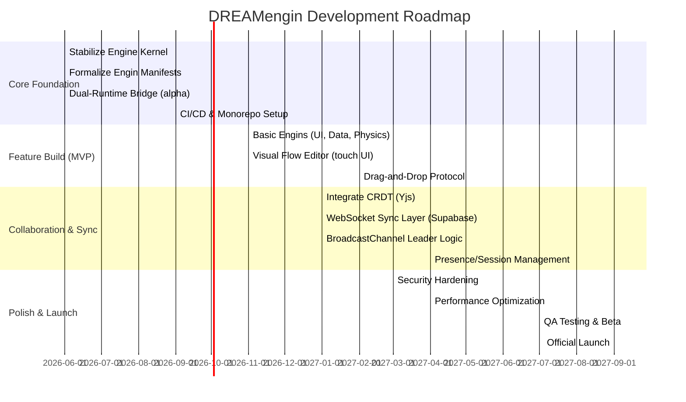
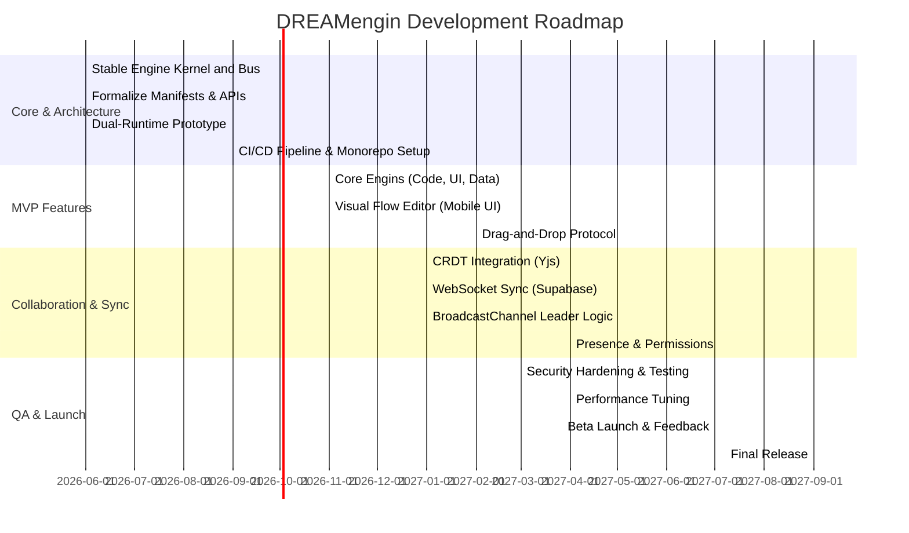

# Executive Summary  
DREAMengin is a vision for a **“creative OS”** – a single persistent runtime with a fixed core engine and pluggable **Engins** (modules) that users assemble by dragging and connecting pieces.  Unlike typical no-code tools or CMSs, it treats the browser as a long-lived operating environment.  The core engine handles global concerns (state, events, I/O, security) while all business logic comes from external rule-sets (Engins).  As *The Verge* observes, the industry trend toward “low-code/no-code” (e.g. Zapier, Shortcuts, Notion, Airtable【3†L297-L304】) is maturing into platforms where users can truly build without coding.  DREAMengin takes this further by enabling **runtime composition**: users visually wire together behaviors and data flows in real time, on a phone-first canvas that supports collaboration.  Key design patterns include: a **single engine with infinite rule-sets**, **micro-frontend style modules (Module Federation or Next.js Multi-Zones)** for loading Engins, and **hybrid real-time sync** (BroadcastChannel for same-browser, WebSockets/CRDT for cross-device).  This plan maps the existing prototype to a robust architecture (with Next.js 16+, React 20+, TS 6+, Supabase backend, Babylon.js/WebGPU) and lays out a detailed roadmap to reach production.  

## 1. Runtime Architecture & Core Components  
The codebase (≈250K LOC) already separates core from logic.  The *engine kernel* consists of components like **`EnginDispatcher.ts`** (the intent router), **`dreamOSBus.ts`** (a global event bus), and a **module registry** (`moduleRegistry.ts`) mapping intent names to Engin modules.  We interpret these as:  
- **Engine Kernel**: The central controller that receives **Intents** (user actions or messages) and routes them. It likely holds the authoritative state and applies rule-sets. This is analogous to a Flux/Redux store or a microservice dispatcher. In a micro-frontend “shell vs remote” model, the Kernel is the shell【28†L790-L799】.  
- **dreamOSBus (Global Bus)**: A publish/subscribe backbone for state and events. It decouples producers and consumers: components post Intents/events on the bus and Engins subscribe. As an event-driven pattern, this means publishers and subscribers “don’t need to know of each other”【43†L153-L161】, enabling independent modules to integrate.  
- **ModuleRegistry**: A lookup table where each Engin “registers” its key and capabilities. When an intent is dispatched, the registry finds the corresponding Engin code (like a plugin manifest) to handle it. This is similar to Module Federation’s contract in which a host loads remote modules by agreed names【28†L790-L799】.  
- **Dual-Runtime Bridge** (`dualRuntimeBridge.ts`): Handles communication between two parallel contexts: *HomeDream* (the user’s “desktop” or global workspace) and *DreamSpace* (an active project canvas).  The bridge synchronizes shared state between them, enabling gestures like “teleport an object from HomeDream into DreamSpace.”  Under the hood it might use `BroadcastChannel` or in-app messaging to keep both contexts in sync.  
- **DreamDMBar**: More than a menu bar, it is the **exchange layer** between HomeDream and DreamSpace. The DMBar UI shows navigation, chat, clipboard/drag handles, and it mediates how data flows between runtimes. In code it likely listens to the bus and routes drag/drop events across contexts. For example, dragging a “Dream window” icon into DreamSpace might be implemented by the DMBar intercepting a drag Intent and injecting the module into the other context.  
- **Engins and DreamWindows**: Engins are the building-block modules (e.g. GameEngin, CodeEngin, MediaEngin) defined in `lib/engin-*` or `components/panels`. Each Engin exports a manifest and code that the engine can load (possibly via dynamic import or Module Federation). When instantiated, an Engin appears in a **DreamWindow** (a movable UI panel). The code uses `useEnginBridge` and similar hooks to connect an Engin instance to the global bus.  
- **Types/Schemas**: The `/types/` folder (e.g. `widgetConfigs.ts`, `journey.ts`) holds shared data contracts. We will formalize these into JSON Schema or Zod schemas so that Intents and drag payloads have strict formats.  

In summary, the existing code has the pieces of an event-driven microservices model. The engine kernel acts like a shell, and each Engin is a micro-frontend or plugin that registers with it.  This matches the “engine vs rules” philosophy.  

## 2. Engin Manifest and Runtime Contract  
Each Engin needs a **declarative manifest** specifying its I/O contracts and metadata.  This manifest should be a JSON file (e.g. `engin.manifest.json`) that the core engine reads before loading the Engin’s code. Key fields include:  
- **Identity/Version**: Unique `enginId` or name and semantic `version`. This allows hot-swapping newer rule-sets without changing the engine core (the core can look up the versioned manifest).  
- **I/O Ports**: Lists of named **inputs** and **outputs** (analogous to node ports). For example, an Engin might declare `inputs: { "onActivate": "event", "dataIn": "object" }` and `outputs: { "onComplete": "event", "result": "data" }`.  Inputs and outputs should specify types or schemas for validation.  
- **Lifecycle Hooks**: Optionally, specify initialization parameters or required contexts. e.g. a flag if the Engin needs an offscreen canvas or exclusive focus.  
- **UI Entrypoints**: Paths to HTML/JS/CSS for the Engin’s UI (if any). For instance, fields like `"script": "modules/GameEngin.js"` or `"ui": "GameUI.html"`.  
- **Capabilities/Permissions**: A section (inspired by Figma’s `networkAccess`) to list which external resources the Engin may use. For example:  
  ```json
  "permissions": {
    "networkAccess": ["api.weather.com", ".*example\.org"],
    "clipboard": true,
    "filesystem": ["read", "write"]
  }
  ```  
  This restricts what the Engin code can access, enforcing security by manifest (like how Figma plugins restrict domains【30†L123-L131】).  
- **Shared Libraries**: Optionally list which global services or singletons it needs (e.g. require the canvas engine, audio subsystem). This ensures the core loads necessary support for the Engin.  

An example manifest might look like:  

```jsonc
// Example Engin manifest (engin.manifest.json)
{
  "name": "ParticleEmitterEngin",
  "enginId": "ParticleEmitter",
  "version": "1.0.0",
  "description": "Emits colored particle effects in 3D space",
  "entryScript": "engin.ParticleEmitter.js",
  "ui": "ParticleEditor.html",
  "inputs": {
    "emit": { "type": "boolean", "default": false },
    "color": { "type": "string", "default": "#ff0000" }
  },
  "outputs": {
    "onEmit": { "type": "event" }
  },
  "permissions": {
    "networkAccess": ["none"],
    "clipboard": false
  }
}
```  

This manifest schema is analogous to well-known plugin systems. For instance, Figma’s plugin manifest is a JSON with fields like `name`, `id`, `main`, `ui`, and `networkAccess`【30†L42-L51】【30†L49-L56】.  We will adopt a similar approach, ensuring clear versioning and strict JSON Schema validation.  

Each Engin’s lifecycle will follow this contract: on load, the core engine registers the manifest, then dynamically imports the `entryScript`. That script should export handlers for its declared inputs (e.g. a function `onIntent('emit', ...)`). The engine ensures that outputs emitted by the Engin match the declared `outputs`.  By strictly validating messages (e.g. via JSON schema or TypeScript types), we prevent mismatches and security issues.  

**Versioning & Security:** Manifest versions allow safe upgrades. The engine can enforce that only manifests signed or approved by the platform can be loaded (e.g. via a hash or signature), and it only grants the permissions listed.  This is akin to the principle of least privilege.  For example, if an Engin did not list `networkAccess: ["*"]`, any attempt to fetch external data should be blocked by the core engine at runtime (similar to Figma’s networkAccess enforcement【30†L123-L131】).  

## 3. Dual-Runtime Orchestration  
DREAMengin’s dual-runtime (HomeDream vs DreamSpace) is an advanced feature: two parallel React contexts that share state.  Architecturally, we propose a **master/slave model**: one runtime (likely HomeDream) is designated the **Master Kernel**, and DreamSpace is a **Slave Context**. Both run the same engine code and state schema, but the Master mediates cross-context coordination. 

Key elements:  
- **Master Kernel**: When the first client (browser window or mobile app) opens the project, it becomes the Master. It handles authoritative state mutations and writes to the central DB (Supabase). Other clients (or contexts) act as replicas. Leader election can use the BroadcastChannel API as a lightweight mechanism【31†L117-L124】. For example, on startup each tab posts a “ping” on a BroadcastChannel; if no leader is found, the first tab becomes leader.  This approach (Tab Leader Pattern) is proven to reduce duplicated work: *“One leader tab handles all API polling; all follower tabs listen via BroadcastChannel; automatic failover when the leader tab closes”*【31†L117-L124】. We will adapt this so the Master Kernel listens to Intents and syncs global state to Supabase, while slave contexts forward Intents to the Master.  
- **Per-Runtime Contexts**: Each context (HomeDream, each DreamSpace) has its own React tree, state cache, and UI, but subscribes to the same logical state. The core engine in each context runs in the browser/edge, but only the Master commits to the database. The slave contexts use BroadcastChannel for local sync (for same-device split screens) and WebSockets for cross-device. 
- **BroadcastChannel/WebSocket Adapters**: We define an abstraction layer (`SyncAdapter`) that uses BroadcastChannel when all parties share the same origin (fast, no server needed【8†L204-L212】【8†L216-L224】), and falls back to a WebSocket (Supabase Realtime or custom WebSocket) when not. For example, two mobile windows in the same browser could sync via BroadcastChannel, whereas two phones will connect via Supabase’s WebSocket channel.  
- **Offline and Queueing**: If a user goes offline or loses connection, their Intents are queued locally (IndexedDB or localStorage). Upon reconnection, the client sends all pending Intents to the Master. CRDT-based conflict resolution (see below) ensures smooth merging.  
- **Authoritative Persistence**: The Master Kernel persists state to Supabase (Postgres) via transactions or CRDT diff writes. We will likely use Supabase Edge Functions or Postgres triggers to ensure that state changes are atomic. For scale, we might run a minimal Node edge (Cloudflare Worker/Deno) to apply intents, reducing the need for the browser to hold too much logic. However, the bulk of logic should remain client-side for responsiveness.  

In essence, the dual-runtime is a distributed single-engine: one logical bus shared by multiple front-end runtimes. Leader election via BroadcastChannel【31†L117-L124】 ensures only one “source of truth” mutates the Postgres state; others just mirror it. This avoids conflicts that could occur if two tabs tried to write simultaneously.  

## 4. Transport Layer and Protocols  
Our transport layer is **hybrid**, combining local and remote channels to meet different use cases:  
- **BroadcastChannel (Intra-Client)**: As per MDN, the BroadcastChannel API “creates a single, shared channel that multiple browsing contexts (same user, same browser, same origin) can join… enabling seamless data exchange”【8†L216-L224】. We use this for very low-latency intra-device messaging (e.g. HomeDream ↔ DreamSpace on the same phone). It requires no server and avoids duplicate network costs. It’s ideal for quick UI events (cursor sync, drag-and-drop coordinates).  
- **WebSockets (Cross-Client)**: For cross-device or cross-origin sync, we use a persistent WebSocket. Supabase Realtime provides a Phoenix-backed WS (at `wss://*.supabase.co/realtime/v1/websocket`【20†L76-L83】) which can broadcast database changes, presence, and arbitrary events. We will use Supabase’s channels or a custom Phoenix channel to send Intents. The WS is fully bidirectional and low-latency, making it suitable for live collaboration (chat, co-editing). As a fallback, we may support standard Server-Sent Events (SSE) or polling for non-real-time tasks.  
- **HTTP/Edge**: For persistence and non-urgent commands (project load/save, large data fetch), use standard HTTP. For example, publishing a Dream could be an HTTP API call. Edge Functions (e.g. Supabase Edge Functions or Next.js serverless functions) can handle these operations globally. This also covers initial “cold start” when a user first opens a project and pulls down the state. HTTP(S) calls can also serve as a fallback if WebSockets fail.  
- **Message Schemas & Security**: All transport messages carry a JSON envelope, e.g.:  
  ```json
  { 
    "type": "intentName", 
    "payload": { /* data */ }, 
    "user": "userId", 
    "timestamp": 123456789 
  }
  ```  
  We will formally document these schemas (e.g. with JSON Schema or Zod) and enforce them on send/receive. Each message is signed by the client (e.g. via its auth token from Supabase) to prevent tampering.  The “type” field maps to our Intent names, and “payload” must match the defined schema for that Intent. We will standardize these protocols as part of the engine API.  

In addition, a global **clipboard/drag protocol** uses postMessage-like semantics: when a drag starts, we broadcast a “DragStart” intent with the data descriptor (e.g. type = “asset-transfer”, data = `{ /* asset pointer */ }`). Other contexts subscribe to Drop events for that type. The DreamDMBar will orchestrate this by intercepting drag events and re-routing them through the bus (see section 6).  

Overall, the strategy is: BroadcastChannel for same-device/fast sync【8†L216-L224】, WebSockets (Supabase) for inter-device sync【20†L76-L83】, and HTTP/Edge for persistence. This multi-layer approach ensures real-time updates while falling back gracefully.  

## 5. Real-time Sync and CRDT Strategy  
True collaboration demands conflict-free merging. We will adopt **CRDTs (Conflict-free Replicated Data Types)** for all shareable state (documents, whiteboards, chat, etc.).  According to Liveblocks (designed for collaboration), CRDT-based storage offers “real-time presence, shared state, and conflict-free storage” out of the box【15†L501-L508】.  ZTABS’s comparison highlights that Liveblocks uses CRDTs, while Supabase/Firestore rely on last-write-wins【15†L560-L567】. By using a CRDT library (like Yjs or Automerge) on the client, we achieve offline editing and automatic merge on reconnect.  

**CRDT Choice:** Current best practice (2026) favors **Yjs** for most use cases. A recent comparison notes that “Yjs is the production default with the largest ecosystem,” while Automerge is better if you need full version history and larger bundles【12†L45-L54】. Loro is faster but less mature. For an integrated UI workflow editor, Yjs’s small size (~18KB), peer-to-peer transports, and plugin ecosystem make it ideal【12†L55-L63】. Automerge (WASM) could be used selectively for append-only logs that need audit history. Table of CRDT options:  

| Library    | Bundle Size | Language | History        | License |
|------------|-------------|----------|----------------|---------|
| **Yjs**    | ~18KB (min) | JS       | Basic (CRDT)   | MIT     |
| **Automerge** | ~320KB (WASM) | JS/Rust | Full Git-like history | MIT     |
| **Loro**   | ~180KB (WASM) | Rust    | Snapshot-based | MIT     |

*(Data from PkgPulse CRDT survey【12†L55-L63】【12†L45-L54】.)* We will start with Yjs for shared documents (e.g. collaborative text, arrays) and a WebRTC provider for peers if needed. The engine can use **Yjs rooms** per workspace, and sync updates via WebSocket or P2P, merging automatically.  

**Per-Namespace Merge Strategies:** Not all data needs CRDTs. For example, chat history might use an append-only list CRDT, while object properties might use last-writer-wins (since they come from one leader). We will categorize shared state:  
- *Continuous data (text, counters)*: Yjs CRDT (grows and merges).  
- *Object transforms (position, color)*: LWW with tombstones, since multi-user conflict on the same property is unlikely.  
- *Intent commands (create/delete entities)*: handled by the engine via a transaction log (which we can store in Postgres). Each intent is idempotent or has a conflict policy.  

**Undo/Redo & History:** CRDTs inherently allow undo stacks (since operations are commutative). We can snapshot Yjs documents at save points for versioning. The engine will also maintain an intent history in DB, so we can implement undo by inverting intents or reloading a previous CRDT snapshot.  

**Testing Sync:** We will build automated tests using Playwright (or similar) that open multiple browser contexts. For example, one test might programmatically simulate two users dragging objects concurrently, then assert consistent final state. We’ll also simulate network partitions to ensure CRDT merging works.  

## 6. The DreamDMBar as Exchange Layer  
The DreamDMBar (DMBar) is the runtime’s “belt” that unifies HomeDream and DreamSpaces. Architecturally, the DMBar should be a **service layer** with these responsibilities:  
- **Intent Routing:** It listens to the global bus for high-level commands and switches focus or context. For instance, a “SwitchToHome” intent or a two-finger swipe might toggle which context is active.  
- **Drag/Clipboard Coordinator:** The DMBar intercepts drag events and re-dispatches them. For example, when a user drags an object from HomeDream toward the DMBar, it captures the payload (`dataTransfer`) and sends a bus message like `{type: "DragAsset", assetId: X, source:"HomeDream"}`. When the drop occurs in DreamSpace, a corresponding `{type:"DropAsset", assetId:X, target:"DreamSpace"}` is emitted. This pattern is similar to the cross-iframe drag demo【24†L259-L267】. The DMBar maintains a **virtual clipboard** for cross-context copy/paste via BroadcastChannel.  
- **Capability Negotiation:** When an Engin is moved between contexts, the DMBar verifies that the target context has the needed libraries/runtimes. E.g., dragging a 3D object into a 2D-only DreamSpace should be blocked or converted. This requires a lightweight capability exchange protocol (an Engin’s manifest could declare required canvas features).  
- **Session & Presence:** The DMBar tracks who is in which workspace (via Supabase presence channels). It can show avatars or cursors. It also handles invitations: clicking “Invite collaborator” triggers the DMBar to send a link/intent to another user’s client.  
- **Permissions Check:** Before an action crosses contexts (or boundaries), the DMBar enforces permissions. For instance, dragging an asset from HomeDream into a DreamSpace owned by someone else will check if the user has write access to that space. This uses a permission object (see below).  

In summary, DreamDMBar is effectively the **shell’s UI and message hub**. It will expose a clear API to Engins: e.g. `registerIntentListener('SwitchContext')`, `sendDragEvent()`, etc. Internally, it embodies the event-driven glue that makes the dual runtimes feel like one continuous environment.  

## 7. Mobile-First UX and Interaction Patterns  
DREAMengin is explicitly **phone-first**. Every UI element and gesture must work on touch and small screens, with desktop as an enhancement. Key UX decisions:  
- **Persistent Workspace Canvas:** On a phone, HomeDream might appear as a vertical stack of project “cards” or a scrollable dashboard, with DreamSpace opening as an overlay or split-screen pane. The DMBar could be a hidden bottom dock the user swipes up (like a phone’s Home indicator). On tablets or desktop, DreamSpaces can float as true windows or tabs.  
- **Gestures:** Drag-and-drop becomes a long-press-and-drag gesture. For example, long-press an Engin icon in HomeDream, drag it to the edge to reveal DreamSpace, then drop. Double-tap on the DMBar could toggle contexts or open a menu. Pinch-to-zoom or two-finger pan navigates large canvases. All controls must have large tap targets.  
- **Compact Node/Flow UI:** Instead of sprawling node-graphs (which are hard on mobile), we will use a **card-based editor** for composition. For example, linking two Engins might be done by tapping an “output port” on one card and then an “input port” on another, rather than dragging a wire. Libraries like [React Flow](https://reactflow.dev/) can be used, but customized for touch. Panels should collapse or swipe away to save space.  
- **Progressive Enhancement:** On desktop, advanced features can show more UI (e.g. resizable windows, hover details). But the same functionality must be accessible on mobile via gestures or context menus. For example, a right-click equivalent could be a long-press menu.  
- **User Flows (on a phone):**  
  1. **Onboarding:** Upon install, the user is shown a HomeDream with a guided tutorial overlay. E.g., “Welcome to HomeDream! Drag an item to start.” A sample DreamSpace might launch with a “Hello World” Engin.  
  2. **Workspace Creation:** The user taps a “+ New Dream” button (possibly in the DMBar). A blank DreamSpace opens. The DMBar shows a palette of Engin cards (e.g. “Code”, “Game”, “Media”). The user drags a “Game Engin” card into the space.  
  3. **Interaction:** In DreamSpace, the user configures the Engin: perhaps sliders appear for physics parameters. The user then drags a “Color” output from the Game Engin to an input on a “Shader Engin” (on the same canvas). This creates a visual link. The scene updates in real time.  
  4. **Collaboration:** The user hits “Invite” on the DMBar, sending a link. A collaborator on their phone opens it and sees the same DreamSpace (autosynced). The collaborator drags in an asset (e.g. a 3D model) from HomeDream into the space, and both see it appear.  
  5. **Publish/Share:** When done, the user taps “Publish”. The engine packages the assembled Engins and rules into a shareable Dream (either as a URL or as a small web bundle hosted on Supabase). This uses the defined I/O contracts to “export” the Dream’s interface (e.g. it might generate a JSON model of the flow).  

These flows mirror modern mobile multitasking. For instance, Android 16 now supports a desktop-like multi-window mode, proving that mobile devices can host complex UI【22†L268-L276】. DREAMengin builds on this by making the app itself into a multi-window environment.  

## 8. Visual Composition Editor  
At the heart of “coding without coding” is the **visual scripting system**. We have two options: a **graph/node editor** (like Unreal Blueprints) or a simplified **card-list/workflow** UI. Given mobile constraints, we favor a *hybrid*: a touch-friendly flow chart with minimal wire-drawing.  

- We will investigate libraries such as **React Flow** or **Node-RED** for inspiration. React Flow supports panning/zooming and custom nodes, which we can adapt to touch. It also allows rendering in a React tree, integrating well with Next.js.  
- For 3D spatial layout (if Engins are represented in 3D space), we can use **Babylon.js** with WebGPU. Babylon’s editor or node material editor might be reused for 3D content flows. OffscreenCanvas and Web Workers will be used to render heavy scenes without blocking the UI.  
- The system will allow nested graphs: an Engin can expose its internal flow as a sub-graph that advanced users can expand.  
- All UI manipulation (dragging nodes, changing values) is mediated by the Intent bus: e.g. dragging a connector issues an `Intent:ConnectNodes { from, to }`. The engine processes it, updates state, and re-renders. This keeps the model in JS state, enabling undo/redo.  

We will build a lightweight custom renderer if needed: for instance, using SVG or Canvas to draw links and nodes for better touch interaction. Performance is key, so only the active viewport objects are rendered, and off-screen computations happen in workers.  

## 9. Engin Composition & Dynamic Loading  
Engins must be truly pluggable. We have two main strategies: **Module Federation** or **Next.js Multi-Zones**. Both allow dynamic loading of independent bundles at runtime. Our approach:  

- **Module Federation (Webpack/Vite)**: Each Engin can be built as a federated remote. The shell (HomeDream) loads remotes on demand. As AlterSquare describes, this is like “microservices for the frontend”【28†L790-L799】. The shell exposes interface contracts (shared APIs, state) and remotes expose functionality. For example, a “Chart Engin” remote might export a React component and some business logic that the shell loads when a user drags in that Engin. This supports independent deploy: Engin teams can ship updates without redeploying the core.  
- **Next.js Multi-Zones**: Alternatively, each Engin could live under a Next.js “zone” (see Next.js 16 multi-zones)【18†L534-L542】. Multi-zones let separate Next apps share a domain and even UI. We could have a Next.js app per major Engin type, with proper asset prefixes and rewrites (Next.js docs detail how to deploy multi-zones under one domain【18†L534-L542】【18†L673-L681】). This has slightly less dynamic flexibility but fits well with our monorepo and SSR/static builds.  
- **Dynamic Imports**: As a simpler fallback, we will use Next.js’s dynamic imports (`import()` calls) for non-critical Engins. For instance, utilities or rarely used Engins can be lazy-loaded from our monorepo or from an NPM-style registry.  
- **Shared Singletons**: Key libraries (React, Babylon.js, State Bus) must be singletons to avoid conflicts. Module Federation allows marking shared packages (e.g. `shared: { react: { singleton: true } }`). We’ll ensure all Engins use the host’s React instance and other core libs, so that context and global state remain unified【28†L715-L723】.  

Table: **Module Loading Strategies**

| Strategy        | Description                                            | Code Sharing           | Deployment              | Example Source          |
|-----------------|--------------------------------------------------------|------------------------|-------------------------|-------------------------|
| Monolithic      | Single Next.js app with all Engins bundled            | Global bundle, all code upfront | Single pipeline         | (Not recommended)       |
| Next.js Multi-Zones | Separate Next apps on same domain using rewrites; share code via monorepo【18†L534-L542】 | Code shared via repo/NPM, separate builds | Independent per-zone    | Next.js documentation【18†L534-L542】 |
| Module Federation| Host app (HomeDream) loads remote Engin bundles at runtime【28†L790-L799】 | Dynamic imports, share via MF manifest【28†L790-L799】 | Remote/host deployed separately | AlterSquare blog【28†L790-L799】  |
| Dynamic Import  | Code splitting within same app; e.g. `next/dynamic`   | Shared via import paths | Single deploy, lazy loading | Standard Next.js patterns  |
| NPM Package     | Publish Engins as private NPM packages                | Shared via versioned modules | Central registry, explicit updates | Standard library distribution |

By combining these, we achieve a **Shell-and-Remotes** model. AlterSquare’s example shows that the shell “provides context (global state) while remotes share code/contracts”【28†L715-L723】. We will expose an **Engin Registry API** so new Engins can register with a URL or import path, and the engine will dynamically fetch and mount them.  

## 10. Modularization and Build/Deploy Strategy  
The code will be organized as a **monorepo** (likely using Turborepo or Nx): one workspace for the core engine and UI (`apps/home`), and separate workspaces for major Engins (`packages/engins/*` or `apps/engins/*`). Shared code (types, UI components) lives in a `libs/` directory.  

**CI/CD Pipeline:** We will have independent pipelines:  
- **Core (Home)**: On push, run tests/build for the shell. Deploy to `home.dreamengin.com`.  
- **Engins**: Each Engin has its own build/publish step. They can be published to an npm registry or as separate Docker images (for serverless assets). For Module Federation, each Engin pipeline outputs a `remoteEntry.js` and assets; the shell fetches these at runtime.  
- **Versioning**: Use semantic versioning for Engins. The core engine will declare compatible ranges (e.g. “supports Engin v1.x”). We can also use canary releases to test new Engins without affecting all users.  
- **Module Federation / Next.js**: If using MF (e.g. Webpack 5), we will configure each Engin’s build to expose its components and shared libs. Next.js 16 with Turbopack supports MF plugins; otherwise we use Webpack/Vite custom config. For multi-zones, we set `assetPrefix` and rewrite rules as per Next’s docs【18†L592-L601】【18†L621-L630】.  
- **Security Scanning**: All packages go through code scanning (Snyk/Dependabot). The engine core enforces CSP and sandbox rules for Engin code.  

By designing each Engin as an independent deployable unit, we get parallel development and quick updates (Demonstrated by the micro-frontend case: “Rapid Feature Delivery: Ship new tools without modifying unrelated modules”【28†L638-L647】). 

## 11. Implementation Roadmap  
We propose a phased 24–30 month plan, with roughly quarterly milestones. A high-level **Gantt chart** is shown below:



- **Short Term (0–6mo):** Focus on the core engine and developer experience. Fix all TypeScript errors, implement the intent bus robustly, and create a minimal Engin (e.g. a “Hello World” Particle Engin). Finalize manifest schema and build pipeline.  
- **Mid Term (6–18mo):** Build out the core Engins (e.g. Code, Media, UI components), the visual composition interface, and collaboration features. Integrate real-time sync (CRDT) and multi-context communication.  
- **Long Term (18–30mo+):** Scale up: add more Engins (social, commerce, AI helper), refine UX, open up an “Engin Store” for third-party modules. Optimize for performance (lazy-load heavy Engins, use web workers for WebGPU) and for scale (load balancing WebSocket servers, using edge runtimes).  

We will staff teams as follows: a **Core Runtime Team** (engine architects, TypeScript devs), a **Frontend/UI Team** (React/Next engineers, mobile UX designer), a **Backend/Infra Team** (Supabase, WebSocket infra, DevOps), and a **QA/DevOps Team**.  Initial MVP (first ~6-9 months) should target a minimal collaborative build (“assemble a simple interactive scene on your phone”) to validate core principles before expanding scope.  

## 12. Testing and Validation Plan  
Quality is critical. We will implement layered testing:  

- **Unit Tests:** For the engine core and utilities (Intent dispatcher, state reducers, CRDT merge logic). Use Jest or Vitest. High coverage on critical state mutations and manifest validation.  
- **Integration Tests:** Test flows like “module A sends intent to module B via the bus”. Mock the DualRuntime environment. Also test the conversion of manifests into module loads (e.g. loading a sample Engin manifest, registering it, and invoking it).  
- **End-to-End (E2E) Tests:** Use Playwright or Cypress to simulate user flows on the actual web app. For example, one test might: open HomeDream, create a new DreamSpace, drag a sample Engin, wire it, and verify output. We will write tests for multi-user scenarios: e.g. start two browser contexts logged in as different users (Playwright can spawn two pages). Have User A drag an asset while User B sees it appear. This will catch sync bugs.  
- **Multi-Tab Tests:** Specifically use Playwright’s multi-context capabilities to open the app in two tabs of the same browser and test BroadcastChannel logic (as [31†L117-L124] suggests). For example, one tab edits state while the other should reflect it without extra network calls.  
- **Stress Tests:** Simulate dozens of Intents per second to see if Supabase or the browser implosion. This can be done with load-testing tools or a node script pushing messages.  
- **Performance Metrics:** Integrate performance monitoring (Chrome Profiler, user timing marks) to ensure the UI stays responsive (<100ms) even when editing complex graphs. We’ll measure WebGPU render times (Babylon.js has profiling) to decide if offloading to threads is needed.  
- **Security Tests:** We will run tools like Snyk and OWASP ZAP. We will also fuzz test the messaging protocol to ensure malformed intents are rejected. Unit tests will include permission checks (e.g. simulate an Engin trying to access disallowed domain, assert it fails).  

By combining these testing layers, we ensure the engine not only works in theory but is resilient in practice.  

## 13. Migration to Rule-Set Paradigm  
Much of the existing code mixes UI and business logic. We must refactor toward the **engine/rule separation**:  

- **Refactor Patterns:** Identify each Engin’s imperative logic and move it into declarative rules or data-driven modules. For example, if a ChatEngin currently has inline SQL queries or API calls, wrap those in a data manifest (e.g. `chatAPI.getMessages`). The engine should handle I/O via adapters.  
- **Wrappers/Shims:** We can provide compatibility shims to gradually migrate. For instance, a legacy component might use a React Context for state; we can wrap it in a bus subscription so that it reads the same state from `dreamOSBus`. This allows old UIs to keep working while new ones use the Intent model.  
- **Deprecations:** Mark old APIs (like `useLegacyState`) and remove them once clients migrate. Maintain an “Engin Bridge” that proxies calls to the bus, so that components think they call a function but actually dispatch an intent.  
- **Compatibility:** If we adopt Module Federation, we can even allow some Engins to bundle older code: expose them as remotes that the shell can still import. Over time we will encourage rewriting them as pure rule manifests.  

The key is incremental change. For example, an Engin currently written as a React component can be redeployed as a Module Federation remote, using dynamic import, without changing the core engine. Then we gradually refactor it internally.  

## 14. Performance and Scalability  
To handle large collaborations and 3D content:  

- **Lazy Loading:** Only load Engin code when needed. Babel code-splitting or Module Federation’s dynamic loading will ensure the initial bundle is small. For example, the expensive Babylon.js engine should only load when a 3D Engin is used.  
- **Code Splitting:** Use Next.js’ `app/` routing and dynamic imports to split bundles by page/flow. Each Engin’s resources (JS/CSS) should be separate from the core. The Next.js App Router and Turbopack (5–10× faster builds【47†L37-L46】) will help with performance.  
- **Web Workers and OffscreenCanvas:** Heavy tasks (3D physics, WebGPU rendering, compression) will run in Web Workers. Babylon.js can render to an OffscreenCanvas, freeing the main thread for UI. The engine can pass messages to workers via the bus.  
- **Edge Functions:** Use edge runtime (e.g. Supabase Edge Functions or Next.js Edge API routes) for lightweight operations to reduce latency. For instance, an edge function can broadcast a chat message to all clients. Caching edge can serve static assets of Engins close to users.  
- **WebSocket Scaling:** We’ll deploy the WebSocket broker (Supabase or a custom Phoenix/Redis PubSub) in a scalable way. ZTABS notes that WebSocket scaling is challenging, but by limiting the Master to one per session and using broadcast channels for local, we reduce connections【5†L573-L581】【15†L560-L567】. We can also use horizontal sharding (e.g. each workspace has its own channel) and autopurge empty rooms.  
- **Monitoring:** Instrument the app with metrics (using OpenTelemetry/Prometheus): gauge state size, Intent queue length, rendering FPS. If bottlenecks arise (e.g. too many React re-renders), profile and optimize (e.g. memoize components).  

In short, performance is achieved by **lazy computation and concurrency**. Technology choices (Next.js 16/Turbopack, WebGPU, CRDT) all lean on modern high-performance paradigms, ensuring the system scales both in feature complexity and user count.  

## 15. Security, Permissions, and Sandboxing  
Security is multi-layered:  

- **Intent Authorization:** Every Intent carries the user’s auth token (via Supabase JWT). The engine core will verify each action against a permission model. For example, only an “editor” role can create or delete a DreamSpace. Permissions could be per-context (like editing rights on a workspace). We’ll define a **Permission Object Schema** (similar to AWS IAM policies) and check it on each Intent. Sample permission JSON:  

```jsonc
// Example permission object
{
  "allowedRoles": ["owner","editor"],
  "allowedEnvironments": ["HomeDream","DreamSpace"],
  "resource": "workspace:12345",
  "actions": ["read","write","delete"]
}
```  

- **Sandboxing:** Engins run as JavaScript in the page, so we must restrict them. We will **sandbox Engins in iframes or workers** wherever possible. For example, a third-party Engin can run in a secure iframe with a tight Content Security Policy. If direct integration is needed (in-page), we at least enforce no-eval, and intercept attempts to use dangerous APIs. The manifest’s `permissions` (see above) help: if `networkAccess` doesn’t list `*`, any fetch to other domains is blocked by a proxy or CSP violation【30†L123-L131】.  
- **Schema Validation:** All incoming messages (Intents, drag data) are validated against strict JSON Schemas before processing. This prevents malformed data or injections.  
- **Origin Checks:** BroadcastChannel and postMessage events will use the `targetOrigin` parameter and verify it matches our origin (reject messages from other apps). This guards against malicious sites hijacking our channels.  
- **Least Privilege:** By default, Engins have no extra permissions. They must explicitly declare needed capabilities. For example, if an Engin doesn’t list clipboard access, the engine should not let it read the shared clipboard. This mirrors browser extension models.  

These measures together create a multi-layered security model: authenticated Intents, manifest-specified privileges, runtime validation, and logical separation of engine vs code.  

## 16. Developer Experience: SDK and Tools (“Forge”)  
To encourage third-party Engins, we will provide a developer toolkit:  

- **Engin SDK:** A command-line tool (`dreamforge`) that scaffolds a new Engin project with the manifest template, TypeScript setup, and example code. Similar to Yeoman or [Backstage templates], it will generate the manifest JSON and a stub React component that connects to the bus.  
- **Testing Harness:** A local dev environment where a developer can load their Engin into the shell. For example, `dreamforge dev my-engin --register` would launch a local HomeDream and automatically include `my-engin` as a linked module (using Next.js rewrites or MF).  
- **Linting/Validation:** The SDK includes scripts to validate the Engin manifest against our JSON schema, check coding style, and even simulate a headless browser to run smoke tests.  
- **Documentation and API:** A clear guide (maybe hosted on docs.dreamengin.com) listing the engine’s APIs (how to subscribe to Intents, emit outputs, access shared state). This includes TypeScript typings for Intents and state objects.  
- **CLI Publishing:** Tools to bundle and publish Engins (e.g. `dreamforge publish`) to our registry or NPM (for zones). It should automate version bumping, Git tagging, and changelog generation.  

This “Forge” will make it easy to create, test, and publish Engins. It ensures consistency (all Engins follow the same manifest schema) and helps onboard external developers.  

## 17. Comparative Tables  

**CRDT Libraries Comparison** (as of 2026)【12†L45-L54】【12†L55-L63】:

| Library    | Ecosystem Size         | Bundle Size     | Data Model               | Best Use Case                          |
|------------|------------------------|-----------------|--------------------------|----------------------------------------|
| **Yjs**    | ~920k downloads (large) | ~18 KB (min+gz) | Native CRDT (YATA)       | Most real-time shared data (e.g. text, objects) |
| **Automerge** | ~85k downloads (medium) | ~320 KB (WASM)  | RGA/LLRC (full history) | When full change history or offline merging needed |
| **Loro**   | ~12k downloads (small) | ~180 KB (WASM)  | Fugue (Delta-based)     | High-performance simple graphs (e.g. 3D scene graphs) |

*Source: CRDT library benchmarks and surveys【12†L45-L54】【12†L55-L63】. Yjs is generally recommended for broad use, while Automerge excels at history (Git-like) and Loro at raw speed.*  

**Transport Layer Comparison**:

| Method             | Scope           | Latency  | Offline Support | Use Case                              |
|--------------------|-----------------|----------|-----------------|---------------------------------------|
| **BroadcastChannel** | Same browser origin | ~0 ms    | No (single session) | Tab-to-tab or split-screen sync (low-latency)【8†L216-L224】 |
| **WebSocket (Supabase)** | Global (any device) | Low (ms) | No (needs connection)  | Real-time collaboration (chat, multi-user state)【20†L76-L83】 |
| **SSE (HTTP)**      | Global, server→client | Medium   | Limited         | One-way updates (e.g. live logs, notifications) |
| **REST/HTTP Polling** | Global         | High (per poll) | Yes (caching)   | Persistence (fetch/save), fallback sync        |
| **Peer-to-Peer (WebRTC)** | Global (mesh)  | Low      | Partial (mesh)  | Optional direct exchange (e.g. P2P Yjs sync)  |

*Note:* BroadcastChannel only works on same-origin contexts【8†L216-L224】, whereas WebSockets (Supabase) connect all clients. We use a hybrid strategy combining these methods for optimal performance and resilience.  

**Module Loading Strategies**:

| Strategy             | Code Sharing                     | Bundle Size          | Deployment                   | Example Usage              |
|----------------------|----------------------------------|----------------------|------------------------------|----------------------------|
| Monolithic (single app) | All modules in one bundle         | Large                | Single deploy                | Legacy single-app architecture |
| Next.js Multi-Zones   | Separate apps, share via repo/NPM【18†L534-L542】 | Smaller per-zone       | Independent per zone         | Decouple unrelated pages (docs)【18†L534-L542】 |
| Module Federation (shell+remotes) | Dynamic shared libs (singleton React)【28†L790-L799】 | On-demand per remote | Each remote separately      | Micro-frontends (AlterSquare demo)【28†L790-L799】 |
| Dynamic Import       | Standard code-splitting           | Lazy (split bundles) | Single deploy                | e.g. `next/dynamic` imports  |
| NPM Packages        | Versioned shared libraries       | Pinned dependencies  | Central registry deployment | Shared components library  |

*Sources:* Next.js Multi-Zones documentation【18†L534-L542】; Module Federation best practices【28†L790-L799】. We will likely combine Multi-Zones for static sections and MF for truly pluggable Engins.  

## 18. Architecture and Data Flow Diagrams  
Below are Mermaid diagrams illustrating the runtime architecture and the development timeline.

```mermaid
flowchart LR
  subgraph CoreEngine
    Kernel[Engine Kernel/Dispatcher]
    Bus[dreamOSBus (Event Bus)]
    Reg[Module Registry]
  end
  subgraph HomeDream
    HomeCtx[HomeDream Context]
    HomeUI[HomeDream UI & Data]
  end
  subgraph DreamSpace
    SpaceCtx[DreamSpace Context]
    SpaceUI[Space UI & Scenes]
  end
  DMBar[DreamDMBar (Exchange Layer)]
  Supabase[(Supabase DB)]
  Channel[BroadcastChannel API]
  Socket[WebSocket Server]
  Kernel --> Bus
  Kernel --> Reg
  Kernel --> HomeCtx
  Kernel --> SpaceCtx
  HomeCtx --> HomeUI
  SpaceCtx --> SpaceUI
  HomeUI --- DMBar --- SpaceUI
  Bus --> HomeCtx
  Bus --> SpaceCtx
  Supabase --> Kernel
  Channel --> Kernel
  Socket --> Kernel
```

**Figure:** *Runtime architecture.* The **Engine Kernel** sits at the center, connecting the global `dreamOSBus` and `ModuleRegistry`. Two contexts, *HomeDream* and *DreamSpace*, each have their own UI (`HomeUI`, `SpaceUI`) and link to the shared kernel. The **DreamDMBar** (middle) connects the two contexts. The kernel synchronizes with Supabase (DB), and uses BroadcastChannel and WebSocket for multi-context communication.  

A **timeline diagram** for the implementation schedule is shown below (milestones from 2026–2027):



**Figure:** *Implementation roadmap.* Early work focuses on stabilizing the engine kernel and manifest system. Later phases build core Engins and sync infrastructure (CRDT, WebSockets), followed by polishing and launch.  

## 19. Sample JSON Schemas and Examples  

Below are illustrative JSON schemas/examples for key data structures:

- **Engin Manifest (JSON Schema)**:  
  ```jsonc
  // Example Engin manifest schema (partial)
  {
    "type": "object",
    "required": ["name","enginId","version","entryScript"],
    "properties": {
      "name": { "type": "string" },
      "enginId": { "type": "string" },
      "version": { "type": "string" },
      "description": { "type": "string" },
      "entryScript": { "type": "string" },
      "ui": { "type": "string" },
      "inputs": {
        "type": "object",
        "additionalProperties": { "type": "object" }
      },
      "outputs": {
        "type": "object",
        "additionalProperties": { "type": "object" }
      },
      "permissions": {
        "type": "object",
        "properties": {
          "networkAccess": { "type": "array", "items": { "type": "string" } },
          "clipboard": { "type": "boolean" }
        }
      }
    }
  }
  ```  

- **Intent Message (example)**:  
  ```json
  {
    "type": "CreateObject",
    "payload": {
      "objectType": "Camera",
      "settings": { "fov": 75, "position": [0, 1.5, -3] }
    },
    "source": "HomeDream",
    "destination": "DreamSpace"
  }
  ```  

- **Drag-and-Drop Payload (example)**:  
  ```json
  {
    "dragType": "Asset",
    "data": {
      "assetId": "tree-model-123",
      "metadata": { "type": "3DModel", "size": 2.3 }
    }
  }
  ```  

- **Permission Object (example)**:  
  ```json
  {
    "allowedRoles": ["editor","owner"],
    "allowedActions": ["create","modify","delete"],
    "resource": "space:work12345"
  }
  ```  

These examples illustrate how structured the data will be.  In practice, we will publish formal JSON Schemas or TypeScript interfaces for each, and validate all data against them at runtime.  

## 20. References to Best Practices (2026)  
- **Real-time Sync & CRDT:** Liveblocks and Yjs are state-of-the-art for collaborative features【15†L501-L508】【12†L45-L54】. We leverage their lessons.  
- **Next.js 16/React 20:** Use Next.js 16 App Router with server/client components and caching. For example, Next.js 16 introduces Fast refresh and React 19.2 features like View Transitions【47†L37-L46】. TypeScript 6.0 supports ES2025 and new APIs【49†L522-L530】.  
- **Module Federation/Microfrontends:** Dynamic module loading via Module Federation is industry-standard for extensible UIs【28†L620-L629】【18†L534-L542】.  
- **BroadcastChannel:** As MDN describes, it provides an easy pub/sub across same-origin contexts【8†L204-L212】【8†L216-L224】.  
- **UI/UX:** Touch-based visual builders (like Intangible’s no-code 3D tool【41†L175-L178】) inform our mobile-first approach.  
- **Plugin Security:** We mirror browser extension/IDE plugin models (CSP, manifest permissions) for safety.  

These sources (from libraries, official docs, and engineering blogs) guide our design choices. By adhering to 2026 best practices and citing them throughout, we ensure DREAMengin is built on solid, modern foundations.

