# VISUAL SCHEMATIC

This is the owner-facing Supabase-style visual schematic for the entire DREAMengin repository.
It shows every file, folder, symbol, and connection, including disconnected/floating orphan nodes.

**Live viewer:** https://appthemanger-ctrl.github.io/DREAMengin/

<!-- VISUAL-SCHEMATIC:AUTO-GENERATED:START -->
### Auto-Generated Repository Overview

- **Total files:** 2090
- **Total function/class nodes:** 4048
- **Total edges:** 7573
- **Orphan nodes:** 3371

#### Top-Level Folder Connectivity (overview)
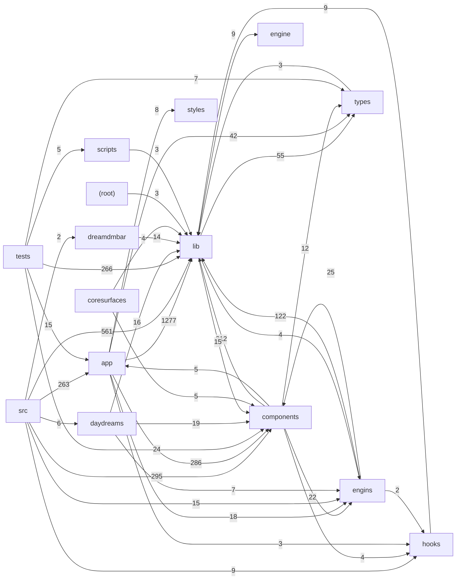

#### File-Level Connectivity (auto-generated)

<details><summary>lib/ (579 files)</summary>

| File | Type | Imports | Imported By | Top Importers | Top Imports |
|---|---|---|---|---|---|
| `lib/supabase/safeGetUser.ts` | ts | 0 | 191 | `app/(internal)/idari-console/page.tsx`, `app/(internal)/idari-console/platform-health/page.tsx`, `app/actions/dream-docs.ts` | — |
| `lib/supabase/server.ts` | ts | 2 | 187 | `app/(internal)/idari-console/page.tsx`, `app/(internal)/idari-console/platform-errors/page.tsx`, `app/(internal)/idari-console/platform-health/page.tsx` | `types/supabase.ts`, `lib/supabase/config.ts` |
| `lib/utils.ts` | ts | 0 | 123 | `app/actions/dream-docs.ts`, `app/ads/create/page.tsx`, `app/api/account/delete-data/route.ts` | — |
| `lib/supabase/client.ts` | ts | 1 | 60 | `app/ads/create/page.tsx`, `app/auth/reset-password/page.tsx`, `app/auth/update-password/page.tsx` | `lib/supabase/config.ts` |
| `lib/dev-bypass.ts` | ts | 0 | 44 | `app/(internal)/idari-console/page.tsx`, `app/daydream/brand/page.tsx`, `app/daydream/code/page.tsx` | — |
| `lib/runtime/dualRuntimeBridge.ts` | ts | 2 | 35 | `app/dreamdmbar/_components/dreamr/dream.DreamRCore.tsx`, `app/dreamdmbar/_components/dreamr/dream.DreamRFeed.tsx`, `components/daydream/dream.CodeDreamIDE.tsx` | `lib/runtime/madMaxiSnapshotBridge.ts`, `lib/vm/wasmGpuVM.ts` |
| `lib/engin-runtime/EnginBaseState.ts` | ts | 0 | 28 | `lib/dreams/dreamIntentBus.ts`, `lib/dreams/types.ts`, `lib/engin-runtime/EnginCapabilities.ts` | — |
| `lib/dreamdm/DreamSystemContext.tsx` | tsx | 5 | 27 | `app/dreamdmbar/_components/DreamBarDataBridge.tsx`, `app/dreamdmbar/dreamspace/page.tsx`, `app/dreamdmbar/dualruntime/page.tsx` | `lib/dreamdm/barInteractions.ts`, `lib/panels/panelTypes.ts`, `lib/runtime/dualRuntime.ts` |
| `lib/forge/forgeRegistry.ts` | ts | 0 | 22 | `app/daydream/forge/page.tsx`, `components/dreams/dreamsurface.dreamspace.tsx`, `components/forge/dream.panel.AIBuilderPanel.tsx` | — |
| `lib/activity/types.ts` | ts | 0 | 20 | `app/api/activity/track/route.ts`, `app/api/ads/view/route.ts`, `app/api/metrics/platform/route.ts` | — |
| `lib/gameengin/cartridges/manifest.ts` | ts | 1 | 20 | `app/api/game-scores/route.ts`, `app/daydream/game/dream.shell.ImmersiveGameShell.tsx`, `app/gameengin/cartridges/[id]/page.tsx` | `lib/gameengin/cartridge.ts` |
| `lib/connectors/normalise.ts` | ts | 1 | 19 | `lib/connectors/providers/bluesky.ts`, `lib/connectors/providers/devto.ts`, `lib/connectors/providers/facebook.ts` | `types/connector.ts` |
| `lib/gameengin/cartridge.ts` | ts | 0 | 19 | `app/daydream/game/dream.shell.ImmersiveGameShell.tsx`, `components/gameengin/dream.cartridge.CartridgeLauncher.tsx`, `engins/engin.GameEngin.tsx` | — |
| `lib/ai/triad.ts` | ts | 2 | 17 | `app/(internal)/idari-console/page.tsx`, `app/actions/dream-docs.ts`, `app/api/admin/ai-chat/route.ts` | `lib/ai/groq.ts`, `lib/ai/schemas.ts` |
| `lib/engin-runtime/EnginCapabilityTargets.ts` | ts | 0 | 16 | `lib/engin-runtime/EnginCapabilityExecution.ts`, `lib/engin-runtime/EnginCapabilityScorecard.ts`, `lib/engin-runtime/EnginDomainCores.ts` | — |
| `lib/identity/canonical-names.ts` | ts | 0 | 16 | `components/dreamengin/dream.DREAMenginOS.tsx`, `components/runtime/dream.RuntimeView.tsx`, `lib/dream-window/DreamWindowLifecycle.ts` | — |
| `lib/runtime/dreamOSBus.ts` | ts | 8 | 15 | `app/dreamdmbar/_components/DreamBarDataBridge.tsx`, `app/dreamdmbar/_components/DreamSpaceRegion.tsx`, `components/dream.OSShellActivator.tsx` | `lib/identity/canonical-names.ts`, `lib/runtime/dualRuntime.ts`, `lib/runtime/dualRuntimeBridge.ts` |
| `lib/supabase/config.ts` | ts | 0 | 15 | `app/api/auth/providers/route.ts`, `app/api/setup/google-oauth/route.ts`, `app/auth/callback/route.ts` | — |
| `lib/api/route.ts` | ts | 2 | 14 | `app/api/account/delete-data/route.ts`, `app/api/account/delete-dream/route.ts`, `app/api/account/export-data/route.ts` | `lib/supabase/server.ts`, `lib/supabase/safeGetUser.ts` |
| `lib/engin-runtime/EnginCapabilities.ts` | ts | 1 | 14 | `lib/dreams/dreamIntentBus.ts`, `lib/engin-runtime/EnginRuleSetContract.ts`, `lib/engin-runtime/EnginRuntime.ts` | `lib/engin-runtime/EnginBaseState.ts` |
| `lib/gameengin/power-systems.ts` | ts | 0 | 14 | `lib/gameengin/core.ts`, `lib/gameengin/index.ts`, `lib/gameengin/systems/ai.ts` | — |
| `lib/games/hooks.ts` | ts | 2 | 14 | `components/games/dream.AvenueOfMirrors.tsx`, `components/games/dream.DefuseRitual.tsx`, `components/games/dream.EchoArena.tsx` | `lib/games/performance-baseline.ts`, `lib/webgpu.ts` |
| `lib/media/ledger.ts` | ts | 1 | 14 | `app/api/ledger-media/route.ts`, `app/dreamdmbar/_components/dreamr/dreamsurface.dreamr.tsx`, `components/dream.CreatePostModal.tsx` | `lib/utils.ts` |
| `lib/social/rss-feed.ts` | ts | 1 | 13 | `app/api/social/rss-feed/route.ts`, `lib/connectors/providers/devto.ts`, `lib/connectors/providers/facebook.ts` | `types/connector.ts` |
| `lib/dreamdm/barInteractions.ts` | ts | 0 | 12 | `app/dreamdmbar/_components/DreamBarDataBridge.tsx`, `components/dream.OSShellActivator.tsx`, `components/home/dream.NeuralSeamCanvas.tsx` | — |
| `lib/engin-runtime/EnginRuleSetContract.ts` | ts | 3 | 12 | `lib/engin-runtime/EnginRuntime.ts`, `lib/engin-runtime/HotRuntime.ts`, `lib/engin-runtime/PremiumRuntimeQuality.ts` | `lib/engin-runtime/EnginBaseState.ts`, `lib/engin-runtime/EnginCapabilities.ts`, `lib/engin-runtime/EnginCapabilityTargets.ts` |
| `lib/forge/forgeIntelligence.ts` | ts | 1 | 12 | `components/daydream/dreamsurface.daydream.BrandDaydream.tsx`, `components/dreams/dreamsurface.dreamspace.tsx`, `engins/dream.ForgeEngin.tsx` | `lib/forge/forgeRegistry.ts` |
| `lib/forge/useForgeActivity.ts` | ts | 1 | 12 | `components/daydream/dream.shell.DaydreamShell.tsx`, `components/daydream/dreamsurface.daydream.BrandDaydream.tsx`, `components/dream.universal_asset_registry.tsx` | `lib/forge/forgeRegistry.ts` |
| `lib/ui/CustomizeModeContext.tsx` | tsx | 1 | 12 | `app/layout.tsx`, `app/settings/appearance/page.tsx`, `components/customize/dream.bar.CustomizeModeBar.tsx` | `lib/ui/skin-engine.ts` |
| `lib/ai/audit.ts` | ts | 2 | 11 | `app/api/account/delete-data/route.ts`, `app/api/account/delete-dream/route.ts`, `app/api/ai/boogieman/child-safety/route.ts` | `lib/ai/boogie-policy.ts`, `lib/supabase/server.ts` |
| `lib/ai/boogie-policy.ts` | ts | 0 | 10 | `app/api/ai/boogieman/status/route.ts`, `app/api/appeal/route.ts`, `app/policy/page.tsx` | — |
| `lib/dream-window/DreamWindowLifecycle.ts` | ts | 1 | 10 | `app/api/dream-windows/[id]/route.ts`, `app/api/dream-windows/route.ts`, `components/dreams/dream.widget.SuperDreamWidget.tsx` | `lib/identity/canonical-names.ts` |
| `lib/engin-runtime/EnginIOAdapter.ts` | ts | 2 | 10 | `lib/engin-runtime/EnginRuntime.ts`, `lib/engin-runtime/index.ts`, `lib/engins/brand/useBrandEnginRuntime.ts` | `lib/engin-runtime/EnginBaseState.ts`, `lib/engin-runtime/PremiumRuntimeQuality.ts` |
| `lib/feed/useLiveFeed.ts` | ts | 3 | 10 | `app/dreamdmbar/_components/dreamr/dreamsurface.dreamr.tsx`, `app/dreamdmbar/layout.tsx`, `components/dream.HomeFeed.tsx` | `engine/io.ts`, `lib/media/postMedia.ts`, `lib/supabase/client.ts` |
| `lib/gameengin/cartridges/loaders.ts` | ts | 16 | 10 | `app/daydream/game/dream.shell.ImmersiveGameShell.tsx`, `components/gameengin/dream.cartridge.CartridgeLauncher.tsx`, `engins/engin.GameEngin.tsx` | `lib/gameengin/cartridge.ts`, `lib/gameengin/cartridges/manifest.ts`, `lib/gameengin/cartridges/reactCartridge.ts` |
| `lib/ai/schemas.ts` | ts | 0 | 9 | `app/api/ai/eams/route.ts`, `app/api/ai/execute/route.ts`, `app/api/ai/idari/route.ts` | — |
| `lib/auth/nextRedirect.ts` | ts | 0 | 9 | `app/auth/callback/route.ts`, `app/daydream/games/page.tsx`, `app/engines/games/builder/page.tsx` | — |
| `lib/babylon/createEngine.ts` | ts | 0 | 9 | `components/dreamengin/dream.DREAMenginOS.tsx`, `components/dreamengin/dream.scene.BabylonGameScene.tsx`, `components/dreamengin/dream.scene.DrEamsScene.tsx` | — |
| `lib/codeengin/pathSafety.ts` | ts | 0 | 9 | `app/api/codeengin/diagnostics/route.ts`, `app/api/codeengin/file/route.ts`, `app/api/codeengin/git/route.ts` | — |
| `lib/codeengin/workspaceStore.ts` | ts | 2 | 9 | `app/api/codeengin/file/route.ts`, `app/api/codeengin/upload/route.ts`, `app/api/codeengin/workspace/route.ts` | `lib/codeengin/pathSafety.ts`, `lib/codeengin/types.ts` |
| `lib/connectors/connectorRegistry.ts` | ts | 0 | 9 | `app/api/connectors/status/route.ts`, `app/connectors/dream.ConnectorsClient.tsx`, `components/connectors/dream.AddSliceSheet.tsx` | — |
| `lib/enginpipe/index.ts` | ts | 5 | 9 | `engins/CodeEngin/orchestrator/dream.index.tsx`, `engins/dream.ForgeEngin.tsx`, `engins/engin.BrandingEngin.tsx` | `lib/enginpipe/artifact/manifest.ts`, `lib/enginpipe/telemetry/client.ts`, `lib/enginpipe/telemetry/events.ts` |
| `lib/eventBus.ts` | ts | 0 | 9 | `components/dream.ForgeDreamCanvas.tsx`, `lib/dreamenginOS/OSContext.tsx`, `lib/dreamenginOS/index.ts` | — |
| `lib/games/navigation.ts` | ts | 0 | 9 | `app/daydream/game/dream.shell.ImmersiveGameShell.tsx`, `app/daydream/games/page.tsx`, `app/daydream/play/page.tsx` | — |
| `lib/observability/collector.ts` | ts | 1 | 9 | `app/api/admin/observability/route.ts`, `lib/agents/idariLoop.ts`, `lib/observability/correlator.ts` | `lib/observability/otelBridge.ts` |
| `lib/runtime/dualRuntime.ts` | ts | 2 | 9 | `components/runtime/dream.DualRuntimeContainer.tsx`, `components/runtime/dream.RuntimeView.tsx`, `lib/dreamdm/DreamSystemContext.tsx` | `lib/identity/canonical-names.ts`, `lib/panels/panelTypes.ts` |
| `lib/widgets/widgetRegistry.ts` | ts | 0 | 9 | `app/connectors/dream.ConnectorsClient.tsx`, `components/connectors/dream.NoSlotDialog.tsx`, `components/connectors/dream.PlacementMode.tsx` | — |
| `lib/child-safety/childSafetyDetector.ts` | ts | 1 | 8 | `app/api/ai/boogieman/child-safety/route.ts`, `app/api/comments/route.ts`, `app/api/messages/route.ts` | `lib/child-safety/imageClassifier.ts` |
| `lib/codeengin/auth.ts` | ts | 3 | 8 | `app/api/codeengin/diagnostics/route.ts`, `app/api/codeengin/file/route.ts`, `app/api/codeengin/git/route.ts` | `lib/admin/lockout.ts`, `lib/supabase/safeGetUser.ts`, `lib/supabase/server.ts` |
| `lib/connectors/providers/youtube.ts` | ts | 2 | 8 | `app/api/connectors/[provider]/connect/route.ts`, `app/api/connectors/[provider]/verify/route.ts`, `app/api/youtube/channel/route.ts` | `lib/connectors/normalise.ts`, `types/connector.ts` |
| `lib/engin-runtime/EnginRuntime.ts` | ts | 10 | 8 | `lib/engin-runtime/index.ts`, `lib/engins/brand/useBrandEnginRuntime.ts`, `lib/engins/code/useCodeEnginRuntime.ts` | `lib/engin-runtime/EnginBaseState.ts`, `lib/engin-runtime/EnginCapabilities.ts`, `lib/engin-runtime/EnginEventBus.ts` |
| `lib/media/postMedia.ts` | ts | 0 | 8 | `app/api/dreamr/suggested/route.ts`, `app/api/feed/route.ts`, `app/api/posts/route.ts` | — |
| `lib/social/platforms.ts` | ts | 0 | 8 | `components/dream.ProfileEditor.tsx`, `components/profile/dream.ProfileCanvas.tsx`, `components/ui/dream.PlatformBadge.tsx` | — |
| `lib/agents/agentBus.ts` | ts | 2 | 7 | `app/api/account/delete-dream/route.ts`, `components/dream.AIAssistant.tsx`, `components/dream.DrEamsVoiceAssistant.tsx` | `lib/ai/schemas.ts`, `lib/ai/triad.ts` |
| `lib/ai/boogieman.ts` | ts | 2 | 7 | `app/api/ai/boogieman/child-safety/route.ts`, `app/api/ai/boogieman/privacy-event/route.ts`, `app/api/ai/boogieman/route.ts` | `lib/ai/boogie-policy.ts`, `lib/ai/schemas.ts` |
| `lib/daydream/useDaydreamPersistence.ts` | ts | 2 | 7 | `engins/engin.BrandingEngin.tsx`, `engins/engin.CodeEngin.tsx`, `engins/engin.ContentEngin.tsx` | `lib/supabase/client.ts`, `lib/supabase/safeGetUser.ts` |
| `lib/dreamenginOS/index.ts` | ts | 11 | 7 | `engins/engin.BrandingEngin.tsx`, `engins/engin.ContentEngin.tsx`, `engins/engin.GameEngin.tsx` | `lib/ledger.ts`, `lib/eventBus.ts`, `lib/slog.ts` |
| `lib/dreamnav/delta.ts` | ts | 0 | 7 | `components/dreamengin/dream.menu.OutdreamMenu.tsx`, `components/dreamengin/dream.overlay.ViewAllDreamsOverlay.tsx`, `components/dreamnav/dreamsurface.dreamnav.tsx` | — |
| `lib/gameengin/brain-reader.ts` | ts | 0 | 7 | `app/api/gameengin/crash-report/route.ts`, `src/engin/generated/systems.ts`, `tests/gameengin-architect.test.ts` | — |
| `lib/god-tier/godTierEngine.ts` | ts | 1 | 7 | `components/dreamengin/dream.scene.BabylonGameScene.tsx`, `components/dreamengin/dream.scene.DrEamsScene.tsx`, `components/games/madmaxi/dream.MadmaxiGame.tsx` | `lib/webgpu/director.ts` |
| `lib/navigation/WidgetInstanceMemory.ts` | ts | 0 | 7 | `components/dream.ProfileSpace.tsx`, `components/dream.widget.AnchorWidget.tsx`, `components/spatial/dream.shell.EnhancedSpatialShell.tsx` | — |
| `lib/panels/panelTypes.ts` | ts | 0 | 7 | `app/dreamdmbar/_components/DreamBarDataBridge.tsx`, `components/dream.OSShellActivator.tsx`, `components/panels/dream.panel.SettingsPanel.tsx` | — |
| `lib/agents/idari.ts` | ts | 1 | 6 | `app/api/ai/idari/route.ts`, `lib/admin/upgrade-readiness.ts`, `lib/agents/idariLoop.ts` | `types/ai.ts` |
| `lib/ai/rateLimit.ts` | ts | 1 | 6 | `app/api/ai/boogieman/child-safety/route.ts`, `app/api/ai/boogieman/route.ts`, `app/api/ai/eams/route.ts` | `lib/supabase/server.ts` |
| `lib/codeengin/types.ts` | ts | 0 | 6 | `lib/codeengin/diagnostics.ts`, `lib/codeengin/projectGraph.ts`, `lib/codeengin/runner.ts` | — |
| `lib/collaboration/index.ts` | ts | 1 | 6 | `components/shared-dream/dream.SharedDreamProvider.tsx`, `hooks/useSharedDream.ts`, `lib/reality/types.ts` | `engine/io.ts` |
| `lib/componentInventory.ts` | ts | 0 | 6 | `components/dream.ForgeDreamCanvas.tsx`, `components/forge/dream.EngineBuilderCanvas.tsx`, `lib/dreamenginOS/index.ts` | — |
| `lib/engin-runtime/EnginCapabilityExecution.ts` | ts | 1 | 6 | `lib/engin-runtime/EnginDomainCores.ts`, `lib/engin-runtime/EnginRuntime.ts`, `lib/engin-runtime/HotRuntime.ts` | `lib/engin-runtime/EnginCapabilityTargets.ts` |
| `lib/engins/game/gameEnginRuleSet.ts` | ts | 4 | 6 | `engins/engin.GameEngin.tsx`, `lib/engins/game/index.ts`, `lib/engins/game/useGameEnginRuntime.ts` | `lib/engin-runtime/EnginBaseState.ts`, `lib/engin-runtime/EnginCapabilities.ts`, `lib/engin-runtime/EnginCapabilityTargets.ts` |
| `lib/engins/useEnginWorkflow.ts` | ts | 3 | 6 | `engins/engin.BrandingEngin.tsx`, `engins/engin.CodeEngin.tsx`, `engins/engin.ContentEngin.tsx` | `lib/journey/journeyDots.ts`, `lib/runtime/dualRuntimeBridge.ts`, `lib/engins/workflowEngine.ts` |
| `lib/forge/forgeMomentum.ts` | ts | 1 | 6 | `components/dreams/dreamsurface.dreamspace.tsx`, `components/forge/dream.widget.ForgeMomentumWidget.tsx`, `components/home/dream.FlagshipEnginesStrip.tsx` | `lib/forge/forgeRegistry.ts` |
| `lib/gameengin/ai-director.ts` | ts | 0 | 6 | `components/games/dream.NeonDrift.tsx`, `lib/gameengin/executionWiring.ts`, `lib/gameengin/index.ts` | — |
| `lib/games/catalog.ts` | ts | 3 | 6 | `components/engines/games/panels/dream.panel.LibraryPanel.tsx`, `components/games/dream.GamesHub.tsx`, `engins/engin.GameEngin.tsx` | `lib/gameengin/cartridges/manifest.ts`, `lib/games/mobileControls.ts`, `lib/games/performance-baseline.ts` |
| `lib/games/mobileControls.ts` | ts | 1 | 6 | `components/games/dream.EchoArena.tsx`, `components/games/dream.hud.GameHUD.tsx`, `components/games/dream.hud.MobileGameHUD.tsx` | `lib/games/useRemoteChannel.ts` |
| `lib/games/performance-baseline.ts` | ts | 0 | 6 | `components/games/dream.EchoArena.tsx`, `components/games/dream.NeonDrift.tsx`, `lib/games/catalog.ts` | — |
| `lib/gct/gct-engine.ts` | ts | 0 | 6 | `lib/gct/anomaly-detection.ts`, `lib/gct/audio-fingerprint.ts`, `lib/gct/image-search.ts` | — |
| `lib/music/starmakerDaw.ts` | ts | 0 | 6 | `components/daydream/starmaker/dream.panel.CompingPanel.tsx`, `components/daydream/starmaker/dream.panel.PianoRollPanel.tsx`, `components/daydream/starmaker/dream.panel.SessionViewPanel.tsx` | — |
| `lib/navigation/NavStateBuffer.ts` | ts | 0 | 6 | `components/dream.widget.AnchorWidget.tsx`, `components/spatial/dream.shell.EnhancedSpatialShell.tsx`, `lib/navigation/SpatialNavigationEngine.ts` | — |
| `lib/observability/correlator.ts` | ts | 1 | 6 | `app/api/admin/observability/route.ts`, `lib/agents/idariLoop.ts`, `lib/observability/index.ts` | `lib/observability/collector.ts` |
| `lib/observability/rootCauseAnalyzer.ts` | ts | 3 | 6 | `app/api/admin/observability/route.ts`, `lib/agents/idariLoop.ts`, `lib/observability/immediateAction.ts` | `lib/agents/idari.ts`, `lib/observability/collector.ts`, `lib/observability/correlator.ts` |
| `lib/runtime/coercionTable.ts` | ts | 0 | 6 | `components/universal-editor/dream.UniversalEditor.tsx`, `lib/runtime/dropTargetRegistry.ts`, `lib/runtime/useDragSurface.ts` | — |
| `lib/runtime/EnginDispatcher.ts` | ts | 1 | 6 | `app/dreamdmbar/_components/DreamBarDataBridge.tsx`, `components/dream.OSShellActivator.tsx`, `components/dreamengin/dream.DREAMenginOS.tsx` | `lib/runtime/memory.ts` |
| `lib/runtime/instanceManager.ts` | ts | 3 | 6 | `engins/autoopen/dream.AutoOpenGameEngin.tsx`, `engins/engin.GameEngin.tsx`, `lib/runtime/useEnginCoopSync.ts` | `lib/runtime/runtimeChannel.ts`, `types/module-manifest.ts`, `lib/supabase/client.ts` |
| `lib/runtime/useEnginBridge.ts` | ts | 1 | 6 | `engins/engin.BrandingEngin.tsx`, `engins/engin.CodeEngin.tsx`, `engins/engin.ContentEngin.tsx` | `lib/runtime/dualRuntimeBridge.ts` |
| `lib/runtime/useEnginCoopSync.ts` | ts | 3 | 6 | `engins/engin.BrandingEngin.tsx`, `engins/engin.ContentEngin.tsx`, `engins/engin.GameEngin.tsx` | `lib/runtime/instanceManager.ts`, `lib/runtime/useSharedEnginChannel.ts`, `types/module-manifest.ts` |
| `lib/ui/runtimeViewport.ts` | ts | 1 | 6 | `app/dreamdmbar/_components/HomeDreamRegion.tsx`, `components/dream.HomeFeed.tsx`, `components/runtime/dream.shell.RuntimeShell.tsx` | `lib/ui/responsive.ts` |
| `lib/vm/types.ts` | ts | 0 | 6 | `lib/vm/bufferManager.ts`, `lib/vm/index.ts`, `lib/vm/snapshot.ts` | — |
| `lib/webgpu/director.ts` | ts | 0 | 6 | `components/dreamengin/dream.scene.BabylonGameScene.tsx`, `lib/god-tier/godTierEngine.ts`, `lib/webgpu/adaptiveQuality.ts` | — |
| `lib/activity/scoring.ts` | ts | 1 | 5 | `app/api/activity/track/route.ts`, `components/activity/dream.ActivityPostForm.tsx`, `components/activity/dream.TierBadge.tsx` | `lib/activity/types.ts` |
| `lib/admin/lockout.ts` | ts | 1 | 5 | `app/api/admin/ai-chat/route.ts`, `app/api/admin/code-files/route.ts`, `lib/codeengin/auth.ts` | `lib/supabase/server.ts` |
| `lib/ai/groq.ts` | ts | 0 | 5 | `app/api/admin/ai-chat/route.ts`, `app/api/ai/idari/route.ts`, `lib/ai/triad.ts` | — |
| `lib/ai/tool-router.ts` | ts | 4 | 5 | `lib/ai/handlers/dreams.ts`, `lib/ai/handlers/index.ts`, `lib/ai/handlers/navigation.ts` | `engine/io.ts`, `types/ai-system.ts`, `lib/ai/audit.ts` |
| `lib/audioFingerprint.ts` | ts | 1 | 5 | `components/dream.AudioVisualizer3D.tsx`, `engins/engin.StarMakerEngin.tsx`, `lib/dreamenginOS/index.ts` | `lib/torridity.ts` |
| `lib/botDetection.ts` | ts | 1 | 5 | `app/dreamdmbar/_components/dreamr/dream.DreamRFeed.tsx`, `lib/bot-detection/index.ts`, `lib/dreamenginOS/index.ts` | `lib/slog.ts` |
| `lib/child-safety/imageClassifier.ts` | ts | 2 | 5 | `app/api/ai/boogieman/child-safety/route.ts`, `lib/child-safety/childSafetyDetector.ts`, `lib/child-safety/scanMediaUrls.ts` | `lib/ai/groq.ts`, `lib/utils.ts` |
| `lib/child-safety/ncmecReporter.ts` | ts | 3 | 5 | `app/api/ai/boogieman/child-safety/route.ts`, `app/api/comments/route.ts`, `app/api/messages/route.ts` | `lib/supabase/server.ts`, `lib/child-safety/childSafetyDetector.ts`, `lib/utils.ts` |
| `lib/connectors/installFlow.ts` | ts | 1 | 5 | `app/connectors/dream.ConnectorsClient.tsx`, `components/connectors/dream.PlacementMode.tsx`, `hooks/useConnectorInstallFlow.ts` | `lib/widgets/widgetRegistry.ts` |
| `lib/connectors/providers/nostr.ts` | ts | 2 | 5 | `app/api/connectors/[provider]/connect/route.ts`, `app/api/connectors/[provider]/verify/route.ts`, `lib/connectors/syncDispatch.ts` | `lib/connectors/normalise.ts`, `types/connector.ts` |
| `lib/daydream/useDaydreamState.ts` | ts | 2 | 5 | `components/daydream/dream.shell.DaydreamShell.tsx`, `engins/engin.BrandingEngin.tsx`, `engins/engin.CodeEngin.tsx` | `lib/supabase/client.ts`, `lib/supabase/safeGetUser.ts` |
| `lib/dreamr/torridityLedger.ts` | ts | 1 | 5 | `app/dreamdmbar/_components/dreamr/algorithms/botDetector.ts`, `app/dreamdmbar/_components/dreamr/algorithms/dreamrAlgorithm.ts`, `lib/dreamr/dreamrfeed.tsx` | `lib/dreamr/swipeCalibration.ts` |
| `lib/engin-runtime/EnginCapabilityScorecard.ts` | ts | 2 | 5 | `lib/engin-runtime/EnginDomainCores.ts`, `lib/engin-runtime/EnginPerformanceProbe.ts`, `lib/engin-runtime/InternalMetrics.ts` | `lib/engin-runtime/EnginBaseState.ts`, `lib/engin-runtime/EnginCapabilityTargets.ts` |
| `lib/forge/engineForge.ts` | ts | 2 | 5 | `components/dream.ForgeDreamCanvas.tsx`, `components/forge/dream.EngineBuilderCanvas.tsx`, `lib/dreamenginOS/index.ts` | `lib/componentInventory.ts`, `lib/eventBus.ts` |
| `lib/gameengin/cartridges/reactCartridge.ts` | ts | 2 | 5 | `components/games/dream.AvenueOfMirrors.tsx`, `components/games/dream.MadMaxiWildfall.tsx`, `lib/gameengin/cartridges/loaders.ts` | `lib/gameengin/cartridge.ts`, `lib/gameengin/cartridges/manifest.ts` |
| `lib/gameengin/core.ts` | ts | 2 | 5 | `lib/gameengin/index.ts`, `lib/gameengin/platform.ts`, `lib/gameengin/post-fx.ts` | `lib/gameengin/power-systems.ts`, `lib/babylon/createEngine.ts` |
| `lib/games/quality-plan.ts` | ts | 0 | 5 | `app/daydream/games/page.tsx`, `daydreams/games/page.tsx`, `engins/engin.GameEngin.tsx` | — |
| `lib/navigation/manifold.ts` | ts | 0 | 5 | `lib/navigation/TransformSolver.ts`, `lib/navigation/anchorField.ts`, `lib/navigation/index.ts` | — |
| `lib/notifications/notificationHelpers.ts` | ts | 0 | 5 | `components/dream.NotificationCenter.tsx`, `lib/notifications/useNotifications.ts`, `src/engin/generated/systems.ts` | — |
| `lib/offline/offlineCache.ts` | ts | 0 | 5 | `components/dreamengin/dream.CanvasDropZone.tsx`, `lib/offline/useOfflineSync.ts`, `lib/scene/sceneState.ts` | — |
| `lib/optimizer/creative-optimizero.ts` | ts | 0 | 5 | `components/optimizer/dream.scene.BabylonOptimizeroScene.tsx`, `lib/optimizer/babylon-optimizero.ts`, `src/engin/generated/systems.ts` | — |
| `lib/optimizer/types.ts` | ts | 0 | 5 | `lib/optimizer/constraint-solver.ts`, `lib/optimizer/creative-validator.ts`, `lib/optimizer/index.ts` | — |
| `lib/routing/surfaces.ts` | ts | 0 | 5 | `components/dream.OSShellActivator.tsx`, `components/home/dream.bar.GlobalDreamBar.tsx`, `components/home/dream.bar.PersistentDreamBar.tsx` | — |
| `lib/runtime/runtimeChannel.ts` | ts | 1 | 5 | `lib/gameengin/GameRuntime.tsx`, `lib/runtime/instanceManager.ts`, `lib/runtime/useSharedEnginChannel.ts` | `lib/engin-runtime/EnginBaseState.ts` |
| `lib/ui/skin-engine.ts` | ts | 0 | 5 | `components/customize/panels/dream.panel.ColorPanel.tsx`, `components/customize/panels/dream.panel.FontPanel.tsx`, `components/customize/panels/dream.panel.LayoutPanel.tsx` | — |
| `lib/ui/theme-engine.ts` | ts | 0 | 5 | `app/settings/appearance/page.tsx`, `components/dreamengin/dream.widget.AppearanceWidget.tsx`, `components/panels/dream.panel.AppearancePanel.tsx` | — |
| `lib/vm/wasmGpuVM.ts` | ts | 3 | 5 | `lib/runtime/dualRuntimeBridge.ts`, `lib/vm/index.ts`, `lib/vm/snapshot.ts` | `lib/vm/bufferManager.ts`, `lib/vm/pipelineCache.ts`, `lib/vm/types.ts` |
| `lib/web3/types.ts` | ts | 0 | 5 | `lib/web3/client.ts`, `lib/web3/engagement.ts`, `lib/web3/index.ts` | — |
| `lib/activity/aqs.ts` | ts | 2 | 4 | `app/api/ads/view/route.ts`, `components/activity/dream.ActivityProfile.tsx`, `src/engin/generated/systems.ts` | `lib/supabase/client.ts`, `lib/activity/types.ts` |
| `lib/agents/teachBus.ts` | ts | 0 | 4 | `components/dream.AIAssistant.tsx`, `components/dream.DrEamsModeToggle.tsx`, `components/dream.ThemeToggle.tsx` | — |
| `lib/artifactStore.ts` | ts | 1 | 4 | `app/dreamdmbar/_components/DreamSpaceRegion.tsx`, `components/home/dream.ActiveModuleSurface.tsx`, `src/engin/generated/systems.ts` | `types/dreamArtifact.ts` |
| `lib/child-safety/scanMediaUrls.ts` | ts | 2 | 4 | `app/api/messages/route.ts`, `app/api/posts/route.ts`, `src/engin/generated/systems.ts` | `lib/child-safety/childSafetyDetector.ts`, `lib/child-safety/imageClassifier.ts` |
| `lib/code/drEamsCodeAssist.ts` | ts | 0 | 4 | `src/engin/generated/systems.ts`, `tests/code-dream-preview.test.ts`, `tests/dr-eams-code-assist.test.ts` | — |
| `lib/codeengin/runner.ts` | ts | 2 | 4 | `app/api/ci/run/route.ts`, `app/api/codeengin/run/route.ts`, `app/api/codeengin/workspace/route.ts` | `lib/codeengin/workspaceStore.ts`, `lib/codeengin/types.ts` |
| `lib/connectors/providers/bluesky.ts` | ts | 2 | 4 | `app/api/connectors/[provider]/connect/route.ts`, `app/api/connectors/[provider]/verify/route.ts`, `lib/connectors/syncDispatch.ts` | `lib/connectors/normalise.ts`, `types/connector.ts` |
| `lib/connectors/providers/github.ts` | ts | 2 | 4 | `app/api/connectors/[provider]/connect/route.ts`, `app/api/connectors/[provider]/verify/route.ts`, `lib/connectors/syncDispatch.ts` | `lib/connectors/normalise.ts`, `types/connector.ts` |
| `lib/connectors/providers/mastodon.ts` | ts | 2 | 4 | `app/api/connectors/[provider]/connect/route.ts`, `app/api/connectors/[provider]/verify/route.ts`, `lib/connectors/syncDispatch.ts` | `lib/connectors/normalise.ts`, `types/connector.ts` |
| `lib/connectors/providers/reddit.ts` | ts | 2 | 4 | `app/api/connectors/[provider]/connect/route.ts`, `app/api/connectors/[provider]/verify/route.ts`, `lib/connectors/syncDispatch.ts` | `lib/connectors/normalise.ts`, `types/connector.ts` |
| `lib/connectors/syncDispatch.ts` | ts | 8 | 4 | `app/api/connectors/[provider]/sync/route.ts`, `app/api/connectors/cron/route.ts`, `lib/connectors/reconcile.ts` | `lib/connectors/providers/bluesky.ts`, `lib/connectors/providers/github.ts`, `lib/connectors/providers/instagram.ts` |
| `lib/connectors/webhookVerification.ts` | ts | 0 | 4 | `app/api/connectors/cron/route.ts`, `app/api/connectors/webhooks/[provider]/route.ts`, `src/engin/generated/connectors.ts` | — |
| `lib/content/transcriptEditor.ts` | ts | 0 | 4 | `app/api/content/transcribe/route.ts`, `engins/engin.ContentEngin.tsx`, `src/engin/generated/systems.ts` | — |
| `lib/dream-window/enginConnectionNetwork.ts` | ts | 1 | 4 | `lib/dream-window/index.ts`, `lib/dreamengin/osSubsystemManifest.ts`, `src/engin/generated/dreamsurfaces.ts` | `lib/identity/canonical-names.ts` |
| `lib/dream-window/useDreamWindowActions.ts` | ts | 3 | 4 | `components/dreams/dream.widget.SuperDreamWidget.tsx`, `components/home/dream.ActiveModuleSurface.tsx`, `src/engin/generated/dreamsurfaces.ts` | `types/dream-window.ts`, `lib/dream-window/DreamWindowLifecycle.ts`, `lib/utils.ts` |
| `lib/dreamdm/useDreamBarContext.ts` | ts | 1 | 4 | `dreamdmbar/dreamsurface.dreamdmbar.tsx`, `src/engin/generated/dreamdmbar.ts`, `tests/dream-bar-context.test.ts` | `lib/dreamdm/DreamSystemContext.tsx` |
| `lib/dreamdm/useDreamDMMessages.ts` | ts | 2 | 4 | `components/dream.MessagesClient.tsx`, `dreamdmbar/dreamsurface.dreamdmbar.tsx`, `lib/dreamdm/useMessagingCore.ts` | `engine/io.ts`, `lib/supabase/client.ts` |
| `lib/dreamenginOS/OSContext.tsx` | tsx | 3 | 4 | `app/dreamdmbar/_components/DreamSpaceRegion.tsx`, `app/layout.tsx`, `components/home/dream.bar.PersistentDreamBar.tsx` | `lib/eventBus.ts`, `lib/ledger.ts`, `lib/dreamenginOS/index.ts` |
| `lib/dreamr/closeFriendsVisibility.ts` | ts | 2 | 4 | `app/api/dreamr/suggested/route.ts`, `app/dreamdmbar/_components/dreamr/api/feedHandler.ts`, `src/engin/generated/dreamr.ts` | `engine/io.ts`, `lib/supabase/server.ts` |
| `lib/dreamr/swipeCalibration.ts` | ts | 0 | 4 | `components/dream.LandingHero.tsx`, `lib/dreamr/torridityLedger.ts`, `src/engin/generated/dreamr.ts` | — |
| `lib/dreams/drag.ts` | ts | 0 | 4 | `components/dreams/dream.DraggableDream.tsx`, `components/dreams/dream.GlobalDragLayer.tsx`, `components/home/dream.bar.PersistentDreamBar.tsx` | — |
| `lib/dreams/types.ts` | ts | 1 | 4 | `lib/dreams/dreamIntentBus.ts`, `lib/dreams/profileProjection.ts`, `src/engin/generated/dreamsurfaces.ts` | `lib/engin-runtime/EnginBaseState.ts` |
| `lib/engin-runtime/EnginEventBus.ts` | ts | 1 | 4 | `lib/engin-runtime/EnginRuntime.ts`, `lib/engin-runtime/index.ts`, `src/engin/generated/systems.ts` | `lib/engin-runtime/EnginBaseState.ts` |
| `lib/engin-runtime/EnginHardwareCapabilities.ts` | ts | 1 | 4 | `lib/engin-runtime/EnginDomainCores.ts`, `lib/engin-runtime/EnginPerformanceProbe.ts`, `lib/engin-runtime/index.ts` | `lib/engin-runtime/EnginBaseState.ts` |
| `lib/engin-runtime/HotRuntime.ts` | ts | 2 | 4 | `lib/engin-runtime/EnginDomainCores.ts`, `lib/engin-runtime/EnginRuntime.ts`, `lib/engin-runtime/index.ts` | `lib/engin-runtime/EnginRuleSetContract.ts`, `lib/engin-runtime/EnginCapabilityExecution.ts` |
| `lib/engin-runtime/PremiumRuntimeQuality.ts` | ts | 2 | 4 | `lib/engin-runtime/EnginIOAdapter.ts`, `lib/engin-runtime/EnginRuntime.ts`, `lib/engin-runtime/index.ts` | `lib/engin-runtime/EnginBaseState.ts`, `lib/engin-runtime/EnginRuleSetContract.ts` |
| `lib/enginpipe/telemetry/events.ts` | ts | 0 | 4 | `lib/enginpipe/index.ts`, `lib/enginpipe/telemetry/client.ts`, `src/engin/generated/systems.ts` | — |
| `lib/engins/code/codeEnginRuleSet.ts` | ts | 4 | 4 | `lib/engins/code/useCodeEnginRuntime.ts`, `src/engin/generated/rulesets.ts`, `tests/engin-capability-targets.test.ts` | `lib/engin-runtime/EnginBaseState.ts`, `lib/engin-runtime/EnginCapabilities.ts`, `lib/engin-runtime/EnginCapabilityTargets.ts` |
| `lib/feature-build/featureManifest.ts` | ts | 1 | 4 | `lib/feature-build/buildCycle.ts`, `lib/feature-build/index.ts`, `src/engin/generated/systems.ts` | `lib/identity/canonical-names.ts` |
| `lib/forge-ngn/piece-registry.ts` | ts | 0 | 4 | `components/daydream/dream.NGNEngin.tsx`, `lib/forge-ngn/assembly.ts`, `lib/forge-ngn/index.ts` | — |
| `lib/forge/forgeBuild.ts` | ts | 0 | 4 | `components/forge/dream.panel.AIBuilderPanel.tsx`, `lib/forge/useForgeBuild.ts`, `src/engin/generated/systems.ts` | — |
| `lib/gameengin/assets/BundleManifest.ts` | ts | 1 | 4 | `lib/gameengin/assets/BundleCache.ts`, `lib/gameengin/systems/assets.ts`, `src/engin/generated/systems.ts` | `lib/gameengin/cartridge.ts` |
| `lib/gameengin/gameEnginRuntime.ts` | ts | 3 | 4 | `lib/dreamenginOS/index.ts`, `lib/gameengin/executionWiring.ts`, `src/core/GameEnginCore.ts` | `lib/eventBus.ts`, `lib/gameengin/runtime/FrameBudget.ts`, `lib/gameengin/runtime/RuntimeQuality.ts` |
| `lib/gameengin/GameRuntime.tsx` | tsx | 9 | 4 | `app/daydream/game/dream.shell.ImmersiveGameShell.tsx`, `components/gameengin/dream.cartridge.CartridgeLauncher.tsx`, `engins/engin.GameEngin.tsx` | `lib/runtime/channelMetrics.ts`, `lib/runtime/dreamOSBus.ts`, `lib/runtime/runtimeChannel.ts` |
| `lib/gameengin/post-fx.ts` | ts | 1 | 4 | `components/games/dream.NeonDrift.tsx`, `lib/gameengin/index.ts`, `lib/gameengin/platform.ts` | `lib/gameengin/core.ts` |
| `lib/gameengin/remote/moves.ts` | ts | 0 | 4 | `lib/gameengin/executionWiring.ts`, `lib/gameengin/remote/comboMachine.ts`, `lib/gameengin/remote/index.ts` | — |
| `lib/gameengin/runtime/FrameBudget.ts` | ts | 0 | 4 | `lib/gameengin/gameEnginRuntime.ts`, `lib/gameengin/runtime/FrameClock.ts`, `lib/gameengin/runtime/index.ts` | — |
| `lib/gameengin/runtime/RuntimeQuality.ts` | ts | 0 | 4 | `lib/gameengin/backendNegotiator.ts`, `lib/gameengin/gameEnginRuntime.ts`, `lib/gameengin/runtime/index.ts` | — |
| `lib/games/library-state.ts` | ts | 0 | 4 | `components/games/dream.GamesHub.tsx`, `engins/engin.GameEngin.tsx`, `src/engin/generated/systems.ts` | — |
| `lib/games/useRemoteChannel.ts` | ts | 0 | 4 | `components/games/dream.remote.GameRemoteSurface.tsx`, `engins/engin.GameEngin.tsx`, `lib/games/mobileControls.ts` | — |
| `lib/gsap/gsap.ts` | ts | 0 | 4 | `lib/gsap/useGsapEntrance.ts`, `lib/gsap/useGsapFlip.ts`, `lib/gsap/useGsapScrollReveal.ts` | — |
| `lib/icons/sheet.ts` | ts | 0 | 4 | `components/ui/dream.PlatformBadge.tsx`, `components/ui/dream.SheetIcon.tsx`, `src/engin/generated/systems.ts` | — |
| `lib/intelligence/continuityHelpers.ts` | ts | 1 | 4 | `components/dreams/dream.panel.RuntimeMemoryHUD.tsx`, `components/dreams/dreamsurface.dreamspace.tsx`, `src/engin/generated/systems.ts` | `lib/forge/forgeRegistry.ts` |
| `lib/journey/journeyDots.ts` | ts | 1 | 4 | `components/daydream/dream.shell.DaydreamShell.tsx`, `lib/engins/useEnginWorkflow.ts`, `lib/journey/withJourney.ts` | `types/journey.ts` |
| `lib/ledger.ts` | ts | 2 | 4 | `app/dreamdmbar/_components/DreamSpaceRegion.tsx`, `lib/dreamenginOS/OSContext.tsx`, `lib/dreamenginOS/index.ts` | `engine/io.ts`, `lib/audioFingerprint.ts` |
| `lib/navigation/AnchorWidgetStorage.ts` | ts | 0 | 4 | `components/dream.ShrunkMode.tsx`, `components/dream.widget.AnchorWidget.tsx`, `lib/navigation/index.ts` | — |
| `lib/navigation/dream-state.ts` | ts | 0 | 4 | `lib/navigation/StructureLedger.ts`, `src/engin/generated/systems.ts`, `tests/dream-state.test.ts` | — |
| `lib/navigation/GestureFrameComputer.ts` | ts | 1 | 4 | `lib/navigation/GestureIntentResolver.ts`, `lib/navigation/SpatialNavigationEngine.ts`, `lib/navigation/index.ts` | `lib/navigation/PointerEventCapture.ts` |
| `lib/navigation/PointerEventCapture.ts` | ts | 0 | 4 | `lib/navigation/GestureFrameComputer.ts`, `lib/navigation/SpatialNavigationEngine.ts`, `lib/navigation/index.ts` | — |
| `lib/navigation/quaternion.ts` | ts | 1 | 4 | `lib/navigation/GestureIntentResolver.ts`, `lib/navigation/TransformSolver.ts`, `lib/navigation/index.ts` | `lib/navigation/manifold.ts` |
| `lib/navigation/ReturnStack.ts` | ts | 0 | 4 | `components/dream.widget.AnchorWidget.tsx`, `lib/navigation/SpatialNavigationEngine.ts`, `lib/navigation/index.ts` | — |
| `lib/navigation/SpatialNavigationEngine.ts` | ts | 7 | 4 | `components/spatial/dream.shell.EnhancedSpatialShell.tsx`, `lib/navigation/index.ts`, `lib/navigation/useNavigation.ts` | `lib/navigation/GestureFrameComputer.ts`, `lib/navigation/GestureIntentResolver.ts`, `lib/navigation/NavStateBuffer.ts` |
| `lib/observability/immediateAction.ts` | ts | 1 | 4 | `app/api/admin/observability/route.ts`, `lib/agents/idariLoop.ts`, `src/engin/generated/systems.ts` | `lib/observability/rootCauseAnalyzer.ts` |
| `lib/policy/boogiePolicy.ts` | ts | 1 | 4 | `components/dream.BoogieWarningBanner.tsx`, `lib/activity/boogieActivityPolicy.ts`, `src/engin/generated/systems.ts` | `lib/ai/boogie-policy.ts` |
| `lib/runtime/memory.ts` | ts | 0 | 4 | `lib/runtime/EnginDispatcher.ts`, `src/engin/generated/systems.ts`, `tests/conform-memory-map.test.ts` | — |
| `lib/runtime/swapManager.ts` | ts | 0 | 4 | `components/daydream/dream.CodeDreamIDE.tsx`, `components/daydream/dream.LabDreamIDE.tsx`, `src/engin/generated/systems.ts` | — |
| `lib/runtime/useSharedEnginChannel.ts` | ts | 3 | 4 | `engins/autoopen/dream.AutoOpenGameEngin.tsx`, `engins/engin.GameEngin.tsx`, `lib/runtime/useEnginCoopSync.ts` | `lib/runtime/instanceManager.ts`, `lib/runtime/runtimeChannel.ts`, `types/module-manifest.ts` |
| `lib/setup/checks.ts` | ts | 1 | 4 | `app/api/setup/check/route.ts`, `lib/admin/upgrade-readiness.ts`, `src/engin/generated/systems.ts` | `lib/supabase/config.ts` |
| `lib/slog.ts` | ts | 0 | 4 | `lib/botDetection.ts`, `lib/dreamenginOS/index.ts`, `lib/torridity.ts` | — |
| `lib/torridity.ts` | ts | 1 | 4 | `lib/audioFingerprint.ts`, `lib/dreamenginOS/index.ts`, `src/engin/generated/systems.ts` | `lib/slog.ts` |
| `lib/torridity/constants.ts` | ts | 0 | 4 | `components/landing/dream.scene.UniverseField.tsx`, `lib/torridity/index.ts`, `lib/torridity/physics.ts` | — |
| `lib/ui/responsive.ts` | ts | 0 | 4 | `lib/hooks/useResponsive.ts`, `lib/ui/runtimeViewport.ts`, `src/engin/generated/systems.ts` | — |
| `lib/universalEditor.ts` | ts | 2 | 4 | `components/dreams/dreamsurface.window.tsx`, `hooks/useTapHoldMove.ts`, `lib/dreamenginOS/index.ts` | `lib/eventBus.ts`, `types/module-manifest.ts` |
| `lib/vm/bufferManager.ts` | ts | 1 | 4 | `lib/vm/index.ts`, `lib/vm/wasmGpuVM.ts`, `src/engin/generated/systems.ts` | `lib/vm/types.ts` |
| `lib/vm/pipelineCache.ts` | ts | 0 | 4 | `lib/vm/index.ts`, `lib/vm/wasmGpuVM.ts`, `src/engin/generated/systems.ts` | — |
| `lib/warp/warpEngine.ts` | ts | 0 | 4 | `components/warp/dream.WarpCanvas.tsx`, `lib/warp/useWarp.ts`, `src/engin/generated/systems.ts` | — |
| `lib/activeModulesStore.ts` | ts | 1 | 3 | `components/home/dream.ActiveModuleSurface.tsx`, `src/engin/generated/systems.ts`, `tests/modular-os-stores.test.ts` | `types/dreamArtifact.ts` |
| `lib/activity/revenueSplit.ts` | ts | 0 | 3 | `app/api/ads/view/route.ts`, `src/engin/generated/systems.ts`, `tests/activity-revenue-split.test.ts` | — |
| `lib/activity/skipCredits.ts` | ts | 1 | 3 | `app/api/ads/view/route.ts`, `src/engin/generated/systems.ts`, `tests/skip-credits.test.ts` | `lib/activity/types.ts` |
| `lib/activity/visibility-score.ts` | ts | 2 | 3 | `app/api/feed/route.ts`, `src/engin/generated/systems.ts`, `tests/activity-first-protocol.test.ts` | `lib/supabase/client.ts`, `lib/activity/types.ts` |
| `lib/admin/upgrade-readiness.ts` | ts | 3 | 3 | `app/(internal)/idari-console/page.tsx`, `src/engin/generated/systems.ts`, `tests/admin-upgrade-readiness.test.ts` | `lib/agents/idari.ts`, `lib/feature-build/index.ts`, `lib/setup/checks.ts` |
| `lib/agentOS/hostTools.ts` | ts | 0 | 3 | `app/api/agent/session/route.ts`, `lib/agentOS.ts`, `src/engin/generated/systems.ts` | — |
| `lib/agents/drEamsMode.ts` | ts | 0 | 3 | `components/dream.AIAssistant.tsx`, `components/dream.DrEamsModeToggle.tsx`, `src/engin/generated/systems.ts` | — |
| `lib/agents/idariLoop.ts` | ts | 6 | 3 | `lib/observability/healthTrend.ts`, `src/engin/generated/systems.ts`, `tests/idari-observability-loop.test.ts` | `lib/agents/idari.ts`, `lib/observability/collector.ts`, `lib/observability/correlator.ts` |
| `lib/ai/confirm.ts` | ts | 0 | 3 | `app/api/ai/eams/route.ts`, `app/api/ai/execute/route.ts`, `src/engin/generated/systems.ts` | — |
| `lib/assets/indexedDBStore.ts` | ts | 0 | 3 | `lib/assets/assetOptimizer.ts`, `src/engin/generated/systems.ts`, `tests/asset-optimizer.test.ts` | — |
| `lib/audio-fingerprint/fingerprint.ts` | ts | 1 | 3 | `lib/audio-fingerprint/index.ts`, `lib/audio-fingerprint/stem-extractor.ts`, `src/engin/generated/systems.ts` | `lib/audio-fingerprint/peak-map.ts` |
| `lib/audio-fingerprint/peak-map.ts` | ts | 0 | 3 | `lib/audio-fingerprint/fingerprint.ts`, `lib/audio-fingerprint/index.ts`, `src/engin/generated/systems.ts` | — |
| `lib/branding/logos.ts` | ts | 0 | 3 | `components/dream.BrandLogo.tsx`, `src/engin/generated/systems.ts`, `tests/branding-logos.test.ts` | — |
| `lib/composite/compositor.ts` | ts | 0 | 3 | `engins/engin.ContentEngin.tsx`, `src/engin/generated/systems.ts`, `tests/compositeengin-features.test.ts` | — |
| `lib/composite/fxSimulation.ts` | ts | 0 | 3 | `engins/engin.ContentEngin.tsx`, `src/engin/generated/systems.ts`, `tests/compositeengin-features.test.ts` | — |
| `lib/composite/matchmover.ts` | ts | 0 | 3 | `engins/engin.ContentEngin.tsx`, `src/engin/generated/systems.ts`, `tests/compositeengin-features.test.ts` | — |
| `lib/composite/motionCapture.ts` | ts | 0 | 3 | `engins/engin.ContentEngin.tsx`, `src/engin/generated/systems.ts`, `tests/compositeengin-features.test.ts` | — |
| `lib/composite/rotoscope.ts` | ts | 0 | 3 | `engins/engin.ContentEngin.tsx`, `src/engin/generated/systems.ts`, `tests/compositeengin-features.test.ts` | — |
| `lib/connectors/deliveryStrategy.ts` | ts | 0 | 3 | `app/api/connectors/webhooks/[provider]/route.ts`, `src/engin/generated/connectors.ts`, `tests/connector-delivery.test.ts` | — |
| `lib/connectors/reconcile.ts` | ts | 5 | 3 | `app/api/connectors/[provider]/sync/route.ts`, `app/api/connectors/cron/route.ts`, `src/engin/generated/connectors.ts` | `engine/io.ts`, `types/supabase.ts`, `lib/connectors/normalise.ts` |
| `lib/content/publishIntent.ts` | ts | 0 | 3 | `engins/engin.ContentEngin.tsx`, `src/engin/generated/systems.ts`, `tests/content-publish-intent.test.ts` | — |
| `lib/content/seoScorer.ts` | ts | 0 | 3 | `engins/engin.ContentEngin.tsx`, `src/engin/generated/systems.ts`, `tests/contentengin-features.test.ts` | — |
| `lib/content/voiceClone.ts` | ts | 0 | 3 | `app/api/content/voice-clone/route.ts`, `src/engin/generated/systems.ts`, `tests/contentengin-features.test.ts` | — |
| `lib/data-transform.ts` | ts | 0 | 3 | `src/engin/generated/systems.ts`, `tests/data-transform-extended.test.ts`, `tests/data-transform.test.ts` | — |
| `lib/diff/diffUtils.ts` | ts | 0 | 3 | `components/daydream/dream.DiffViewer.tsx`, `src/engin/generated/systems.ts`, `tests/diff-viewer.test.ts` | — |
| `lib/dream-docs/embed.ts` | ts | 1 | 3 | `app/actions/dream-docs.ts`, `lib/dream-docs/index.ts`, `src/engin/generated/systems.ts` | `lib/supabase/server.ts` |
| `lib/dream-window/connectionVerbs.ts` | ts | 1 | 3 | `lib/dream-window/index.ts`, `src/engin/generated/dreamsurfaces.ts`, `tests/dream-window-system.test.ts` | `lib/identity/canonical-names.ts` |
| `lib/dream-window/runtimeRegion.ts` | ts | 1 | 3 | `lib/dream-window/index.ts`, `src/engin/generated/dreamsurfaces.ts`, `tests/dream-window-system.test.ts` | `lib/identity/canonical-names.ts` |
| `lib/dreamdm/bridgeSeamFlow.ts` | ts | 0 | 3 | `components/home/dream.NeuralSeamCanvas.tsx`, `src/engin/generated/dreamdmbar.ts`, `tests/neural-seam-flow.test.ts` | — |
| `lib/dreamdm/useDreamDMDraft.ts` | ts | 0 | 3 | `components/dream.MessagesClient.tsx`, `dreamdmbar/dreamsurface.dreamdmbar.tsx`, `src/engin/generated/dreamdmbar.ts` | — |
| `lib/dreamdm/useDreamSearch.ts` | ts | 2 | 3 | `components/dream.MessagesClient.tsx`, `dreamdmbar/dreamsurface.dreamdmbar.tsx`, `src/engin/generated/dreamdmbar.ts` | `lib/forge/forgeRegistry.ts`, `lib/supabase/client.ts` |
| `lib/dreamengin/drEamsSearch.ts` | ts | 0 | 3 | `components/dreamengin/dream.bar.DrEamsSearchBar.tsx`, `src/engin/generated/systems.ts`, `tests/dr-eams-search-bar.test.ts` | — |
| `lib/dreamengin/osSubsystemManifest.ts` | ts | 5 | 3 | `components/dreamengin/dream.DREAMenginOS.tsx`, `src/engin/generated/systems.ts`, `tests/os-subsystem-manifest.test.ts` | `lib/connectors/connectorRegistry.ts`, `lib/dream-window/enginConnectionNetwork.ts`, `lib/forge/forgeRegistry.ts` |
| `lib/dreamnav/path.ts` | ts | 1 | 3 | `components/dreamengin/dream.menu.OutdreamMenu.tsx`, `components/dreamengin/dream.overlay.ViewAllDreamsOverlay.tsx`, `src/engin/generated/systems.ts` | `lib/dreamnav/delta.ts` |
| `lib/dreamnav/tau.ts` | ts | 1 | 3 | `lib/dreamnav/gctAssist.ts`, `src/engin/generated/systems.ts`, `tests/dreamnav.tau.test.ts` | `lib/dreamnav/delta.ts` |
| `lib/dreamr/dreamrfeed.tsx` | tsx | 7 | 3 | `app/dreamdmbar/_components/dreamr/dream.DreamRFeed.tsx`, `app/dreamdmbar/_components/dreamr/dreamsurface.dreamr.tsx`, `src/engin/generated/dreamr.ts` | `components/dreamr/dream.panel.DreamRChannelPanel.tsx`, `components/dreamr/dream.panel.DreamRCreatorPanel.tsx`, `lib/dreamdm/DreamSystemContext.tsx` |
| `lib/dreamr/feedCursor.ts` | ts | 0 | 3 | `app/dreamdmbar/_components/dreamr/api/feedHandler.ts`, `src/engin/generated/dreamr.ts`, `tests/dreamr-visibility-cursor.test.ts` | — |
| `lib/dreamr/swipePersonalization.ts` | ts | 0 | 3 | `lib/dreamr/dreamrfeed.tsx`, `src/engin/generated/dreamr.ts`, `tests/dreamr-swipe-personalization.test.ts` | — |
| `lib/engin-runtime/EnginPerformanceProbe.ts` | ts | 3 | 3 | `lib/engin-runtime/EnginDomainCores.ts`, `lib/engin-runtime/index.ts`, `src/engin/generated/systems.ts` | `lib/engin-runtime/EnginCapabilityTargets.ts`, `lib/engin-runtime/EnginCapabilityScorecard.ts`, `lib/engin-runtime/EnginHardwareCapabilities.ts` |
| `lib/engin-runtime/EnginSnapshotFingerprint.ts` | ts | 1 | 3 | `lib/engin-runtime/EnginRuntime.ts`, `lib/engin-runtime/index.ts`, `src/engin/generated/systems.ts` | `lib/engin-runtime/EnginBaseState.ts` |
| `lib/engin-runtime/index.ts` | ts | 16 | 3 | `src/engin/generated/systems.ts`, `tests/engin-hot-runtime-wiring.test.ts`, `tests/engin-runtime-core.test.ts` | `lib/engin-runtime/EnginRuleSetContract.ts`, `lib/engin-runtime/EnginRuntime.ts`, `lib/engin-runtime/EnginBaseState.ts` |
| `lib/enginpipe/artifact/manifest.ts` | ts | 0 | 3 | `lib/enginpipe/index.ts`, `src/engin/generated/systems.ts`, `tests/enginpipe/manifest.test.ts` | — |
| `lib/enginpipe/quality/tiers.ts` | ts | 0 | 3 | `lib/enginpipe/index.ts`, `src/engin/generated/systems.ts`, `tests/enginpipe/tiers.test.ts` | — |
| `lib/enginpipe/telemetry/client.ts` | ts | 1 | 3 | `lib/enginpipe/index.ts`, `src/engin/generated/systems.ts`, `tests/enginpipe/telemetry.test.ts` | `lib/enginpipe/telemetry/events.ts` |
| `lib/engins/brand/brandEnginRuleSet.ts` | ts | 4 | 3 | `lib/engins/brand/useBrandEnginRuntime.ts`, `src/engin/generated/rulesets.ts`, `tests/engin-capability-targets.test.ts` | `lib/engin-runtime/EnginBaseState.ts`, `lib/engin-runtime/EnginCapabilities.ts`, `lib/engin-runtime/EnginCapabilityTargets.ts` |
| `lib/engins/content/contentEnginRuleSet.ts` | ts | 4 | 3 | `lib/engins/content/useContentEnginRuntime.ts`, `src/engin/generated/rulesets.ts`, `tests/engin-capability-targets.test.ts` | `lib/engin-runtime/EnginBaseState.ts`, `lib/engin-runtime/EnginCapabilities.ts`, `lib/engin-runtime/EnginCapabilityTargets.ts` |
| `lib/engins/lab/labEnginRuleSet.ts` | ts | 4 | 3 | `lib/engins/lab/useLabEnginRuntime.ts`, `src/engin/generated/rulesets.ts`, `tests/engin-capability-targets.test.ts` | `lib/engin-runtime/EnginBaseState.ts`, `lib/engin-runtime/EnginCapabilities.ts`, `lib/engin-runtime/EnginCapabilityTargets.ts` |
| `lib/engins/music/starMakerEnginRuleSet.ts` | ts | 4 | 3 | `lib/engins/music/useStarMakerEnginRuntime.ts`, `src/engin/generated/rulesets.ts`, `tests/engin-capability-targets.test.ts` | `lib/engin-runtime/EnginBaseState.ts`, `lib/engin-runtime/EnginCapabilities.ts`, `lib/engin-runtime/EnginCapabilityTargets.ts` |
| `lib/engins/workflowEngine.ts` | ts | 0 | 3 | `lib/engins/useEnginWorkflow.ts`, `src/engin/generated/rulesets.ts`, `tests/engin-workflow.test.ts` | — |
| `lib/feature-build/buildCycle.ts` | ts | 1 | 3 | `lib/feature-build/index.ts`, `src/engin/generated/systems.ts`, `tests/feature-build.test.ts` | `lib/feature-build/featureManifest.ts` |
| `lib/feature-build/index.ts` | ts | 3 | 3 | `lib/admin/upgrade-readiness.ts`, `src/engin/generated/systems.ts`, `tests/admin-upgrade-readiness.test.ts` | `lib/feature-build/featureManifest.ts`, `lib/feature-build/buildCycle.ts`, `lib/feature-build/uiQualityCriteria.ts` |
| `lib/feature-build/uiQualityCriteria.ts` | ts | 0 | 3 | `lib/feature-build/index.ts`, `src/engin/generated/systems.ts`, `tests/feature-build.test.ts` | — |
| `lib/feed/feedTopics.ts` | ts | 0 | 3 | `components/panels/dream.panel.FeedSettingsPanel.tsx`, `lib/feed/useYouTubeLiveFeed.ts`, `src/engin/generated/systems.ts` | — |
| `lib/feeds/embedFeedLoader.ts` | ts | 0 | 3 | `app/api/embed-feed/route.ts`, `components/feeds/dream.widget.EmbedFeedWidget.tsx`, `src/engin/generated/systems.ts` | — |
| `lib/forge-ngn/assembly.ts` | ts | 1 | 3 | `components/daydream/dream.NGNEngin.tsx`, `lib/forge-ngn/index.ts`, `src/engin/generated/systems.ts` | `lib/forge-ngn/piece-registry.ts` |
| `lib/forge/forgeNexus.ts` | ts | 1 | 3 | `engins/dream.ForgeEngin.tsx`, `src/engin/generated/systems.ts`, `tests/forge-nexus.test.ts` | `lib/forge/forgeRegistry.ts` |
| `lib/forge/forgeRituals.ts` | ts | 1 | 3 | `engins/dream.ForgeEngin.tsx`, `src/engin/generated/systems.ts`, `tests/forge-rituals.test.ts` | `lib/forge/forgeRegistry.ts` |
| `lib/gameengin/assets/BundleCache.ts` | ts | 1 | 3 | `lib/gameengin/systems/assets.ts`, `src/engin/generated/systems.ts`, `tests/gameengin-asset-pipeline.test.ts` | `lib/gameengin/assets/BundleManifest.ts` |
| `lib/gameengin/cartridge-manifest.ts` | ts | 0 | 3 | `lib/gameengin/dreamr-loader.ts`, `src/engin/generated/systems.ts`, `tests/gameengin-spec.test.ts` | — |
| `lib/gameengin/cartridgeLoader.ts` | ts | 1 | 3 | `lib/gameengin/executionWiring.ts`, `src/engin/generated/systems.ts`, `tests/gameengin-spec.test.ts` | `lib/gameengin/dreamr-loader.ts` |
| `lib/gameengin/control-mappings.ts` | ts | 2 | 3 | `lib/gameengin/executionWiring.ts`, `lib/gameengin/index.ts`, `src/engin/generated/systems.ts` | `lib/supabase/client.ts`, `lib/supabase/safeGetUser.ts` |
| `lib/gameengin/dream-engine.ts` | ts | 4 | 3 | `lib/gameengin/executionWiring.ts`, `lib/gameengin/index.ts`, `src/engin/generated/systems.ts` | `lib/media/ledger.ts`, `lib/supabase/client.ts`, `lib/supabase/safeGetUser.ts` |
| `lib/gameengin/dreamr-loader.ts` | ts | 1 | 3 | `lib/gameengin/cartridgeLoader.ts`, `lib/gameengin/webgpu-runtime-shell.ts`, `src/engin/generated/systems.ts` | `lib/gameengin/cartridge-manifest.ts` |
| `lib/gameengin/executionWiring.ts` | ts | 39 | 3 | `lib/gameengin/GameRuntime.tsx`, `lib/gameengin/index.ts`, `src/engin/generated/systems.ts` | `lib/gameengin/accessibility-ai.ts`, `lib/gameengin/ai-director.ts`, `lib/gameengin/ai-npcs.ts` |
| `lib/gameengin/platform.ts` | ts | 4 | 3 | `lib/gameengin/executionWiring.ts`, `lib/gameengin/index.ts`, `src/engin/generated/systems.ts` | `lib/gameengin/ai-director.ts`, `lib/gameengin/cartridge.ts`, `lib/gameengin/core.ts` |
| `lib/gameengin/registerCartridges.ts` | ts | 4 | 3 | `components/gameengin/dream.CartridgeRegistryBootstrap.tsx`, `src/engin/generated/systems.ts`, `tests/shell-cartridge-wiring.test.ts` | `lib/gameengin/cartridges/manifest.ts`, `lib/gameengin/cartridges/loaders.ts`, `lib/runtime/moduleRegistry.ts` |
| `lib/gameengin/remote/comboMachine.ts` | ts | 1 | 3 | `lib/gameengin/executionWiring.ts`, `lib/gameengin/remote/index.ts`, `src/engin/generated/systems.ts` | `lib/gameengin/remote/moves.ts` |
| `lib/gameengin/remote/layout.ts` | ts | 0 | 3 | `lib/gameengin/executionWiring.ts`, `lib/gameengin/remote/index.ts`, `src/engin/generated/systems.ts` | — |
| `lib/gameengin/remote/sprintDetector.ts` | ts | 0 | 3 | `lib/gameengin/executionWiring.ts`, `lib/gameengin/remote/index.ts`, `src/engin/generated/systems.ts` | — |
| `lib/gameengin/systems/ai.ts` | ts | 1 | 3 | `lib/gameengin/executionWiring.ts`, `lib/gameengin/systems/index.ts`, `src/engin/generated/systems.ts` | `lib/gameengin/power-systems.ts` |
| `lib/gameengin/systems/animation.ts` | ts | 1 | 3 | `lib/gameengin/executionWiring.ts`, `lib/gameengin/systems/index.ts`, `src/engin/generated/systems.ts` | `lib/gameengin/power-systems.ts` |
| `lib/gameengin/systems/assets.ts` | ts | 3 | 3 | `lib/gameengin/executionWiring.ts`, `lib/gameengin/systems/index.ts`, `src/engin/generated/systems.ts` | `lib/gameengin/power-systems.ts`, `lib/gameengin/assets/BundleManifest.ts`, `lib/gameengin/assets/BundleCache.ts` |
| `lib/gameengin/systems/lod.ts` | ts | 1 | 3 | `lib/gameengin/executionWiring.ts`, `lib/gameengin/systems/index.ts`, `src/engin/generated/systems.ts` | `lib/gameengin/power-systems.ts` |
| `lib/gameengin/systems/network.ts` | ts | 1 | 3 | `lib/gameengin/executionWiring.ts`, `lib/gameengin/systems/index.ts`, `src/engin/generated/systems.ts` | `lib/gameengin/power-systems.ts` |
| `lib/gameengin/systems/physics.ts` | ts | 1 | 3 | `lib/gameengin/executionWiring.ts`, `lib/gameengin/systems/index.ts`, `src/engin/generated/systems.ts` | `lib/gameengin/power-systems.ts` |
| `lib/gameengin/systems/pooling.ts` | ts | 1 | 3 | `lib/gameengin/executionWiring.ts`, `lib/gameengin/systems/index.ts`, `src/engin/generated/systems.ts` | `lib/gameengin/power-systems.ts` |
| `lib/gameengin/systems/rendering.ts` | ts | 1 | 3 | `lib/gameengin/executionWiring.ts`, `lib/gameengin/systems/index.ts`, `src/engin/generated/systems.ts` | `lib/gameengin/power-systems.ts` |
| `lib/gameengin/systems/spatial.ts` | ts | 1 | 3 | `lib/gameengin/executionWiring.ts`, `lib/gameengin/systems/index.ts`, `src/engin/generated/systems.ts` | `lib/gameengin/power-systems.ts` |
| `lib/gameengin/systems/world.ts` | ts | 1 | 3 | `lib/gameengin/executionWiring.ts`, `lib/gameengin/systems/index.ts`, `src/engin/generated/systems.ts` | `lib/gameengin/power-systems.ts` |
| `lib/gameengin/unifiedLoop.ts` | ts | 0 | 3 | `lib/gameengin/index.ts`, `lib/gameengin/useUnifiedLoop.ts`, `src/engin/generated/systems.ts` | — |
| `lib/gameengin/useUnifiedLoop.ts` | ts | 1 | 3 | `lib/gameengin/executionWiring.ts`, `lib/gameengin/index.ts`, `src/engin/generated/systems.ts` | `lib/gameengin/unifiedLoop.ts` |
| `lib/games/avatar.ts` | ts | 0 | 3 | `components/games/dream.GamesHub.tsx`, `engins/engin.GameEngin.tsx`, `src/engin/generated/systems.ts` | — |
| `lib/games/gameControllerButtons.ts` | ts | 0 | 3 | `components/games/dream.remote.GameRemoteSurface.tsx`, `src/engin/generated/systems.ts`, `tests/game-controller.test.ts` | — |
| `lib/games/madmaxi-wildfall-world.ts` | ts | 0 | 3 | `components/games/dream.MadMaxiWildfall.tsx`, `lib/gameengin/executionWiring.ts`, `src/engin/generated/systems.ts` | — |
| `lib/games/useGameInputKeyboardBridge.ts` | ts | 1 | 3 | `engins/engin.GameEngin.tsx`, `src/engin/generated/systems.ts`, `tests/game-navigation.test.ts` | `components/games/dream.remote.GameRemote.tsx` |
| `lib/games/useImmersiveGameLayout.ts` | ts | 0 | 3 | `components/games/madmaxi/dream.MadmaxiGame.tsx`, `dreamdmbar/dreamsurface.dreamdmbar.tsx`, `src/engin/generated/systems.ts` | — |
| `lib/gestures/touchGestures.ts` | ts | 0 | 3 | `lib/gestures/useTouchGestures.ts`, `src/engin/generated/systems.ts`, `tests/phase9-touch-gestures.test.ts` | — |
| `lib/gsap/useGsapEntrance.ts` | ts | 1 | 3 | `app/dream-effects/page.tsx`, `components/games/dream.GamesHub.tsx`, `src/engin/generated/systems.ts` | `lib/gsap/gsap.ts` |
| `lib/home-buttons/contextual-home.ts` | ts | 0 | 3 | `components/home/dream.bar.GlobalDreamBar.tsx`, `src/engin/generated/homedream.ts`, `tests/contextual-home.test.ts` | — |
| `lib/intelligence/sessionContinuity.ts` | ts | 0 | 3 | `lib/intelligence/useSessionIntelligence.ts`, `src/engin/generated/systems.ts`, `tests/session-continuity.test.ts` | — |
| `lib/intelligence/sessionPatternEngine.ts` | ts | 0 | 3 | `lib/intelligence/useSessionIntelligence.ts`, `src/engin/generated/systems.ts`, `tests/session-pattern-engine.test.ts` | — |
| `lib/intelligence/useSessionIntelligence.ts` | ts | 3 | 3 | `components/dreamengin/dream.DREAMenginOS.tsx`, `components/dreams/dreamsurface.dreamspace.tsx`, `src/engin/generated/systems.ts` | `lib/runtime/dreamOSBus.ts`, `lib/intelligence/sessionContinuity.ts`, `lib/intelligence/sessionPatternEngine.ts` |
| `lib/journey/journeyInsights.ts` | ts | 1 | 3 | `components/daydream/dream.JourneyTrail.tsx`, `src/engin/generated/systems.ts`, `tests/journey-insights.test.ts` | `types/journey.ts` |
| `lib/marketplace/listings.ts` | ts | 0 | 3 | `lib/marketplace/request.ts`, `src/engin/generated/systems.ts`, `tests/phase8e-shop-marketplace.test.ts` | — |
| `lib/marketplace/request.ts` | ts | 1 | 3 | `app/api/marketplace/request/route.ts`, `src/engin/generated/systems.ts`, `tests/phase8e-shop-marketplace.test.ts` | `lib/marketplace/listings.ts` |
| `lib/music/starmaker.ts` | ts | 0 | 3 | `engins/engin.StarMakerEngin.tsx`, `src/engin/generated/systems.ts`, `tests/starmaker-music.test.ts` | — |
| `lib/music/starmakerArrangement.ts` | ts | 0 | 3 | `components/daydream/starmaker/dream.panel.MultitrackArrangementPanel.tsx`, `engins/engin.StarMakerEngin.tsx`, `src/engin/generated/systems.ts` | — |
| `lib/navigation/AnchorStateBuffer.ts` | ts | 0 | 3 | `components/dream.widget.AnchorWidget.tsx`, `lib/navigation/index.ts`, `src/engin/generated/systems.ts` | — |
| `lib/navigation/GestureIntentResolver.ts` | ts | 2 | 3 | `lib/navigation/SpatialNavigationEngine.ts`, `lib/navigation/index.ts`, `src/engin/generated/systems.ts` | `lib/navigation/GestureFrameComputer.ts`, `lib/navigation/quaternion.ts` |
| `lib/navigation/StructureLedger.ts` | ts | 1 | 3 | `lib/navigation/index.ts`, `src/engin/generated/systems.ts`, `tests/structure-ledger.test.ts` | `lib/navigation/dream-state.ts` |
| `lib/navigation/TransformSolver.ts` | ts | 3 | 3 | `lib/navigation/SpatialNavigationEngine.ts`, `lib/navigation/index.ts`, `src/engin/generated/systems.ts` | `lib/navigation/manifold.ts`, `lib/navigation/NavStateBuffer.ts`, `lib/navigation/quaternion.ts` |
| `lib/notifications/useNotifications.ts` | ts | 2 | 3 | `app/dreamdmbar/_components/HomeDreamRegion.tsx`, `components/dream.NotificationCenter.tsx`, `src/engin/generated/systems.ts` | `lib/notifications/notificationHelpers.ts`, `lib/utils.ts` |
| `lib/observability/otel.ts` | ts | 0 | 3 | `app/api/metrics/route.ts`, `lib/observability/otelBridge.ts`, `src/engin/generated/systems.ts` | — |
| `lib/observability/otelBridge.ts` | ts | 1 | 3 | `app/api/metrics/route.ts`, `lib/observability/collector.ts`, `src/engin/generated/systems.ts` | `lib/observability/otel.ts` |
| `lib/optimizer/babylon-optimizero.ts` | ts | 1 | 3 | `components/optimizer/dream.scene.BabylonOptimizeroScene.tsx`, `src/engin/generated/systems.ts`, `tests/babylon-optimizero.test.ts` | `lib/optimizer/creative-optimizero.ts` |
| `lib/optimizer/constraint-solver.ts` | ts | 1 | 3 | `lib/optimizer/index.ts`, `src/engin/generated/systems.ts`, `tests/optimizer.test.ts` | `lib/optimizer/types.ts` |
| `lib/optimizer/creative-validator.ts` | ts | 1 | 3 | `lib/optimizer/index.ts`, `src/engin/generated/systems.ts`, `tests/optimizer.test.ts` | `lib/optimizer/types.ts` |
| `lib/platform/lab.ts` | ts | 2 | 3 | `lib/platform/index.ts`, `src/engin/generated/systems.ts`, `tests/platform-utils.test.ts` | `lib/supabase/client.ts`, `lib/utils.ts` |
| `lib/renderer/FrustumCuller.ts` | ts | 0 | 3 | `lib/renderer/Canvas2DRenderer.ts`, `lib/renderer/index.ts`, `src/engin/generated/systems.ts` | — |
| `lib/runtime/dropTargetRegistry.ts` | ts | 2 | 3 | `lib/runtime/useDragSurface.ts`, `src/engin/generated/systems.ts`, `tests/drop-target-registry.test.ts` | `lib/runtime/coercionTable.ts`, `types/module-manifest.ts` |
| `lib/runtime/enginWorkflowRegistry.ts` | ts | 1 | 3 | `lib/runtime/seamClipboard.ts`, `src/engin/generated/systems.ts`, `tests/seam-clipboard.test.ts` | `lib/runtime/dualRuntimeBridge.ts` |
| `lib/runtime/iEngine.ts` | ts | 3 | 3 | `components/runtime/dream.DualRuntimeContainer.tsx`, `src/engin/generated/systems.ts`, `tests/i-engine-runtime.test.ts` | `lib/engin-runtime/EnginBaseState.ts`, `lib/engin-runtime/EnginCapabilities.ts`, `lib/runtime/dualRuntime.ts` |
| `lib/runtime/isAuthRelatedError.ts` | ts | 1 | 3 | `app/error.tsx`, `src/engin/generated/systems.ts`, `tests/is-auth-related-error.test.ts` | `lib/utils.ts` |
| `lib/runtime/madMaxiSnapshotBridge.ts` | ts | 0 | 3 | `lib/gameengin/executionWiring.ts`, `lib/runtime/dualRuntimeBridge.ts`, `src/engin/generated/systems.ts` | — |
| `lib/runtime/moduleRegistry.ts` | ts | 3 | 3 | `lib/gameengin/registerCartridges.ts`, `src/engin/generated/systems.ts`, `tests/shell-cartridge-wiring.test.ts` | `lib/runtime/dualRuntimeBridge.ts`, `types/module-manifest.ts`, `types/widgets.ts` |
| `lib/runtime/runtimeContainer.ts` | ts | 1 | 3 | `lib/runtime/dreamOSBus.ts`, `src/engin/generated/systems.ts`, `tests/runtime-container.test.ts` | `lib/engin-runtime/EnginBaseState.ts` |
| `lib/sharedDream.ts` | ts | 3 | 3 | `components/dreams/dream.shell.SharedDreamShell.tsx`, `hooks/useSharedDream.ts`, `src/engin/generated/systems.ts` | `engine/io.ts`, `lib/collaboration/index.ts`, `lib/sharedDream/useSharedDreamSession.ts` |
| `lib/sharedDream/useSharedDreamSession.ts` | ts | 2 | 3 | `components/shared-dream/dream.SharedDreamRuntime.tsx`, `lib/sharedDream.ts`, `src/engin/generated/systems.ts` | `lib/supabase/client.ts`, `lib/supabase/safeGetUser.ts` |
| `lib/shop/listings.ts` | ts | 0 | 3 | `app/api/shop/route.ts`, `src/engin/generated/systems.ts`, `tests/phase8e-shop-marketplace.test.ts` | — |
| `lib/social/livekit.ts` | ts | 0 | 3 | `app/api/social/livekit/room/route.ts`, `app/api/social/livekit/token/route.ts`, `src/engin/generated/systems.ts` | — |
| `lib/ui/theme.ts` | ts | 0 | 3 | `components/dream.ThemeToggle.tsx`, `lib/agents/uiActions.ts`, `src/engin/generated/systems.ts` | — |
| `lib/vm/dualVMCoordinator.ts` | ts | 1 | 3 | `lib/vm/index.ts`, `src/engin/generated/systems.ts`, `tests/wasm-gpu-vm.test.ts` | `lib/runtime/dualRuntimeBridge.ts` |
| `lib/vm/inter-vm-messaging.ts` | ts | 0 | 3 | `lib/vm/dual-runtime.ts`, `lib/vm/index.ts`, `src/engin/generated/systems.ts` | — |
| `lib/vm/snapshot.ts` | ts | 2 | 3 | `lib/vm/index.ts`, `src/engin/generated/systems.ts`, `tests/wasm-gpu-vm.test.ts` | `lib/vm/types.ts`, `lib/vm/wasmGpuVM.ts` |
| `lib/web3/client.ts` | ts | 2 | 3 | `lib/web3/engagement.ts`, `lib/web3/index.ts`, `src/engin/generated/systems.ts` | `lib/web3/types.ts`, `lib/utils.ts` |
| `lib/webgpu.ts` | ts | 0 | 3 | `components/webgpu/dream.WebGPUShowcase.tsx`, `lib/games/hooks.ts`, `src/engin/generated/systems.ts` | — |
| `lib/adari.ts` | ts | 0 | 2 | `scripts/postbuild.ts`, `src/engin/generated/systems.ts` | — |
| `lib/agentOS.ts` | ts | 1 | 2 | `app/api/agent/session/route.ts`, `src/engin/generated/systems.ts` | `lib/agentOS/hostTools.ts` |
| `lib/agents/boogieManAI.ts` | ts | 1 | 2 | `src/engin/core/index.ts`, `src/engin/generated/systems.ts` | `types/ai.ts` |
| `lib/agents/uiActions.ts` | ts | 1 | 2 | `components/dream.AIAssistant.tsx`, `src/engin/generated/systems.ts` | `lib/ui/theme.ts` |
| `lib/ai/capability-gate.ts` | ts | 4 | 2 | `src/engin/core/index.ts`, `src/engin/generated/systems.ts` | `lib/ai/triad.ts`, `lib/supabase/server.ts`, `lib/supabase/safeGetUser.ts` |
| `lib/ai/confirm-token.ts` | ts | 2 | 2 | `src/engin/core/index.ts`, `src/engin/generated/systems.ts` | `lib/supabase/server.ts`, `types/ai-system.ts` |
| `lib/ai/handlers/dreams.ts` | ts | 2 | 2 | `lib/ai/handlers/index.ts`, `src/engin/generated/systems.ts` | `types/ai-system.ts`, `lib/ai/tool-router.ts` |
| `lib/ai/handlers/navigation.ts` | ts | 2 | 2 | `lib/ai/handlers/index.ts`, `src/engin/generated/systems.ts` | `types/ai-system.ts`, `lib/ai/tool-router.ts` |
| `lib/ai/handlers/social.ts` | ts | 2 | 2 | `lib/ai/handlers/index.ts`, `src/engin/generated/systems.ts` | `types/ai-system.ts`, `lib/ai/tool-router.ts` |
| `lib/ai/idempotency.ts` | ts | 1 | 2 | `src/engin/core/index.ts`, `src/engin/generated/systems.ts` | `lib/supabase/server.ts` |
| `lib/ai/rate-limiter.ts` | ts | 1 | 2 | `src/engin/core/index.ts`, `src/engin/generated/systems.ts` | `lib/supabase/server.ts` |
| `lib/assets/assetOptimizer.ts` | ts | 1 | 2 | `src/engin/generated/systems.ts`, `tests/asset-optimizer.test.ts` | `lib/assets/indexedDBStore.ts` |
| `lib/audio-fingerprint/stem-extractor.ts` | ts | 1 | 2 | `lib/audio-fingerprint/index.ts`, `src/engin/generated/systems.ts` | `lib/audio-fingerprint/fingerprint.ts` |
| `lib/bot-detection/index.ts` | ts | 1 | 2 | `src/engin/generated/systems.ts`, `tests/spec36-bot-detection.test.ts` | `lib/botDetection.ts` |
| `lib/bot-detection/swipe-physics.ts` | ts | 0 | 2 | `lib/bot-detection/detector.ts`, `src/engin/generated/systems.ts` | — |
| `lib/child-safety/messageContextChecker.ts` | ts | 0 | 2 | `src/engin/generated/systems.ts`, `tests/child-safety.test.ts` | — |
| `lib/codeengin/diagnostics.ts` | ts | 3 | 2 | `app/api/codeengin/diagnostics/route.ts`, `src/engin/generated/systems.ts` | `engins/CodeEngin/core/parser.ts`, `lib/codeengin/workspaceStore.ts`, `lib/codeengin/types.ts` |
| `lib/codeengin/git.ts` | ts | 1 | 2 | `app/api/codeengin/git/route.ts`, `src/engin/generated/systems.ts` | `lib/codeengin/workspaceStore.ts` |
| `lib/codeengin/projectGraph.ts` | ts | 3 | 2 | `app/api/codeengin/workspace/route.ts`, `src/engin/generated/systems.ts` | `engins/CodeEngin/core/parser.ts`, `lib/codeengin/workspaceStore.ts`, `lib/codeengin/types.ts` |
| `lib/codeengin/search.ts` | ts | 2 | 2 | `app/api/codeengin/search/route.ts`, `src/engin/generated/systems.ts` | `lib/codeengin/workspaceStore.ts`, `lib/codeengin/types.ts` |
| `lib/connectors/providers/instagram.ts` | ts | 1 | 2 | `lib/connectors/syncDispatch.ts`, `src/engin/generated/connectors.ts` | `types/connector.ts` |
| `lib/connectors/providers/shellhub.ts` | ts | 0 | 2 | `app/api/shellhub/devices/route.ts`, `src/engin/generated/connectors.ts` | — |
| `lib/diff/aiEditEngine.ts` | ts | 0 | 2 | `src/engin/generated/systems.ts`, `tests/ai-edit-engine.test.ts` | — |
| `lib/dream-docs/search.ts` | ts | 1 | 2 | `lib/dream-docs/index.ts`, `src/engin/generated/systems.ts` | `lib/supabase/server.ts` |
| `lib/dreamdm/useDreamDMConversations.ts` | ts | 2 | 2 | `dreamdmbar/dreamsurface.dreamdmbar.tsx`, `src/engin/generated/dreamdmbar.ts` | `engine/io.ts`, `lib/supabase/client.ts` |
| `lib/dreamdm/useMessagingCore.ts` | ts | 4 | 2 | `dreamdmbar/dreamsurface.dreamdmbar.tsx`, `src/engin/generated/dreamdmbar.ts` | `lib/media/ledger.ts`, `lib/supabase/client.ts`, `lib/dreamdm/useDreamDMMessages.ts` |
| `lib/dreamdm/useNotifications.ts` | ts | 0 | 2 | `dreamdmbar/dreamsurface.dreamdmbar.tsx`, `src/engin/generated/dreamdmbar.ts` | — |
| `lib/dreamengin/DrEamsAnimator.ts` | ts | 0 | 2 | `components/dreamengin/dream.DrEamsCanvas.tsx`, `src/engin/generated/systems.ts` | — |
| `lib/dreams/dreamIntentBus.ts` | ts | 4 | 2 | `src/engin/generated/dreamsurfaces.ts`, `tests/dream-intent-bus.test.ts` | `lib/engin-runtime/EnginBaseState.ts`, `lib/engin-runtime/EnginCapabilities.ts`, `lib/runtime/dreamOSBus.ts` |
| `lib/dreams/DreamRegistry.tsx` | tsx | 0 | 2 | `components/runtime/dream.RuntimeView.tsx`, `src/engin/generated/dreamsurfaces.ts` | — |
| `lib/dreams/profileProjection.ts` | ts | 1 | 2 | `components/dreams/dream.outputlayer.tsx`, `src/engin/generated/dreamsurfaces.ts` | `lib/dreams/types.ts` |
| `lib/dreams/useDreamsRuntime.ts` | ts | 0 | 2 | `components/dreams/dreamsurface.dreamspace.tsx`, `src/engin/generated/dreamsurfaces.ts` | — |
| `lib/engin-runtime/EnginDomainCores.ts` | ts | 7 | 2 | `lib/engin-runtime/index.ts`, `src/engin/generated/systems.ts` | `lib/engin-runtime/EnginCapabilityExecution.ts`, `lib/engin-runtime/HotRuntime.ts`, `lib/engin-runtime/EnginPerformanceProbe.ts` |
| `lib/engin-runtime/InternalMetrics.ts` | ts | 1 | 2 | `lib/engin-runtime/index.ts`, `src/engin/generated/systems.ts` | `lib/engin-runtime/EnginCapabilityScorecard.ts` |
| `lib/engine/index.ts` | ts | 1 | 2 | `src/engin/generated/systems.ts`, `tests/universal-engine.test.ts` | `src/engin/core/index.ts` |
| `lib/engins/brand/useBrandEnginRuntime.ts` | ts | 3 | 2 | `engins/engin.BrandingEngin.tsx`, `src/engin/generated/rulesets.ts` | `lib/engin-runtime/EnginIOAdapter.ts`, `lib/engin-runtime/EnginRuntime.ts`, `lib/engins/brand/brandEnginRuleSet.ts` |
| `lib/engins/code/useCodeEnginRuntime.ts` | ts | 3 | 2 | `engins/engin.CodeEngin.tsx`, `src/engin/generated/rulesets.ts` | `lib/engin-runtime/EnginIOAdapter.ts`, `lib/engin-runtime/EnginRuntime.ts`, `lib/engins/code/codeEnginRuleSet.ts` |
| `lib/engins/content/useContentEnginRuntime.ts` | ts | 3 | 2 | `engins/engin.ContentEngin.tsx`, `src/engin/generated/rulesets.ts` | `lib/engin-runtime/EnginIOAdapter.ts`, `lib/engin-runtime/EnginRuntime.ts`, `lib/engins/content/contentEnginRuleSet.ts` |
| `lib/engins/game/index.ts` | ts | 1 | 2 | `lib/gameengin/executionWiring.ts`, `src/engin/generated/rulesets.ts` | `lib/engins/game/gameEnginRuleSet.ts` |
| `lib/engins/game/useGameEnginRuntime.ts` | ts | 3 | 2 | `engins/engin.GameEngin.tsx`, `src/engin/generated/rulesets.ts` | `lib/engin-runtime/EnginIOAdapter.ts`, `lib/engin-runtime/EnginRuntime.ts`, `lib/engins/game/gameEnginRuleSet.ts` |
| `lib/engins/lab/useLabEnginRuntime.ts` | ts | 3 | 2 | `engins/engin.LabEngin.tsx`, `src/engin/generated/rulesets.ts` | `lib/engin-runtime/EnginIOAdapter.ts`, `lib/engin-runtime/EnginRuntime.ts`, `lib/engins/lab/labEnginRuleSet.ts` |
| `lib/engins/music/useStarMakerEnginRuntime.ts` | ts | 3 | 2 | `engins/engin.StarMakerEngin.tsx`, `src/engin/generated/rulesets.ts` | `lib/engin-runtime/EnginIOAdapter.ts`, `lib/engin-runtime/EnginRuntime.ts`, `lib/engins/music/starMakerEnginRuleSet.ts` |
| `lib/event-bus/index.ts` | ts | 0 | 2 | `components/daydream/dream.NGNEngin.tsx`, `src/engin/generated/systems.ts` | — |
| `lib/feed/hashtags.ts` | ts | 0 | 2 | `src/engin/generated/systems.ts`, `tests/phase9-hashtags.test.ts` | — |
| `lib/feed/useYouTubeLiveFeed.ts` | ts | 3 | 2 | `components/dream.HomeFeed.tsx`, `src/engin/generated/systems.ts` | `lib/feed/feedTopics.ts`, `lib/feed/useLiveFeed.ts`, `types/connector.ts` |
| `lib/forge/useForgeBuild.ts` | ts | 2 | 2 | `components/forge/dream.panel.AIBuilderPanel.tsx`, `src/engin/generated/systems.ts` | `lib/forge/forgeBuild.ts`, `lib/utils.ts` |
| `lib/gameengin/accessibility-ai.ts` | ts | 0 | 2 | `lib/gameengin/executionWiring.ts`, `src/engin/generated/systems.ts` | — |
| `lib/gameengin/ai-npcs.ts` | ts | 0 | 2 | `lib/gameengin/executionWiring.ts`, `src/engin/generated/systems.ts` | — |
| `lib/gameengin/backendNegotiator.ts` | ts | 3 | 2 | `components/gameengin/dream.cartridge.CartridgeLauncher.tsx`, `src/engin/generated/systems.ts` | `lib/gameengin/cartridge.ts`, `lib/gameengin/cartridges/manifest.ts`, `lib/gameengin/runtime/RuntimeQuality.ts` |
| `lib/gameengin/cartridges/achievementEngine.ts` | ts | 1 | 2 | `lib/gameengin/GameRuntime.tsx`, `src/engin/generated/cartridges.ts` | `lib/gameengin/cartridge.ts` |
| `lib/gameengin/cartridges/apiStubs.ts` | ts | 1 | 2 | `lib/gameengin/GameRuntime.tsx`, `src/engin/generated/cartridges.ts` | `lib/gameengin/cartridge.ts` |
| `lib/gameengin/cartridges/index.ts` | ts | 2 | 2 | `lib/gameengin/executionWiring.ts`, `src/engin/generated/cartridges.ts` | `lib/gameengin/cartridges/manifest.ts`, `lib/gameengin/cartridges/loaders.ts` |
| `lib/gameengin/cartridges/saveState.ts` | ts | 1 | 2 | `lib/gameengin/GameRuntime.tsx`, `src/engin/generated/cartridges.ts` | `lib/gameengin/cartridge.ts` |
| `lib/gameengin/cloud-compute.ts` | ts | 0 | 2 | `lib/gameengin/executionWiring.ts`, `src/engin/generated/systems.ts` | — |
| `lib/gameengin/generative-audio.ts` | ts | 0 | 2 | `lib/gameengin/executionWiring.ts`, `src/engin/generated/systems.ts` | — |
| `lib/gameengin/index.ts` | ts | 15 | 2 | `components/games/dream.NeonDrift.tsx`, `src/engin/generated/systems.ts` | `lib/gameengin/control-mappings.ts`, `lib/gameengin/core.ts`, `lib/gameengin/dream-engine.ts` |
| `lib/gameengin/input/index.ts` | ts | 1 | 2 | `src/engin/generated/systems.ts`, `tests/gameengin-input-router.test.ts` | `lib/gameengin/input/InputRouter.ts` |
| `lib/gameengin/input/InputRouter.ts` | ts | 1 | 2 | `lib/gameengin/input/index.ts`, `src/engin/generated/systems.ts` | `lib/gameengin/cartridge.ts` |
| `lib/gameengin/neural-render.ts` | ts | 0 | 2 | `lib/gameengin/executionWiring.ts`, `src/engin/generated/systems.ts` | — |
| `lib/gameengin/path-tracing.ts` | ts | 0 | 2 | `lib/gameengin/executionWiring.ts`, `src/engin/generated/systems.ts` | — |
| `lib/gameengin/predictive-stream.ts` | ts | 0 | 2 | `lib/gameengin/executionWiring.ts`, `src/engin/generated/systems.ts` | — |
| `lib/gameengin/procgen.ts` | ts | 0 | 2 | `lib/gameengin/executionWiring.ts`, `src/engin/generated/systems.ts` | — |
| `lib/gameengin/remote/index.ts` | ts | 4 | 2 | `src/engin/generated/systems.ts`, `tests/gameengin-remote.test.ts` | `lib/gameengin/remote/comboMachine.ts`, `lib/gameengin/remote/layout.ts`, `lib/gameengin/remote/moves.ts` |
| `lib/gameengin/render/ShaderRegistry.ts` | ts | 1 | 2 | `src/engin/generated/systems.ts`, `tests/gameengin-asset-pipeline.test.ts` | `lib/gameengin/cartridge.ts` |
| `lib/gameengin/runtime/FrameClock.ts` | ts | 1 | 2 | `lib/gameengin/runtime/index.ts`, `src/engin/generated/systems.ts` | `lib/gameengin/runtime/FrameBudget.ts` |
| `lib/gameengin/runtime/index.ts` | ts | 3 | 2 | `src/engin/generated/systems.ts`, `tests/gameengin-runtime-upgrade.test.ts` | `lib/gameengin/runtime/FrameBudget.ts`, `lib/gameengin/runtime/FrameClock.ts`, `lib/gameengin/runtime/RuntimeQuality.ts` |
| `lib/gameengin/webgpu-runtime-shell.ts` | ts | 1 | 2 | `lib/gameengin/executionWiring.ts`, `src/engin/generated/systems.ts` | `lib/gameengin/dreamr-loader.ts` |
| `lib/gameengin/world-crdt.ts` | ts | 0 | 2 | `lib/gameengin/executionWiring.ts`, `src/engin/generated/systems.ts` | — |
| `lib/gameengin/xr.ts` | ts | 0 | 2 | `lib/gameengin/executionWiring.ts`, `src/engin/generated/systems.ts` | — |
| `lib/games/DualSenseManager.ts` | ts | 0 | 2 | `engins/engin.GameEngin.tsx`, `src/engin/generated/systems.ts` | — |
| `lib/games/gameControllerLeft.ts` | ts | 0 | 2 | `src/engin/generated/systems.ts`, `tests/game-controller.test.ts` | — |
| `lib/games/gameControllerRight.ts` | ts | 0 | 2 | `src/engin/generated/systems.ts`, `tests/game-controller.test.ts` | — |
| `lib/games/useAIDirector.ts` | ts | 1 | 2 | `engins/engin.GameEngin.tsx`, `src/engin/generated/systems.ts` | `lib/gameengin/ai-director.ts` |
| `lib/games/useGamepad.ts` | ts | 0 | 2 | `engins/engin.GameEngin.tsx`, `src/engin/generated/systems.ts` | — |
| `lib/gct/anomaly-detection.ts` | ts | 1 | 2 | `lib/gct/index.ts`, `src/engin/generated/systems.ts` | `lib/gct/gct-engine.ts` |
| `lib/gct/audio-fingerprint.ts` | ts | 1 | 2 | `lib/gct/index.ts`, `src/engin/generated/systems.ts` | `lib/gct/gct-engine.ts` |
| `lib/gct/image-search.ts` | ts | 1 | 2 | `lib/gct/index.ts`, `src/engin/generated/systems.ts` | `lib/gct/gct-engine.ts` |
| `lib/gct/index.ts` | ts | 5 | 2 | `lib/dreamnav/gctAssist.ts`, `src/engin/generated/systems.ts` | `lib/gct/anomaly-detection.ts`, `lib/gct/audio-fingerprint.ts`, `lib/gct/gct-engine.ts` |
| `lib/gct/recommendations.ts` | ts | 1 | 2 | `lib/gct/index.ts`, `src/engin/generated/systems.ts` | `lib/gct/gct-engine.ts` |
| `lib/generationLaw.ts` | ts | 0 | 2 | `lib/dreamenginOS/index.ts`, `src/engin/generated/systems.ts` | — |
| `lib/god-tier/useGodTier.ts` | ts | 1 | 2 | `components/providers/dream.GodTierProvider.tsx`, `src/engin/generated/systems.ts` | `lib/god-tier/godTierEngine.ts` |
| `lib/gsap/useGsapFlip.ts` | ts | 1 | 2 | `components/daydream/dream.shell.DaydreamShell.tsx`, `src/engin/generated/systems.ts` | `lib/gsap/gsap.ts` |
| `lib/gsap/useGsapScrollReveal.ts` | ts | 1 | 2 | `components/games/dream.GamesHub.tsx`, `src/engin/generated/systems.ts` | `lib/gsap/gsap.ts` |
| `lib/h265-encoder.ts` | ts | 0 | 2 | `components/games/dream.RecordingControls.tsx`, `src/engin/generated/systems.ts` | — |
| `lib/hooks/useMotionTilt.ts` | ts | 0 | 2 | `components/games/dream.GamesHub.tsx`, `src/engin/generated/hooks.ts` | — |
| `lib/ledger-data.ts` | ts | 0 | 2 | `components/dream.LedgerChart.tsx`, `src/engin/generated/systems.ts` | — |
| `lib/music/presets.ts` | ts | 0 | 2 | `engins/engin.StarMakerEngin.tsx`, `src/engin/generated/systems.ts` | — |
| `lib/navigation/anchorField.ts` | ts | 1 | 2 | `lib/navigation/index.ts`, `src/engin/generated/systems.ts` | `lib/navigation/manifold.ts` |
| `lib/navigation/physics.ts` | ts | 0 | 2 | `lib/navigation/index.ts`, `src/engin/generated/systems.ts` | — |
| `lib/navigation/useNavigation.ts` | ts | 2 | 2 | `lib/navigation/index.ts`, `src/engin/generated/systems.ts` | `lib/navigation/SpatialNavigationEngine.ts`, `lib/navigation/WidgetInstanceMemory.ts` |
| `lib/optimizer/index.ts` | ts | 3 | 2 | `src/engin/generated/systems.ts`, `tests/optimizer.test.ts` | `lib/optimizer/constraint-solver.ts`, `lib/optimizer/creative-validator.ts`, `lib/optimizer/types.ts` |
| `lib/platform/index.ts` | ts | 1 | 2 | `src/engin/generated/systems.ts`, `tests/platform-utils.test.ts` | `lib/platform/lab.ts` |
| `lib/reality/types.ts` | ts | 1 | 2 | `lib/reality/realityStore.ts`, `src/engin/generated/systems.ts` | `lib/collaboration/index.ts` |
| `lib/renderer/Canvas2DRenderer.ts` | ts | 2 | 2 | `lib/renderer/index.ts`, `src/engin/generated/systems.ts` | `lib/renderer/FrustumCuller.ts`, `lib/renderer/IRenderer.ts` |
| `lib/renderer/IRenderer.ts` | ts | 0 | 2 | `lib/renderer/Canvas2DRenderer.ts`, `src/engin/generated/systems.ts` | — |
| `lib/runtime/channelMetrics.ts` | ts | 0 | 2 | `lib/gameengin/GameRuntime.tsx`, `src/engin/generated/systems.ts` | — |
| `lib/runtime/offlineQueue.ts` | ts | 1 | 2 | `src/engin/generated/systems.ts`, `tests/offline-queue.test.ts` | `lib/utils.ts` |
| `lib/runtime/seamClipboard.ts` | ts | 4 | 2 | `src/engin/generated/systems.ts`, `tests/seam-clipboard.test.ts` | `lib/identity/canonical-names.ts`, `lib/runtime/dreamOSBus.ts`, `lib/runtime/dualRuntimeBridge.ts` |
| `lib/runtime/sharedResourcePool.ts` | ts | 0 | 2 | `lib/gameengin/GameRuntime.tsx`, `src/engin/generated/systems.ts` | — |
| `lib/scene/sceneState.ts` | ts | 1 | 2 | `src/engin/generated/systems.ts`, `tests/phase9-scene-state.test.ts` | `lib/offline/offlineCache.ts` |
| `lib/social-feed.ts` | ts | 0 | 2 | `src/engin/generated/systems.ts`, `tests/social-feed.test.ts` | — |
| `lib/social/crossPost.ts` | ts | 1 | 2 | `src/engin/generated/systems.ts`, `tests/phase9-cross-post.test.ts` | `lib/social/platforms.ts` |
| `lib/social/normalizers.ts` | ts | 0 | 2 | `lib/social/useSocialData.ts`, `src/engin/generated/systems.ts` | — |
| `lib/supabase/vector.ts` | ts | 1 | 2 | `src/engin/generated/systems.ts`, `tests/tech-foundation.test.ts` | `lib/utils.ts` |
| `lib/torridity/physics.ts` | ts | 1 | 2 | `lib/torridity/index.ts`, `src/engin/generated/systems.ts` | `lib/torridity/constants.ts` |
| `lib/user-sim/userSimAgent.ts` | ts | 1 | 2 | `src/engin/generated/systems.ts`, `tests/user-sim.test.ts` | `types/user-sim.ts` |
| `lib/vm/bus-events.ts` | ts | 0 | 2 | `lib/vm/dual-runtime.ts`, `src/engin/generated/systems.ts` | — |
| `lib/vm/dual-runtime.ts` | ts | 2 | 2 | `lib/vm/index.ts`, `src/engin/generated/systems.ts` | `lib/vm/bus-events.ts`, `lib/vm/inter-vm-messaging.ts` |
| `lib/vm/resource-quota.ts` | ts | 0 | 2 | `lib/vm/index.ts`, `src/engin/generated/systems.ts` | — |
| `lib/vm/security.ts` | ts | 0 | 2 | `lib/vm/index.ts`, `src/engin/generated/systems.ts` | — |
| `lib/vm/wasm-features.ts` | ts | 0 | 2 | `lib/vm/index.ts`, `src/engin/generated/systems.ts` | — |
| `lib/warp/useWarp.ts` | ts | 1 | 2 | `components/warp/dream.WarpCanvas.tsx`, `src/engin/generated/systems.ts` | `lib/warp/warpEngine.ts` |
| `lib/web3/engagement.ts` | ts | 2 | 2 | `lib/web3/index.ts`, `src/engin/generated/systems.ts` | `lib/web3/client.ts`, `lib/web3/types.ts` |
| `lib/web3/ipfs.ts` | ts | 1 | 2 | `lib/web3/index.ts`, `src/engin/generated/systems.ts` | `lib/web3/types.ts` |
| `lib/webgpu/adaptiveQuality.ts` | ts | 1 | 2 | `src/engin/generated/systems.ts`, `tests/phase9-adaptive-quality.test.ts` | `lib/webgpu/director.ts` |
| `lib/widgets/feed-resolver.ts` | ts | 3 | 2 | `app/api/dreams/feed/route.ts`, `src/engin/generated/dreamsurfaces.ts` | `lib/supabase/server.ts`, `types/widget-system-v2.ts`, `lib/utils.ts` |
| `lib/widgets/parseConfig.ts` | ts | 1 | 2 | `components/dream.FeedCard.tsx`, `src/engin/generated/dreamsurfaces.ts` | `types/widgetConfigs.ts` |
| `lib/widgets/WidgetBus.ts` | ts | 0 | 2 | `lib/widgets/useWidget.ts`, `src/engin/generated/dreamsurfaces.ts` | — |
| `lib/widgets/WidgetEventBus.ts` | ts | 0 | 2 | `lib/widgets/CrossWidgetPosting.ts`, `src/engin/generated/dreamsurfaces.ts` | — |
| `lib/widgets/WidgetLinkGraph.ts` | ts | 0 | 2 | `lib/widgets/CrossWidgetPosting.ts`, `src/engin/generated/dreamsurfaces.ts` | — |
| `lib/activity/boogieActivityPolicy.ts` | ts | 1 | 1 | `src/engin/generated/systems.ts` | `lib/policy/boogiePolicy.ts` |
| `lib/agents/dreamengin.ts` | ts | 0 | 1 | `src/engin/generated/systems.ts` | — |
| `lib/ai/boogie-verifier.ts` | ts | 2 | 1 | `src/engin/generated/systems.ts` | `lib/supabase/server.ts`, `types/ai-system.ts` |
| `lib/ai/CIC.ts` | ts | 0 | 1 | `src/engin/generated/systems.ts` | — |
| `lib/ai/handlers/index.ts` | ts | 4 | 1 | `src/engin/generated/systems.ts` | `lib/ai/tool-router.ts`, `lib/ai/handlers/navigation.ts`, `lib/ai/handlers/dreams.ts` |
| `lib/ai/tfBackend.ts` | ts | 0 | 1 | `src/engin/generated/systems.ts` | — |
| `lib/audio-fingerprint/index.ts` | ts | 3 | 1 | `src/engin/generated/systems.ts` | `lib/audio-fingerprint/fingerprint.ts`, `lib/audio-fingerprint/peak-map.ts`, `lib/audio-fingerprint/stem-extractor.ts` |
| `lib/babylon/dreamengine-hybrid.ts` | ts | 0 | 1 | `src/engin/generated/systems.ts` | — |
| `lib/bot-detection/detector.ts` | ts | 1 | 1 | `src/engin/generated/systems.ts` | `lib/bot-detection/swipe-physics.ts` |
| `lib/bot-detection/view-tally.ts` | ts | 0 | 1 | `src/engin/generated/systems.ts` | — |
| `lib/connectors/providers/devto.ts` | ts | 3 | 1 | `src/engin/generated/connectors.ts` | `lib/connectors/normalise.ts`, `lib/social/rss-feed.ts`, `types/connector.ts` |
| `lib/connectors/providers/facebook.ts` | ts | 4 | 1 | `src/engin/generated/connectors.ts` | `lib/connectors/normalise.ts`, `lib/social/rss-feed.ts`, `types/connector.ts` |
| `lib/connectors/providers/hackernews.ts` | ts | 3 | 1 | `src/engin/generated/connectors.ts` | `lib/connectors/normalise.ts`, `lib/social/rss-feed.ts`, `types/connector.ts` |
| `lib/connectors/providers/medium.ts` | ts | 3 | 1 | `src/engin/generated/connectors.ts` | `lib/connectors/normalise.ts`, `lib/social/rss-feed.ts`, `types/connector.ts` |
| `lib/connectors/providers/pinterest.ts` | ts | 4 | 1 | `src/engin/generated/connectors.ts` | `lib/connectors/normalise.ts`, `lib/social/rss-feed.ts`, `types/connector.ts` |
| `lib/connectors/providers/podcast.ts` | ts | 4 | 1 | `src/engin/generated/connectors.ts` | `lib/connectors/normalise.ts`, `lib/social/rss-feed.ts`, `types/connector.ts` |
| `lib/connectors/providers/substack.ts` | ts | 3 | 1 | `src/engin/generated/connectors.ts` | `lib/connectors/normalise.ts`, `lib/social/rss-feed.ts`, `types/connector.ts` |
| `lib/connectors/providers/tiktok.ts` | ts | 4 | 1 | `src/engin/generated/connectors.ts` | `lib/connectors/normalise.ts`, `lib/social/rss-feed.ts`, `types/connector.ts` |
| `lib/connectors/providers/tumblr.ts` | ts | 4 | 1 | `src/engin/generated/connectors.ts` | `lib/connectors/normalise.ts`, `lib/social/rss-feed.ts`, `types/connector.ts` |
| `lib/connectors/providers/twitter.ts` | ts | 4 | 1 | `src/engin/generated/connectors.ts` | `lib/connectors/normalise.ts`, `lib/social/rss-feed.ts`, `types/connector.ts` |
| `lib/connectors/youtube.ts` | ts | 1 | 1 | `src/engin/generated/connectors.ts` | `lib/supabase/server.ts` |
| `lib/consent/consentManager.ts` | ts | 1 | 1 | `src/engin/generated/systems.ts` | `lib/supabase/client.ts` |
| `lib/content/generativeFill.ts` | ts | 0 | 1 | `src/engin/generated/systems.ts` | — |
| `lib/dream-docs/index.ts` | ts | 2 | 1 | `src/engin/generated/systems.ts` | `lib/dream-docs/search.ts`, `lib/dream-docs/embed.ts` |
| `lib/dream-window/index.ts` | ts | 4 | 1 | `src/engin/generated/dreamsurfaces.ts` | `lib/dream-window/DreamWindowLifecycle.ts`, `lib/dream-window/connectionVerbs.ts`, `lib/dream-window/runtimeRegion.ts` |
| `lib/dreamdm/useModuleBarIntent.ts` | ts | 1 | 1 | `src/engin/generated/dreamdmbar.ts` | `lib/dreamdm/DreamSystemContext.tsx` |
| `lib/dreamengin/engineAssets.ts` | ts | 3 | 1 | `src/engin/generated/systems.ts` | `lib/media/ledger.ts`, `lib/supabase/client.ts`, `lib/supabase/safeGetUser.ts` |
| `lib/dreamnav/gctAssist.ts` | ts | 2 | 1 | `src/engin/generated/systems.ts` | `lib/gct/index.ts`, `lib/dreamnav/tau.ts` |
| `lib/dreamnav/gestures6.ts` | ts | 1 | 1 | `src/engin/generated/systems.ts` | `lib/dreamnav/delta.ts` |
| `lib/dreamr/socialHumanityScore.ts` | ts | 1 | 1 | `src/engin/generated/dreamr.ts` | `lib/supabase/client.ts` |
| `lib/enginpipe/shell/ArtifactSlot.tsx` | tsx | 1 | 1 | `lib/enginpipe/index.ts` | `lib/eventBus.ts` |
| `lib/forge-ngn/index.ts` | ts | 2 | 1 | `src/engin/generated/systems.ts` | `lib/forge-ngn/assembly.ts`, `lib/forge-ngn/piece-registry.ts` |
| `lib/gameengin/brain/active-projects.json` | config | 0 | 1 | `src/engin/generated/brain.ts` | — |
| `lib/gameengin/brain/character-voices/mad-maxi.json` | config | 0 | 1 | `src/engin/generated/brain.ts` | — |
| `lib/gameengin/brain/composition-principles/leading-lines-landmark.json` | config | 0 | 1 | `src/engin/generated/brain.ts` | — |
| `lib/gameengin/brain/composition-principles/parallax-layers.json` | config | 0 | 1 | `src/engin/generated/brain.ts` | — |
| `lib/gameengin/brain/concept-library/neon-courier.json` | config | 0 | 1 | `src/engin/generated/brain.ts` | — |
| `lib/gameengin/brain/concept-patterns/protagonists/reluctant-courier.json` | config | 0 | 1 | `src/engin/generated/brain.ts` | — |
| `lib/gameengin/brain/concept-patterns/scope-formulas/one-day-runner.json` | config | 0 | 1 | `src/engin/generated/brain.ts` | — |
| `lib/gameengin/brain/concept-patterns/settings/neon-rain-megacity.json` | config | 0 | 1 | `src/engin/generated/brain.ts` | — |
| `lib/gameengin/brain/dialogue-patterns/callback-anchor.json` | config | 0 | 1 | `src/engin/generated/brain.ts` | — |
| `lib/gameengin/brain/dialogue-patterns/implied-subject.json` | config | 0 | 1 | `src/engin/generated/brain.ts` | — |
| `lib/gameengin/brain/dialogue-patterns/sentence-fragment-rhythm.json` | config | 0 | 1 | `src/engin/generated/brain.ts` | — |
| `lib/gameengin/brain/emotional-tones/determined.json` | config | 0 | 1 | `src/engin/generated/brain.ts` | — |
| `lib/gameengin/brain/emotional-tones/fierce.json` | config | 0 | 1 | `src/engin/generated/brain.ts` | — |
| `lib/gameengin/brain/emotional-tones/hopeful.json` | config | 0 | 1 | `src/engin/generated/brain.ts` | — |
| `lib/gameengin/brain/emotional-tones/reflective.json` | config | 0 | 1 | `src/engin/generated/brain.ts` | — |
| `lib/gameengin/brain/emotional-tones/weary.json` | config | 0 | 1 | `src/engin/generated/brain.ts` | — |
| `lib/gameengin/brain/fun-heuristics/meta-progression.json` | config | 0 | 1 | `src/engin/generated/brain.ts` | — |
| `lib/gameengin/brain/fun-heuristics/moment-to-moment.json` | config | 0 | 1 | `src/engin/generated/brain.ts` | — |
| `lib/gameengin/brain/fun-heuristics/session-loop.json` | config | 0 | 1 | `src/engin/generated/brain.ts` | — |
| `lib/gameengin/brain/genre-dna/action-rpg.json` | config | 0 | 1 | `src/engin/generated/brain.ts` | — |
| `lib/gameengin/brain/genre-dna/episodic.json` | config | 0 | 1 | `src/engin/generated/brain.ts` | — |
| `lib/gameengin/brain/genre-dna/live-service.json` | config | 0 | 1 | `src/engin/generated/brain.ts` | — |
| `lib/gameengin/brain/genre-dna/metroidvania.json` | config | 0 | 1 | `src/engin/generated/brain.ts` | — |
| `lib/gameengin/brain/genre-dna/open-world.json` | config | 0 | 1 | `src/engin/generated/brain.ts` | — |
| `lib/gameengin/brain/genre-dna/platformer.json` | config | 0 | 1 | `src/engin/generated/brain.ts` | — |
| `lib/gameengin/brain/genre-dna/puzzle.json` | config | 0 | 1 | `src/engin/generated/brain.ts` | — |
| `lib/gameengin/brain/genre-dna/racing.json` | config | 0 | 1 | `src/engin/generated/brain.ts` | — |
| `lib/gameengin/brain/genre-dna/roguelike.json` | config | 0 | 1 | `src/engin/generated/brain.ts` | — |
| `lib/gameengin/brain/genre-dna/sandbox.json` | config | 0 | 1 | `src/engin/generated/brain.ts` | — |
| `lib/gameengin/brain/genre-dna/template.json` | config | 0 | 1 | `src/engin/generated/brain.ts` | — |
| `lib/gameengin/brain/inspiration-corpus/celeste.json` | config | 0 | 1 | `src/engin/generated/brain.ts` | — |
| `lib/gameengin/brain/inspiration-corpus/dead-cells.json` | config | 0 | 1 | `src/engin/generated/brain.ts` | — |
| `lib/gameengin/brain/inspiration-corpus/hades.json` | config | 0 | 1 | `src/engin/generated/brain.ts` | — |
| `lib/gameengin/brain/inspiration-corpus/hollow-knight.json` | config | 0 | 1 | `src/engin/generated/brain.ts` | — |
| `lib/gameengin/brain/inspiration-corpus/outer-wilds.json` | config | 0 | 1 | `src/engin/generated/brain.ts` | — |
| `lib/gameengin/brain/material-recipes/neon-glass-tube.json` | config | 0 | 1 | `src/engin/generated/brain.ts` | — |
| `lib/gameengin/brain/material-recipes/rusted-iron.json` | config | 0 | 1 | `src/engin/generated/brain.ts` | — |
| `lib/gameengin/brain/material-recipes/sun-bleached-sandstone.json` | config | 0 | 1 | `src/engin/generated/brain.ts` | — |
| `lib/gameengin/brain/mechanic-library/camera/look-ahead.json` | config | 0 | 1 | `src/engin/generated/brain.ts` | — |
| `lib/gameengin/brain/mechanic-library/camera/screen-shake.json` | config | 0 | 1 | `src/engin/generated/brain.ts` | — |
| `lib/gameengin/brain/mechanic-library/camera/smooth-follow.json` | config | 0 | 1 | `src/engin/generated/brain.ts` | — |
| `lib/gameengin/brain/mechanic-library/combat/combo.json` | config | 0 | 1 | `src/engin/generated/brain.ts` | — |
| `lib/gameengin/brain/mechanic-library/combat/hit-stop.json` | config | 0 | 1 | `src/engin/generated/brain.ts` | — |
| `lib/gameengin/brain/mechanic-library/combat/parry.json` | config | 0 | 1 | `src/engin/generated/brain.ts` | — |
| `lib/gameengin/brain/mechanic-library/combat/ranged.json` | config | 0 | 1 | `src/engin/generated/brain.ts` | — |
| `lib/gameengin/brain/mechanic-library/movement/coyote-time.json` | config | 0 | 1 | `src/engin/generated/brain.ts` | — |
| `lib/gameengin/brain/mechanic-library/movement/dash.json` | config | 0 | 1 | `src/engin/generated/brain.ts` | — |
| `lib/gameengin/brain/mechanic-library/movement/double-jump.json` | config | 0 | 1 | `src/engin/generated/brain.ts` | — |
| `lib/gameengin/brain/mechanic-library/movement/grapple.json` | config | 0 | 1 | `src/engin/generated/brain.ts` | — |
| `lib/gameengin/brain/mechanic-library/movement/wall-slide.json` | config | 0 | 1 | `src/engin/generated/brain.ts` | — |
| `lib/gameengin/brain/mechanic-library/progression/metroidvania-gating.json` | config | 0 | 1 | `src/engin/generated/brain.ts` | — |
| `lib/gameengin/brain/mechanic-library/progression/roguelike-perks.json` | config | 0 | 1 | `src/engin/generated/brain.ts` | — |
| `lib/gameengin/brain/mechanic-library/progression/skill-tree.json` | config | 0 | 1 | `src/engin/generated/brain.ts` | — |
| `lib/gameengin/brain/mechanic-library/structural/ability-gating.json` | config | 0 | 1 | `src/engin/generated/brain.ts` | — |
| `lib/gameengin/brain/mechanic-library/structural/meta-progression.json` | config | 0 | 1 | `src/engin/generated/brain.ts` | — |
| `lib/gameengin/brain/mechanic-library/structural/procedural-generation.json` | config | 0 | 1 | `src/engin/generated/brain.ts` | — |
| `lib/gameengin/brain/mechanic-library/structural/run-persistence.json` | config | 0 | 1 | `src/engin/generated/brain.ts` | — |
| `lib/gameengin/brain/mechanic-library/structural/season-pass.json` | config | 0 | 1 | `src/engin/generated/brain.ts` | — |
| `lib/gameengin/brain/mechanic-library/structural/world-streaming.json` | config | 0 | 1 | `src/engin/generated/brain.ts` | — |
| `lib/gameengin/brain/narrative-pacing/default.json` | config | 0 | 1 | `src/engin/generated/brain.ts` | — |
| `lib/gameengin/brain/originality-registry/by-cartridge/mad-maxi.json` | config | 0 | 1 | `src/engin/generated/brain.ts` | — |
| `lib/gameengin/brain/originality-registry/signatures.json` | config | 0 | 1 | `src/engin/generated/brain.ts` | — |
| `lib/gameengin/brain/technique-library/lighting/three-point-mood.json` | config | 0 | 1 | `src/engin/generated/brain.ts` | — |
| `lib/gameengin/brain/technique-library/modeling/edge-flow.json` | config | 0 | 1 | `src/engin/generated/brain.ts` | — |
| `lib/gameengin/brain/technique-library/modeling/silhouette-first.json` | config | 0 | 1 | `src/engin/generated/brain.ts` | — |
| `lib/gameengin/brain/technique-library/optimization/texture-atlasing.json` | config | 0 | 1 | `src/engin/generated/brain.ts` | — |
| `lib/gameengin/brain/upgrade-history/prioritization-rules.json` | config | 0 | 1 | `src/engin/generated/brain.ts` | — |
| `lib/gameengin/systems/index.ts` | ts | 10 | 1 | `src/engin/generated/systems.ts` | `lib/gameengin/systems/ai.ts`, `lib/gameengin/systems/animation.ts`, `lib/gameengin/systems/assets.ts` |
| `lib/games/lucid-avenue-world.ts` | ts | 0 | 1 | `src/engin/generated/systems.ts` | — |
| `lib/gestures/useTouchGestures.ts` | ts | 1 | 1 | `src/engin/generated/systems.ts` | `lib/gestures/touchGestures.ts` |
| `lib/home-buttons/button-groups.ts` | ts | 0 | 1 | `src/engin/generated/homedream.ts` | — |
| `lib/hooks/useResponsive.ts` | ts | 1 | 1 | `src/engin/generated/hooks.ts` | `lib/ui/responsive.ts` |
| `lib/hooks/useTap.ts` | ts | 0 | 1 | `src/engin/generated/hooks.ts` | — |
| `lib/journey/withJourney.ts` | ts | 2 | 1 | `src/engin/generated/systems.ts` | `lib/journey/journeyDots.ts`, `types/journey.ts` |
| `lib/music/wasmAudioBridge.ts` | ts | 0 | 1 | `src/engin/generated/systems.ts` | — |
| `lib/navigation/index.ts` | ts | 16 | 1 | `src/engin/generated/systems.ts` | `lib/navigation/AnchorStateBuffer.ts`, `lib/navigation/AnchorWidgetStorage.ts`, `lib/navigation/GestureFrameComputer.ts` |
| `lib/observability/healthTrend.ts` | ts | 1 | 1 | `src/engin/generated/systems.ts` | `lib/agents/idariLoop.ts` |
| `lib/observability/index.ts` | ts | 3 | 1 | `src/engin/generated/systems.ts` | `lib/observability/collector.ts`, `lib/observability/correlator.ts`, `lib/observability/rootCauseAnalyzer.ts` |
| `lib/offline/useOfflineSync.ts` | ts | 1 | 1 | `src/engin/generated/systems.ts` | `lib/offline/offlineCache.ts` |
| `lib/reality/realityStore.ts` | ts | 1 | 1 | `src/engin/generated/systems.ts` | `lib/reality/types.ts` |
| `lib/renderer/index.ts` | ts | 2 | 1 | `src/engin/generated/systems.ts` | `lib/renderer/Canvas2DRenderer.ts`, `lib/renderer/FrustumCuller.ts` |
| `lib/runtime/quantumCircuit.ts` | ts | 1 | 1 | `src/engin/generated/systems.ts` | `lib/runtime/dualRuntimeBridge.ts` |
| `lib/runtime/snapshotFingerprint.ts` | ts | 1 | 1 | `src/engin/generated/systems.ts` | `lib/observability/collector.ts` |
| `lib/runtime/useDragSurface.ts` | ts | 3 | 1 | `src/engin/generated/systems.ts` | `lib/runtime/coercionTable.ts`, `lib/runtime/dropTargetRegistry.ts`, `types/module-manifest.ts` |
| `lib/runtime/useDualRuntime.ts` | ts | 1 | 1 | `src/engin/generated/systems.ts` | `lib/runtime/dualRuntimeBridge.ts` |
| `lib/runtime/useDualRuntimePersistence.ts` | ts | 1 | 1 | `src/engin/generated/systems.ts` | `lib/runtime/dualRuntime.ts` |
| `lib/social/useSocialData.ts` | ts | 2 | 1 | `src/engin/generated/systems.ts` | `lib/social/normalizers.ts`, `lib/utils.ts` |
| `lib/supabase/realtime.ts` | ts | 0 | 1 | `src/engin/generated/systems.ts` | — |
| `lib/torridity/index.ts` | ts | 2 | 1 | `src/engin/generated/systems.ts` | `lib/torridity/constants.ts`, `lib/torridity/physics.ts` |
| `lib/vm/index.ts` | ts | 11 | 1 | `src/engin/generated/systems.ts` | `lib/vm/wasm-features.ts`, `lib/vm/resource-quota.ts`, `lib/vm/inter-vm-messaging.ts` |
| `lib/web3/index.ts` | ts | 4 | 1 | `src/engin/generated/systems.ts` | `lib/web3/types.ts`, `lib/web3/client.ts`, `lib/web3/engagement.ts` |
| `lib/webgpu/useWebGPUDirector.ts` | ts | 1 | 1 | `src/engin/generated/systems.ts` | `lib/webgpu/director.ts` |
| `lib/widgets/CrossWidgetPosting.ts` | ts | 3 | 1 | `src/engin/generated/dreamsurfaces.ts` | `lib/widgets/WidgetEventBus.ts`, `lib/widgets/WidgetLinkGraph.ts`, `lib/utils.ts` |
| `lib/widgets/parse.ts` | ts | 1 | 1 | `src/engin/generated/dreamsurfaces.ts` | `types/widgetConfigs.ts` |
| `lib/widgets/useWidget.ts` | ts | 1 | 1 | `src/engin/generated/dreamsurfaces.ts` | `lib/widgets/WidgetBus.ts` |
| `lib/widgets/WidgetEngine.tsx` | tsx | 0 | 1 | `src/engin/generated/dreamsurfaces.ts` | — |
| `lib/Agents-MUST-READ-ARCHITECTURE.md` | doc | 0 | 0 | — | — |
| `lib/bus.wasm` | file | 0 | 0 | — | — |
| `lib/gameengin/brain/asset-registry/README.md` | doc | 0 | 0 | — | — |
| `lib/gameengin/brain/build-history/README.md` | doc | 0 | 0 | — | — |
| `lib/gameengin/brain/concept-library/README.md` | doc | 0 | 0 | — | — |
| `lib/gameengin/brain/concept-patterns/README.md` | doc | 0 | 0 | — | — |
| `lib/gameengin/brain/crash-reports/README.md` | doc | 0 | 0 | — | — |
| `lib/gameengin/brain/principles/emotional-core.md` | doc | 0 | 0 | — | — |
| `lib/gameengin/brain/principles/feedback.md` | doc | 0 | 0 | — | — |
| `lib/gameengin/brain/principles/mastery.md` | doc | 0 | 0 | — | — |
| `lib/gameengin/brain/principles/progression.md` | doc | 0 | 0 | — | — |
| `lib/gameengin/brain/principles/responsiveness.md` | doc | 0 | 0 | — | — |
| `lib/gameengin/brain/principles/risk-reward.md` | doc | 0 | 0 | — | — |
| `lib/gameengin/brain/progression-state/README.md` | doc | 0 | 0 | — | — |
| `lib/gameengin/brain/rd-sessions/README.md` | doc | 0 | 0 | — | — |
| `lib/gameengin/brain/README.md` | doc | 0 | 0 | — | — |
| `lib/gameengin/brain/upgrade-history/README.md` | doc | 0 | 0 | — | — |
| `lib/gameengin/brain/visual-bible/characters/mad-maxi.md` | doc | 0 | 0 | — | — |
| `lib/gameengin/brain/visual-bible/environments/neon-wasteland.md` | doc | 0 | 0 | — | — |
| `lib/gameengin/brain/work-queue/README.md` | doc | 0 | 0 | — | — |
| `lib/navigation/README.md` | doc | 0 | 0 | — | — |
| `lib/optimizer/README.md` | doc | 0 | 0 | — | — |
| `lib/vm/README.md` | doc | 0 | 0 | — | — |

</details>

<details><summary>components/ (300 files)</summary>

| File | Type | Imports | Imported By | Top Importers | Top Imports |
|---|---|---|---|---|---|
| `components/engines/shared/index.ts` | ts | 4 | 29 | `app/engines/brand/campaigns/page.tsx`, `app/engines/brand/identity/page.tsx`, `app/engines/code/ai/page.tsx` | `components/engines/shared/dream.bar.EnginNavBar.tsx`, `components/engines/shared/dream.EnginProvider.tsx`, `components/engines/shared/dream.makeEnginApp.tsx` |
| `components/ui/dream.AuthenticatedPageHeader.tsx` | tsx | 1 | 23 | `app/daydream/brand/page.tsx`, `app/daydream/code/page.tsx`, `app/daydream/create/page.tsx` | `components/dream.BrandLogo.tsx` |
| `components/daydream/dream.shell.DaydreamShell.tsx` | tsx | 7 | 15 | `app/daydream/brand/page.tsx`, `app/daydream/code/page.tsx`, `app/daydream/create/page.tsx` | `components/dream.BrandLogo.tsx`, `components/games/dream.remote.GameRemote.tsx`, `lib/daydream/useDaydreamState.ts` |
| `components/ui/dream.DreamWord.tsx` | tsx | 0 | 15 | `app/ads/page.tsx`, `app/edit-profiledream/page.tsx`, `app/marketplace/[id]/page.tsx` | — |
| `components/daydream/dream.JourneyTrail.tsx` | tsx | 2 | 10 | `app/dreamdmbar/_components/dreamr/dreamsurface.dreamr.tsx`, `components/dreams/dream.window.JourneyDreamWindow.tsx`, `engins/dream.ForgeEngin.tsx` | `lib/journey/journeyInsights.ts`, `types/journey.ts` |
| `components/daydream/dream.OpenDaydreamSideBButton.tsx` | tsx | 0 | 9 | `app/daydream/code/page.tsx`, `app/daydream/create/page.tsx`, `app/daydream/games/page.tsx` | — |
| `components/games/dream.remote.GameRemote.tsx` | tsx | 1 | 9 | `app/daydream/game/dream.shell.ImmersiveGameShell.tsx`, `components/daydream/dream.shell.DaydreamShell.tsx`, `components/games/dream.GameController.tsx` | `components/games/dream.remote.GameRemoteSurface.tsx` |
| `components/runtime/dream.DualRuntimeContainer.tsx` | tsx | 2 | 8 | `app/dreamdmbar/_components/DreamBarDataBridge.tsx`, `app/dreamdmbar/dreamspace/page.tsx`, `app/dreamdmbar/homedream/page.tsx` | `lib/runtime/dualRuntime.ts`, `lib/runtime/iEngine.ts` |
| `components/profile/dream.widget.ProfileWidgetGrid.tsx` | tsx | 2 | 7 | `app/edit-profiledream/page.tsx`, `app/profile/[handle]/page.tsx`, `app/view-profile/page.tsx` | `components/connectors/dream.widget.ConnectorWidgetPicker.tsx`, `components/profile/dream.EditableAvatar.tsx` |
| `components/dream.ThemeApplicator.tsx` | tsx | 0 | 6 | `app/layout.tsx`, `app/settings/appearance/page.tsx`, `components/dream.VoidThemeToggle.tsx` | — |
| `components/games/madmaxi/index.ts` | ts | 3 | 6 | `components/games/dream.BabylonSideScroller.tsx`, `components/games/dream.GamesHub.tsx`, `lib/gameengin/cartridges/loaders.ts` | `components/games/madmaxi/dream.MadmaxiGame.tsx`, `components/games/madmaxi/config.ts`, `components/games/madmaxi/levels.ts` |
| `components/providers/dream.ThemeProvider.tsx` | tsx | 1 | 6 | `app/layout.tsx`, `app/settings/appearance/page.tsx`, `components/dreamengin/dream.widget.AppearanceWidget.tsx` | `lib/ui/theme-engine.ts` |
| `components/customize/panels/dream.panel.ColorPanel.tsx` | tsx | 2 | 5 | `components/customize/dream.GlobalCustomizeUI.tsx`, `components/customize/panels/dream.panel.EffectsPanel.tsx`, `components/customize/panels/dream.panel.FontPanel.tsx` | `lib/ui/CustomizeModeContext.tsx`, `lib/ui/skin-engine.ts` |
| `components/dream.BrandLogo.tsx` | tsx | 1 | 5 | `app/dreamdmbar/_components/HomeDreamRegion.tsx`, `components/daydream/dream.shell.DaydreamShell.tsx`, `components/ui/dream.AuthenticatedPageHeader.tsx` | `lib/branding/logos.ts` |
| `components/dreams/dreamsurface.shell.tsx` | tsx | 0 | 5 | `components/dreams/dream.shell.DreamShell.tsx`, `components/widgets/dream.widget.WidgetCard.tsx`, `components/widgets/dream.widget.WidgetShell.tsx` | — |
| `components/games/_fx/canvasFx.ts` | ts | 0 | 5 | `components/games/dream.Glassfall.tsx`, `components/games/dream.NullCathedral.tsx`, `components/games/dream.SerpentSiege.tsx` | — |
| `components/games/madmaxi/config.ts` | ts | 1 | 5 | `components/games/madmaxi/authoredZonePacks.ts`, `components/games/madmaxi/dream.MadmaxiGame.tsx`, `components/games/madmaxi/index.ts` | `components/games/madmaxi/types.ts` |
| `components/games/madmaxi/types.ts` | ts | 0 | 5 | `components/games/madmaxi/authoredZonePacks.ts`, `components/games/madmaxi/config.ts`, `components/games/madmaxi/dream.MadmaxiGame.tsx` | — |
| `components/shared-dream/dream.SharedDreamProvider.tsx` | tsx | 2 | 5 | `components/shared-dream/dream.InviteFlow.tsx`, `components/shared-dream/dream.SharedDreamCanvas.tsx`, `components/shared-dream/dream.SharedDreamRuntime.tsx` | `lib/collaboration/index.ts`, `lib/supabase/client.ts` |
| `components/activity/dream.ActivityProfile.tsx` | tsx | 3 | 4 | `app/edit-profiledream/page.tsx`, `app/profile/[handle]/page.tsx`, `app/view-profile/page.tsx` | `lib/activity/aqs.ts`, `lib/activity/types.ts`, `components/activity/dream.TierBadge.tsx` |
| `components/auth/dream.PasswordField.tsx` | tsx | 0 | 4 | `app/auth/update-password/page.tsx`, `app/join/page.tsx`, `app/login/page.tsx` | — |
| `components/dream.ProfileShareButton.tsx` | tsx | 1 | 4 | `app/profile/[handle]/page.tsx`, `app/view-profile/page.tsx`, `coresurfaces/dreamsurface.ViewProfile.tsx` | `components/ui/dream.SocialShareSheet.tsx` |
| `components/dreamengin/dream.CanvasDropZone.tsx` | tsx | 1 | 4 | `components/dreamengin/dream.DREAMenginOS.tsx`, `components/dreamengin/dreamsurface.dreamengin.tsx`, `src/engin/generated/surfaces.ts` | `lib/offline/offlineCache.ts` |
| `components/dreamnav/dreamsurface.dreamnav.tsx` | tsx | 1 | 4 | `components/dreamengin/dream.menu.OutdreamMenu.tsx`, `components/dreamengin/dream.overlay.ViewAllDreamsOverlay.tsx`, `components/dreamengin/dreamsurface.dreamengin.tsx` | `lib/dreamnav/delta.ts` |
| `components/dreams/dream.DraggableDream.tsx` | tsx | 1 | 4 | `app/dreamdmbar/_components/DreamSpaceRegion.tsx`, `app/dreamdmbar/_components/HomeDreamRegion.tsx`, `app/settings/dreams/dreams-layout-editor.tsx` | `lib/dreams/drag.ts` |
| `components/dreams/dream.widget.SuperDreamWidget.tsx` | tsx | 3 | 4 | `components/widgets/dream.widget.WidgetLibrary.tsx`, `components/widgets/dream.widget.WidgetSurface.tsx`, `src/engin/generated/dreamsurfaces.ts` | `lib/dream-window/DreamWindowLifecycle.ts`, `lib/dream-window/useDreamWindowActions.ts`, `types/dream-window.ts` |
| `components/dreams/dreamsurface.dreamspace.tsx` | tsx | 11 | 4 | `app/dreamspace/page.tsx`, `components/runtime/dream.RuntimeView.tsx`, `src/engin/generated/dreamsurfaces.ts` | `app/dreamdmbar/_components/DreamSpaceRegion.tsx`, `components/home/dream.ActiveModuleSurface.tsx`, `components/spatial/dream.ProfileSpace.tsx` |
| `components/engines/shared/dream.bar.EnginNavBar.tsx` | tsx | 0 | 4 | `components/engines/shared/dream.EnginRuleSet.ts`, `components/engines/shared/dream.makeEnginApp.tsx`, `components/engines/shared/index.ts` | — |
| `components/gameengin/dream.cartridge.CartridgeErrorBoundary.tsx` | tsx | 1 | 4 | `components/gameengin/dream.cartridge.CartridgeLauncher.tsx`, `engins/engin.GameEngin.tsx`, `src/engin/generated/surfaces.ts` | `lib/utils.ts` |
| `components/gameengin/dream.CrashReportModal.tsx` | tsx | 1 | 4 | `components/gameengin/dream.cartridge.CartridgeLauncher.tsx`, `engins/engin.GameEngin.tsx`, `src/engin/generated/surfaces.ts` | `lib/utils.ts` |
| `components/games/dream.BabylonSideScroller.tsx` | tsx | 1 | 4 | `app/daydream/game/dream.GamePageClient.tsx`, `src/engin/generated/surfaces.ts`, `tests/madmaxi-authored-levels.test.ts` | `components/games/madmaxi/index.ts` |
| `components/games/dream.GamesHub.tsx` | tsx | 19 | 4 | `app/daydream/games/page.tsx`, `daydreams/games/page.tsx`, `src/engin/generated/surfaces.ts` | `lib/games/avatar.ts`, `lib/games/catalog.ts`, `lib/games/library-state.ts` |
| `components/overlays/dream.RootStatusScreen.tsx` | tsx | 0 | 4 | `app/error.tsx`, `app/loading.tsx`, `app/not-found.tsx` | — |
| `components/widgets/dream.widget.WidgetCard.tsx` | tsx | 1 | 4 | `components/widgets/dream.widget.PlayMediaWidget.tsx`, `components/widgets/dream.widget.UniversalWidget.tsx`, `src/engin/generated/surfaces.ts` | `components/dreams/dreamsurface.shell.tsx` |
| `components/activity/dream.TierBadge.tsx` | tsx | 2 | 3 | `components/activity/dream.ActivityPostForm.tsx`, `components/activity/dream.ActivityProfile.tsx`, `src/engin/generated/surfaces.ts` | `lib/activity/scoring.ts`, `lib/activity/types.ts` |
| `components/connectors/dream.widget.ConnectWidgetPrompt.tsx` | tsx | 1 | 3 | `app/connectors/dream.ConnectorsClient.tsx`, `components/connectors/dream.ConnectDreamPrompt.tsx`, `src/engin/generated/surfaces.ts` | `lib/widgets/widgetRegistry.ts` |
| `components/daydream/dreamsurface.daydream.BrandDaydream.tsx` | tsx | 5 | 3 | `app/daydream/brand/page.tsx`, `daydreams/brand/page.tsx`, `src/engin/generated/surfaces.ts` | `lib/forge/forgeIntelligence.ts`, `lib/forge/useForgeActivity.ts`, `lib/runtime/dualRuntimeBridge.ts` |
| `components/dream.CommandPalette.tsx` | tsx | 0 | 3 | `app/layout.tsx`, `components/providers/dream.AppSurfaceShell.tsx`, `src/engin/generated/surfaces.ts` | — |
| `components/dream.GlobalOverlays.tsx` | tsx | 4 | 3 | `app/layout.tsx`, `components/providers/dream.AppSurfaceShell.tsx`, `src/engin/generated/surfaces.ts` | `components/customize/dream.GlobalCustomizeUI.tsx`, `components/dreams/dream.GlobalDragLayer.tsx`, `components/dreams/dream.PlatformErrorReporter.tsx` |
| `components/dreamengin/dream.DREAMenginOS.tsx` | tsx | 9 | 3 | `components/dreamengin/dreamsurface.dreamengin.tsx`, `src/engin/generated/surfaces.ts`, `tests/dreamengin-os.test.ts` | `components/dreamengin/dream.CanvasDropZone.tsx`, `lib/agents/agentBus.ts`, `lib/babylon/createEngine.ts` |
| `components/dreamengin/dream.panel.DrEamsPanel.tsx` | tsx | 0 | 3 | `components/dreamengin/dreamsurface.dreamengin.tsx`, `components/home/dream.bar.GlobalDreamBar.tsx`, `src/engin/generated/surfaces.ts` | — |
| `components/engines/brand/dream.BrandEnginApp.tsx` | tsx | 2 | 3 | `app/engines/brand/page.tsx`, `components/engines/brand/index.ts`, `src/engin/generated/surfaces.ts` | `components/engines/shared/index.ts`, `engins/engin.BrandingEngin.tsx` |
| `components/engines/brand/panels/dream.panel.CampaignsPanel.tsx` | tsx | 0 | 3 | `app/engines/brand/campaigns/page.tsx`, `components/engines/brand/index.ts`, `src/engin/generated/surfaces.ts` | — |
| `components/engines/brand/panels/dream.panel.IdentityPanel.tsx` | tsx | 1 | 3 | `app/engines/brand/identity/page.tsx`, `components/engines/brand/index.ts`, `src/engin/generated/surfaces.ts` | `lib/runtime/dualRuntimeBridge.ts` |
| `components/engines/code/dream.CodeEnginApp.tsx` | tsx | 2 | 3 | `app/engines/code/page.tsx`, `components/engines/code/index.ts`, `src/engin/generated/surfaces.ts` | `components/engines/shared/index.ts`, `engins/engin.CodeEngin.tsx` |
| `components/engines/code/panels/dream.panel.AIPanel.tsx` | tsx | 0 | 3 | `app/engines/code/ai/page.tsx`, `components/engines/code/index.ts`, `src/engin/generated/surfaces.ts` | — |
| `components/engines/code/panels/dream.panel.NotebookPanel.tsx` | tsx | 0 | 3 | `app/engines/code/notebook/page.tsx`, `components/engines/code/index.ts`, `src/engin/generated/surfaces.ts` | — |
| `components/engines/code/panels/dream.panel.ProjectsPanel.tsx` | tsx | 3 | 3 | `app/engines/code/projects/page.tsx`, `components/engines/code/index.ts`, `src/engin/generated/surfaces.ts` | `lib/supabase/client.ts`, `lib/supabase/safeGetUser.ts`, `lib/utils.ts` |
| `components/engines/create/dream.CreateEnginApp.tsx` | tsx | 2 | 3 | `app/engines/create/page.tsx`, `components/engines/create/index.ts`, `src/engin/generated/surfaces.ts` | `components/engines/shared/index.ts`, `engins/engin.ContentEngin.tsx` |
| `components/engines/create/panels/dream.panel.CalendarPanel.tsx` | tsx | 0 | 3 | `app/engines/create/calendar/page.tsx`, `components/engines/create/index.ts`, `src/engin/generated/surfaces.ts` | — |
| `components/engines/create/panels/dream.panel.EditorPanel.tsx` | tsx | 0 | 3 | `app/engines/create/editor/page.tsx`, `components/engines/create/index.ts`, `src/engin/generated/surfaces.ts` | — |
| `components/engines/create/panels/dream.panel.QueuePanel.tsx` | tsx | 0 | 3 | `app/engines/create/queue/page.tsx`, `components/engines/create/index.ts`, `src/engin/generated/surfaces.ts` | — |
| `components/engines/games/dream.GameEnginApp.tsx` | tsx | 2 | 3 | `app/engines/games/page.tsx`, `components/engines/games/index.ts`, `src/engin/generated/surfaces.ts` | `components/engines/shared/index.ts`, `engins/engin.GameEngin.tsx` |
| `components/engines/games/panels/dream.panel.BuilderPanel.tsx` | tsx | 1 | 3 | `app/engines/games/builder/page.tsx`, `components/engines/games/index.ts`, `src/engin/generated/surfaces.ts` | `lib/runtime/dualRuntimeBridge.ts` |
| `components/engines/games/panels/dream.panel.LibraryPanel.tsx` | tsx | 2 | 3 | `app/engines/games/library/page.tsx`, `components/engines/games/index.ts`, `src/engin/generated/surfaces.ts` | `lib/games/catalog.ts`, `lib/games/navigation.ts` |
| `components/engines/games/panels/dream.panel.ScoresPanel.tsx` | tsx | 0 | 3 | `app/engines/games/scores/page.tsx`, `components/engines/games/index.ts`, `src/engin/generated/surfaces.ts` | — |
| `components/engines/lab/dream.LabEnginApp.tsx` | tsx | 2 | 3 | `app/engines/lab/page.tsx`, `components/engines/lab/index.ts`, `src/engin/generated/surfaces.ts` | `components/engines/shared/index.ts`, `engins/engin.LabEngin.tsx` |
| `components/engines/lab/panels/dream.panel.DataVizPanel.tsx` | tsx | 0 | 3 | `app/engines/lab/data/page.tsx`, `components/engines/lab/index.ts`, `src/engin/generated/surfaces.ts` | — |
| `components/engines/lab/panels/dream.panel.ExperimentsPanel.tsx` | tsx | 0 | 3 | `app/engines/lab/experiments/page.tsx`, `components/engines/lab/index.ts`, `src/engin/generated/surfaces.ts` | — |
| `components/engines/lab/panels/dream.panel.QuantumPanel.tsx` | tsx | 0 | 3 | `app/engines/lab/quantum/page.tsx`, `components/engines/lab/index.ts`, `src/engin/generated/surfaces.ts` | — |
| `components/engines/music/dream.MusicEnginApp.tsx` | tsx | 2 | 3 | `app/engines/music/page.tsx`, `components/engines/music/index.ts`, `src/engin/generated/surfaces.ts` | `components/engines/shared/index.ts`, `engins/engin.StarMakerEngin.tsx` |
| `components/engines/music/panels/dream.panel.ArrangePanel.tsx` | tsx | 0 | 3 | `app/engines/music/arrange/page.tsx`, `components/engines/music/index.ts`, `src/engin/generated/surfaces.ts` | — |
| `components/engines/music/panels/dream.panel.MusicLibraryPanel.tsx` | tsx | 0 | 3 | `app/engines/music/library/page.tsx`, `components/engines/music/index.ts`, `src/engin/generated/surfaces.ts` | — |
| `components/engines/music/panels/dream.panel.StudioPanel.tsx` | tsx | 1 | 3 | `app/engines/music/studio/page.tsx`, `components/engines/music/index.ts`, `src/engin/generated/surfaces.ts` | `lib/utils.ts` |
| `components/engines/portfolio/dream.PortfolioEnginApp.tsx` | tsx | 2 | 3 | `app/engines/portfolio/page.tsx`, `components/engines/portfolio/index.ts`, `src/engin/generated/surfaces.ts` | `components/engines/shared/index.ts`, `engins/portfolio/dream.PortfolioEngin.tsx` |
| `components/engines/portfolio/panels/dream.panel.AssetsPanel.tsx` | tsx | 0 | 3 | `app/engines/portfolio/assets/page.tsx`, `components/engines/portfolio/index.ts`, `src/engin/generated/surfaces.ts` | — |
| `components/engines/portfolio/panels/dream.panel.OptimizePanel.tsx` | tsx | 1 | 3 | `app/engines/portfolio/optimize/page.tsx`, `components/engines/portfolio/index.ts`, `src/engin/generated/surfaces.ts` | `engins/dream.QuantumCircuitCanvas.tsx` |
| `components/engines/portfolio/panels/dream.panel.PortfolioQuantumPanel.tsx` | tsx | 0 | 3 | `app/engines/portfolio/quantum/page.tsx`, `components/engines/portfolio/index.ts`, `src/engin/generated/surfaces.ts` | — |
| `components/engines/shared/dream.EnginProvider.tsx` | tsx | 0 | 3 | `components/engines/shared/dream.EnginRuleSet.ts`, `components/engines/shared/index.ts`, `src/engin/generated/surfaces.ts` | — |
| `components/engines/shared/dream.shell.EnginAppShell.tsx` | tsx | 1 | 3 | `components/engines/shared/dream.makeEnginApp.tsx`, `components/engines/shared/index.ts`, `src/engin/generated/surfaces.ts` | `components/shared-dream/index.ts` |
| `components/feed/dream.AlgorithmEngine.tsx` | tsx | 0 | 3 | `app/settings/algorithm/page.tsx`, `components/panels/dream.panel.AlgorithmPanel.tsx`, `src/engin/generated/surfaces.ts` | — |
| `components/gameengin/dream.cartridge.CartridgeLauncher.tsx` | tsx | 8 | 3 | `app/gameengin/cartridges/[id]/page.tsx`, `src/engin/generated/surfaces.ts`, `tests/gameengin-crash-modal.test.ts` | `lib/gameengin/GameRuntime.tsx`, `lib/gameengin/cartridge.ts`, `lib/gameengin/cartridges/loaders.ts` |
| `components/gameengin/dream.CartridgeRegistryBootstrap.tsx` | tsx | 2 | 3 | `app/layout.tsx`, `engins/engin.GameEngin.tsx`, `src/engin/generated/surfaces.ts` | `lib/gameengin/registerCartridges.ts`, `lib/runtime/dreamOSBus.ts` |
| `components/gameengin/input/DualSenseManager.ts` | ts | 0 | 3 | `components/games/dream.EchoArena.tsx`, `components/games/dream.NeonDrift.tsx`, `src/engin/generated/surfaces.ts` | — |
| `components/games/dream.DefuseRitual.tsx` | tsx | 1 | 3 | `components/games/dream.GamesHub.tsx`, `lib/gameengin/cartridges/loaders.ts`, `src/engin/generated/surfaces.ts` | `lib/games/hooks.ts` |
| `components/games/dream.EchoArena.tsx` | tsx | 4 | 3 | `components/games/dream.GamesHub.tsx`, `lib/gameengin/cartridges/loaders.ts`, `src/engin/generated/surfaces.ts` | `components/gameengin/input/DualSenseManager.ts`, `lib/games/hooks.ts`, `lib/games/mobileControls.ts` |
| `components/games/dream.EnginFracture.tsx` | tsx | 1 | 3 | `components/games/dream.GamesHub.tsx`, `lib/gameengin/cartridges/loaders.ts`, `src/engin/generated/surfaces.ts` | `lib/games/hooks.ts` |
| `components/games/dream.Glassfall.tsx` | tsx | 2 | 3 | `components/games/dream.GamesHub.tsx`, `lib/gameengin/cartridges/loaders.ts`, `src/engin/generated/surfaces.ts` | `lib/games/hooks.ts`, `components/games/_fx/canvasFx.ts` |
| `components/games/dream.LexiconSolitaire.tsx` | tsx | 1 | 3 | `components/games/dream.GamesHub.tsx`, `lib/gameengin/cartridges/loaders.ts`, `src/engin/generated/surfaces.ts` | `lib/games/hooks.ts` |
| `components/games/dream.MadMaxiWildfall.tsx` | tsx | 3 | 3 | `components/games/dream.GamesHub.tsx`, `lib/gameengin/cartridges/loaders.ts`, `src/engin/generated/surfaces.ts` | `lib/games/hooks.ts`, `lib/gameengin/cartridges/reactCartridge.ts`, `lib/games/madmaxi-wildfall-world.ts` |
| `components/games/dream.NeonDrift.tsx` | tsx | 7 | 3 | `components/games/dream.GamesHub.tsx`, `lib/gameengin/cartridges/loaders.ts`, `src/engin/generated/surfaces.ts` | `components/gameengin/input/DualSenseManager.ts`, `lib/gameengin/index.ts`, `lib/gameengin/ai-director.ts` |
| `components/games/dream.NiteFlyerSolarHymn.tsx` | tsx | 1 | 3 | `components/games/dream.GamesHub.tsx`, `lib/gameengin/cartridges/loaders.ts`, `src/engin/generated/surfaces.ts` | `lib/games/hooks.ts` |
| `components/games/dream.NullCathedral.tsx` | tsx | 2 | 3 | `components/games/dream.GamesHub.tsx`, `lib/gameengin/cartridges/loaders.ts`, `src/engin/generated/surfaces.ts` | `lib/games/hooks.ts`, `components/games/_fx/canvasFx.ts` |
| `components/games/dream.SerpentSiege.tsx` | tsx | 2 | 3 | `components/games/dream.GamesHub.tsx`, `lib/gameengin/cartridges/loaders.ts`, `src/engin/generated/surfaces.ts` | `lib/games/hooks.ts`, `components/games/_fx/canvasFx.ts` |
| `components/games/dream.VoidlineGP.tsx` | tsx | 2 | 3 | `components/games/dream.GamesHub.tsx`, `lib/gameengin/cartridges/loaders.ts`, `src/engin/generated/surfaces.ts` | `lib/games/hooks.ts`, `components/games/_fx/canvasFx.ts` |
| `components/games/madmaxi/levels.ts` | ts | 3 | 3 | `components/games/madmaxi/dream.MadmaxiGame.tsx`, `components/games/madmaxi/index.ts`, `src/engin/generated/surfaces.ts` | `components/games/madmaxi/authoredZonePacks.ts`, `components/games/madmaxi/config.ts`, `components/games/madmaxi/types.ts` |
| `components/home/dream.ActiveModuleSurface.tsx` | tsx | 7 | 3 | `app/dreamdmbar/_components/HomeDreamRegion.tsx`, `components/dreams/dreamsurface.dreamspace.tsx`, `src/engin/generated/surfaces.ts` | `lib/activeModulesStore.ts`, `lib/artifactStore.ts`, `lib/dream-window/DreamWindowLifecycle.ts` |
| `components/marketplace/dream.MarketplaceListingCard.tsx` | tsx | 0 | 3 | `app/marketplace/page.tsx`, `components/panels/dream.panel.MarketplacePanel.tsx`, `src/engin/generated/surfaces.ts` | — |
| `components/menus/dream.panel.MenuPanel.tsx` | tsx | 0 | 3 | `components/menus/dream.menu.DreamRadialMenu.tsx`, `components/menus/dream.menu.SystemRadialMenu.tsx`, `src/engin/generated/surfaces.ts` | — |
| `components/music/dream.SoundRecorder.tsx` | tsx | 1 | 3 | `app/daydream/music/page.tsx`, `daydreams/music/page.tsx`, `src/engin/generated/surfaces.ts` | `lib/utils.ts` |
| `components/panels/dream.panel.FeedSettingsPanel.tsx` | tsx | 1 | 3 | `components/panels/dream.panel.FeedPanel.tsx`, `components/runtime/dream.RuntimeView.tsx`, `src/engin/generated/surfaces.ts` | `lib/feed/feedTopics.ts` |
| `components/profile/dream.EditableAvatar.tsx` | tsx | 0 | 3 | `components/dream.HomeFeed.tsx`, `components/profile/dream.widget.ProfileWidgetGrid.tsx`, `src/engin/generated/surfaces.ts` | — |
| `components/providers/dream.GodTierProvider.tsx` | tsx | 1 | 3 | `app/layout.tsx`, `components/providers/dream.AppSurfaceShell.tsx`, `src/engin/generated/surfaces.ts` | `lib/god-tier/useGodTier.ts` |
| `components/shaders/dream.LightningWing.tsx` | tsx | 0 | 3 | `components/shaders/index.ts`, `components/three/dream.scene.tsx`, `src/engin/generated/surfaces.ts` | — |
| `components/shaders/dream.NeonGlow.tsx` | tsx | 0 | 3 | `components/shaders/index.ts`, `components/three/dream.scene.tsx`, `src/engin/generated/surfaces.ts` | — |
| `components/shaders/dream.Refractor.tsx` | tsx | 0 | 3 | `components/shaders/index.ts`, `components/three/dream.scene.tsx`, `src/engin/generated/surfaces.ts` | — |
| `components/shared-dream/dream.InviteFlow.tsx` | tsx | 1 | 3 | `components/shared-dream/dream.SharedDreamRuntime.tsx`, `components/shared-dream/index.ts`, `src/engin/generated/surfaces.ts` | `components/shared-dream/dream.SharedDreamProvider.tsx` |
| `components/shared-dream/dream.SharedDreamCanvas.tsx` | tsx | 1 | 3 | `components/shared-dream/dream.SharedDreamRuntime.tsx`, `components/shared-dream/index.ts`, `src/engin/generated/surfaces.ts` | `components/shared-dream/dream.SharedDreamProvider.tsx` |
| `components/shared-dream/dream.SharedDreamRuntime.tsx` | tsx | 5 | 3 | `app/dreamdmbar/dualruntime/page.tsx`, `components/shared-dream/index.ts`, `src/engin/generated/surfaces.ts` | `lib/runtime/dualRuntimeBridge.ts`, `lib/sharedDream/useSharedDreamSession.ts`, `components/shared-dream/dream.InviteFlow.tsx` |
| `components/three/dream.scene.tsx` | tsx | 3 | 3 | `app/dream-effects/page.tsx`, `components/three/index.ts`, `src/engin/generated/surfaces.ts` | `components/shaders/dream.LightningWing.tsx`, `components/shaders/dream.NeonGlow.tsx`, `components/shaders/dream.Refractor.tsx` |
| `components/ui/dream.InfinityIcon.tsx` | tsx | 0 | 3 | `app/profile/[handle]/page.tsx`, `components/dreamengin/dream.HomeControls.tsx`, `src/engin/generated/surfaces.ts` | — |
| `components/ui/dream.PlatformBadge.tsx` | tsx | 3 | 3 | `app/about/page.tsx`, `components/profile/dream.ProfileCanvas.tsx`, `src/engin/generated/surfaces.ts` | `components/ui/dream.SheetIcon.tsx`, `lib/icons/sheet.ts`, `lib/social/platforms.ts` |
| `components/ui/dream.SheetIcon.tsx` | tsx | 1 | 3 | `components/ui/dream.IconList.tsx`, `components/ui/dream.PlatformBadge.tsx`, `src/engin/generated/surfaces.ts` | `lib/icons/sheet.ts` |
| `components/ui/dream.SocialShareSheet.tsx` | tsx | 1 | 3 | `components/dream.HomeFeed.tsx`, `components/dream.ProfileShareButton.tsx`, `src/engin/generated/surfaces.ts` | `lib/social/platforms.ts` |
| `components/universal-editor/useTapHoldMove.ts` | ts | 1 | 3 | `components/universal-editor/dream.UniversalEditorWrapper.tsx`, `components/universal-editor/index.ts`, `src/engin/generated/surfaces.ts` | `types/module-manifest.ts` |
| `components/widgets/dream.widget.UniversalWidget.tsx` | tsx | 1 | 3 | `components/dreams/dreamsurface.dreamspace.tsx`, `src/engin/generated/surfaces.ts`, `tests/phase8b-dream-windows.test.ts` | `components/widgets/dream.widget.WidgetCard.tsx` |
| `components/widgets/dream.widget.WidgetShell.tsx` | tsx | 1 | 3 | `app/connectors/dream.ConnectorsClient.tsx`, `src/engin/generated/surfaces.ts`, `tests/phase8b-dream-windows.test.ts` | `components/dreams/dreamsurface.shell.tsx` |
| `components/activity/dream.ActivityPostForm.tsx` | tsx | 3 | 2 | `engins/engin.ContentEngin.tsx`, `src/engin/generated/surfaces.ts` | `lib/activity/scoring.ts`, `lib/activity/types.ts`, `components/activity/dream.TierBadge.tsx` |
| `components/ads/dream.AdUnit.tsx` | tsx | 1 | 2 | `components/dream.HomeFeed.tsx`, `src/engin/generated/surfaces.ts` | `lib/activity/types.ts` |
| `components/connectors/dream.AddSliceSheet.tsx` | tsx | 1 | 2 | `app/connectors/dream.ConnectorsClient.tsx`, `src/engin/generated/surfaces.ts` | `lib/connectors/connectorRegistry.ts` |
| `components/connectors/dream.ConnectorRow.tsx` | tsx | 1 | 2 | `app/connectors/dream.ConnectorsClient.tsx`, `src/engin/generated/surfaces.ts` | `lib/connectors/connectorRegistry.ts` |
| `components/connectors/dream.NoSlotDialog.tsx` | tsx | 1 | 2 | `app/connectors/dream.ConnectorsClient.tsx`, `src/engin/generated/surfaces.ts` | `lib/widgets/widgetRegistry.ts` |
| `components/connectors/dream.PlacementMode.tsx` | tsx | 2 | 2 | `app/connectors/dream.ConnectorsClient.tsx`, `src/engin/generated/surfaces.ts` | `lib/connectors/installFlow.ts`, `lib/widgets/widgetRegistry.ts` |
| `components/connectors/dream.widget.ConnectorWidgetPicker.tsx` | tsx | 1 | 2 | `components/profile/dream.widget.ProfileWidgetGrid.tsx`, `src/engin/generated/surfaces.ts` | `types/widgets.ts` |
| `components/customize/dream.bar.CustomizeModeBar.tsx` | tsx | 1 | 2 | `components/customize/dream.GlobalCustomizeUI.tsx`, `src/engin/generated/surfaces.ts` | `lib/ui/CustomizeModeContext.tsx` |
| `components/customize/dream.bar.CustomizeToolbar.tsx` | tsx | 1 | 2 | `components/customize/dream.GlobalCustomizeUI.tsx`, `src/engin/generated/surfaces.ts` | `lib/ui/CustomizeModeContext.tsx` |
| `components/customize/dream.GlobalCustomizeUI.tsx` | tsx | 6 | 2 | `components/dream.GlobalOverlays.tsx`, `src/engin/generated/surfaces.ts` | `components/customize/dream.bar.CustomizeModeBar.tsx`, `components/customize/dream.bar.CustomizeToolbar.tsx`, `components/customize/panels/dream.panel.ColorPanel.tsx` |
| `components/customize/panels/dream.panel.EffectsPanel.tsx` | tsx | 2 | 2 | `components/customize/dream.GlobalCustomizeUI.tsx`, `src/engin/generated/surfaces.ts` | `lib/ui/CustomizeModeContext.tsx`, `components/customize/panels/dream.panel.ColorPanel.tsx` |
| `components/customize/panels/dream.panel.FontPanel.tsx` | tsx | 3 | 2 | `components/customize/dream.GlobalCustomizeUI.tsx`, `src/engin/generated/surfaces.ts` | `lib/ui/CustomizeModeContext.tsx`, `lib/ui/skin-engine.ts`, `components/customize/panels/dream.panel.ColorPanel.tsx` |
| `components/customize/panels/dream.panel.LayoutPanel.tsx` | tsx | 3 | 2 | `components/customize/dream.GlobalCustomizeUI.tsx`, `src/engin/generated/surfaces.ts` | `lib/ui/CustomizeModeContext.tsx`, `lib/ui/skin-engine.ts`, `components/customize/panels/dream.panel.ColorPanel.tsx` |
| `components/daydream/dream.constellationmap.tsx` | tsx | 0 | 2 | `app/daydream/constellation/dream.ConstellationClient.tsx`, `src/engin/generated/surfaces.ts` | — |
| `components/daydream/starmaker/dream.panel.CompingPanel.tsx` | tsx | 1 | 2 | `engins/engin.StarMakerEngin.tsx`, `src/engin/generated/surfaces.ts` | `lib/music/starmakerDaw.ts` |
| `components/daydream/starmaker/dream.panel.MultitrackArrangementPanel.tsx` | tsx | 1 | 2 | `engins/engin.StarMakerEngin.tsx`, `src/engin/generated/surfaces.ts` | `lib/music/starmakerArrangement.ts` |
| `components/daydream/starmaker/dream.panel.PianoRollPanel.tsx` | tsx | 1 | 2 | `engins/engin.StarMakerEngin.tsx`, `src/engin/generated/surfaces.ts` | `lib/music/starmakerDaw.ts` |
| `components/daydream/starmaker/dream.panel.SessionViewPanel.tsx` | tsx | 1 | 2 | `engins/engin.StarMakerEngin.tsx`, `src/engin/generated/surfaces.ts` | `lib/music/starmakerDaw.ts` |
| `components/dream.AudioVisualizer3D.tsx` | tsx | 1 | 2 | `engins/engin.StarMakerEngin.tsx`, `src/engin/generated/surfaces.ts` | `lib/audioFingerprint.ts` |
| `components/dream.DragToAnchorClose.tsx` | tsx | 0 | 2 | `components/dream.ProfileSpace.tsx`, `src/engin/generated/surfaces.ts` | — |
| `components/dream.ForgeDreamCanvas.tsx` | tsx | 5 | 2 | `engins/engin.LabEngin.tsx`, `src/engin/generated/surfaces.ts` | `lib/componentInventory.ts`, `lib/eventBus.ts`, `lib/forge/engineForge.ts` |
| `components/dream.HeroSprite.tsx` | tsx | 0 | 2 | `src/engin/generated/surfaces.ts`, `tests/hero-sprite.test.ts` | — |
| `components/dream.HomeFeed.tsx` | tsx | 12 | 2 | `app/dreamdmbar/_components/HomeDreamRegion.tsx`, `src/engin/generated/surfaces.ts` | `components/ads/dream.AdUnit.tsx`, `components/feed/dream.FeedVideoCard.tsx`, `components/profile/dream.EditableAvatar.tsx` |
| `components/dream.KonamiDream.tsx` | tsx | 0 | 2 | `components/dream.GlobalOverlays.tsx`, `src/engin/generated/surfaces.ts` | — |
| `components/dream.LandingHero.tsx` | tsx | 2 | 2 | `app/page.tsx`, `src/engin/generated/surfaces.ts` | `lib/dreamr/swipeCalibration.ts`, `components/landing/dream.LandingProductStatement.tsx` |
| `components/dream.MessagesClient.tsx` | tsx | 6 | 2 | `app/messages/page.tsx`, `src/engin/generated/surfaces.ts` | `lib/dreamdm/useDreamDMDraft.ts`, `lib/dreamdm/useDreamDMMessages.ts`, `lib/dreamdm/useDreamSearch.ts` |
| `components/dream.NotificationCenter.tsx` | tsx | 2 | 2 | `app/dreamdmbar/_components/HomeDreamRegion.tsx`, `src/engin/generated/surfaces.ts` | `lib/notifications/notificationHelpers.ts`, `lib/notifications/useNotifications.ts` |
| `components/dream.panel.ChildSafetyPanel.tsx` | tsx | 1 | 2 | `app/(internal)/idari-console/page.tsx`, `src/engin/generated/surfaces.ts` | `lib/utils.ts` |
| `components/dream.panel.IDariPanel.tsx` | tsx | 2 | 2 | `app/(internal)/idari-console/page.tsx`, `src/engin/generated/surfaces.ts` | `lib/agents/agentBus.ts`, `lib/utils.ts` |
| `components/dream.ProfileSpace.tsx` | tsx | 2 | 2 | `components/spatial/dream.shell.EnhancedSpatialShell.tsx`, `src/engin/generated/surfaces.ts` | `lib/navigation/WidgetInstanceMemory.ts`, `components/dream.DragToAnchorClose.tsx` |
| `components/dream.universal_asset_registry.tsx` | tsx | 4 | 2 | `src/engin/generated/surfaces.ts`, `tests/universal-asset-registry.test.ts` | `lib/forge/useForgeActivity.ts`, `lib/supabase/client.ts`, `lib/supabase/safeGetUser.ts` |
| `components/dreamengin/dream.HomeControls.tsx` | tsx | 1 | 2 | `components/dreamengin/dreamsurface.dreamengin.tsx`, `src/engin/generated/surfaces.ts` | `components/ui/dream.InfinityIcon.tsx` |
| `components/dreamengin/dream.menu.NexusMenu.tsx` | tsx | 1 | 2 | `components/dreamengin/dreamsurface.dreamengin.tsx`, `src/engin/generated/surfaces.ts` | `components/ui/dream.DreamWord.tsx` |
| `components/dreamengin/dream.menu.OutdreamMenu.tsx` | tsx | 3 | 2 | `components/dreamengin/dreamsurface.dreamengin.tsx`, `src/engin/generated/surfaces.ts` | `components/dreamnav/dreamsurface.dreamnav.tsx`, `lib/dreamnav/delta.ts`, `lib/dreamnav/path.ts` |
| `components/dreamengin/dream.panel.CrossEnginStatusPanel.tsx` | tsx | 1 | 2 | `engins/engin.CodeEngin.tsx`, `src/engin/generated/surfaces.ts` | `lib/runtime/dualRuntimeBridge.ts` |
| `components/dreamengin/engine/math.ts` | ts | 0 | 2 | `components/dreamengin/engine/types.ts`, `src/engin/generated/surfaces.ts` | — |
| `components/dreamr/dream.panel.DreamRChannelPanel.tsx` | tsx | 2 | 2 | `lib/dreamr/dreamrfeed.tsx`, `src/engin/generated/dreamr.ts` | `lib/feed/useLiveFeed.ts`, `types/connector.ts` |
| `components/dreamr/dream.panel.DreamRCreatorPanel.tsx` | tsx | 1 | 2 | `lib/dreamr/dreamrfeed.tsx`, `src/engin/generated/dreamr.ts` | `lib/feed/useLiveFeed.ts` |
| `components/dreams/dream.GlobalDragLayer.tsx` | tsx | 1 | 2 | `components/dream.GlobalOverlays.tsx`, `src/engin/generated/dreamsurfaces.ts` | `lib/dreams/drag.ts` |
| `components/dreams/dream.PlatformErrorReporter.tsx` | tsx | 0 | 2 | `components/dream.GlobalOverlays.tsx`, `src/engin/generated/dreamsurfaces.ts` | — |
| `components/engines/brand/index.ts` | ts | 3 | 2 | `components/engines/index.ts`, `src/engin/generated/surfaces.ts` | `components/engines/brand/dream.BrandEnginApp.tsx`, `components/engines/brand/panels/dream.panel.CampaignsPanel.tsx`, `components/engines/brand/panels/dream.panel.IdentityPanel.tsx` |
| `components/engines/code/index.ts` | ts | 4 | 2 | `components/engines/index.ts`, `src/engin/generated/surfaces.ts` | `components/engines/code/dream.CodeEnginApp.tsx`, `components/engines/code/panels/dream.panel.AIPanel.tsx`, `components/engines/code/panels/dream.panel.NotebookPanel.tsx` |
| `components/engines/create/index.ts` | ts | 4 | 2 | `components/engines/index.ts`, `src/engin/generated/surfaces.ts` | `components/engines/create/dream.CreateEnginApp.tsx`, `components/engines/create/panels/dream.panel.CalendarPanel.tsx`, `components/engines/create/panels/dream.panel.EditorPanel.tsx` |
| `components/engines/games/index.ts` | ts | 4 | 2 | `components/engines/index.ts`, `src/engin/generated/surfaces.ts` | `components/engines/games/dream.GameEnginApp.tsx`, `components/engines/games/panels/dream.panel.BuilderPanel.tsx`, `components/engines/games/panels/dream.panel.LibraryPanel.tsx` |
| `components/engines/lab/index.ts` | ts | 4 | 2 | `components/engines/index.ts`, `src/engin/generated/surfaces.ts` | `components/engines/lab/dream.LabEnginApp.tsx`, `components/engines/lab/panels/dream.panel.DataVizPanel.tsx`, `components/engines/lab/panels/dream.panel.ExperimentsPanel.tsx` |
| `components/engines/music/index.ts` | ts | 4 | 2 | `components/engines/index.ts`, `src/engin/generated/surfaces.ts` | `components/engines/music/dream.MusicEnginApp.tsx`, `components/engines/music/panels/dream.panel.ArrangePanel.tsx`, `components/engines/music/panels/dream.panel.MusicLibraryPanel.tsx` |
| `components/engines/portfolio/index.ts` | ts | 4 | 2 | `components/engines/index.ts`, `src/engin/generated/surfaces.ts` | `components/engines/portfolio/dream.PortfolioEnginApp.tsx`, `components/engines/portfolio/panels/dream.panel.AssetsPanel.tsx`, `components/engines/portfolio/panels/dream.panel.OptimizePanel.tsx` |
| `components/engines/shared/dream.EnginRuleSet.ts` | ts | 2 | 2 | `components/engines/shared/dream.makeEnginApp.tsx`, `src/engin/generated/surfaces.ts` | `components/engines/shared/dream.EnginProvider.tsx`, `components/engines/shared/dream.bar.EnginNavBar.tsx` |
| `components/engines/shared/dream.makeEnginApp.tsx` | tsx | 3 | 2 | `components/engines/shared/index.ts`, `src/engin/generated/surfaces.ts` | `components/engines/shared/dream.bar.EnginNavBar.tsx`, `components/engines/shared/dream.EnginRuleSet.ts`, `components/engines/shared/dream.shell.EnginAppShell.tsx` |
| `components/feed/dream.CommentSection.tsx` | tsx | 1 | 2 | `components/dream.FeedCard.tsx`, `src/engin/generated/surfaces.ts` | `lib/utils.ts` |
| `components/feed/dream.FeedVideoCard.tsx` | tsx | 1 | 2 | `components/dream.HomeFeed.tsx`, `src/engin/generated/surfaces.ts` | `lib/feed/useLiveFeed.ts` |
| `components/feed/dream.FollowButton.tsx` | tsx | 1 | 2 | `app/profile/[handle]/page.tsx`, `src/engin/generated/surfaces.ts` | `components/feed/dream.FollowOnboarding.tsx` |
| `components/feed/dream.FollowOnboarding.tsx` | tsx | 0 | 2 | `components/feed/dream.FollowButton.tsx`, `src/engin/generated/surfaces.ts` | — |
| `components/forge/dream.panel.AIBuilderPanel.tsx` | tsx | 3 | 2 | `engins/dream.ForgeEngin.tsx`, `src/engin/generated/surfaces.ts` | `lib/forge/forgeBuild.ts`, `lib/forge/forgeRegistry.ts`, `lib/forge/useForgeBuild.ts` |
| `components/forge/dream.widget.ForgeMomentumWidget.tsx` | tsx | 1 | 2 | `app/daydream/forge/page.tsx`, `src/engin/generated/surfaces.ts` | `lib/forge/forgeMomentum.ts` |
| `components/gameengin/dream.cartridge.CartridgeBrowser.tsx` | tsx | 1 | 2 | `app/gameengin/cartridges/page.tsx`, `src/engin/generated/surfaces.ts` | `lib/gameengin/cartridges/manifest.ts` |
| `components/gameengin/dream.cartridge.FeaturedCartridges.tsx` | tsx | 1 | 2 | `engins/engin.GameEngin.tsx`, `src/engin/generated/surfaces.ts` | `lib/gameengin/cartridges/manifest.ts` |
| `components/games/dream.hud.LegacyGameHUD.tsx` | tsx | 1 | 2 | `engins/engin.GameEngin.tsx`, `src/engin/generated/surfaces.ts` | `components/games/dream.remote.GameRemote.tsx` |
| `components/games/dream.hud.MobileGameHUD.tsx` | tsx | 2 | 2 | `engins/engin.GameEngin.tsx`, `src/engin/generated/surfaces.ts` | `components/games/dream.hud.MobileGameHUD.module.css`, `lib/games/mobileControls.ts` |
| `components/games/dream.Leaderboard.tsx` | tsx | 0 | 2 | `engins/engin.GameEngin.tsx`, `src/engin/generated/surfaces.ts` | — |
| `components/games/dream.remote.GameRemoteSurface.tsx` | tsx | 2 | 2 | `components/games/dream.remote.GameRemote.tsx`, `src/engin/generated/surfaces.ts` | `lib/games/useRemoteChannel.ts`, `lib/games/gameControllerButtons.ts` |
| `components/games/madmaxi/audio.ts` | ts | 0 | 2 | `components/games/madmaxi/dream.MadmaxiGame.tsx`, `src/engin/generated/surfaces.ts` | — |
| `components/games/madmaxi/authoredZonePacks.ts` | ts | 2 | 2 | `components/games/madmaxi/levels.ts`, `src/engin/generated/surfaces.ts` | `components/games/madmaxi/config.ts`, `components/games/madmaxi/types.ts` |
| `components/games/madmaxi/dream.MadmaxiGame.tsx` | tsx | 10 | 2 | `components/games/madmaxi/index.ts`, `src/engin/generated/surfaces.ts` | `lib/babylon/createEngine.ts`, `lib/games/hooks.ts`, `lib/games/useImmersiveGameLayout.ts` |
| `components/games/madmaxi/materials.ts` | ts | 0 | 2 | `components/games/madmaxi/dream.MadmaxiGame.tsx`, `src/engin/generated/surfaces.ts` | — |
| `components/games/madmaxi/vfx.ts` | ts | 0 | 2 | `components/games/madmaxi/dream.MadmaxiGame.tsx`, `src/engin/generated/surfaces.ts` | — |
| `components/home/dream.bar.GlobalDreamBar.tsx` | tsx | 5 | 2 | `app/dreamdmbar/layout.tsx`, `src/engin/generated/surfaces.ts` | `components/dreamengin/dream.panel.DrEamsPanel.tsx`, `components/menus/dream.menu.DualBottomMenu.tsx`, `lib/dreamdm/DreamSystemContext.tsx` |
| `components/home/dream.bar.PersistentDreamBar.tsx` | tsx | 10 | 2 | `app/dreamdmbar/layout.tsx`, `src/engin/generated/surfaces.ts` | `components/home/dream.NeuralSeamCanvas.tsx`, `components/runtime/dream.DualRuntimeContainer.tsx`, `components/runtime/dream.RuntimeView.tsx` |
| `components/home/dream.DaydreamPulseStrip.tsx` | tsx | 0 | 2 | `app/dreamdmbar/_components/HomeDreamRegion.tsx`, `src/engin/generated/surfaces.ts` | — |
| `components/home/dream.FlagshipEnginesStrip.tsx` | tsx | 2 | 2 | `app/dreamdmbar/_components/HomeDreamRegion.tsx`, `src/engin/generated/surfaces.ts` | `lib/forge/forgeMomentum.ts`, `lib/forge/forgeRegistry.ts` |
| `components/home/dream.NeuralSeamCanvas.tsx` | tsx | 3 | 2 | `components/home/dream.bar.PersistentDreamBar.tsx`, `src/engin/generated/surfaces.ts` | `lib/dreamdm/barInteractions.ts`, `lib/dreamdm/bridgeSeamFlow.ts`, `lib/runtime/dualRuntimeBridge.ts` |
| `components/idari/dream.PlatformHealth.tsx` | tsx | 1 | 2 | `app/(internal)/idari-console/platform-health/page.tsx`, `src/engin/generated/surfaces.ts` | `lib/activity/types.ts` |
| `components/landing/dream.LandingNav.tsx` | tsx | 0 | 2 | `app/page.tsx`, `src/engin/generated/surfaces.ts` | — |
| `components/landing/dream.LandingProductStatement.tsx` | tsx | 0 | 2 | `components/dream.LandingHero.tsx`, `src/engin/generated/surfaces.ts` | — |
| `components/landing/dream.scene.UniverseField.tsx` | tsx | 1 | 2 | `app/page.tsx`, `src/engin/generated/surfaces.ts` | `lib/torridity/constants.ts` |
| `components/marketplace/dream.MarketplaceRequestButton.tsx` | tsx | 1 | 2 | `app/marketplace/[id]/page.tsx`, `src/engin/generated/surfaces.ts` | `lib/utils.ts` |
| `components/menus/dream.menu.DualBottomMenu.tsx` | tsx | 0 | 2 | `components/home/dream.bar.GlobalDreamBar.tsx`, `src/engin/generated/surfaces.ts` | — |
| `components/messaging/dream.BoardComposer.tsx` | tsx | 0 | 2 | `app/messages/boards/[id]/page.tsx`, `src/engin/generated/surfaces.ts` | — |
| `components/panels/dream.panel.AlgorithmPanel.tsx` | tsx | 2 | 2 | `components/runtime/dream.RuntimeView.tsx`, `src/engin/generated/surfaces.ts` | `components/feed/dream.AlgorithmEngine.tsx`, `lib/dreamdm/DreamSystemContext.tsx` |
| `components/panels/dream.panel.AppearancePanel.tsx` | tsx | 5 | 2 | `components/runtime/dream.RuntimeView.tsx`, `src/engin/generated/surfaces.ts` | `components/dream.ThemeApplicator.tsx`, `components/providers/dream.ThemeProvider.tsx`, `lib/dreamdm/DreamSystemContext.tsx` |
| `components/panels/dream.panel.ConnectorsPanel.tsx` | tsx | 1 | 2 | `components/runtime/dream.RuntimeView.tsx`, `src/engin/generated/surfaces.ts` | `app/connectors/dream.ConnectorsClient.tsx` |
| `components/panels/dream.panel.ControlsPanel.tsx` | tsx | 2 | 2 | `components/runtime/dream.RuntimeView.tsx`, `src/engin/generated/surfaces.ts` | `app/settings/controls/dream.PositionIndicatorToggle.tsx`, `lib/dreamdm/DreamSystemContext.tsx` |
| `components/panels/dream.panel.DataPanel.tsx` | tsx | 2 | 2 | `components/runtime/dream.RuntimeView.tsx`, `src/engin/generated/surfaces.ts` | `lib/dreamdm/DreamSystemContext.tsx`, `lib/supabase/client.ts` |
| `components/panels/dream.panel.HelpPanel.tsx` | tsx | 1 | 2 | `components/runtime/dream.RuntimeView.tsx`, `src/engin/generated/surfaces.ts` | `lib/dreamdm/DreamSystemContext.tsx` |
| `components/panels/dream.panel.MarketplacePanel.tsx` | tsx | 4 | 2 | `components/runtime/dream.RuntimeView.tsx`, `src/engin/generated/surfaces.ts` | `components/marketplace/dream.MarketplaceListingCard.tsx`, `components/ui/dream.DreamWord.tsx`, `lib/dreamdm/DreamSystemContext.tsx` |
| `components/panels/dream.panel.PrivacyPanel.tsx` | tsx | 1 | 2 | `components/runtime/dream.RuntimeView.tsx`, `src/engin/generated/surfaces.ts` | `lib/dreamdm/DreamSystemContext.tsx` |
| `components/panels/dream.panel.ProfilePanel.tsx` | tsx | 4 | 2 | `components/runtime/dream.RuntimeView.tsx`, `src/engin/generated/surfaces.ts` | `components/profile/dream.widget.ProfileWidgetGrid.tsx`, `components/ui/dream.DreamWord.tsx`, `lib/supabase/client.ts` |
| `components/panels/dream.panel.SafetyPanel.tsx` | tsx | 4 | 2 | `components/runtime/dream.RuntimeView.tsx`, `src/engin/generated/surfaces.ts` | `lib/ai/boogie-policy.ts`, `lib/dreamdm/DreamSystemContext.tsx`, `lib/supabase/client.ts` |
| `components/panels/dream.panel.SettingsPanel.tsx` | tsx | 4 | 2 | `components/runtime/dream.RuntimeView.tsx`, `src/engin/generated/surfaces.ts` | `lib/dreamdm/DreamSystemContext.tsx`, `lib/panels/panelTypes.ts`, `lib/supabase/client.ts` |
| `components/panels/dream.panel.WidgetsPanel.tsx` | tsx | 4 | 2 | `components/runtime/dream.RuntimeView.tsx`, `src/engin/generated/surfaces.ts` | `components/ui/dream.DreamWord.tsx`, `lib/dreamdm/DreamSystemContext.tsx`, `lib/supabase/client.ts` |
| `components/profile/dream.ProfileCustomizeButton.tsx` | tsx | 1 | 2 | `app/profile/[handle]/page.tsx`, `src/engin/generated/surfaces.ts` | `lib/ui/CustomizeModeContext.tsx` |
| `components/runtime/dream.RuntimeView.tsx` | tsx | 30 | 2 | `components/home/dream.bar.PersistentDreamBar.tsx`, `src/engin/generated/surfaces.ts` | `app/dreamdmbar/_components/HomeDreamRegion.tsx`, `components/dreams/dreamsurface.dreamspace.tsx`, `components/runtime/dream.shell.RuntimeShell.tsx` |
| `components/runtime/dream.shell.RuntimeShell.tsx` | tsx | 1 | 2 | `components/runtime/dream.RuntimeView.tsx`, `src/engin/generated/surfaces.ts` | `lib/ui/runtimeViewport.ts` |
| `components/shared-dream/index.ts` | ts | 4 | 2 | `components/engines/shared/dream.shell.EnginAppShell.tsx`, `src/engin/generated/surfaces.ts` | `components/shared-dream/dream.SharedDreamProvider.tsx`, `components/shared-dream/dream.SharedDreamCanvas.tsx`, `components/shared-dream/dream.InviteFlow.tsx` |
| `components/spatial/dream.PixiPhysicsLayer.tsx` | tsx | 0 | 2 | `components/spatial/dream.shell.EnhancedSpatialShell.tsx`, `src/engin/generated/surfaces.ts` | — |
| `components/spatial/dream.ProfileSpace.tsx` | tsx | 3 | 2 | `components/dreams/dreamsurface.dreamspace.tsx`, `src/engin/generated/surfaces.ts` | `hooks/use-spatial.ts`, `lib/utils.ts`, `types/spatial.ts` |
| `components/spatial/dream.shell.EnhancedSpatialShell.tsx` | tsx | 5 | 2 | `components/runtime/dream.RuntimeView.tsx`, `src/engin/generated/surfaces.ts` | `components/dream.ProfileSpace.tsx`, `components/spatial/dream.PixiPhysicsLayer.tsx`, `lib/navigation/NavStateBuffer.ts` |
| `components/universal-editor/dream.UniversalEditor.tsx` | tsx | 1 | 2 | `components/universal-editor/index.ts`, `src/engin/generated/surfaces.ts` | `lib/runtime/coercionTable.ts` |
| `components/universal-editor/dream.UniversalEditorWrapper.tsx` | tsx | 2 | 2 | `components/universal-editor/index.ts`, `src/engin/generated/surfaces.ts` | `types/module-manifest.ts`, `components/universal-editor/useTapHoldMove.ts` |
| `components/universe/dream.node-cluster.tsx` | tsx | 1 | 2 | `components/universe/index.ts`, `src/engin/generated/surfaces.ts` | `lib/utils.ts` |
| `components/universe/dream.shell.universe-shell.tsx` | tsx | 1 | 2 | `components/universe/index.ts`, `src/engin/generated/surfaces.ts` | `lib/utils.ts` |
| `components/universe/dream.universe-card.tsx` | tsx | 1 | 2 | `components/universe/index.ts`, `src/engin/generated/surfaces.ts` | `lib/utils.ts` |
| `components/universe/index.ts` | ts | 3 | 2 | `components/dream.FeedCard.tsx`, `src/engin/generated/surfaces.ts` | `components/universe/dream.node-cluster.tsx`, `components/universe/dream.shell.universe-shell.tsx`, `components/universe/dream.universe-card.tsx` |
| `components/webgpu/dream.WebGPUShowcase.tsx` | tsx | 2 | 2 | `app/webgpu/page.tsx`, `src/engin/generated/surfaces.ts` | `lib/webgpu.ts`, `components/webgpu/renderer.ts` |
| `components/webgpu/renderer.ts` | ts | 1 | 2 | `components/webgpu/dream.WebGPUShowcase.tsx`, `src/engin/generated/surfaces.ts` | `components/webgpu/shaders.ts` |
| `components/webgpu/shaders.ts` | ts | 0 | 2 | `components/webgpu/renderer.ts`, `src/engin/generated/surfaces.ts` | — |
| `components/widgets/dream.EditModeProvider.tsx` | tsx | 0 | 2 | `components/widgets/dream.EditModeBanner.tsx`, `src/engin/generated/surfaces.ts` | — |
| `components/widgets/dream.widget.WidgetLibrary.tsx` | tsx | 1 | 2 | `src/engin/generated/surfaces.ts`, `tests/phase8b-dream-windows.test.ts` | `components/dreams/dream.widget.SuperDreamWidget.tsx` |
| `components/widgets/dream.widget.WidgetSurface.tsx` | tsx | 1 | 2 | `src/engin/generated/surfaces.ts`, `tests/phase8b-dream-windows.test.ts` | `components/dreams/dream.widget.SuperDreamWidget.tsx` |
| `components/ads/dream.SkipCreditBalance.tsx` | tsx | 0 | 1 | `src/engin/generated/surfaces.ts` | — |
| `components/connectors/dream.ConnectDreamPrompt.tsx` | tsx | 1 | 1 | `src/engin/generated/surfaces.ts` | `components/connectors/dream.widget.ConnectWidgetPrompt.tsx` |
| `components/core/dream.CoreDream.tsx` | tsx | 1 | 1 | `src/engin/generated/surfaces.ts` | `app/dreamdmbar/_components/HomeDreamRegion.tsx` |
| `components/daydream/dream.CodeDreamIDE.tsx` | tsx | 2 | 1 | `src/engin/generated/surfaces.ts` | `lib/runtime/dualRuntimeBridge.ts`, `lib/runtime/swapManager.ts` |
| `components/daydream/dream.DiffViewer.tsx` | tsx | 1 | 1 | `src/engin/generated/surfaces.ts` | `lib/diff/diffUtils.ts` |
| `components/daydream/dream.LabDreamIDE.tsx` | tsx | 2 | 1 | `src/engin/generated/surfaces.ts` | `lib/runtime/dualRuntimeBridge.ts`, `lib/runtime/swapManager.ts` |
| `components/daydream/dream.NGNEngin.tsx` | tsx | 4 | 1 | `src/engin/generated/surfaces.ts` | `lib/event-bus/index.ts`, `lib/forge-ngn/assembly.ts`, `lib/forge-ngn/piece-registry.ts` |
| `components/daydream/dream.StandaloneEnginSurface.tsx` | tsx | 7 | 1 | `src/engin/generated/surfaces.ts` | `engins/dream.ForgeEngin.tsx`, `engins/engin.BrandingEngin.tsx`, `engins/engin.CodeEngin.tsx` |
| `components/draggable/dream.DraggableModule.tsx` | tsx | 2 | 1 | `src/engin/generated/surfaces.ts` | `lib/runtime/dualRuntimeBridge.ts`, `types/module-manifest.ts` |
| `components/dream.AIAssistant.tsx` | tsx | 4 | 1 | `src/engin/generated/surfaces.ts` | `lib/agents/agentBus.ts`, `lib/agents/drEamsMode.ts`, `lib/agents/teachBus.ts` |
| `components/dream.BoogieWarningBanner.tsx` | tsx | 1 | 1 | `src/engin/generated/surfaces.ts` | `lib/policy/boogiePolicy.ts` |
| `components/dream.CreatePostModal.tsx` | tsx | 3 | 1 | `src/engin/generated/surfaces.ts` | `lib/media/ledger.ts`, `lib/supabase/client.ts`, `lib/utils.ts` |
| `components/dream.DrEamsModeToggle.tsx` | tsx | 2 | 1 | `src/engin/generated/surfaces.ts` | `lib/agents/drEamsMode.ts`, `lib/agents/teachBus.ts` |
| `components/dream.DrEamsVoiceAssistant.tsx` | tsx | 1 | 1 | `src/engin/generated/surfaces.ts` | `lib/agents/agentBus.ts` |
| `components/dream.FeedCard.tsx` | tsx | 4 | 1 | `src/engin/generated/surfaces.ts` | `components/feed/dream.CommentSection.tsx`, `components/universe/index.ts`, `lib/utils.ts` |
| `components/dream.IconSelector.tsx` | tsx | 0 | 1 | `src/engin/generated/surfaces.ts` | — |
| `components/dream.InnerDreamsButton.tsx` | tsx | 0 | 1 | `src/engin/generated/surfaces.ts` | — |
| `components/dream.LedgerChart.tsx` | tsx | 1 | 1 | `src/engin/generated/surfaces.ts` | `lib/ledger-data.ts` |
| `components/dream.OSShellActivator.tsx` | tsx | 7 | 1 | `src/engin/generated/surfaces.ts` | `components/runtime/dream.DualRuntimeContainer.tsx`, `lib/dreamdm/DreamSystemContext.tsx`, `lib/dreamdm/barInteractions.ts` |
| `components/dream.PhysicsLab.tsx` | tsx | 0 | 1 | `src/engin/generated/surfaces.ts` | — |
| `components/dream.ProfileEditor.tsx` | tsx | 5 | 1 | `src/engin/generated/surfaces.ts` | `lib/media/ledger.ts`, `lib/social/platforms.ts`, `lib/supabase/client.ts` |
| `components/dream.PullToRefresh.tsx` | tsx | 0 | 1 | `src/engin/generated/surfaces.ts` | — |
| `components/dream.ShrunkMode.tsx` | tsx | 1 | 1 | `src/engin/generated/surfaces.ts` | `lib/navigation/AnchorWidgetStorage.ts` |
| `components/dream.SkeletonLoaders.tsx` | tsx | 0 | 1 | `src/engin/generated/surfaces.ts` | — |
| `components/dream.ThemeToggle.tsx` | tsx | 2 | 1 | `src/engin/generated/surfaces.ts` | `lib/agents/teachBus.ts`, `lib/ui/theme.ts` |
| `components/dream.ToastSystem.tsx` | tsx | 0 | 1 | `src/engin/generated/surfaces.ts` | — |
| `components/dream.VoidThemeToggle.tsx` | tsx | 1 | 1 | `src/engin/generated/surfaces.ts` | `components/dream.ThemeApplicator.tsx` |
| `components/dream.widget.AnchorWidget.tsx` | tsx | 5 | 1 | `src/engin/generated/surfaces.ts` | `lib/navigation/AnchorStateBuffer.ts`, `lib/navigation/AnchorWidgetStorage.ts`, `lib/navigation/NavStateBuffer.ts` |
| `components/dream.widget.ProfileWidgetBlock.tsx` | tsx | 0 | 1 | `src/engin/generated/surfaces.ts` | — |
| `components/dream.widget.WidgetBubble.tsx` | tsx | 0 | 1 | `src/engin/generated/surfaces.ts` | — |
| `components/dreamengin/dream.bar.DrEamsSearchBar.tsx` | tsx | 1 | 1 | `src/engin/generated/surfaces.ts` | `lib/dreamengin/drEamsSearch.ts` |
| `components/dreamengin/dream.DrEamsCanvas.tsx` | tsx | 1 | 1 | `src/engin/generated/surfaces.ts` | `lib/dreamengin/DrEamsAnimator.ts` |
| `components/dreamengin/dream.overlay.ViewAllDreamsOverlay.tsx` | tsx | 3 | 1 | `src/engin/generated/surfaces.ts` | `components/dreamnav/dreamsurface.dreamnav.tsx`, `lib/dreamnav/delta.ts`, `lib/dreamnav/path.ts` |
| `components/dreamengin/dream.scene.BabylonGameScene.tsx` | tsx | 3 | 1 | `src/engin/generated/surfaces.ts` | `lib/babylon/createEngine.ts`, `lib/god-tier/godTierEngine.ts`, `lib/webgpu/director.ts` |
| `components/dreamengin/dream.scene.DrEamsScene.tsx` | tsx | 2 | 1 | `src/engin/generated/surfaces.ts` | `lib/babylon/createEngine.ts`, `lib/god-tier/godTierEngine.ts` |
| `components/dreamengin/dream.scene.PortfolioOptimizationScene.tsx` | tsx | 0 | 1 | `src/engin/generated/surfaces.ts` | — |
| `components/dreamengin/dream.shell.EnginShell.tsx` | tsx | 0 | 1 | `src/engin/generated/surfaces.ts` | — |
| `components/dreamengin/dream.widget.AppearanceWidget.tsx` | tsx | 2 | 1 | `src/engin/generated/surfaces.ts` | `components/providers/dream.ThemeProvider.tsx`, `lib/ui/theme-engine.ts` |
| `components/dreamengin/dreamsurface.dreamengin.tsx` | tsx | 7 | 1 | `src/engin/generated/surfaces.ts` | `components/dreamnav/dreamsurface.dreamnav.tsx`, `components/dreamengin/dream.CanvasDropZone.tsx`, `components/dreamengin/dream.DREAMenginOS.tsx` |
| `components/dreamengin/engine/types.ts` | ts | 1 | 1 | `src/engin/generated/surfaces.ts` | `components/dreamengin/engine/math.ts` |
| `components/dreamnav/dream.DreamNavControls.tsx` | tsx | 0 | 1 | `src/engin/generated/surfaces.ts` | — |
| `components/dreamr/dream.CloseFriendsSettings.tsx` | tsx | 0 | 1 | `src/engin/generated/dreamr.ts` | — |
| `components/dreams/dream.connectorlayer.tsx` | tsx | 0 | 1 | `src/engin/generated/dreamsurfaces.ts` | — |
| `components/dreams/dream.featurelayer.tsx` | tsx | 0 | 1 | `src/engin/generated/dreamsurfaces.ts` | — |
| `components/dreams/dream.outputlayer.tsx` | tsx | 1 | 1 | `src/engin/generated/dreamsurfaces.ts` | `lib/dreams/profileProjection.ts` |
| `components/dreams/dream.panel.RuntimeMemoryHUD.tsx` | tsx | 2 | 1 | `src/engin/generated/dreamsurfaces.ts` | `lib/intelligence/continuityHelpers.ts`, `lib/runtime/dreamOSBus.ts` |
| `components/dreams/dream.shell.DreamShell.tsx` | tsx | 1 | 1 | `src/engin/generated/dreamsurfaces.ts` | `components/dreams/dreamsurface.shell.tsx` |
| `components/dreams/dream.shell.SharedDreamShell.tsx` | tsx | 3 | 1 | `src/engin/generated/dreamsurfaces.ts` | `hooks/useSharedDream.ts`, `lib/sharedDream.ts`, `lib/utils.ts` |
| `components/dreams/dream.SlideOverPanel.tsx` | tsx | 0 | 1 | `src/engin/generated/dreamsurfaces.ts` | — |
| `components/dreams/dream.window.JourneyDreamWindow.tsx` | tsx | 1 | 1 | `src/engin/generated/dreamsurfaces.ts` | `components/daydream/dream.JourneyTrail.tsx` |
| `components/dreams/dreamsurface.window.tsx` | tsx | 2 | 1 | `src/engin/generated/dreamsurfaces.ts` | `hooks/useTapHoldMove.ts`, `lib/universalEditor.ts` |
| `components/engines/index.ts` | ts | 8 | 1 | `src/engin/generated/surfaces.ts` | `components/engines/shared/index.ts`, `components/engines/brand/index.ts`, `components/engines/code/index.ts` |
| `components/feeds/dream.widget.EmbedFeedWidget.tsx` | tsx | 2 | 1 | `src/engin/generated/surfaces.ts` | `lib/feeds/embedFeedLoader.ts`, `lib/utils.ts` |
| `components/forge/dream.EngineBuilderCanvas.tsx` | tsx | 2 | 1 | `src/engin/generated/surfaces.ts` | `lib/componentInventory.ts`, `lib/forge/engineForge.ts` |
| `components/games/dream.AvenueOfMirrors.tsx` | tsx | 2 | 1 | `src/engin/generated/surfaces.ts` | `lib/games/hooks.ts`, `lib/gameengin/cartridges/reactCartridge.ts` |
| `components/games/dream.GameController.tsx` | tsx | 1 | 1 | `src/engin/generated/surfaces.ts` | `components/games/dream.remote.GameRemote.tsx` |
| `components/games/dream.hud.GameHUD.tsx` | tsx | 2 | 1 | `src/engin/generated/surfaces.ts` | `components/games/dream.remote.GameRemote.tsx`, `lib/games/mobileControls.ts` |
| `components/games/dream.hud.MobileGameHUD.module.css` | css | 0 | 1 | `components/games/dream.hud.MobileGameHUD.tsx` | — |
| `components/games/dream.RecordingControls.tsx` | tsx | 1 | 1 | `src/engin/generated/surfaces.ts` | `lib/h265-encoder.ts` |
| `components/games/dream.remote.LegacyGameRemote.tsx` | tsx | 1 | 1 | `src/engin/generated/surfaces.ts` | `components/games/dream.remote.GameRemote.tsx` |
| `components/home/dream.widget.DreamWidget.tsx` | tsx | 1 | 1 | `src/engin/generated/surfaces.ts` | `lib/utils.ts` |
| `components/menus/dream.menu.DreamRadialMenu.tsx` | tsx | 1 | 1 | `src/engin/generated/surfaces.ts` | `components/menus/dream.panel.MenuPanel.tsx` |
| `components/menus/dream.menu.RadialMenu.tsx` | tsx | 0 | 1 | `src/engin/generated/surfaces.ts` | — |
| `components/menus/dream.menu.SystemRadialMenu.tsx` | tsx | 1 | 1 | `src/engin/generated/surfaces.ts` | `components/menus/dream.panel.MenuPanel.tsx` |
| `components/onboarding/dream.OnboardingTip.tsx` | tsx | 0 | 1 | `src/engin/generated/surfaces.ts` | — |
| `components/optimizer/dream.scene.BabylonOptimizeroScene.tsx` | tsx | 4 | 1 | `src/engin/generated/surfaces.ts` | `lib/babylon/createEngine.ts`, `lib/god-tier/godTierEngine.ts`, `lib/optimizer/babylon-optimizero.ts` |
| `components/panels/dream.panel.FeedPanel.tsx` | tsx | 1 | 1 | `src/engin/generated/surfaces.ts` | `components/panels/dream.panel.FeedSettingsPanel.tsx` |
| `components/profile/dream.ProfileCanvas.tsx` | tsx | 4 | 1 | `src/engin/generated/surfaces.ts` | `components/ui/dream.PlatformBadge.tsx`, `lib/social/platforms.ts`, `lib/supabase/client.ts` |
| `components/providers/dream.AppSurfaceShell.tsx` | tsx | 10 | 1 | `src/engin/generated/surfaces.ts` | `components/dream.CommandPalette.tsx`, `components/dream.GlobalOverlays.tsx`, `components/dream.ThemeApplicator.tsx` |
| `components/shaders/index.ts` | ts | 3 | 1 | `src/engin/generated/surfaces.ts` | `components/shaders/dream.NeonGlow.tsx`, `components/shaders/dream.LightningWing.tsx`, `components/shaders/dream.Refractor.tsx` |
| `components/three/index.ts` | ts | 1 | 1 | `src/engin/generated/surfaces.ts` | `components/three/dream.scene.tsx` |
| `components/ui/dream.IconList.tsx` | tsx | 1 | 1 | `src/engin/generated/surfaces.ts` | `components/ui/dream.SheetIcon.tsx` |
| `components/universal-editor/index.ts` | ts | 3 | 1 | `src/engin/generated/surfaces.ts` | `components/universal-editor/useTapHoldMove.ts`, `components/universal-editor/dream.UniversalEditorWrapper.tsx`, `components/universal-editor/dream.UniversalEditor.tsx` |
| `components/warp/dream.WarpCanvas.tsx` | tsx | 2 | 1 | `src/engin/generated/surfaces.ts` | `lib/warp/useWarp.ts`, `lib/warp/warpEngine.ts` |
| `components/webgpu/neuralPostProcess.ts` | ts | 0 | 1 | `src/engin/generated/surfaces.ts` | — |
| `components/widgets/dream.AddDreamCTA.tsx` | tsx | 0 | 1 | `src/engin/generated/surfaces.ts` | — |
| `components/widgets/dream.ConfigureSheet.tsx` | tsx | 0 | 1 | `src/engin/generated/surfaces.ts` | — |
| `components/widgets/dream.EditModeBanner.tsx` | tsx | 1 | 1 | `src/engin/generated/surfaces.ts` | `components/widgets/dream.EditModeProvider.tsx` |
| `components/widgets/dream.widget.PlayMediaWidget.tsx` | tsx | 1 | 1 | `src/engin/generated/surfaces.ts` | `components/widgets/dream.widget.WidgetCard.tsx` |
| `components/widgets/dream.widget.WidgetPlaceholder.tsx` | tsx | 0 | 1 | `src/engin/generated/surfaces.ts` | — |
| `components/Agents-MUST-READ-ARCHITECTURE.md` | doc | 0 | 0 | — | — |
| `components/gameengin/README.md` | doc | 0 | 0 | — | — |
| `components/games/css-modules.d.ts` | ts | 0 | 0 | — | — |
| `components/games/dream.GameController.module.css` | css | 0 | 0 | — | — |

</details>

<details><summary>app/ (269 files)</summary>

| File | Type | Imports | Imported By | Top Importers | Top Imports |
|---|---|---|---|---|---|
| `app/dreamdmbar/_components/dreamr/algorithms/dreamrAlgorithm.ts` | ts | 1 | 5 | `app/api/dreamr/suggested/route.ts`, `app/dreamdmbar/_components/dreamr/api/feedHandler.ts`, `src/engin/generated/surfaces.ts` | `lib/dreamr/torridityLedger.ts` |
| `app/connectors/dream.ConnectorsClient.tsx` | tsx | 10 | 3 | `app/connectors/page.tsx`, `components/panels/dream.panel.ConnectorsPanel.tsx`, `src/engin/generated/surfaces.ts` | `components/connectors/dream.AddSliceSheet.tsx`, `components/connectors/dream.ConnectorRow.tsx`, `components/connectors/dream.NoSlotDialog.tsx` |
| `app/dreamdmbar/_components/dreamr/api/feedHandler.ts` | ts | 7 | 3 | `app/api/dreamr/feed/route.ts`, `app/dreamdmbar/_components/dreamr/api/route.ts`, `src/engin/generated/surfaces.ts` | `lib/dreamr/closeFriendsVisibility.ts`, `lib/dreamr/feedCursor.ts`, `lib/media/postMedia.ts` |
| `app/dreamdmbar/_components/dreamr/dreamsurface.dreamr.tsx` | tsx | 6 | 3 | `app/dreamdmbar/_components/HomeDreamRegion.tsx`, `app/dreamr/page.tsx`, `src/engin/generated/surfaces.ts` | `app/dreamdmbar/_components/dreamr/dream.DreamRCore.tsx`, `components/daydream/dream.JourneyTrail.tsx`, `lib/dreamr/dreamrfeed.tsx` |
| `app/dreamdmbar/_components/HomeDreamRegion.tsx` | tsx | 11 | 3 | `components/core/dream.CoreDream.tsx`, `components/runtime/dream.RuntimeView.tsx`, `src/engin/generated/surfaces.ts` | `app/dreamdmbar/_components/dreamr/dreamsurface.dreamr.tsx`, `components/dream.BrandLogo.tsx`, `components/dream.HomeFeed.tsx` |
| `app/settings/controls/dream.PositionIndicatorToggle.tsx` | tsx | 0 | 3 | `app/settings/controls/dream.ControlsClient.tsx`, `components/panels/dream.panel.ControlsPanel.tsx`, `src/engin/generated/surfaces.ts` | — |
| `app/api/ads/orders/route.ts` | route | 3 | 2 | `src/engin/generated/surfaces.ts`, `tests/platform-utils.test.ts` | `lib/supabase/server.ts`, `lib/supabase/safeGetUser.ts`, `lib/utils.ts` |
| `app/api/auth/providers/route.ts` | route | 1 | 2 | `src/engin/generated/surfaces.ts`, `tests/auth-providers-route.test.ts` | `lib/supabase/config.ts` |
| `app/api/content/generative-fill/route.ts` | route | 3 | 2 | `src/engin/generated/surfaces.ts`, `tests/contentengin-features.test.ts` | `lib/supabase/server.ts`, `lib/supabase/safeGetUser.ts`, `lib/utils.ts` |
| `app/api/content/intelligence/route.ts` | route | 3 | 2 | `src/engin/generated/surfaces.ts`, `tests/content-intelligence-routes.test.ts` | `lib/supabase/server.ts`, `lib/supabase/safeGetUser.ts`, `lib/utils.ts` |
| `app/api/content/transcribe/route.ts` | route | 3 | 2 | `src/engin/generated/surfaces.ts`, `tests/contentengin-features.test.ts` | `lib/content/transcriptEditor.ts`, `lib/supabase/server.ts`, `lib/supabase/safeGetUser.ts` |
| `app/api/content/voice-clone/route.ts` | route | 4 | 2 | `src/engin/generated/surfaces.ts`, `tests/contentengin-features.test.ts` | `lib/content/voiceClone.ts`, `lib/supabase/server.ts`, `lib/supabase/safeGetUser.ts` |
| `app/api/gal/route.ts` | route | 3 | 2 | `src/engin/generated/surfaces.ts`, `tests/platform-utils.test.ts` | `lib/supabase/server.ts`, `lib/supabase/safeGetUser.ts`, `lib/utils.ts` |
| `app/api/gameengin/crash-report/route.ts` | route | 2 | 2 | `src/engin/generated/surfaces.ts`, `tests/gameengin-loop.test.ts` | `lib/gameengin/brain-reader.ts`, `lib/utils.ts` |
| `app/api/lab/benchmarks/route.ts` | route | 3 | 2 | `src/engin/generated/surfaces.ts`, `tests/content-intelligence-routes.test.ts` | `lib/supabase/server.ts`, `lib/supabase/safeGetUser.ts`, `lib/utils.ts` |
| `app/daydream/constellation/dream.ConstellationClient.tsx` | tsx | 1 | 2 | `app/daydream/constellation/page.tsx`, `src/engin/generated/surfaces.ts` | `components/daydream/dream.constellationmap.tsx` |
| `app/daydream/games/page.tsx` | route | 12 | 2 | `src/engin/generated/surfaces.ts`, `tests/games-daydream-page-auth.test.ts` | `components/games/dream.GamesHub.tsx`, `lib/dev-bypass.ts`, `lib/supabase/safeGetUser.ts` |
| `app/dreamdmbar/_components/DreamBarDataBridge.tsx` | tsx | 7 | 2 | `app/dreamdmbar/layout.tsx`, `src/engin/generated/surfaces.ts` | `components/runtime/dream.DualRuntimeContainer.tsx`, `lib/dreamdm/DreamSystemContext.tsx`, `lib/dreamdm/barInteractions.ts` |
| `app/dreamdmbar/_components/dreamr/algorithms/botDetector.ts` | ts | 1 | 2 | `src/engin/generated/surfaces.ts`, `tests/bot-detector.test.ts` | `lib/dreamr/torridityLedger.ts` |
| `app/dreamdmbar/_components/dreamr/dream.DreamRCore.tsx` | tsx | 1 | 2 | `app/dreamdmbar/_components/dreamr/dreamsurface.dreamr.tsx`, `src/engin/generated/surfaces.ts` | `lib/runtime/dualRuntimeBridge.ts` |
| `app/dreamdmbar/_components/dreamr/dream.DreamRFeed.tsx` | tsx | 3 | 2 | `src/engin/generated/surfaces.ts`, `tests/dreamr-feed-topics.test.ts` | `lib/botDetection.ts`, `lib/runtime/dualRuntimeBridge.ts`, `lib/dreamr/dreamrfeed.tsx` |
| `app/dreamdmbar/_components/DreamSpaceRegion.tsx` | tsx | 7 | 2 | `components/dreams/dreamsurface.dreamspace.tsx`, `src/engin/generated/surfaces.ts` | `components/dreams/dream.DraggableDream.tsx`, `hooks/useAccount.ts`, `lib/artifactStore.ts` |
| `app/dreamdmbar/layout.tsx` | route | 9 | 2 | `src/engin/generated/surfaces.ts`, `tests/homedream-page-auth.test.ts` | `app/dreamdmbar/_components/DreamBarDataBridge.tsx`, `components/home/dream.bar.GlobalDreamBar.tsx`, `components/home/dream.bar.PersistentDreamBar.tsx` |
| `app/feed-settings/dream.FeedSettingsClient.tsx` | tsx | 0 | 2 | `app/feed-settings/page.tsx`, `src/engin/generated/surfaces.ts` | — |
| `app/settings/account/dream.DangerZoneActions.tsx` | tsx | 0 | 2 | `app/settings/account/page.tsx`, `src/engin/generated/surfaces.ts` | — |
| `app/settings/controls/dream.ControlsClient.tsx` | tsx | 1 | 2 | `app/settings/controls/page.tsx`, `src/engin/generated/surfaces.ts` | `app/settings/controls/dream.PositionIndicatorToggle.tsx` |
| `app/settings/data/dream.DataClient.tsx` | tsx | 0 | 2 | `app/settings/data/page.tsx`, `src/engin/generated/surfaces.ts` | — |
| `app/settings/dreams/dreams-layout-editor.tsx` | tsx | 2 | 2 | `app/settings/dreams/page.tsx`, `src/engin/generated/surfaces.ts` | `components/dreams/dream.DraggableDream.tsx`, `hooks/useDreamLayout.ts` |
| `app/settings/privacy/dream.PrivacyClient.tsx` | tsx | 0 | 2 | `app/settings/privacy/page.tsx`, `src/engin/generated/surfaces.ts` | — |
| `app/(internal)/idari-console/page.tsx` | route | 7 | 1 | `src/engin/generated/surfaces.ts` | `components/dream.panel.ChildSafetyPanel.tsx`, `components/dream.panel.IDariPanel.tsx`, `lib/admin/upgrade-readiness.ts` |
| `app/(internal)/idari-console/platform-errors/page.tsx` | route | 1 | 1 | `src/engin/generated/surfaces.ts` | `lib/supabase/server.ts` |
| `app/(internal)/idari-console/platform-health/page.tsx` | route | 3 | 1 | `src/engin/generated/surfaces.ts` | `components/idari/dream.PlatformHealth.tsx`, `lib/supabase/server.ts`, `lib/supabase/safeGetUser.ts` |
| `app/about/page.tsx` | route | 1 | 1 | `src/engin/generated/surfaces.ts` | `components/ui/dream.PlatformBadge.tsx` |
| `app/actions/dream-docs.ts` | ts | 6 | 1 | `src/engin/generated/surfaces.ts` | `lib/ai/triad.ts`, `lib/dream-docs/embed.ts`, `lib/supabase/server.ts` |
| `app/ads/create/page.tsx` | route | 3 | 1 | `src/engin/generated/surfaces.ts` | `lib/supabase/client.ts`, `lib/supabase/safeGetUser.ts`, `lib/utils.ts` |
| `app/ads/page.tsx` | route | 4 | 1 | `src/engin/generated/surfaces.ts` | `components/ui/dream.DreamWord.tsx`, `lib/supabase/server.ts`, `lib/supabase/safeGetUser.ts` |
| `app/ads/slot/[id]/page.tsx` | route | 3 | 1 | `src/engin/generated/surfaces.ts` | `lib/supabase/server.ts`, `lib/supabase/safeGetUser.ts`, `types/ads.ts` |
| `app/api/account/delete-data/route.ts` | route | 5 | 1 | `src/engin/generated/surfaces.ts` | `lib/ai/audit.ts`, `lib/api/route.ts`, `lib/supabase/server.ts` |
| `app/api/account/delete-dream/route.ts` | route | 5 | 1 | `src/engin/generated/surfaces.ts` | `lib/agents/agentBus.ts`, `lib/ai/audit.ts`, `lib/api/route.ts` |
| `app/api/account/export-data/route.ts` | route | 3 | 1 | `src/engin/generated/surfaces.ts` | `lib/api/route.ts`, `lib/supabase/server.ts`, `lib/supabase/safeGetUser.ts` |
| `app/api/activity/track/route.ts` | route | 4 | 1 | `src/engin/generated/surfaces.ts` | `lib/activity/scoring.ts`, `lib/activity/types.ts`, `lib/supabase/server.ts` |
| `app/api/admin/ai-chat/route.ts` | route | 5 | 1 | `src/engin/generated/surfaces.ts` | `lib/admin/lockout.ts`, `lib/ai/groq.ts`, `lib/ai/triad.ts` |
| `app/api/admin/ai-request/route.ts` | route | 2 | 1 | `src/engin/generated/surfaces.ts` | `lib/supabase/server.ts`, `lib/supabase/safeGetUser.ts` |
| `app/api/admin/child-safety/route.ts` | route | 5 | 1 | `src/engin/generated/surfaces.ts` | `lib/ai/triad.ts`, `lib/api/route.ts`, `lib/supabase/server.ts` |
| `app/api/admin/code-files/route.ts` | route | 3 | 1 | `src/engin/generated/surfaces.ts` | `lib/admin/lockout.ts`, `lib/supabase/server.ts`, `lib/supabase/safeGetUser.ts` |
| `app/api/admin/observability/route.ts` | route | 8 | 1 | `src/engin/generated/surfaces.ts` | `lib/ai/triad.ts`, `lib/api/route.ts`, `lib/observability/collector.ts` |
| `app/api/ads/view/route.ts` | route | 6 | 1 | `src/engin/generated/surfaces.ts` | `lib/activity/aqs.ts`, `lib/activity/revenueSplit.ts`, `lib/activity/skipCredits.ts` |
| `app/api/agent/session/route.ts` | route | 2 | 1 | `src/engin/generated/surfaces.ts` | `lib/agentOS.ts`, `lib/agentOS/hostTools.ts` |
| `app/api/ai/boogieman/child-safety/route.ts` | route | 10 | 1 | `src/engin/generated/surfaces.ts` | `lib/ai/audit.ts`, `lib/ai/boogieman.ts`, `lib/ai/rateLimit.ts` |
| `app/api/ai/boogieman/privacy-event/route.ts` | route | 5 | 1 | `src/engin/generated/surfaces.ts` | `lib/ai/audit.ts`, `lib/ai/boogieman.ts`, `lib/api/route.ts` |
| `app/api/ai/boogieman/route.ts` | route | 7 | 1 | `src/engin/generated/surfaces.ts` | `lib/ai/audit.ts`, `lib/ai/boogieman.ts`, `lib/ai/rateLimit.ts` |
| `app/api/ai/boogieman/status/route.ts` | route | 1 | 1 | `src/engin/generated/surfaces.ts` | `lib/ai/boogie-policy.ts` |
| `app/api/ai/eams/route.ts` | route | 9 | 1 | `src/engin/generated/surfaces.ts` | `lib/ai/audit.ts`, `lib/ai/boogieman.ts`, `lib/ai/confirm.ts` |
| `app/api/ai/execute/route.ts` | route | 10 | 1 | `src/engin/generated/surfaces.ts` | `lib/ai/audit.ts`, `lib/ai/confirm.ts`, `lib/ai/rateLimit.ts` |
| `app/api/ai/idari/route.ts` | route | 10 | 1 | `src/engin/generated/surfaces.ts` | `lib/agents/idari.ts`, `lib/ai/audit.ts`, `lib/ai/boogieman.ts` |
| `app/api/appeal/route.ts` | route | 6 | 1 | `src/engin/generated/surfaces.ts` | `lib/ai/audit.ts`, `lib/ai/boogie-policy.ts`, `lib/ai/schemas.ts` |
| `app/api/auth/logout/route.ts` | route | 1 | 1 | `src/engin/generated/surfaces.ts` | `lib/supabase/server.ts` |
| `app/api/blocks/route.ts` | route | 4 | 1 | `src/engin/generated/surfaces.ts` | `lib/api/route.ts`, `lib/supabase/server.ts`, `lib/supabase/safeGetUser.ts` |
| `app/api/ci/run/route.ts` | route | 1 | 1 | `src/engin/generated/surfaces.ts` | `lib/codeengin/runner.ts` |
| `app/api/close-friends/route.ts` | route | 3 | 1 | `src/engin/generated/surfaces.ts` | `lib/supabase/server.ts`, `lib/supabase/safeGetUser.ts`, `lib/utils.ts` |
| `app/api/codeengin/diagnostics/route.ts` | route | 3 | 1 | `src/engin/generated/surfaces.ts` | `lib/codeengin/auth.ts`, `lib/codeengin/diagnostics.ts`, `lib/codeengin/pathSafety.ts` |
| `app/api/codeengin/file/route.ts` | route | 3 | 1 | `src/engin/generated/surfaces.ts` | `lib/codeengin/auth.ts`, `lib/codeengin/pathSafety.ts`, `lib/codeengin/workspaceStore.ts` |
| `app/api/codeengin/git/route.ts` | route | 3 | 1 | `src/engin/generated/surfaces.ts` | `lib/codeengin/auth.ts`, `lib/codeengin/git.ts`, `lib/codeengin/pathSafety.ts` |
| `app/api/codeengin/run/route.ts` | route | 3 | 1 | `src/engin/generated/surfaces.ts` | `lib/codeengin/auth.ts`, `lib/codeengin/pathSafety.ts`, `lib/codeengin/runner.ts` |
| `app/api/codeengin/search/route.ts` | route | 3 | 1 | `src/engin/generated/surfaces.ts` | `lib/codeengin/auth.ts`, `lib/codeengin/pathSafety.ts`, `lib/codeengin/search.ts` |
| `app/api/codeengin/upload/route.ts` | route | 3 | 1 | `src/engin/generated/surfaces.ts` | `lib/codeengin/auth.ts`, `lib/codeengin/pathSafety.ts`, `lib/codeengin/workspaceStore.ts` |
| `app/api/codeengin/workspace/route.ts` | route | 5 | 1 | `src/engin/generated/surfaces.ts` | `lib/codeengin/auth.ts`, `lib/codeengin/projectGraph.ts`, `lib/codeengin/pathSafety.ts` |
| `app/api/comments/route.ts` | route | 5 | 1 | `src/engin/generated/surfaces.ts` | `lib/child-safety/childSafetyDetector.ts`, `lib/child-safety/ncmecReporter.ts`, `lib/supabase/server.ts` |
| `app/api/connectors/[provider]/connect/route.ts` | route | 10 | 1 | `src/engin/generated/surfaces.ts` | `lib/connectors/providers/bluesky.ts`, `lib/connectors/providers/github.ts`, `lib/connectors/providers/mastodon.ts` |
| `app/api/connectors/[provider]/disconnect/route.ts` | route | 2 | 1 | `src/engin/generated/surfaces.ts` | `lib/supabase/server.ts`, `lib/supabase/safeGetUser.ts` |
| `app/api/connectors/[provider]/items/route.ts` | route | 3 | 1 | `src/engin/generated/surfaces.ts` | `lib/supabase/server.ts`, `lib/supabase/safeGetUser.ts`, `lib/utils.ts` |
| `app/api/connectors/[provider]/sync/route.ts` | route | 5 | 1 | `src/engin/generated/surfaces.ts` | `lib/connectors/reconcile.ts`, `lib/connectors/syncDispatch.ts`, `lib/supabase/server.ts` |
| `app/api/connectors/[provider]/verify/route.ts` | route | 10 | 1 | `src/engin/generated/surfaces.ts` | `lib/connectors/providers/bluesky.ts`, `lib/connectors/providers/github.ts`, `lib/connectors/providers/mastodon.ts` |
| `app/api/connectors/cron/route.ts` | route | 5 | 1 | `src/engin/generated/surfaces.ts` | `lib/connectors/reconcile.ts`, `lib/connectors/syncDispatch.ts`, `lib/connectors/webhookVerification.ts` |
| `app/api/connectors/instagram/oauth/callback/route.ts` | route | 2 | 1 | `src/engin/generated/surfaces.ts` | `lib/supabase/server.ts`, `lib/supabase/safeGetUser.ts` |
| `app/api/connectors/instagram/oauth/start/route.ts` | route | 0 | 1 | `src/engin/generated/surfaces.ts` | — |
| `app/api/connectors/status/route.ts` | route | 3 | 1 | `src/engin/generated/surfaces.ts` | `lib/connectors/connectorRegistry.ts`, `lib/supabase/server.ts`, `lib/supabase/safeGetUser.ts` |
| `app/api/connectors/webhooks/[provider]/route.ts` | route | 3 | 1 | `src/engin/generated/surfaces.ts` | `lib/connectors/deliveryStrategy.ts`, `lib/connectors/webhookVerification.ts`, `lib/utils.ts` |
| `app/api/connectors/youtube/oauth/callback/route.ts` | route | 2 | 1 | `src/engin/generated/surfaces.ts` | `lib/supabase/server.ts`, `lib/supabase/safeGetUser.ts` |
| `app/api/connectors/youtube/oauth/start/route.ts` | route | 0 | 1 | `src/engin/generated/surfaces.ts` | — |
| `app/api/dr-eams/hf/route.ts` | route | 0 | 1 | `src/engin/generated/surfaces.ts` | — |
| `app/api/dr-eams/run/route.ts` | route | 0 | 1 | `src/engin/generated/surfaces.ts` | — |
| `app/api/drafts/[id]/route.ts` | route | 2 | 1 | `src/engin/generated/surfaces.ts` | `lib/supabase/server.ts`, `lib/supabase/safeGetUser.ts` |
| `app/api/drafts/route.ts` | route | 3 | 1 | `src/engin/generated/surfaces.ts` | `lib/supabase/server.ts`, `lib/supabase/safeGetUser.ts`, `lib/utils.ts` |
| `app/api/dream-windows/[id]/route.ts` | route | 3 | 1 | `src/engin/generated/surfaces.ts` | `lib/dream-window/DreamWindowLifecycle.ts`, `lib/supabase/server.ts`, `lib/supabase/safeGetUser.ts` |
| `app/api/dream-windows/route.ts` | route | 4 | 1 | `src/engin/generated/surfaces.ts` | `lib/dream-window/DreamWindowLifecycle.ts`, `lib/supabase/server.ts`, `lib/supabase/safeGetUser.ts` |
| `app/api/dreamengin/os-status/route.ts` | route | 2 | 1 | `src/engin/generated/surfaces.ts` | `lib/supabase/server.ts`, `lib/supabase/safeGetUser.ts` |
| `app/api/dreamr/feed/route.ts` | route | 1 | 1 | `src/engin/generated/surfaces.ts` | `app/dreamdmbar/_components/dreamr/api/feedHandler.ts` |
| `app/api/dreamr/suggested/route.ts` | route | 5 | 1 | `src/engin/generated/surfaces.ts` | `app/dreamdmbar/_components/dreamr/algorithms/dreamrAlgorithm.ts`, `lib/dreamr/closeFriendsVisibility.ts`, `lib/media/postMedia.ts` |
| `app/api/dreamr/tally/route.ts` | route | 2 | 1 | `src/engin/generated/surfaces.ts` | `lib/supabase/server.ts`, `lib/supabase/safeGetUser.ts` |
| `app/api/dreams/feed/route.ts` | route | 4 | 1 | `src/engin/generated/surfaces.ts` | `lib/supabase/server.ts`, `lib/supabase/safeGetUser.ts`, `lib/widgets/feed-resolver.ts` |
| `app/api/dreams/instances/route.ts` | route | 3 | 1 | `src/engin/generated/surfaces.ts` | `lib/supabase/server.ts`, `lib/supabase/safeGetUser.ts`, `types/widget-system-v2.ts` |
| `app/api/dreams/transfer/route.ts` | route | 3 | 1 | `src/engin/generated/surfaces.ts` | `lib/supabase/server.ts`, `lib/supabase/safeGetUser.ts`, `lib/utils.ts` |
| `app/api/embed-feed/route.ts` | route | 2 | 1 | `src/engin/generated/surfaces.ts` | `lib/feeds/embedFeedLoader.ts`, `lib/supabase/server.ts` |
| `app/api/favorites/route.ts` | route | 3 | 1 | `src/engin/generated/surfaces.ts` | `lib/supabase/server.ts`, `lib/supabase/safeGetUser.ts`, `lib/utils.ts` |
| `app/api/feed/route.ts` | route | 4 | 1 | `src/engin/generated/surfaces.ts` | `lib/activity/visibility-score.ts`, `lib/media/postMedia.ts`, `lib/supabase/server.ts` |
| `app/api/follow/route.ts` | route | 3 | 1 | `src/engin/generated/surfaces.ts` | `lib/supabase/server.ts`, `lib/supabase/safeGetUser.ts`, `lib/utils.ts` |
| `app/api/game-scores/route.ts` | route | 4 | 1 | `src/engin/generated/surfaces.ts` | `lib/gameengin/cartridges/manifest.ts`, `lib/supabase/server.ts`, `lib/supabase/safeGetUser.ts` |
| `app/api/health/route.ts` | route | 0 | 1 | `src/engin/generated/surfaces.ts` | — |
| `app/api/home-layout/route.ts` | route | 3 | 1 | `src/engin/generated/surfaces.ts` | `lib/supabase/server.ts`, `lib/supabase/safeGetUser.ts`, `lib/utils.ts` |
| `app/api/journey/route.ts` | route | 4 | 1 | `src/engin/generated/surfaces.ts` | `lib/supabase/server.ts`, `lib/supabase/safeGetUser.ts`, `types/supabase.ts` |
| `app/api/ledger-media/route.ts` | route | 3 | 1 | `src/engin/generated/surfaces.ts` | `lib/media/ledger.ts`, `lib/supabase/server.ts`, `lib/utils.ts` |
| `app/api/likes/route.ts` | route | 3 | 1 | `src/engin/generated/surfaces.ts` | `lib/supabase/server.ts`, `lib/supabase/safeGetUser.ts`, `lib/utils.ts` |
| `app/api/marketplace/request/route.ts` | route | 3 | 1 | `src/engin/generated/surfaces.ts` | `lib/marketplace/request.ts`, `lib/supabase/server.ts`, `lib/supabase/safeGetUser.ts` |
| `app/api/marketplace/route.ts` | route | 3 | 1 | `src/engin/generated/surfaces.ts` | `lib/supabase/server.ts`, `lib/supabase/safeGetUser.ts`, `lib/utils.ts` |
| `app/api/messages/boards/route.ts` | route | 2 | 1 | `src/engin/generated/surfaces.ts` | `lib/supabase/server.ts`, `lib/supabase/safeGetUser.ts` |
| `app/api/messages/route.ts` | route | 6 | 1 | `src/engin/generated/surfaces.ts` | `lib/child-safety/childSafetyDetector.ts`, `lib/child-safety/ncmecReporter.ts`, `lib/child-safety/scanMediaUrls.ts` |
| `app/api/metrics/platform/route.ts` | route | 3 | 1 | `src/engin/generated/surfaces.ts` | `lib/activity/types.ts`, `lib/supabase/server.ts`, `lib/supabase/safeGetUser.ts` |
| `app/api/metrics/route.ts` | route | 2 | 1 | `src/engin/generated/surfaces.ts` | `lib/observability/otel.ts`, `lib/observability/otelBridge.ts` |
| `app/api/metrics/user/[userId]/route.ts` | route | 3 | 1 | `src/engin/generated/surfaces.ts` | `lib/activity/types.ts`, `lib/supabase/server.ts`, `types/supabase.ts` |
| `app/api/music/route.ts` | route | 4 | 1 | `src/engin/generated/surfaces.ts` | `lib/supabase/server.ts`, `lib/supabase/safeGetUser.ts`, `types/supabase.ts` |
| `app/api/notifications/route.ts` | route | 3 | 1 | `src/engin/generated/surfaces.ts` | `lib/supabase/server.ts`, `lib/supabase/safeGetUser.ts`, `lib/utils.ts` |
| `app/api/platform/errors/route.ts` | route | 3 | 1 | `src/engin/generated/surfaces.ts` | `lib/supabase/server.ts`, `lib/supabase/safeGetUser.ts`, `lib/utils.ts` |
| `app/api/posts/[id]/route.ts` | route | 2 | 1 | `src/engin/generated/surfaces.ts` | `lib/supabase/server.ts`, `lib/supabase/safeGetUser.ts` |
| `app/api/posts/[id]/save/route.ts` | route | 3 | 1 | `src/engin/generated/surfaces.ts` | `lib/supabase/server.ts`, `lib/supabase/safeGetUser.ts`, `lib/utils.ts` |
| `app/api/posts/[id]/view/route.ts` | route | 2 | 1 | `src/engin/generated/surfaces.ts` | `lib/supabase/server.ts`, `lib/supabase/safeGetUser.ts` |
| `app/api/posts/profile/[userId]/route.ts` | route | 2 | 1 | `src/engin/generated/surfaces.ts` | `lib/supabase/server.ts`, `lib/supabase/safeGetUser.ts` |
| `app/api/posts/route.ts` | route | 8 | 1 | `src/engin/generated/surfaces.ts` | `lib/child-safety/childSafetyDetector.ts`, `lib/child-safety/ncmecReporter.ts`, `lib/child-safety/scanMediaUrls.ts` |
| `app/api/profile/route.ts` | route | 4 | 1 | `src/engin/generated/surfaces.ts` | `lib/supabase/server.ts`, `lib/supabase/safeGetUser.ts`, `types/supabase.ts` |
| `app/api/projects/route.ts` | route | 4 | 1 | `src/engin/generated/surfaces.ts` | `lib/supabase/server.ts`, `lib/supabase/safeGetUser.ts`, `types/supabase.ts` |
| `app/api/scheduled-posts/route.ts` | route | 3 | 1 | `src/engin/generated/surfaces.ts` | `lib/supabase/server.ts`, `lib/supabase/safeGetUser.ts`, `lib/utils.ts` |
| `app/api/security/scan/route.ts` | route | 1 | 1 | `src/engin/generated/surfaces.ts` | `lib/utils.ts` |
| `app/api/settings/appearance/route.ts` | route | 3 | 1 | `src/engin/generated/surfaces.ts` | `lib/supabase/server.ts`, `lib/supabase/safeGetUser.ts`, `lib/utils.ts` |
| `app/api/settings/feed/route.ts` | route | 3 | 1 | `src/engin/generated/surfaces.ts` | `lib/supabase/server.ts`, `lib/supabase/safeGetUser.ts`, `lib/utils.ts` |
| `app/api/settings/notifications/route.ts` | route | 3 | 1 | `src/engin/generated/surfaces.ts` | `lib/supabase/server.ts`, `lib/supabase/safeGetUser.ts`, `lib/utils.ts` |
| `app/api/settings/privacy/route.ts` | route | 3 | 1 | `src/engin/generated/surfaces.ts` | `lib/supabase/server.ts`, `lib/supabase/safeGetUser.ts`, `lib/utils.ts` |
| `app/api/setup/check/route.ts` | route | 1 | 1 | `src/engin/generated/surfaces.ts` | `lib/setup/checks.ts` |
| `app/api/setup/google-oauth/route.ts` | route | 1 | 1 | `src/engin/generated/surfaces.ts` | `lib/supabase/config.ts` |
| `app/api/shared-dream/sessions/[id]/route.ts` | route | 2 | 1 | `src/engin/generated/surfaces.ts` | `lib/supabase/safeGetUser.ts`, `lib/supabase/server.ts` |
| `app/api/shared-dream/sessions/route.ts` | route | 2 | 1 | `src/engin/generated/surfaces.ts` | `lib/supabase/safeGetUser.ts`, `lib/supabase/server.ts` |
| `app/api/shellhub/devices/route.ts` | route | 4 | 1 | `src/engin/generated/surfaces.ts` | `lib/connectors/providers/shellhub.ts`, `lib/supabase/server.ts`, `lib/supabase/safeGetUser.ts` |
| `app/api/shop/route.ts` | route | 5 | 1 | `src/engin/generated/surfaces.ts` | `lib/shop/listings.ts`, `lib/supabase/server.ts`, `lib/supabase/safeGetUser.ts` |
| `app/api/skip-credits/balance/route.ts` | route | 2 | 1 | `src/engin/generated/surfaces.ts` | `lib/supabase/server.ts`, `lib/supabase/safeGetUser.ts` |
| `app/api/skip-credits/earn/route.ts` | route | 3 | 1 | `src/engin/generated/surfaces.ts` | `lib/activity/types.ts`, `lib/supabase/server.ts`, `lib/supabase/safeGetUser.ts` |
| `app/api/skip-credits/use/route.ts` | route | 3 | 1 | `src/engin/generated/surfaces.ts` | `lib/activity/types.ts`, `lib/supabase/server.ts`, `lib/supabase/safeGetUser.ts` |
| `app/api/social/ipfs/route.ts` | route | 2 | 1 | `src/engin/generated/surfaces.ts` | `lib/supabase/server.ts`, `lib/supabase/safeGetUser.ts` |
| `app/api/social/livekit/room/route.ts` | route | 3 | 1 | `src/engin/generated/surfaces.ts` | `lib/social/livekit.ts`, `lib/supabase/server.ts`, `lib/supabase/safeGetUser.ts` |
| `app/api/social/livekit/token/route.ts` | route | 4 | 1 | `src/engin/generated/surfaces.ts` | `lib/social/livekit.ts`, `lib/supabase/server.ts`, `lib/supabase/safeGetUser.ts` |
| `app/api/social/rss-feed/route.ts` | route | 3 | 1 | `src/engin/generated/surfaces.ts` | `lib/social/rss-feed.ts`, `types/connector.ts`, `lib/utils.ts` |
| `app/api/upload/route.ts` | route | 2 | 1 | `src/engin/generated/surfaces.ts` | `lib/supabase/server.ts`, `lib/supabase/safeGetUser.ts` |
| `app/api/user/layout/route.ts` | route | 3 | 1 | `src/engin/generated/surfaces.ts` | `lib/supabase/server.ts`, `lib/supabase/safeGetUser.ts`, `lib/utils.ts` |
| `app/api/views/track/route.ts` | route | 3 | 1 | `src/engin/generated/surfaces.ts` | `lib/activity/types.ts`, `lib/supabase/server.ts`, `lib/supabase/safeGetUser.ts` |
| `app/api/widgets/feed/route.ts` | route | 0 | 1 | `src/engin/generated/surfaces.ts` | — |
| `app/api/widgets/instances/route.ts` | route | 0 | 1 | `src/engin/generated/surfaces.ts` | — |
| `app/api/youtube/channel/route.ts` | route | 3 | 1 | `src/engin/generated/surfaces.ts` | `lib/connectors/providers/youtube.ts`, `types/connector.ts`, `lib/utils.ts` |
| `app/api/youtube/discovery/route.ts` | route | 3 | 1 | `src/engin/generated/surfaces.ts` | `lib/connectors/providers/youtube.ts`, `types/connector.ts`, `lib/utils.ts` |
| `app/api/youtube/live-feed/route.ts` | route | 3 | 1 | `src/engin/generated/surfaces.ts` | `lib/connectors/providers/youtube.ts`, `types/connector.ts`, `lib/utils.ts` |
| `app/auth/callback/route.ts` | route | 3 | 1 | `src/engin/generated/surfaces.ts` | `lib/auth/nextRedirect.ts`, `lib/supabase/config.ts`, `lib/supabase/server.ts` |
| `app/auth/reset-password/page.tsx` | route | 2 | 1 | `src/engin/generated/surfaces.ts` | `lib/supabase/client.ts`, `lib/supabase/config.ts` |
| `app/auth/update-password/page.tsx` | route | 2 | 1 | `src/engin/generated/surfaces.ts` | `components/auth/dream.PasswordField.tsx`, `lib/supabase/client.ts` |
| `app/connectors/page.tsx` | route | 3 | 1 | `src/engin/generated/surfaces.ts` | `lib/supabase/server.ts`, `lib/supabase/safeGetUser.ts`, `app/connectors/dream.ConnectorsClient.tsx` |
| `app/daydream/brand/engin/page.tsx` | route | 0 | 1 | `src/engin/generated/surfaces.ts` | — |
| `app/daydream/brand/page.tsx` | route | 7 | 1 | `src/engin/generated/surfaces.ts` | `components/daydream/dream.shell.DaydreamShell.tsx`, `components/daydream/dreamsurface.daydream.BrandDaydream.tsx`, `components/ui/dream.AuthenticatedPageHeader.tsx` |
| `app/daydream/code/engin/page.tsx` | route | 0 | 1 | `src/engin/generated/surfaces.ts` | — |
| `app/daydream/code/page.tsx` | route | 7 | 1 | `src/engin/generated/surfaces.ts` | `components/daydream/dream.OpenDaydreamSideBButton.tsx`, `components/daydream/dream.shell.DaydreamShell.tsx`, `components/ui/dream.AuthenticatedPageHeader.tsx` |
| `app/daydream/constellation/page.tsx` | route | 4 | 1 | `src/engin/generated/surfaces.ts` | `lib/dev-bypass.ts`, `lib/supabase/server.ts`, `lib/supabase/safeGetUser.ts` |
| `app/daydream/create/engin/page.tsx` | route | 0 | 1 | `src/engin/generated/surfaces.ts` | — |
| `app/daydream/create/page.tsx` | route | 7 | 1 | `src/engin/generated/surfaces.ts` | `components/daydream/dream.OpenDaydreamSideBButton.tsx`, `components/daydream/dream.shell.DaydreamShell.tsx`, `components/ui/dream.AuthenticatedPageHeader.tsx` |
| `app/daydream/forge/page.tsx` | route | 8 | 1 | `src/engin/generated/surfaces.ts` | `components/daydream/dream.shell.DaydreamShell.tsx`, `components/forge/dream.widget.ForgeMomentumWidget.tsx`, `components/ui/dream.AuthenticatedPageHeader.tsx` |
| `app/daydream/game/dream.GamePageClient.tsx` | tsx | 1 | 1 | `src/engin/generated/surfaces.ts` | `components/games/dream.BabylonSideScroller.tsx` |
| `app/daydream/game/dream.shell.ImmersiveGameShell.tsx` | tsx | 7 | 1 | `src/engin/generated/surfaces.ts` | `components/games/dream.remote.GameRemote.tsx`, `lib/gameengin/GameRuntime.tsx`, `lib/gameengin/cartridge.ts` |
| `app/daydream/game/page.tsx` | route | 0 | 1 | `src/engin/generated/surfaces.ts` | — |
| `app/daydream/games/engin/page.tsx` | route | 0 | 1 | `src/engin/generated/surfaces.ts` | — |
| `app/daydream/lab/engin/page.tsx` | route | 0 | 1 | `src/engin/generated/surfaces.ts` | — |
| `app/daydream/lab/page.tsx` | route | 7 | 1 | `src/engin/generated/surfaces.ts` | `components/daydream/dream.shell.DaydreamShell.tsx`, `lib/dev-bypass.ts`, `lib/supabase/server.ts` |
| `app/daydream/lab/portfolio/page.tsx` | route | 5 | 1 | `src/engin/generated/surfaces.ts` | `components/daydream/dream.shell.DaydreamShell.tsx`, `engins/portfolio/dream.PortfolioEngin.tsx`, `lib/dev-bypass.ts` |
| `app/daydream/media-vault/page.tsx` | route | 0 | 1 | `src/engin/generated/surfaces.ts` | — |
| `app/daydream/music/engin/page.tsx` | route | 0 | 1 | `src/engin/generated/surfaces.ts` | — |
| `app/daydream/music/page.tsx` | route | 7 | 1 | `src/engin/generated/surfaces.ts` | `components/daydream/dream.shell.DaydreamShell.tsx`, `components/music/dream.SoundRecorder.tsx`, `lib/dev-bypass.ts` |
| `app/daydream/music/upload/page.tsx` | route | 3 | 1 | `src/engin/generated/surfaces.ts` | `lib/supabase/client.ts`, `lib/supabase/safeGetUser.ts`, `lib/utils.ts` |
| `app/daydream/play/page.tsx` | route | 1 | 1 | `src/engin/generated/surfaces.ts` | `lib/games/navigation.ts` |
| `app/discover/page.tsx` | route | 2 | 1 | `src/engin/generated/surfaces.ts` | `lib/supabase/server.ts`, `lib/supabase/safeGetUser.ts` |
| `app/dream-effects/page.tsx` | route | 3 | 1 | `src/engin/generated/surfaces.ts` | `lib/gsap/useGsapEntrance.ts`, `lib/utils.ts`, `components/three/dream.scene.tsx` |
| `app/dreamdmbar/_components/dreamr/api/route.ts` | route | 1 | 1 | `src/engin/generated/surfaces.ts` | `app/dreamdmbar/_components/dreamr/api/feedHandler.ts` |
| `app/dreamdmbar/_components/DreamWidgetGrid.tsx` | tsx | 1 | 1 | `src/engin/generated/surfaces.ts` | `types/widgets.ts` |
| `app/dreamdmbar/dreamspace/page.tsx` | route | 2 | 1 | `src/engin/generated/surfaces.ts` | `components/runtime/dream.DualRuntimeContainer.tsx`, `lib/dreamdm/DreamSystemContext.tsx` |
| `app/dreamdmbar/dualruntime/page.tsx` | route | 2 | 1 | `src/engin/generated/surfaces.ts` | `components/shared-dream/dream.SharedDreamRuntime.tsx`, `lib/dreamdm/DreamSystemContext.tsx` |
| `app/dreamdmbar/homedream/page.tsx` | route | 2 | 1 | `src/engin/generated/surfaces.ts` | `components/runtime/dream.DualRuntimeContainer.tsx`, `lib/dreamdm/DreamSystemContext.tsx` |
| `app/dreamdmbar/page.tsx` | route | 0 | 1 | `src/engin/generated/surfaces.ts` | — |
| `app/dreamr/page.tsx` | route | 5 | 1 | `src/engin/generated/dreamr.ts` | `app/dreamdmbar/_components/dreamr/dreamsurface.dreamr.tsx`, `components/ui/dream.AuthenticatedPageHeader.tsx`, `lib/dev-bypass.ts` |
| `app/dreamspace/page.tsx` | route | 1 | 1 | `src/engin/generated/surfaces.ts` | `components/dreams/dreamsurface.dreamspace.tsx` |
| `app/edit-profiledream/page.tsx` | route | 5 | 1 | `src/engin/generated/surfaces.ts` | `components/activity/dream.ActivityProfile.tsx`, `components/profile/dream.widget.ProfileWidgetGrid.tsx`, `components/ui/dream.DreamWord.tsx` |
| `app/engines/brand/campaigns/page.tsx` | route | 5 | 1 | `src/engin/generated/surfaces.ts` | `components/engines/brand/panels/dream.panel.CampaignsPanel.tsx`, `components/engines/shared/index.ts`, `lib/dev-bypass.ts` |
| `app/engines/brand/identity/page.tsx` | route | 5 | 1 | `src/engin/generated/surfaces.ts` | `components/engines/brand/panels/dream.panel.IdentityPanel.tsx`, `components/engines/shared/index.ts`, `lib/dev-bypass.ts` |
| `app/engines/brand/layout.tsx` | route | 0 | 1 | `src/engin/generated/surfaces.ts` | — |
| `app/engines/brand/page.tsx` | route | 4 | 1 | `src/engin/generated/surfaces.ts` | `components/engines/brand/dream.BrandEnginApp.tsx`, `lib/dev-bypass.ts`, `lib/supabase/server.ts` |
| `app/engines/code/ai/page.tsx` | route | 5 | 1 | `src/engin/generated/surfaces.ts` | `components/engines/code/panels/dream.panel.AIPanel.tsx`, `components/engines/shared/index.ts`, `lib/dev-bypass.ts` |
| `app/engines/code/layout.tsx` | route | 0 | 1 | `src/engin/generated/surfaces.ts` | — |
| `app/engines/code/notebook/page.tsx` | route | 5 | 1 | `src/engin/generated/surfaces.ts` | `components/engines/code/panels/dream.panel.NotebookPanel.tsx`, `components/engines/shared/index.ts`, `lib/dev-bypass.ts` |
| `app/engines/code/page.tsx` | route | 4 | 1 | `src/engin/generated/surfaces.ts` | `components/engines/code/dream.CodeEnginApp.tsx`, `lib/dev-bypass.ts`, `lib/supabase/server.ts` |
| `app/engines/code/projects/page.tsx` | route | 5 | 1 | `src/engin/generated/surfaces.ts` | `components/engines/code/panels/dream.panel.ProjectsPanel.tsx`, `components/engines/shared/index.ts`, `lib/dev-bypass.ts` |
| `app/engines/create/calendar/page.tsx` | route | 5 | 1 | `src/engin/generated/surfaces.ts` | `components/engines/create/panels/dream.panel.CalendarPanel.tsx`, `components/engines/shared/index.ts`, `lib/dev-bypass.ts` |
| `app/engines/create/editor/page.tsx` | route | 5 | 1 | `src/engin/generated/surfaces.ts` | `components/engines/create/panels/dream.panel.EditorPanel.tsx`, `components/engines/shared/index.ts`, `lib/dev-bypass.ts` |
| `app/engines/create/layout.tsx` | route | 0 | 1 | `src/engin/generated/surfaces.ts` | — |
| `app/engines/create/page.tsx` | route | 4 | 1 | `src/engin/generated/surfaces.ts` | `components/engines/create/dream.CreateEnginApp.tsx`, `lib/dev-bypass.ts`, `lib/supabase/server.ts` |
| `app/engines/create/queue/page.tsx` | route | 5 | 1 | `src/engin/generated/surfaces.ts` | `components/engines/create/panels/dream.panel.QueuePanel.tsx`, `components/engines/shared/index.ts`, `lib/dev-bypass.ts` |
| `app/engines/games/builder/page.tsx` | route | 6 | 1 | `src/engin/generated/surfaces.ts` | `components/engines/games/panels/dream.panel.BuilderPanel.tsx`, `components/engines/shared/index.ts`, `lib/auth/nextRedirect.ts` |
| `app/engines/games/layout.tsx` | route | 0 | 1 | `src/engin/generated/surfaces.ts` | — |
| `app/engines/games/library/page.tsx` | route | 6 | 1 | `src/engin/generated/surfaces.ts` | `components/engines/games/panels/dream.panel.LibraryPanel.tsx`, `components/engines/shared/index.ts`, `lib/auth/nextRedirect.ts` |
| `app/engines/games/page.tsx` | route | 5 | 1 | `src/engin/generated/surfaces.ts` | `components/engines/games/dream.GameEnginApp.tsx`, `lib/auth/nextRedirect.ts`, `lib/dev-bypass.ts` |
| `app/engines/games/scores/page.tsx` | route | 6 | 1 | `src/engin/generated/surfaces.ts` | `components/engines/games/panels/dream.panel.ScoresPanel.tsx`, `components/engines/shared/index.ts`, `lib/auth/nextRedirect.ts` |
| `app/engines/lab/data/page.tsx` | route | 5 | 1 | `src/engin/generated/surfaces.ts` | `components/engines/lab/panels/dream.panel.DataVizPanel.tsx`, `components/engines/shared/index.ts`, `lib/dev-bypass.ts` |
| `app/engines/lab/experiments/page.tsx` | route | 5 | 1 | `src/engin/generated/surfaces.ts` | `components/engines/lab/panels/dream.panel.ExperimentsPanel.tsx`, `components/engines/shared/index.ts`, `lib/dev-bypass.ts` |
| `app/engines/lab/layout.tsx` | route | 0 | 1 | `src/engin/generated/surfaces.ts` | — |
| `app/engines/lab/page.tsx` | route | 4 | 1 | `src/engin/generated/surfaces.ts` | `components/engines/lab/dream.LabEnginApp.tsx`, `lib/dev-bypass.ts`, `lib/supabase/server.ts` |
| `app/engines/lab/quantum/page.tsx` | route | 5 | 1 | `src/engin/generated/surfaces.ts` | `components/engines/lab/panels/dream.panel.QuantumPanel.tsx`, `components/engines/shared/index.ts`, `lib/dev-bypass.ts` |
| `app/engines/layout.tsx` | route | 0 | 1 | `src/engin/generated/surfaces.ts` | — |
| `app/engines/music/arrange/page.tsx` | route | 5 | 1 | `src/engin/generated/surfaces.ts` | `components/engines/music/panels/dream.panel.ArrangePanel.tsx`, `components/engines/shared/index.ts`, `lib/dev-bypass.ts` |
| `app/engines/music/layout.tsx` | route | 0 | 1 | `src/engin/generated/surfaces.ts` | — |
| `app/engines/music/library/page.tsx` | route | 5 | 1 | `src/engin/generated/surfaces.ts` | `components/engines/music/panels/dream.panel.MusicLibraryPanel.tsx`, `components/engines/shared/index.ts`, `lib/dev-bypass.ts` |
| `app/engines/music/page.tsx` | route | 4 | 1 | `src/engin/generated/surfaces.ts` | `components/engines/music/dream.MusicEnginApp.tsx`, `lib/dev-bypass.ts`, `lib/supabase/server.ts` |
| `app/engines/music/studio/page.tsx` | route | 5 | 1 | `src/engin/generated/surfaces.ts` | `components/engines/music/panels/dream.panel.StudioPanel.tsx`, `components/engines/shared/index.ts`, `lib/dev-bypass.ts` |
| `app/engines/page.tsx` | route | 3 | 1 | `src/engin/generated/surfaces.ts` | `lib/dev-bypass.ts`, `lib/supabase/server.ts`, `lib/supabase/safeGetUser.ts` |
| `app/engines/portfolio/assets/page.tsx` | route | 5 | 1 | `src/engin/generated/surfaces.ts` | `components/engines/portfolio/panels/dream.panel.AssetsPanel.tsx`, `components/engines/shared/index.ts`, `lib/dev-bypass.ts` |
| `app/engines/portfolio/layout.tsx` | route | 0 | 1 | `src/engin/generated/surfaces.ts` | — |
| `app/engines/portfolio/optimize/page.tsx` | route | 5 | 1 | `src/engin/generated/surfaces.ts` | `components/engines/portfolio/panels/dream.panel.OptimizePanel.tsx`, `components/engines/shared/index.ts`, `lib/dev-bypass.ts` |
| `app/engines/portfolio/page.tsx` | route | 4 | 1 | `src/engin/generated/surfaces.ts` | `components/engines/portfolio/dream.PortfolioEnginApp.tsx`, `lib/dev-bypass.ts`, `lib/supabase/server.ts` |
| `app/engines/portfolio/quantum/page.tsx` | route | 5 | 1 | `src/engin/generated/surfaces.ts` | `components/engines/portfolio/panels/dream.panel.PortfolioQuantumPanel.tsx`, `components/engines/shared/index.ts`, `lib/dev-bypass.ts` |
| `app/feed-settings/page.tsx` | route | 3 | 1 | `src/engin/generated/surfaces.ts` | `lib/supabase/server.ts`, `lib/supabase/safeGetUser.ts`, `app/feed-settings/dream.FeedSettingsClient.tsx` |
| `app/gameengin/cartridges/[id]/page.tsx` | route | 2 | 1 | `src/engin/generated/surfaces.ts` | `components/gameengin/dream.cartridge.CartridgeLauncher.tsx`, `lib/gameengin/cartridges/manifest.ts` |
| `app/gameengin/cartridges/page.tsx` | route | 1 | 1 | `src/engin/generated/surfaces.ts` | `components/gameengin/dream.cartridge.CartridgeBrowser.tsx` |
| `app/gameengin/page.tsx` | route | 0 | 1 | `src/engin/generated/surfaces.ts` | — |
| `app/homedream/page.tsx` | route | 0 | 1 | `src/engin/generated/homedream.ts` | — |
| `app/join/page.tsx` | route | 3 | 1 | `src/engin/generated/surfaces.ts` | `components/auth/dream.PasswordField.tsx`, `lib/supabase/client.ts`, `lib/supabase/config.ts` |
| `app/lab/[id]/codespace/page.tsx` | route | 0 | 1 | `src/engin/generated/surfaces.ts` | — |
| `app/lab/[id]/page.tsx` | route | 2 | 1 | `src/engin/generated/surfaces.ts` | `lib/supabase/server.ts`, `lib/supabase/safeGetUser.ts` |
| `app/lab/new/page.tsx` | route | 3 | 1 | `src/engin/generated/surfaces.ts` | `lib/supabase/client.ts`, `lib/supabase/safeGetUser.ts`, `lib/utils.ts` |
| `app/lab/page.tsx` | route | 2 | 1 | `src/engin/generated/surfaces.ts` | `lib/supabase/server.ts`, `lib/supabase/safeGetUser.ts` |
| `app/layout.tsx` | route | 14 | 1 | `src/engin/generated/surfaces.ts` | `components/dream.CommandPalette.tsx`, `components/dream.GlobalOverlays.tsx`, `components/dream.ThemeApplicator.tsx` |
| `app/login/page.tsx` | route | 4 | 1 | `src/engin/generated/surfaces.ts` | `components/auth/dream.PasswordField.tsx`, `lib/auth/nextRedirect.ts`, `lib/supabase/client.ts` |
| `app/marketplace/[id]/page.tsx` | route | 4 | 1 | `src/engin/generated/surfaces.ts` | `components/marketplace/dream.MarketplaceRequestButton.tsx`, `components/ui/dream.DreamWord.tsx`, `lib/supabase/server.ts` |
| `app/marketplace/page.tsx` | route | 5 | 1 | `src/engin/generated/surfaces.ts` | `components/marketplace/dream.MarketplaceListingCard.tsx`, `components/ui/dream.AuthenticatedPageHeader.tsx`, `components/ui/dream.DreamWord.tsx` |
| `app/marketplace/sell/page.tsx` | route | 3 | 1 | `src/engin/generated/surfaces.ts` | `lib/supabase/client.ts`, `lib/supabase/safeGetUser.ts`, `lib/utils.ts` |
| `app/messages/boards/[id]/page.tsx` | route | 3 | 1 | `src/engin/generated/surfaces.ts` | `components/messaging/dream.BoardComposer.tsx`, `lib/supabase/server.ts`, `lib/supabase/safeGetUser.ts` |
| `app/messages/boards/new/page.tsx` | route | 0 | 1 | `src/engin/generated/surfaces.ts` | — |
| `app/messages/boards/page.tsx` | route | 2 | 1 | `src/engin/generated/surfaces.ts` | `lib/supabase/server.ts`, `lib/supabase/safeGetUser.ts` |
| `app/messages/page.tsx` | route | 3 | 1 | `src/engin/generated/surfaces.ts` | `components/dream.MessagesClient.tsx`, `lib/supabase/server.ts`, `lib/supabase/safeGetUser.ts` |
| `app/mission/page.tsx` | route | 0 | 1 | `src/engin/generated/surfaces.ts` | — |
| `app/notes/page.tsx` | route | 2 | 1 | `src/engin/generated/surfaces.ts` | `lib/supabase/server.ts`, `lib/supabase/safeGetUser.ts` |
| `app/onboarding/page.tsx` | route | 2 | 1 | `src/engin/generated/surfaces.ts` | `lib/supabase/server.ts`, `lib/supabase/safeGetUser.ts` |
| `app/page.tsx` | route | 5 | 1 | `src/engin/generated/surfaces.ts` | `lib/supabase/safeGetUser.ts`, `lib/supabase/server.ts`, `components/dream.LandingHero.tsx` |
| `app/policy/page.tsx` | route | 1 | 1 | `src/engin/generated/surfaces.ts` | `lib/ai/boogie-policy.ts` |
| `app/profile/[handle]/page.tsx` | route | 9 | 1 | `src/engin/generated/surfaces.ts` | `components/activity/dream.ActivityProfile.tsx`, `components/dream.ProfileShareButton.tsx`, `components/feed/dream.FollowButton.tsx` |
| `app/profile/page.tsx` | route | 0 | 1 | `src/engin/generated/surfaces.ts` | — |
| `app/settings/account/page.tsx` | route | 3 | 1 | `src/engin/generated/surfaces.ts` | `lib/supabase/server.ts`, `lib/supabase/safeGetUser.ts`, `app/settings/account/dream.DangerZoneActions.tsx` |
| `app/settings/algorithm/page.tsx` | route | 4 | 1 | `src/engin/generated/surfaces.ts` | `components/feed/dream.AlgorithmEngine.tsx`, `components/ui/dream.AuthenticatedPageHeader.tsx`, `lib/supabase/server.ts` |
| `app/settings/appearance/page.tsx` | route | 4 | 1 | `src/engin/generated/surfaces.ts` | `components/dream.ThemeApplicator.tsx`, `components/providers/dream.ThemeProvider.tsx`, `lib/ui/CustomizeModeContext.tsx` |
| `app/settings/controls/page.tsx` | route | 3 | 1 | `src/engin/generated/surfaces.ts` | `lib/supabase/server.ts`, `lib/supabase/safeGetUser.ts`, `app/settings/controls/dream.ControlsClient.tsx` |
| `app/settings/data/page.tsx` | route | 3 | 1 | `src/engin/generated/surfaces.ts` | `lib/supabase/server.ts`, `lib/supabase/safeGetUser.ts`, `app/settings/data/dream.DataClient.tsx` |
| `app/settings/dreams/page.tsx` | route | 2 | 1 | `src/engin/generated/surfaces.ts` | `components/ui/dream.AuthenticatedPageHeader.tsx`, `app/settings/dreams/dreams-layout-editor.tsx` |
| `app/settings/feed/page.tsx` | route | 0 | 1 | `src/engin/generated/surfaces.ts` | — |
| `app/settings/help/page.tsx` | route | 3 | 1 | `src/engin/generated/surfaces.ts` | `components/ui/dream.AuthenticatedPageHeader.tsx`, `lib/supabase/server.ts`, `lib/supabase/safeGetUser.ts` |
| `app/settings/notifications/page.tsx` | route | 1 | 1 | `src/engin/generated/surfaces.ts` | `components/ui/dream.AuthenticatedPageHeader.tsx` |
| `app/settings/page.tsx` | route | 3 | 1 | `src/engin/generated/surfaces.ts` | `lib/ai/triad.ts`, `lib/supabase/server.ts`, `lib/supabase/safeGetUser.ts` |
| `app/settings/privacy/page.tsx` | route | 3 | 1 | `src/engin/generated/surfaces.ts` | `lib/supabase/server.ts`, `lib/supabase/safeGetUser.ts`, `app/settings/privacy/dream.PrivacyClient.tsx` |
| `app/settings/safety/page.tsx` | route | 4 | 1 | `src/engin/generated/surfaces.ts` | `components/ui/dream.AuthenticatedPageHeader.tsx`, `lib/ai/boogie-policy.ts`, `lib/supabase/server.ts` |
| `app/settings/security/page.tsx` | route | 5 | 1 | `src/engin/generated/surfaces.ts` | `components/ui/dream.AuthenticatedPageHeader.tsx`, `lib/supabase/client.ts`, `lib/supabase/safeGetUser.ts` |
| `app/settings/widgets/page.tsx` | route | 1 | 1 | `src/engin/generated/surfaces.ts` | `components/ui/dream.AuthenticatedPageHeader.tsx` |
| `app/shop/page.tsx` | route | 3 | 1 | `src/engin/generated/surfaces.ts` | `components/ui/dream.DreamWord.tsx`, `lib/supabase/server.ts`, `lib/supabase/safeGetUser.ts` |
| `app/shop/sell/page.tsx` | route | 3 | 1 | `src/engin/generated/surfaces.ts` | `lib/supabase/client.ts`, `lib/supabase/safeGetUser.ts`, `lib/utils.ts` |
| `app/u/[handle]/page.tsx` | route | 0 | 1 | `src/engin/generated/surfaces.ts` | — |
| `app/view-profile/page.tsx` | route | 6 | 1 | `src/engin/generated/surfaces.ts` | `components/activity/dream.ActivityProfile.tsx`, `components/dream.ProfileShareButton.tsx`, `components/profile/dream.widget.ProfileWidgetGrid.tsx` |
| `app/webgpu/page.tsx` | route | 1 | 1 | `src/engin/generated/surfaces.ts` | `components/webgpu/dream.WebGPUShowcase.tsx` |
| `app/Agents-MUST-READ-ARCHITECTURE.md` | doc | 0 | 0 | — | — |
| `app/error.tsx` | tsx | 3 | 0 | — | `components/overlays/dream.RootStatusScreen.tsx`, `lib/runtime/isAuthRelatedError.ts`, `lib/supabase/client.ts` |
| `app/global-error.tsx` | tsx | 1 | 0 | — | `lib/utils.ts` |
| `app/globals-enhanced.css` | css | 0 | 0 | — | — |
| `app/loading.tsx` | tsx | 1 | 0 | — | `components/overlays/dream.RootStatusScreen.tsx` |
| `app/not-found.tsx` | tsx | 1 | 0 | — | `components/overlays/dream.RootStatusScreen.tsx` |

</details>

<details><summary>tests/ (218 files)</summary>

| File | Type | Imports | Imported By | Top Importers | Top Imports |
|---|---|---|---|---|---|
| `tests/activity-first-protocol.test.ts` | ts | 4 | 0 | — | `lib/activity/types.ts`, `lib/activity/scoring.ts`, `lib/activity/aqs.ts` |
| `tests/activity-revenue-split.test.ts` | ts | 1 | 0 | — | `lib/activity/revenueSplit.ts` |
| `tests/admin-lockout.test.ts` | ts | 1 | 0 | — | `lib/admin/lockout.ts` |
| `tests/admin-upgrade-readiness.test.ts` | ts | 3 | 0 | — | `lib/feature-build/index.ts`, `lib/admin/upgrade-readiness.ts`, `lib/setup/checks.ts` |
| `tests/agent-bus-consensus.test.ts` | ts | 2 | 0 | — | `lib/ai/triad.ts`, `lib/agents/agentBus.ts` |
| `tests/Agents-MUST-READ-ARCHITECTURE.md` | doc | 0 | 0 | — | — |
| `tests/ai-edit-engine.test.ts` | ts | 1 | 0 | — | `lib/diff/aiEditEngine.ts` |
| `tests/api-route-body-guard.test.ts` | ts | 0 | 0 | — | — |
| `tests/asset-optimizer.test.ts` | ts | 3 | 0 | — | `types/supabase.ts`, `lib/assets/assetOptimizer.ts`, `lib/assets/indexedDBStore.ts` |
| `tests/auth-providers-route.test.ts` | ts | 1 | 0 | — | `app/api/auth/providers/route.ts` |
| `tests/auth-update-password-page.test.ts` | ts | 0 | 0 | — | — |
| `tests/authenticated-ui-shells.test.ts` | ts | 0 | 0 | — | — |
| `tests/babylon-optimizero.test.ts` | ts | 2 | 0 | — | `lib/optimizer/babylon-optimizero.ts`, `lib/optimizer/creative-optimizero.ts` |
| `tests/babylon-webgpu-engine.test.ts` | ts | 1 | 0 | — | `lib/babylon/createEngine.ts` |
| `tests/bar-hide-preserves-both-runtimes.test.ts` | ts | 1 | 0 | — | `lib/dreamdm/barInteractions.ts` |
| `tests/boogie-policy-module.test.ts` | ts | 1 | 0 | — | `lib/policy/boogiePolicy.ts` |
| `tests/boogieman.test.ts` | ts | 3 | 0 | — | `lib/ai/boogieman.ts`, `lib/ai/boogie-policy.ts`, `lib/ai/schemas.ts` |
| `tests/bot-detector.test.ts` | ts | 1 | 0 | — | `app/dreamdmbar/_components/dreamr/algorithms/botDetector.ts` |
| `tests/branding-logos.test.ts` | ts | 1 | 0 | — | `lib/branding/logos.ts` |
| `tests/canonical-naming-enforcement.test.ts` | ts | 0 | 0 | — | — |
| `tests/child-safety.test.ts` | ts | 4 | 0 | — | `lib/child-safety/childSafetyDetector.ts`, `lib/child-safety/imageClassifier.ts`, `lib/child-safety/scanMediaUrls.ts` |
| `tests/code-dream-preview.test.ts` | ts | 1 | 0 | — | `lib/code/drEamsCodeAssist.ts` |
| `tests/coercion-table.test.ts` | ts | 1 | 0 | — | `lib/runtime/coercionTable.ts` |
| `tests/collector-extended.test.ts` | ts | 1 | 0 | — | `lib/observability/collector.ts` |
| `tests/compositeengin-features.test.ts` | ts | 5 | 0 | — | `lib/composite/motionCapture.ts`, `lib/composite/compositor.ts`, `lib/composite/rotoscope.ts` |
| `tests/conform-memory-map.test.ts` | ts | 1 | 0 | — | `lib/runtime/memory.ts` |
| `tests/connector-delivery.test.ts` | ts | 2 | 0 | — | `lib/connectors/deliveryStrategy.ts`, `lib/connectors/webhookVerification.ts` |
| `tests/connectors.test.ts` | ts | 3 | 0 | — | `lib/connectors/connectorRegistry.ts`, `lib/connectors/normalise.ts`, `lib/connectors/providers/nostr.ts` |
| `tests/content-intelligence-routes.test.ts` | ts | 2 | 0 | — | `app/api/content/intelligence/route.ts`, `app/api/lab/benchmarks/route.ts` |
| `tests/content-publish-intent.test.ts` | ts | 1 | 0 | — | `lib/content/publishIntent.ts` |
| `tests/contentengin-features.test.ts` | ts | 6 | 0 | — | `lib/content/transcriptEditor.ts`, `lib/content/seoScorer.ts`, `lib/content/voiceClone.ts` |
| `tests/contextual-home.test.ts` | ts | 1 | 0 | — | `lib/home-buttons/contextual-home.ts` |
| `tests/creative-optimizero.test.ts` | ts | 1 | 0 | — | `lib/optimizer/creative-optimizero.ts` |
| `tests/data-transform-extended.test.ts` | ts | 1 | 0 | — | `lib/data-transform.ts` |
| `tests/data-transform.test.ts` | ts | 1 | 0 | — | `lib/data-transform.ts` |
| `tests/daydream-engin-routes.test.ts` | ts | 0 | 0 | — | — |
| `tests/decide-bar-release.test.ts` | ts | 1 | 0 | — | `lib/dreamdm/barInteractions.ts` |
| `tests/dev-bypass.test.ts` | ts | 1 | 0 | — | `lib/dev-bypass.ts` |
| `tests/diff-viewer.test.ts` | ts | 1 | 0 | — | `lib/diff/diffUtils.ts` |
| `tests/dr-eams-code-assist.test.ts` | ts | 1 | 0 | — | `lib/code/drEamsCodeAssist.ts` |
| `tests/dr-eams-search-bar.test.ts` | ts | 1 | 0 | — | `lib/dreamengin/drEamsSearch.ts` |
| `tests/dream-bar-context.test.ts` | ts | 1 | 0 | — | `lib/dreamdm/useDreamBarContext.ts` |
| `tests/dream-continuity-spine.test.ts` | ts | 2 | 0 | — | `lib/intelligence/continuityHelpers.ts`, `lib/forge/forgeRegistry.ts` |
| `tests/dream-effects.test.ts` | ts | 0 | 0 | — | — |
| `tests/dream-intent-bus.test.ts` | ts | 2 | 0 | — | `lib/runtime/dreamOSBus.ts`, `lib/dreams/dreamIntentBus.ts` |
| `tests/dream-os-bus.test.ts` | ts | 2 | 0 | — | `lib/runtime/dualRuntimeBridge.ts`, `lib/runtime/dreamOSBus.ts` |
| `tests/dream-state.test.ts` | ts | 1 | 0 | — | `lib/navigation/dream-state.ts` |
| `tests/dream-window-system.test.ts` | ts | 6 | 0 | — | `lib/dream-window/DreamWindowLifecycle.ts`, `lib/dream-window/connectionVerbs.ts`, `lib/dream-window/runtimeRegion.ts` |
| `tests/dreamdm-bar-intent.test.ts` | ts | 2 | 0 | — | `lib/dreamdm/useDreamBarContext.ts`, `lib/dreamdm/DreamSystemContext.tsx` |
| `tests/dreamdm-bar-interactions.test.ts` | ts | 1 | 0 | — | `lib/dreamdm/barInteractions.ts` |
| `tests/dreamdm-bar-wild.test.ts` | ts | 1 | 0 | — | `lib/dreamdm/barInteractions.ts` |
| `tests/dreamdm-draft.test.ts` | ts | 0 | 0 | — | — |
| `tests/dreamdm-messaging-phase2.test.ts` | ts | 0 | 0 | — | — |
| `tests/dreamengin-os.test.ts` | ts | 2 | 0 | — | `components/dreamengin/dream.DREAMenginOS.tsx`, `lib/babylon/createEngine.ts` |
| `tests/dreamengin-unfakeable-performance-integrity.gate.test.ts` | ts | 0 | 0 | — | — |
| `tests/dreamnav.tau.test.ts` | ts | 1 | 0 | — | `lib/dreamnav/tau.ts` |
| `tests/dreamr-algorithm-velocity.test.ts` | ts | 1 | 0 | — | `app/dreamdmbar/_components/dreamr/algorithms/dreamrAlgorithm.ts` |
| `tests/dreamr-algorithm.test.ts` | ts | 1 | 0 | — | `app/dreamdmbar/_components/dreamr/algorithms/dreamrAlgorithm.ts` |
| `tests/dreamr-feed-limits.test.ts` | ts | 0 | 0 | — | — |
| `tests/dreamr-feed-topics.test.ts` | ts | 1 | 0 | — | `app/dreamdmbar/_components/dreamr/dream.DreamRFeed.tsx` |
| `tests/dreamr-page-route.test.ts` | ts | 0 | 0 | — | — |
| `tests/dreamr-swipe-personalization.test.ts` | ts | 1 | 0 | — | `lib/dreamr/swipePersonalization.ts` |
| `tests/dreamr-visibility-cursor.test.ts` | ts | 2 | 0 | — | `lib/dreamr/closeFriendsVisibility.ts`, `lib/dreamr/feedCursor.ts` |
| `tests/dreamspace-panel.test.ts` | ts | 1 | 0 | — | `components/dreams/dreamsurface.dreamspace.tsx` |
| `tests/drop-target-registry.test.ts` | ts | 2 | 0 | — | `lib/runtime/dropTargetRegistry.ts`, `lib/runtime/coercionTable.ts` |
| `tests/dual-runtime-bridge-peer-activity.test.ts` | ts | 1 | 0 | — | `lib/runtime/dualRuntimeBridge.ts` |
| `tests/DUALSENSE_TEST_PLAN.md` | doc | 0 | 0 | — | — |
| `tests/durable-bridge.test.ts` | ts | 1 | 0 | — | `lib/runtime/dualRuntimeBridge.ts` |
| `tests/e2e/demo.spec.ts` | ts | 0 | 0 | — | — |
| `tests/e2e/full-coverage.spec.ts` | ts | 0 | 0 | — | — |
| `tests/edit-profiledream-section7.test.ts` | ts | 0 | 0 | — | — |
| `tests/engin-capability-targets.test.ts` | ts | 8 | 0 | — | `lib/engin-runtime/EnginCapabilityExecution.ts`, `lib/engin-runtime/EnginCapabilityTargets.ts`, `lib/engins/brand/brandEnginRuleSet.ts` |
| `tests/engin-dispatcher-glow.test.ts` | ts | 1 | 0 | — | `lib/runtime/EnginDispatcher.ts` |
| `tests/engin-dispatcher.test.ts` | ts | 2 | 0 | — | `lib/runtime/memory.ts`, `lib/runtime/EnginDispatcher.ts` |
| `tests/engin-hot-runtime-wiring.test.ts` | ts | 2 | 0 | — | `lib/engin-runtime/index.ts`, `lib/engin-runtime/EnginBaseState.ts` |
| `tests/engin-runtime-core.test.ts` | ts | 8 | 0 | — | `lib/engin-runtime/EnginBaseState.ts`, `lib/engin-runtime/EnginCapabilities.ts`, `lib/engin-runtime/EnginIOAdapter.ts` |
| `tests/engin-workflow.test.ts` | ts | 1 | 0 | — | `lib/engins/workflowEngine.ts` |
| `tests/enginpipe/manifest.test.ts` | ts | 1 | 0 | — | `lib/enginpipe/artifact/manifest.ts` |
| `tests/enginpipe/telemetry.test.ts` | ts | 2 | 0 | — | `lib/enginpipe/telemetry/events.ts`, `lib/enginpipe/telemetry/client.ts` |
| `tests/enginpipe/tiers.test.ts` | ts | 1 | 0 | — | `lib/enginpipe/quality/tiers.ts` |
| `tests/example.spec.ts` | ts | 0 | 0 | — | — |
| `tests/export-full-code.test.ts` | ts | 0 | 0 | — | — |
| `tests/feature-build.test.ts` | ts | 4 | 0 | — | `lib/feature-build/featureManifest.ts`, `lib/feature-build/buildCycle.ts`, `lib/feature-build/uiQualityCriteria.ts` |
| `tests/forge-build.test.ts` | ts | 1 | 0 | — | `lib/forge/forgeBuild.ts` |
| `tests/forge-engin.test.ts` | ts | 2 | 0 | — | `lib/forge/forgeRegistry.ts`, `lib/forge/forgeIntelligence.ts` |
| `tests/forge-momentum.test.ts` | ts | 2 | 0 | — | `lib/forge/forgeMomentum.ts`, `lib/forge/forgeRegistry.ts` |
| `tests/forge-nexus.test.ts` | ts | 2 | 0 | — | `lib/forge/forgeNexus.ts`, `lib/forge/forgeRegistry.ts` |
| `tests/forge-rituals.test.ts` | ts | 2 | 0 | — | `lib/forge/forgeRituals.ts`, `lib/forge/forgeRegistry.ts` |
| `tests/fusion-cartridges-depth.test.ts` | ts | 0 | 0 | — | — |
| `tests/fusion-cartridges.test.ts` | ts | 2 | 0 | — | `lib/gameengin/cartridges/manifest.ts`, `lib/gameengin/cartridges/loaders.ts` |
| `tests/game-controller.test.ts` | ts | 3 | 0 | — | `lib/games/gameControllerLeft.ts`, `lib/games/gameControllerRight.ts`, `lib/games/gameControllerButtons.ts` |
| `tests/game-engin-ruleset.test.ts` | ts | 2 | 0 | — | `lib/engin-runtime/EnginBaseState.ts`, `lib/engins/game/gameEnginRuleSet.ts` |
| `tests/game-navigation.test.ts` | ts | 5 | 0 | — | `lib/auth/nextRedirect.ts`, `lib/supabase/config.ts`, `lib/games/library-state.ts` |
| `tests/game-performance-baseline.test.ts` | ts | 1 | 0 | — | `lib/games/performance-baseline.ts` |
| `tests/game-quality-plan.test.ts` | ts | 1 | 0 | — | `lib/games/quality-plan.ts` |
| `tests/game-remote-regression.test.ts` | ts | 0 | 0 | — | — |
| `tests/gameengin-architect.test.ts` | ts | 1 | 0 | — | `lib/gameengin/brain-reader.ts` |
| `tests/gameengin-asset-pipeline.test.ts` | ts | 3 | 0 | — | `lib/gameengin/assets/BundleManifest.ts`, `lib/gameengin/assets/BundleCache.ts`, `lib/gameengin/render/ShaderRegistry.ts` |
| `tests/gameengin-cartridges.test.ts` | ts | 4 | 0 | — | `lib/gameengin/cartridges/manifest.ts`, `lib/gameengin/cartridges/loaders.ts`, `components/games/dream.GamesHub.tsx` |
| `tests/gameengin-crash-modal.test.ts` | ts | 4 | 0 | — | `lib/gameengin/brain-reader.ts`, `components/gameengin/dream.CrashReportModal.tsx`, `components/gameengin/dream.cartridge.CartridgeErrorBoundary.tsx` |
| `tests/gameengin-input-router.test.ts` | ts | 2 | 0 | — | `lib/gameengin/input/index.ts`, `lib/gameengin/cartridge.ts` |
| `tests/gameengin-loop.test.ts` | ts | 2 | 0 | — | `lib/gameengin/brain-reader.ts`, `app/api/gameengin/crash-report/route.ts` |
| `tests/gameengin-power-systems.test.ts` | ts | 1 | 0 | — | `lib/gameengin/power-systems.ts` |
| `tests/gameengin-progression.test.ts` | ts | 1 | 0 | — | `lib/gameengin/brain-reader.ts` |
| `tests/gameengin-remote.test.ts` | ts | 1 | 0 | — | `lib/gameengin/remote/index.ts` |
| `tests/gameengin-runtime-upgrade.test.ts` | ts | 1 | 0 | — | `lib/gameengin/runtime/index.ts` |
| `tests/gameengin-spec.test.ts` | ts | 4 | 0 | — | `lib/gameengin/cartridge-manifest.ts`, `lib/gameengin/cartridgeLoader.ts`, `lib/gameengin/brain-reader.ts` |
| `tests/games-daydream-page-auth.test.ts` | ts | 1 | 0 | — | `app/daydream/games/page.tsx` |
| `tests/god-tier-engine.test.ts` | ts | 1 | 0 | — | `lib/god-tier/godTierEngine.ts` |
| `tests/hero-sprite.test.ts` | ts | 1 | 0 | — | `components/dream.HeroSprite.tsx` |
| `tests/home-feed-home.test.ts` | ts | 1 | 0 | — | `lib/dreamdm/barInteractions.ts` |
| `tests/homedream-page-auth.test.ts` | ts | 1 | 0 | — | `app/dreamdmbar/layout.tsx` |
| `tests/i-engine-runtime.test.ts` | ts | 2 | 0 | — | `lib/runtime/dualRuntime.ts`, `lib/runtime/iEngine.ts` |
| `tests/icons.test.ts` | ts | 1 | 0 | — | `lib/icons/sheet.ts` |
| `tests/idari-admin-guard.test.ts` | ts | 0 | 0 | — | — |
| `tests/idari-observability-loop.test.ts` | ts | 5 | 0 | — | `lib/observability/collector.ts`, `lib/observability/correlator.ts`, `lib/observability/rootCauseAnalyzer.ts` |
| `tests/idari-patch-plan.test.ts` | ts | 1 | 0 | — | `lib/agents/idari.ts` |
| `tests/instance-manager.test.ts` | ts | 1 | 0 | — | `lib/runtime/instanceManager.ts` |
| `tests/integration-wiring.test.ts` | ts | 1 | 0 | — | `lib/forge/forgeRegistry.ts` |
| `tests/is-auth-related-error.test.ts` | ts | 1 | 0 | — | `lib/runtime/isAuthRelatedError.ts` |
| `tests/journey-insights.test.ts` | ts | 2 | 0 | — | `types/journey.ts`, `lib/journey/journeyInsights.ts` |
| `tests/journey.test.ts` | ts | 1 | 0 | — | `types/journey.ts` |
| `tests/lab-dream-split.test.ts` | ts | 1 | 0 | — | `lib/code/drEamsCodeAssist.ts` |
| `tests/lab-section-12-spec.test.ts` | ts | 0 | 0 | — | — |
| `tests/landing-calibration.test.ts` | ts | 0 | 0 | — | — |
| `tests/landing-mission-link.test.ts` | ts | 0 | 0 | — | — |
| `tests/ledger-media.test.ts` | ts | 1 | 0 | — | `lib/media/ledger.ts` |
| `tests/live-feed.test.ts` | ts | 1 | 0 | — | `lib/feed/useLiveFeed.ts` |
| `tests/madmaxi-accessibility-tuning.test.ts` | ts | 0 | 0 | — | — |
| `tests/madmaxi-authored-levels.test.ts` | ts | 2 | 0 | — | `components/games/madmaxi/index.ts`, `components/games/dream.BabylonSideScroller.tsx` |
| `tests/madmaxi-mechanics.test.ts` | ts | 2 | 0 | — | `components/games/madmaxi/index.ts`, `components/games/dream.BabylonSideScroller.tsx` |
| `tests/mobile-game-controls.test.ts` | ts | 2 | 0 | — | `lib/games/mobileControls.ts`, `lib/games/catalog.ts` |
| `tests/modular-os-stores.test.ts` | ts | 4 | 0 | — | `lib/artifactStore.ts`, `lib/activeModulesStore.ts`, `lib/runtime/dreamOSBus.ts` |
| `tests/module-registry.test.ts` | ts | 1 | 0 | — | `types/module-manifest.ts` |
| `tests/music-starmaker-section10.test.ts` | ts | 0 | 0 | — | — |
| `tests/namespace-isolation.test.ts` | ts | 0 | 0 | — | — |
| `tests/navigation/manifold-physics.spec.ts` | ts | 0 | 0 | — | — |
| `tests/navigation/navigation.spec.ts` | ts | 0 | 0 | — | — |
| `tests/navigation/quaternion.spec.ts` | ts | 0 | 0 | — | — |
| `tests/neural-seam-flow.test.ts` | ts | 1 | 0 | — | `lib/dreamdm/bridgeSeamFlow.ts` |
| `tests/notifications.test.ts` | ts | 1 | 0 | — | `lib/notifications/notificationHelpers.ts` |
| `tests/offline-queue.test.ts` | ts | 1 | 0 | — | `lib/runtime/offlineQueue.ts` |
| `tests/optimizer.test.ts` | ts | 4 | 0 | — | `lib/optimizer/constraint-solver.ts`, `lib/optimizer/index.ts`, `lib/optimizer/creative-validator.ts` |
| `tests/orphan-wire-script.test.ts` | ts | 1 | 0 | — | `scripts/wire-orphans.mjs` |
| `tests/os-subsystem-manifest.test.ts` | ts | 1 | 0 | — | `lib/dreamengin/osSubsystemManifest.ts` |
| `tests/page-surface-wiring.test.ts` | ts | 0 | 0 | — | — |
| `tests/phase6-privacy-idari.test.ts` | ts | 0 | 0 | — | — |
| `tests/phase7-naming.test.ts` | ts | 1 | 0 | — | `lib/identity/canonical-names.ts` |
| `tests/phase8a.test.ts` | ts | 1 | 0 | — | `lib/ai/triad.ts` |
| `tests/phase8b-dream-windows.test.ts` | ts | 10 | 0 | — | `lib/dream-window/DreamWindowLifecycle.ts`, `lib/dream-window/useDreamWindowActions.ts`, `components/dreams/dream.widget.SuperDreamWidget.tsx` |
| `tests/phase8e-orders.test.ts` | ts | 0 | 0 | — | — |
| `tests/phase8e-shop-marketplace.test.ts` | ts | 3 | 0 | — | `lib/shop/listings.ts`, `lib/marketplace/listings.ts`, `lib/marketplace/request.ts` |
| `tests/phase8f-daydream-activation.test.ts` | ts | 0 | 0 | — | — |
| `tests/phase8f-daydream-network.test.ts` | ts | 0 | 0 | — | — |
| `tests/phase8g-dual-runtime-persistence.test.ts` | ts | 0 | 0 | — | — |
| `tests/phase8h-triad-consensus.test.ts` | ts | 0 | 0 | — | — |
| `tests/phase8i-settings-persistence.test.ts` | ts | 0 | 0 | — | — |
| `tests/phase9-adaptive-quality.test.ts` | ts | 1 | 0 | — | `lib/webgpu/adaptiveQuality.ts` |
| `tests/phase9-cross-post.test.ts` | ts | 2 | 0 | — | `lib/social/crossPost.ts`, `lib/social/platforms.ts` |
| `tests/phase9-drag-drop.test.ts` | ts | 1 | 0 | — | `components/dreamengin/dream.CanvasDropZone.tsx` |
| `tests/phase9-hashtags.test.ts` | ts | 1 | 0 | — | `lib/feed/hashtags.ts` |
| `tests/phase9-notifications.test.ts` | ts | 1 | 0 | — | `lib/notifications/notificationHelpers.ts` |
| `tests/phase9-offline-cache.test.ts` | ts | 1 | 0 | — | `lib/offline/offlineCache.ts` |
| `tests/phase9-scene-state.test.ts` | ts | 1 | 0 | — | `lib/scene/sceneState.ts` |
| `tests/phase9-touch-gestures.test.ts` | ts | 1 | 0 | — | `lib/gestures/touchGestures.ts` |
| `tests/platform-utils.test.ts` | ts | 4 | 0 | — | `lib/platform/lab.ts`, `app/api/ads/orders/route.ts`, `app/api/gal/route.ts` |
| `tests/post-media.test.ts` | ts | 1 | 0 | — | `lib/media/postMedia.ts` |
| `tests/post-view-counting.test.ts` | ts | 0 | 0 | — | — |
| `tests/product-law-principle10-alignment.test.ts` | ts | 0 | 0 | — | — |
| `tests/profile-avatar-edit-entrypoints.test.ts` | ts | 0 | 0 | — | — |
| `tests/rate-limiting.test.ts` | ts | 0 | 0 | — | — |
| `tests/readme-autosync.test.ts` | ts | 2 | 0 | — | `scripts/readme-autosync.ts`, `lib/dreams/types.ts` |
| `tests/readme-homedream-system.test.ts` | ts | 0 | 0 | — | — |
| `tests/readme-section13-code-codeengin.test.ts` | ts | 0 | 0 | — | — |
| `tests/readme-section6-homedream.test.ts` | ts | 0 | 0 | — | — |
| `tests/report-driven-game-agent.test.ts` | ts | 0 | 0 | — | — |
| `tests/repository-state-analysis-section.test.ts` | ts | 1 | 0 | — | `scripts/repository-state-analysis-section.mjs` |
| `tests/responsive.test.ts` | ts | 1 | 0 | — | `lib/ui/responsive.ts` |
| `tests/rss-feed.test.ts` | ts | 1 | 0 | — | `lib/social/rss-feed.ts` |
| `tests/runtime-channel.test.ts` | ts | 1 | 0 | — | `lib/runtime/runtimeChannel.ts` |
| `tests/runtime-container.test.ts` | ts | 1 | 0 | — | `lib/runtime/runtimeContainer.ts` |
| `tests/runtime-viewport.test.ts` | ts | 1 | 0 | — | `lib/ui/runtimeViewport.ts` |
| `tests/runtime-wiring.test.ts` | ts | 0 | 0 | — | — |
| `tests/safe-get-user.test.ts` | ts | 1 | 0 | — | `lib/supabase/safeGetUser.ts` |
| `tests/seam-clipboard.test.ts` | ts | 3 | 0 | — | `lib/runtime/dualRuntimeBridge.ts`, `lib/runtime/enginWorkflowRegistry.ts`, `lib/runtime/seamClipboard.ts` |
| `tests/session-continuity.test.ts` | ts | 1 | 0 | — | `lib/intelligence/sessionContinuity.ts` |
| `tests/session-pattern-engine.test.ts` | ts | 1 | 0 | — | `lib/intelligence/sessionPatternEngine.ts` |
| `tests/setup-env.ts` | ts | 0 | 0 | — | — |
| `tests/shell-cartridge-wiring.test.ts` | ts | 5 | 0 | — | `lib/gameengin/cartridges/manifest.ts`, `lib/gameengin/registerCartridges.ts`, `lib/runtime/moduleRegistry.ts` |
| `tests/skip-credits.test.ts` | ts | 2 | 0 | — | `lib/activity/skipCredits.ts`, `lib/activity/types.ts` |
| `tests/social-feed.test.ts` | ts | 1 | 0 | — | `lib/social-feed.ts` |
| `tests/social-platforms.test.ts` | ts | 1 | 0 | — | `lib/social/platforms.ts` |
| `tests/spec35-vm-bus-events.test.ts` | ts | 0 | 0 | — | — |
| `tests/spec36-bot-detection.test.ts` | ts | 2 | 0 | — | `lib/bot-detection/index.ts`, `lib/botDetection.ts` |
| `tests/spec37-torridity.test.ts` | ts | 1 | 0 | — | `lib/torridity.ts` |
| `tests/spec38-collaboration.test.ts` | ts | 1 | 0 | — | `lib/collaboration/index.ts` |
| `tests/spec41-engine-builder.test.ts` | ts | 3 | 0 | — | `lib/forge/engineForge.ts`, `lib/componentInventory.ts`, `lib/eventBus.ts` |
| `tests/starmaker-music.test.ts` | ts | 2 | 0 | — | `lib/music/starmaker.ts`, `lib/music/starmakerDaw.ts` |
| `tests/structure-ledger.test.ts` | ts | 2 | 0 | — | `lib/navigation/dream-state.ts`, `lib/navigation/StructureLedger.ts` |
| `tests/supabase-config.test.ts` | ts | 1 | 0 | — | `lib/supabase/config.ts` |
| `tests/swap-manager-extended.test.ts` | ts | 1 | 0 | — | `lib/runtime/swapManager.ts` |
| `tests/swipe-calibration.test.ts` | ts | 1 | 0 | — | `lib/dreamr/swipeCalibration.ts` |
| `tests/tech-foundation.test.ts` | ts | 1 | 0 | — | `lib/supabase/vector.ts` |
| `tests/torridity-ledger.test.ts` | ts | 1 | 0 | — | `lib/dreamr/torridityLedger.ts` |
| `tests/universal-asset-registry.test.ts` | ts | 1 | 0 | — | `components/dream.universal_asset_registry.tsx` |
| `tests/universal-engine.test.ts` | ts | 1 | 0 | — | `lib/engine/index.ts` |
| `tests/universal-visual-modularity.test.ts` | ts | 0 | 0 | — | — |
| `tests/update-readme-current-status.test.ts` | ts | 1 | 0 | — | `scripts/update-readme-status-utils.mjs` |
| `tests/user-sim.test.ts` | ts | 2 | 0 | — | `types/user-sim.ts`, `lib/user-sim/userSimAgent.ts` |
| `tests/utils-extended.test.ts` | ts | 1 | 0 | — | `lib/utils.ts` |
| `tests/utils-supabase-server.test.ts` | ts | 1 | 0 | — | `utils/supabase/server.ts` |
| `tests/v2-readiness.test.ts` | ts | 1 | 0 | — | `lib/identity/canonical-names.ts` |
| `tests/view-profile-public-view-controls.test.ts` | ts | 0 | 0 | — | — |
| `tests/warp-engine.test.ts` | ts | 1 | 0 | — | `lib/warp/warpEngine.ts` |
| `tests/wasm-gpu-vm.test.ts` | ts | 6 | 0 | — | `lib/vm/types.ts`, `lib/vm/bufferManager.ts`, `lib/vm/pipelineCache.ts` |
| `tests/webgpu-director.test.ts` | ts | 1 | 0 | — | `lib/webgpu/director.ts` |
| `tests/widget-install-flow.test.ts` | ts | 3 | 0 | — | `lib/connectors/installFlow.ts`, `lib/widgets/widgetRegistry.ts`, `lib/connectors/connectorRegistry.ts` |
| `tests/youtube-provider.test.ts` | ts | 1 | 0 | — | `lib/connectors/providers/youtube.ts` |

</details>

<details><summary>scripts/ (51 files)</summary>

| File | Type | Imports | Imported By | Top Importers | Top Imports |
|---|---|---|---|---|---|
| `scripts/update-readme-status-utils.mjs` | mjs | 0 | 2 | `scripts/update-readme.mjs`, `tests/update-readme-current-status.test.ts` | — |
| `scripts/wire-orphans.mjs` | mjs | 0 | 2 | `scripts/check-orphans.mjs`, `tests/orphan-wire-script.test.ts` | — |
| `scripts/gameengin/lib/tar.ts` | ts | 0 | 1 | `tests/gameengin-spec.test.ts` | — |
| `scripts/readme-autosync.ts` | ts | 0 | 1 | `tests/readme-autosync.test.ts` | — |
| `scripts/repository-state-analysis-section.mjs` | mjs | 0 | 1 | `tests/repository-state-analysis-section.test.ts` | — |
| `scripts/Agents-MUST-READ-ARCHITECTURE.md` | doc | 0 | 0 | — | — |
| `scripts/archive/validate-deployment.js` | js | 0 | 0 | — | — |
| `scripts/autofix-vercel-build.mjs` | mjs | 0 | 0 | — | — |
| `scripts/center-audit.mjs` | mjs | 0 | 0 | — | — |
| `scripts/check-build-memory-drift.mjs` | mjs | 0 | 0 | — | — |
| `scripts/check-engin-filenames.mjs` | mjs | 0 | 0 | — | — |
| `scripts/check-licenses.mjs` | mjs | 0 | 0 | — | — |
| `scripts/check-orphans.mjs` | mjs | 1 | 0 | — | `scripts/wire-orphans.mjs` |
| `scripts/check-root-hygiene.mjs` | mjs | 0 | 0 | — | — |
| `scripts/close-all-open-prs.sh` | file | 0 | 0 | — | — |
| `scripts/deploy.sh` | file | 0 | 0 | — | — |
| `scripts/export-full-code.mjs` | mjs | 0 | 0 | — | — |
| `scripts/feature-build/generate-features.mjs` | mjs | 0 | 0 | — | — |
| `scripts/fix-audit.js` | js | 0 | 0 | — | — |
| `scripts/gameengin/architect-run.ts` | ts | 0 | 0 | — | — |
| `scripts/gameengin/artisan-run.ts` | ts | 0 | 0 | — | — |
| `scripts/gameengin/maestro-analyze.ts` | ts | 0 | 0 | — | — |
| `scripts/gameengin/mechanic-run.ts` | ts | 0 | 0 | — | — |
| `scripts/gameengin/package-cartridge.ts` | ts | 0 | 0 | — | — |
| `scripts/gameengin/prophet-run.ts` | ts | 0 | 0 | — | — |
| `scripts/gameengin/smoke-webgl.ts` | ts | 1 | 0 | — | `lib/gameengin/cartridges/manifest.ts` |
| `scripts/gameengin/smoke-webgpu.ts` | ts | 1 | 0 | — | `lib/gameengin/cartridges/manifest.ts` |
| `scripts/gameengin/upgrader-run.ts` | ts | 0 | 0 | — | — |
| `scripts/gameengin/writer-run.ts` | ts | 0 | 0 | — | — |
| `scripts/generate-mobile-nextgen-spec.mjs` | mjs | 0 | 0 | — | — |
| `scripts/generate-mobile-ps5-spec.mjs` | mjs | 0 | 0 | — | — |
| `scripts/generate-readme.ts` | ts | 0 | 0 | — | — |
| `scripts/generate-repo-state.mjs` | mjs | 0 | 0 | — | — |
| `scripts/generate-webapp-final-form.mjs` | mjs | 0 | 0 | — | — |
| `scripts/law-check.sh` | file | 0 | 0 | — | — |
| `scripts/migrate-imports.sh` | file | 0 | 0 | — | — |
| `scripts/optimize-dreamengin.mjs` | mjs | 0 | 0 | — | — |
| `scripts/postbuild.js` | js | 0 | 0 | — | — |
| `scripts/postbuild.ts` | ts | 1 | 0 | — | `lib/adari.ts` |
| `scripts/score-pass.cjs` | cjs | 0 | 0 | — | — |
| `scripts/setup-database.sql` | sql | 0 | 0 | — | — |
| `scripts/spec-check.cjs` | cjs | 0 | 0 | — | — |
| `scripts/sync-build-memory.mjs` | mjs | 0 | 0 | — | — |
| `scripts/ui-ux-agent.py` | python | 0 | 0 | — | — |
| `scripts/update-bugs.mjs` | mjs | 0 | 0 | — | — |
| `scripts/update-embed-feed.mjs` | mjs | 0 | 0 | — | — |
| `scripts/update-handoff.mjs` | mjs | 0 | 0 | — | — |
| `scripts/update-readme.mjs` | mjs | 1 | 0 | — | `scripts/update-readme-status-utils.mjs` |
| `scripts/validate-schema-sync.sh` | file | 0 | 0 | — | — |
| `scripts/vercel-ignore.cjs` | cjs | 0 | 0 | — | — |
| `scripts/vercel-preflight.cjs` | cjs | 0 | 0 | — | — |

</details>

<details><summary>src/ (43 files)</summary>

| File | Type | Imports | Imported By | Top Importers | Top Imports |
|---|---|---|---|---|---|
| `src/dream/rulesets/homedream/dream.homedream.constants.ts` | ts | 0 | 4 | `src/dream/rulesets/homedream/dream.homedream.physics.ts`, `src/dream/rulesets/homedream/dream.homedream.transforms.ts`, `src/dream/rulesets/homedream/index.ts` | — |
| `src/dream/rulesets/homedream/dream.homedream.transforms.ts` | ts | 1 | 3 | `src/dream/rulesets/homedream/index.ts`, `src/dreamsurface/dreamsurface.bridge.ts`, `src/engin/generated/rulesets.ts` | `src/dream/rulesets/homedream/dream.homedream.constants.ts` |
| `src/core/GameEnginCore.ts` | ts | 2 | 2 | `src/configs/demoGameConfig.ts`, `src/launcher.ts` | `lib/gameengin/core.ts`, `lib/gameengin/gameEnginRuntime.ts` |
| `src/dream/rulesets/homedream/dream.homedream.physics.ts` | ts | 1 | 2 | `src/dream/rulesets/homedream/index.ts`, `src/engin/generated/rulesets.ts` | `src/dream/rulesets/homedream/dream.homedream.constants.ts` |
| `src/engin/core/engin.eventbus.ts` | ts | 0 | 2 | `src/dreamsurface/dreamsurface.bridge.ts`, `src/engin/core/index.ts` | — |
| `src/engin/core/engin.ledger.ts` | ts | 0 | 2 | `src/dreamsurface/dreamsurface.bridge.ts`, `src/engin/core/index.ts` | — |
| `src/configs/demoGameConfig.ts` | ts | 1 | 1 | `src/launcher.ts` | `src/core/GameEnginCore.ts` |
| `src/dream/rulesets/codeengin/index.ts` | ts | 0 | 1 | `src/engin/generated/rulesets.ts` | — |
| `src/dream/rulesets/dreamsengin/index.ts` | ts | 0 | 1 | `src/engin/generated/rulesets.ts` | — |
| `src/dream/rulesets/forgengn/index.ts` | ts | 0 | 1 | `src/engin/generated/rulesets.ts` | — |
| `src/dream/rulesets/gameengin/index.ts` | ts | 0 | 1 | `src/engin/generated/rulesets.ts` | — |
| `src/dream/rulesets/homedream/index.ts` | ts | 3 | 1 | `src/engin/generated/rulesets.ts` | `src/dream/rulesets/homedream/dream.homedream.constants.ts`, `src/dream/rulesets/homedream/dream.homedream.transforms.ts`, `src/dream/rulesets/homedream/dream.homedream.physics.ts` |
| `src/dream/rulesets/labengin/index.ts` | ts | 0 | 1 | `src/engin/generated/rulesets.ts` | — |
| `src/dream/rulesets/starmakerengin/index.ts` | ts | 0 | 1 | `src/engin/generated/rulesets.ts` | — |
| `src/dreamsurface/dreamsurface.bridge.ts` | ts | 3 | 1 | `src/dreamsurface/index.ts` | `src/dream/rulesets/homedream/dream.homedream.transforms.ts`, `src/engin/core/engin.eventbus.ts`, `src/engin/core/engin.ledger.ts` |
| `src/dreamsurface/dreamsurface.delta.ts` | ts | 0 | 1 | `src/dreamsurface/index.ts` | — |
| `src/engin/core/engin.auth.ts` | ts | 0 | 1 | `src/engin/core/index.ts` | — |
| `src/engin/core/engin.renderloop.ts` | ts | 0 | 1 | `src/engin/core/index.ts` | — |
| `src/engin/core/index.ts` | ts | 13 | 1 | `lib/engine/index.ts` | `src/engin/state/base.json`, `lib/supabase/client.ts`, `lib/ai/capability-gate.ts` |
| `src/engin/generated/brain.ts` | ts | 67 | 1 | `src/engin/generated/index.ts` | `lib/gameengin/brain/active-projects.json`, `lib/gameengin/brain/character-voices/mad-maxi.json`, `lib/gameengin/brain/composition-principles/leading-lines-landmark.json` |
| `src/engin/generated/cartridges.ts` | ts | 8 | 1 | `src/engin/generated/index.ts` | `lib/gameengin/cartridges/achievementEngine.ts`, `lib/gameengin/cartridges/apiStubs.ts`, `lib/gameengin/cartridges/index.ts` |
| `src/engin/generated/connectors.ts` | ts | 26 | 1 | `src/engin/generated/index.ts` | `lib/connectors/connectorRegistry.ts`, `lib/connectors/deliveryStrategy.ts`, `lib/connectors/installFlow.ts` |
| `src/engin/generated/dreamdmbar.ts` | ts | 13 | 1 | `src/engin/generated/index.ts` | `dreamdmbar/dream.GlowingLight.tsx`, `dreamdmbar/dreamsurface.dreamdmbar.tsx`, `lib/dreamdm/barInteractions.ts` |
| `src/engin/generated/dreamr.ts` | ts | 11 | 1 | `src/engin/generated/index.ts` | `app/dreamr/page.tsx`, `components/dreamr/dream.CloseFriendsSettings.tsx`, `components/dreamr/dream.panel.DreamRChannelPanel.tsx` |
| `src/engin/generated/dreamsurfaces.ts` | ts | 37 | 1 | `src/engin/generated/index.ts` | `components/dreams/dream.connectorlayer.tsx`, `components/dreams/dream.DraggableDream.tsx`, `components/dreams/dream.featurelayer.tsx` |
| `src/engin/generated/engins.ts` | ts | 15 | 1 | `src/engin/generated/index.ts` | `engins/autoopen/dream.AutoOpenGameEngin.tsx`, `engins/CodeEngin/core/parser.ts`, `engins/CodeEngin/modules/ai-co-pilot/dream.panel.AgentPanel.tsx` |
| `src/engin/generated/homedream.ts` | ts | 3 | 1 | `src/engin/generated/index.ts` | `app/homedream/page.tsx`, `lib/home-buttons/button-groups.ts`, `lib/home-buttons/contextual-home.ts` |
| `src/engin/generated/hooks.ts` | ts | 12 | 1 | `src/engin/generated/index.ts` | `hooks/use-spatial.ts`, `hooks/useAccount.ts`, `hooks/useConnectorInstallFlow.ts` |
| `src/engin/generated/index.ts` | ts | 14 | 1 | `src/engin/core/index.ts` | `src/engin/generated/engins.ts`, `src/engin/generated/rulesets.ts`, `src/engin/generated/surfaces.ts` |
| `src/engin/generated/osArchitectureMap.ts` | ts | 0 | 1 | `src/engin/generated/index.ts` | — |
| `src/engin/generated/personas.ts` | ts | 0 | 1 | `src/engin/generated/index.ts` | — |
| `src/engin/generated/rulesets.ts` | ts | 25 | 1 | `src/engin/generated/index.ts` | `lib/engins/brand/brandEnginRuleSet.ts`, `lib/engins/brand/useBrandEnginRuntime.ts`, `lib/engins/code/codeEnginRuleSet.ts` |
| `src/engin/generated/surfaces.ts` | ts | 546 | 1 | `src/engin/generated/index.ts` | `app/(internal)/idari-console/page.tsx`, `app/(internal)/idari-console/platform-errors/page.tsx`, `app/(internal)/idari-console/platform-health/page.tsx` |
| `src/engin/generated/systems.ts` | ts | 392 | 1 | `src/engin/generated/index.ts` | `lib/activeModulesStore.ts`, `lib/activity/aqs.ts`, `lib/activity/boogieActivityPolicy.ts` |
| `src/engin/state/base.json` | config | 0 | 1 | `src/engin/core/index.ts` | — |
| `src/Agents-MUST-READ-ARCHITECTURE.md` | doc | 0 | 0 | — | — |
| `src/components/dream.DreamEnginLogo.tsx` | tsx | 0 | 0 | — | — |
| `src/components/dream.LogoHero.tsx` | tsx | 0 | 0 | — | — |
| `src/components/dream.Nav.tsx` | tsx | 0 | 0 | — | — |
| `src/dreamsurface/index.ts` | ts | 2 | 0 | — | `src/dreamsurface/dreamsurface.bridge.ts`, `src/dreamsurface/dreamsurface.delta.ts` |
| `src/launcher.ts` | ts | 3 | 0 | — | `src/configs/demoGameConfig.ts`, `src/core/GameEnginCore.ts`, `lib/utils.ts` |
| `src/lib/ai/client.ts` | ts | 0 | 0 | — | — |
| `src/lib/babylon/useDreamLogoScene.ts` | ts | 0 | 0 | — | — |

</details>

<details><summary>types/ (19 files)</summary>

| File | Type | Imports | Imported By | Top Importers | Top Imports |
|---|---|---|---|---|---|
| `types/connector.ts` | ts | 0 | 30 | `app/api/connectors/[provider]/connect/route.ts`, `app/api/connectors/[provider]/sync/route.ts`, `app/api/connectors/[provider]/verify/route.ts` | — |
| `types/supabase.ts` | ts | 0 | 13 | `app/actions/dream-docs.ts`, `app/api/ai/execute/route.ts`, `app/api/journey/route.ts` | — |
| `types/module-manifest.ts` | ts | 1 | 12 | `components/draggable/dream.DraggableModule.tsx`, `components/universal-editor/dream.UniversalEditorWrapper.tsx`, `components/universal-editor/useTapHoldMove.ts` | `lib/engin-runtime/EnginBaseState.ts` |
| `types/dreamArtifact.ts` | ts | 0 | 9 | `app/dreamdmbar/_components/DreamSpaceRegion.tsx`, `app/dreamdmbar/_components/HomeDreamRegion.tsx`, `components/dreams/dreamsurface.dreamspace.tsx` | — |
| `types/ai-system.ts` | ts | 0 | 7 | `lib/ai/boogie-verifier.ts`, `lib/ai/capability-gate.ts`, `lib/ai/confirm-token.ts` | — |
| `types/journey.ts` | ts | 0 | 7 | `components/daydream/dream.JourneyTrail.tsx`, `components/daydream/dream.shell.DaydreamShell.tsx`, `lib/journey/journeyDots.ts` | — |
| `types/dream-window.ts` | ts | 1 | 3 | `components/dreams/dream.widget.SuperDreamWidget.tsx`, `lib/dream-window/useDreamWindowActions.ts`, `tests/phase8b-dream-windows.test.ts` | `lib/dream-window/DreamWindowLifecycle.ts` |
| `types/widget-system-v2.ts` | ts | 0 | 3 | `app/api/dreams/feed/route.ts`, `app/api/dreams/instances/route.ts`, `lib/widgets/feed-resolver.ts` | — |
| `types/widgets.ts` | ts | 0 | 3 | `app/dreamdmbar/_components/DreamWidgetGrid.tsx`, `components/connectors/dream.widget.ConnectorWidgetPicker.tsx`, `lib/runtime/moduleRegistry.ts` | — |
| `types/ads.ts` | ts | 0 | 2 | `app/ads/page.tsx`, `app/ads/slot/[id]/page.tsx` | — |
| `types/ai.ts` | ts | 0 | 2 | `lib/agents/boogieManAI.ts`, `lib/agents/idari.ts` | — |
| `types/spatial.ts` | ts | 0 | 2 | `components/spatial/dream.ProfileSpace.tsx`, `hooks/use-spatial.ts` | — |
| `types/user-sim.ts` | ts | 0 | 2 | `lib/user-sim/userSimAgent.ts`, `tests/user-sim.test.ts` | — |
| `types/widgetConfigs.ts` | ts | 0 | 2 | `lib/widgets/parse.ts`, `lib/widgets/parseConfig.ts` | — |
| `types/Agents-MUST-READ-ARCHITECTURE.md` | doc | 0 | 0 | — | — |
| `types/ccc.ts` | ts | 0 | 0 | — | — |
| `types/experience.ts` | ts | 0 | 0 | — | — |
| `types/marketplace.ts` | ts | 0 | 0 | — | — |
| `types/rivet-dev-agent-os.d.ts` | ts | 0 | 0 | — | — |

</details>

<details><summary>engins/ (16 files)</summary>

| File | Type | Imports | Imported By | Top Importers | Top Imports |
|---|---|---|---|---|---|
| `engins/engin.GameEngin.tsx` | tsx | 38 | 7 | `app/daydream/games/page.tsx`, `components/daydream/dream.StandaloneEnginSurface.tsx`, `components/engines/games/dream.GameEnginApp.tsx` | `components/daydream/dream.JourneyTrail.tsx`, `components/gameengin/dream.CartridgeRegistryBootstrap.tsx`, `components/gameengin/dream.cartridge.FeaturedCartridges.tsx` |
| `engins/engin.StarMakerEngin.tsx` | tsx | 27 | 7 | `app/daydream/music/page.tsx`, `components/daydream/dream.StandaloneEnginSurface.tsx`, `components/engines/music/dream.MusicEnginApp.tsx` | `components/daydream/dream.JourneyTrail.tsx`, `components/daydream/starmaker/dream.panel.MultitrackArrangementPanel.tsx`, `components/daydream/starmaker/dream.panel.CompingPanel.tsx` |
| `engins/engin.BrandingEngin.tsx` | tsx | 15 | 6 | `app/daydream/brand/page.tsx`, `components/daydream/dream.StandaloneEnginSurface.tsx`, `components/engines/brand/dream.BrandEnginApp.tsx` | `components/daydream/dream.JourneyTrail.tsx`, `hooks/useSharedDream.ts`, `lib/daydream/useDaydreamPersistence.ts` |
| `engins/engin.CodeEngin.tsx` | tsx | 12 | 6 | `app/daydream/code/page.tsx`, `components/daydream/dream.StandaloneEnginSurface.tsx`, `components/engines/code/dream.CodeEnginApp.tsx` | `components/dreamengin/dream.panel.CrossEnginStatusPanel.tsx`, `lib/daydream/useDaydreamPersistence.ts`, `lib/daydream/useDaydreamState.ts` |
| `engins/engin.ContentEngin.tsx` | tsx | 22 | 6 | `app/daydream/create/page.tsx`, `components/daydream/dream.StandaloneEnginSurface.tsx`, `components/engines/create/dream.CreateEnginApp.tsx` | `components/activity/dream.ActivityPostForm.tsx`, `components/daydream/dream.JourneyTrail.tsx`, `lib/composite/compositor.ts` |
| `engins/engin.LabEngin.tsx` | tsx | 15 | 6 | `app/daydream/lab/page.tsx`, `components/daydream/dream.StandaloneEnginSurface.tsx`, `components/engines/lab/dream.LabEnginApp.tsx` | `components/daydream/dream.JourneyTrail.tsx`, `components/dream.ForgeDreamCanvas.tsx`, `lib/daydream/useDaydreamPersistence.ts` |
| `engins/CodeEngin/core/parser.ts` | ts | 0 | 4 | `engins/engin.CodeEngin.tsx`, `lib/codeengin/diagnostics.ts`, `lib/codeengin/projectGraph.ts` | — |
| `engins/dream.ForgeEngin.tsx` | tsx | 11 | 4 | `app/daydream/forge/page.tsx`, `components/daydream/dream.StandaloneEnginSurface.tsx`, `components/runtime/dream.RuntimeView.tsx` | `components/daydream/dream.JourneyTrail.tsx`, `components/dream.BrandLogo.tsx`, `components/forge/dream.panel.AIBuilderPanel.tsx` |
| `engins/dream.QuantumCircuitCanvas.tsx` | tsx | 0 | 4 | `components/engines/portfolio/panels/dream.panel.OptimizePanel.tsx`, `engins/engin.LabEngin.tsx`, `engins/portfolio/dream.PortfolioEngin.tsx` | — |
| `engins/autoopen/dream.AutoOpenGameEngin.tsx` | tsx | 2 | 3 | `app/daydream/games/page.tsx`, `daydreams/games/page.tsx`, `src/engin/generated/engins.ts` | `lib/runtime/instanceManager.ts`, `lib/runtime/useSharedEnginChannel.ts` |
| `engins/CodeEngin/modules/ai-co-pilot/dream.panel.AgentPanel.tsx` | tsx | 1 | 3 | `engins/CodeEngin/modules/ai-co-pilot/index.ts`, `engins/CodeEngin/orchestrator/dream.index.tsx`, `src/engin/generated/engins.ts` | `engins/CodeEngin/modules/ai-co-pilot/useAgentSession.ts` |
| `engins/CodeEngin/modules/ai-co-pilot/useAgentSession.ts` | ts | 0 | 3 | `engins/CodeEngin/modules/ai-co-pilot/dream.panel.AgentPanel.tsx`, `engins/CodeEngin/modules/ai-co-pilot/index.ts`, `src/engin/generated/engins.ts` | — |
| `engins/portfolio/dream.PortfolioEngin.tsx` | tsx | 5 | 3 | `app/daydream/lab/portfolio/page.tsx`, `components/engines/portfolio/dream.PortfolioEnginApp.tsx`, `src/engin/generated/engins.ts` | `components/daydream/dream.JourneyTrail.tsx`, `engins/dream.QuantumCircuitCanvas.tsx`, `lib/forge/forgeIntelligence.ts` |
| `engins/CodeEngin/modules/ai-co-pilot/index.ts` | ts | 2 | 2 | `engins/engin.CodeEngin.tsx`, `src/engin/generated/engins.ts` | `engins/CodeEngin/modules/ai-co-pilot/dream.panel.AgentPanel.tsx`, `engins/CodeEngin/modules/ai-co-pilot/useAgentSession.ts` |
| `engins/CodeEngin/orchestrator/dream.index.tsx` | tsx | 2 | 1 | `src/engin/generated/engins.ts` | `lib/enginpipe/index.ts`, `engins/CodeEngin/modules/ai-co-pilot/dream.panel.AgentPanel.tsx` |
| `engins/Agents-MUST-READ-ARCHITECTURE.md` | doc | 0 | 0 | — | — |

</details>

<details><summary>hooks/ (10 files)</summary>

| File | Type | Imports | Imported By | Top Importers | Top Imports |
|---|---|---|---|---|---|
| `hooks/useSharedDream.ts` | ts | 3 | 4 | `components/dreams/dream.shell.SharedDreamShell.tsx`, `engins/engin.BrandingEngin.tsx`, `engins/engin.StarMakerEngin.tsx` | `lib/collaboration/index.ts`, `lib/sharedDream.ts`, `lib/supabase/client.ts` |
| `hooks/useDreamLayout.ts` | ts | 0 | 3 | `app/settings/dreams/dreams-layout-editor.tsx`, `components/home/dream.bar.PersistentDreamBar.tsx`, `src/engin/generated/hooks.ts` | — |
| `hooks/use-spatial.ts` | ts | 2 | 2 | `components/spatial/dream.ProfileSpace.tsx`, `src/engin/generated/hooks.ts` | `lib/supabase/client.ts`, `types/spatial.ts` |
| `hooks/useAccount.ts` | ts | 1 | 2 | `app/dreamdmbar/_components/DreamSpaceRegion.tsx`, `src/engin/generated/hooks.ts` | `lib/supabase/client.ts` |
| `hooks/useConnectorInstallFlow.ts` | ts | 3 | 2 | `app/connectors/dream.ConnectorsClient.tsx`, `src/engin/generated/hooks.ts` | `lib/connectors/connectorRegistry.ts`, `lib/connectors/installFlow.ts`, `lib/widgets/widgetRegistry.ts` |
| `hooks/useTapHoldMove.ts` | ts | 1 | 2 | `components/dreams/dreamsurface.window.tsx`, `src/engin/generated/hooks.ts` | `lib/universalEditor.ts` |
| `hooks/useHideOnScroll.ts` | ts | 0 | 1 | `src/engin/generated/hooks.ts` | — |
| `hooks/useTick.ts` | ts | 0 | 1 | `src/engin/generated/hooks.ts` | — |
| `hooks/useViewCounter.ts` | ts | 0 | 1 | `src/engin/generated/hooks.ts` | — |
| `hooks/Agents-MUST-READ-ARCHITECTURE.md` | doc | 0 | 0 | — | — |

</details>

<details><summary>agents/ (9 files)</summary>

| File | Type | Imports | Imported By | Top Importers | Top Imports |
|---|---|---|---|---|---|
| `agents/.gitkeep` | file | 0 | 0 | — | — |
| `agents/Agents-MUST-READ-ARCHITECTURE.md` | doc | 0 | 0 | — | — |
| `agents/humanAI.persona.md` | doc | 0 | 0 | — | — |
| `agents/humanAI/orchestrator.md` | doc | 0 | 0 | — | — |
| `agents/humanAI/personas/accessibility.md` | doc | 0 | 0 | — | — |
| `agents/humanAI/personas/creator.md` | doc | 0 | 0 | — | — |
| `agents/humanAI/personas/ios-first.md` | doc | 0 | 0 | — | — |
| `agents/humanAI/personas/power-user.md` | doc | 0 | 0 | — | — |
| `agents/humanAI/personas/social-explorer.md` | doc | 0 | 0 | — | — |

</details>

<details><summary>daydreams/ (7 files)</summary>

| File | Type | Imports | Imported By | Top Importers | Top Imports |
|---|---|---|---|---|---|
| `daydreams/brand/page.tsx` | tsx | 6 | 1 | `src/engin/generated/surfaces.ts` | `components/daydream/dream.shell.DaydreamShell.tsx`, `components/daydream/dreamsurface.daydream.BrandDaydream.tsx`, `components/ui/dream.AuthenticatedPageHeader.tsx` |
| `daydreams/code/page.tsx` | tsx | 6 | 1 | `src/engin/generated/surfaces.ts` | `components/daydream/dream.OpenDaydreamSideBButton.tsx`, `components/daydream/dream.shell.DaydreamShell.tsx`, `components/ui/dream.AuthenticatedPageHeader.tsx` |
| `daydreams/create/page.tsx` | tsx | 6 | 1 | `src/engin/generated/surfaces.ts` | `components/daydream/dream.OpenDaydreamSideBButton.tsx`, `components/daydream/dream.shell.DaydreamShell.tsx`, `components/ui/dream.AuthenticatedPageHeader.tsx` |
| `daydreams/games/page.tsx` | tsx | 11 | 1 | `src/engin/generated/surfaces.ts` | `components/games/dream.GamesHub.tsx`, `lib/supabase/safeGetUser.ts`, `lib/supabase/server.ts` |
| `daydreams/lab/page.tsx` | tsx | 6 | 1 | `src/engin/generated/surfaces.ts` | `components/daydream/dream.OpenDaydreamSideBButton.tsx`, `components/daydream/dream.shell.DaydreamShell.tsx`, `components/ui/dream.AuthenticatedPageHeader.tsx` |
| `daydreams/music/page.tsx` | tsx | 7 | 1 | `src/engin/generated/surfaces.ts` | `components/daydream/dream.shell.DaydreamShell.tsx`, `components/music/dream.SoundRecorder.tsx`, `components/ui/dream.AuthenticatedPageHeader.tsx` |
| `daydreams/Agents-MUST-READ-ARCHITECTURE.md` | doc | 0 | 0 | — | — |

</details>

<details><summary>assembly/ (4 files)</summary>

| File | Type | Imports | Imported By | Top Importers | Top Imports |
|---|---|---|---|---|---|
| `assembly/Agents-MUST-READ-ARCHITECTURE.md` | doc | 0 | 0 | — | — |
| `assembly/bus.ts` | ts | 0 | 0 | — | — |
| `assembly/index.ts` | ts | 0 | 0 | — | — |
| `assembly/mad-maxi-player.ts` | ts | 0 | 0 | — | — |

</details>

<details><summary>coresurfaces/ (3 files)</summary>

| File | Type | Imports | Imported By | Top Importers | Top Imports |
|---|---|---|---|---|---|
| `coresurfaces/dreamsurface.EditProfileDream.tsx` | tsx | 4 | 1 | `src/engin/generated/surfaces.ts` | `components/profile/dream.widget.ProfileWidgetGrid.tsx`, `components/ui/dream.DreamWord.tsx`, `lib/supabase/client.ts` |
| `coresurfaces/dreamsurface.ViewProfile.tsx` | tsx | 5 | 1 | `src/engin/generated/surfaces.ts` | `components/dream.ProfileShareButton.tsx`, `components/profile/dream.widget.ProfileWidgetGrid.tsx`, `components/ui/dream.DreamWord.tsx` |
| `coresurfaces/Agents-MUST-READ-ARCHITECTURE.md` | doc | 0 | 0 | — | — |

</details>

<details><summary>dr-eams/ (3 files)</summary>

| File | Type | Imports | Imported By | Top Importers | Top Imports |
|---|---|---|---|---|---|
| `dr-eams/Agents-MUST-READ-ARCHITECTURE.md` | doc | 0 | 0 | — | — |
| `dr-eams/capabilities.yaml` | config | 0 | 0 | — | — |
| `dr-eams/tools.ts` | ts | 0 | 0 | — | — |

</details>

<details><summary>dreamdmbar/ (3 files)</summary>

| File | Type | Imports | Imported By | Top Importers | Top Imports |
|---|---|---|---|---|---|
| `dreamdmbar/dream.GlowingLight.tsx` | tsx | 0 | 2 | `dreamdmbar/dreamsurface.dreamdmbar.tsx`, `src/engin/generated/dreamdmbar.ts` | — |
| `dreamdmbar/dreamsurface.dreamdmbar.tsx` | tsx | 16 | 2 | `components/home/dream.bar.PersistentDreamBar.tsx`, `src/engin/generated/dreamdmbar.ts` | `components/ui/dream.DreamWord.tsx`, `dreamdmbar/dream.GlowingLight.tsx`, `lib/dreamdm/barInteractions.ts` |
| `dreamdmbar/Agents-MUST-READ-ARCHITECTURE.md` | doc | 0 | 0 | — | — |

</details>

<details><summary>utils/ (2 files)</summary>

| File | Type | Imports | Imported By | Top Importers | Top Imports |
|---|---|---|---|---|---|
| `utils/supabase/server.ts` | ts | 1 | 1 | `tests/utils-supabase-server.test.ts` | `lib/supabase/server.ts` |
| `utils/Agents-MUST-READ-ARCHITECTURE.md` | doc | 0 | 0 | — | — |

</details>


#### File-Level Graphs by Folder

<details><summary>utils/ — 2 files</summary>

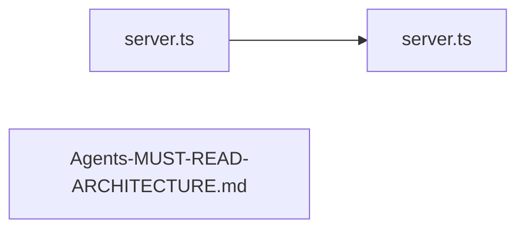

</details>

<details><summary>coresurfaces/ — 3 files</summary>

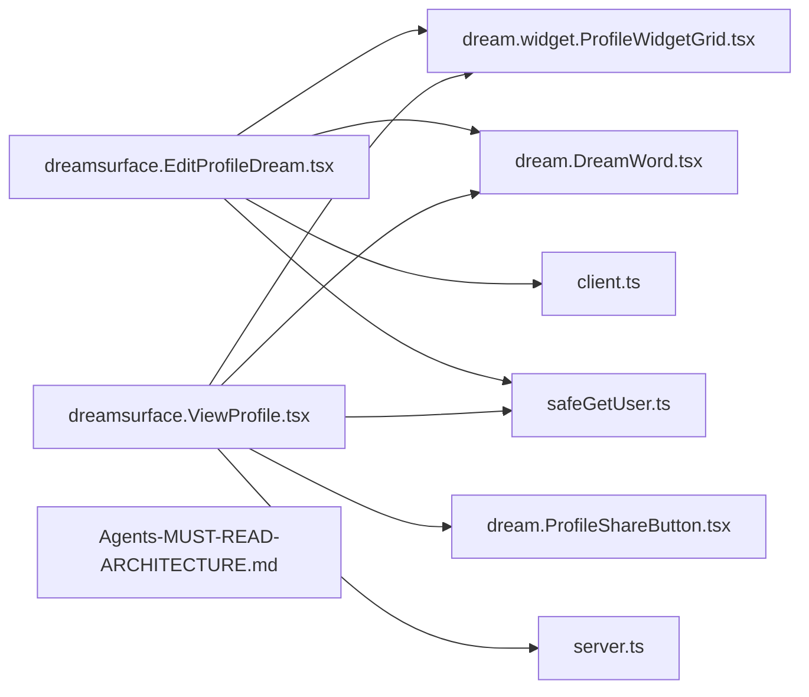

</details>

<details><summary>dr-eams/ — 3 files</summary>

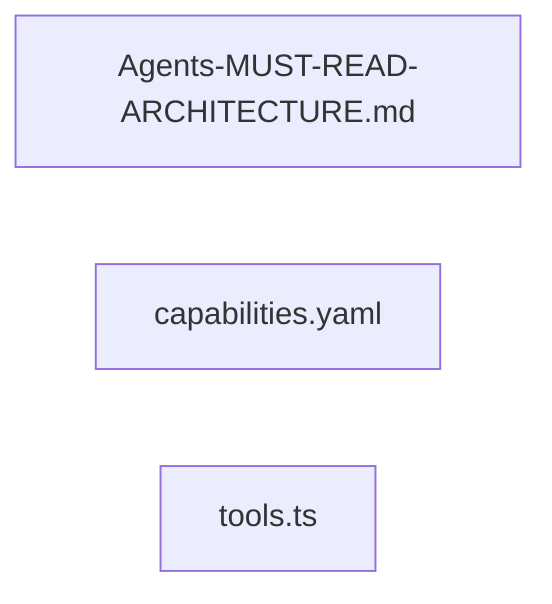

</details>

<details><summary>dreamdmbar/ — 3 files</summary>

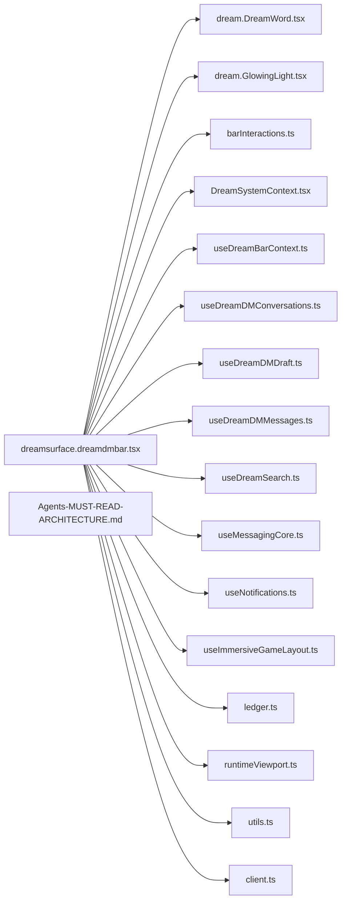

</details>

<details><summary>assembly/ — 4 files</summary>

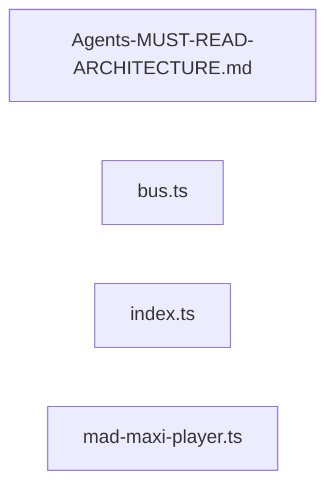

</details>

<details><summary>daydreams/ — 7 files</summary>

```mermaid
graph LR
  f_daydreams_brand_page_tsx["page.tsx"]
  f_components_daydream_dream_shell_DaydreamShell_tsx["dream.shell.DaydreamShell.tsx"]
  f_components_daydream_dreamsurface_daydream_BrandDaydream_tsx["dreamsurface.daydream.BrandDaydream.tsx"]
  f_components_ui_dream_AuthenticatedPageHeader_tsx["dream.AuthenticatedPageHeader.tsx"]
  f_engins_engin_BrandingEngin_tsx["engin.BrandingEngin.tsx"]
  f_lib_supabase_server_ts["server.ts"]
  f_lib_supabase_safeGetUser_ts["safeGetUser.ts"]
  f_daydreams_code_page_tsx["page.tsx"]
  f_components_daydream_dream_OpenDaydreamSideBButton_tsx["dream.OpenDaydreamSideBButton.tsx"]
  f_engins_engin_CodeEngin_tsx["engin.CodeEngin.tsx"]
  f_daydreams_create_page_tsx["page.tsx"]
  f_engins_engin_ContentEngin_tsx["engin.ContentEngin.tsx"]
  f_daydreams_games_page_tsx["page.tsx"]
  f_components_games_dream_GamesHub_tsx["dream.GamesHub.tsx"]
  f_engins_autoopen_dream_AutoOpenGameEngin_tsx["dream.AutoOpenGameEngin.tsx"]
  f_lib_dev_bypass_ts["dev-bypass.ts"]
  f_lib_games_navigation_ts["navigation.ts"]
  f_lib_games_quality_plan_ts["quality-plan.ts"]
  f_engins_engin_GameEngin_tsx["engin.GameEngin.tsx"]
  f_daydreams_lab_page_tsx["page.tsx"]
  f_engins_engin_LabEngin_tsx["engin.LabEngin.tsx"]
  f_daydreams_music_page_tsx["page.tsx"]
  f_components_music_dream_SoundRecorder_tsx["dream.SoundRecorder.tsx"]
  f_engins_engin_StarMakerEngin_tsx["engin.StarMakerEngin.tsx"]
  f_daydreams_Agents_MUST_READ_ARCHITECTURE_md["Agents-MUST-READ-ARCHITECTURE.md"]
  f_daydreams_brand_page_tsx --> f_components_daydream_dream_shell_DaydreamShell_tsx
  f_daydreams_brand_page_tsx --> f_components_daydream_dreamsurface_daydream_BrandDaydream_tsx
  f_daydreams_brand_page_tsx --> f_components_ui_dream_AuthenticatedPageHeader_tsx
  f_daydreams_brand_page_tsx --> f_engins_engin_BrandingEngin_tsx
  f_daydreams_brand_page_tsx --> f_lib_supabase_server_ts
  f_daydreams_brand_page_tsx --> f_lib_supabase_safeGetUser_ts
  f_daydreams_code_page_tsx --> f_components_daydream_dream_OpenDaydreamSideBButton_tsx
  f_daydreams_code_page_tsx --> f_components_daydream_dream_shell_DaydreamShell_tsx
  f_daydreams_code_page_tsx --> f_components_ui_dream_AuthenticatedPageHeader_tsx
  f_daydreams_code_page_tsx --> f_engins_engin_CodeEngin_tsx
  f_daydreams_code_page_tsx --> f_lib_supabase_server_ts
  f_daydreams_code_page_tsx --> f_lib_supabase_safeGetUser_ts
  f_daydreams_create_page_tsx --> f_components_daydream_dream_OpenDaydreamSideBButton_tsx
  f_daydreams_create_page_tsx --> f_components_daydream_dream_shell_DaydreamShell_tsx
  f_daydreams_create_page_tsx --> f_components_ui_dream_AuthenticatedPageHeader_tsx
  f_daydreams_create_page_tsx --> f_engins_engin_ContentEngin_tsx
  f_daydreams_create_page_tsx --> f_lib_supabase_server_ts
  f_daydreams_create_page_tsx --> f_lib_supabase_safeGetUser_ts
  f_daydreams_games_page_tsx --> f_components_games_dream_GamesHub_tsx
  f_daydreams_games_page_tsx --> f_lib_supabase_safeGetUser_ts
  f_daydreams_games_page_tsx --> f_lib_supabase_server_ts
  f_daydreams_games_page_tsx --> f_components_daydream_dream_OpenDaydreamSideBButton_tsx
  f_daydreams_games_page_tsx --> f_components_daydream_dream_shell_DaydreamShell_tsx
  f_daydreams_games_page_tsx --> f_components_ui_dream_AuthenticatedPageHeader_tsx
  f_daydreams_games_page_tsx --> f_engins_autoopen_dream_AutoOpenGameEngin_tsx
  f_daydreams_games_page_tsx --> f_lib_dev_bypass_ts
  f_daydreams_games_page_tsx --> f_lib_games_navigation_ts
  f_daydreams_games_page_tsx --> f_lib_games_quality_plan_ts
  f_daydreams_games_page_tsx --> f_engins_engin_GameEngin_tsx
  f_daydreams_lab_page_tsx --> f_components_daydream_dream_OpenDaydreamSideBButton_tsx
  f_daydreams_lab_page_tsx --> f_components_daydream_dream_shell_DaydreamShell_tsx
  f_daydreams_lab_page_tsx --> f_components_ui_dream_AuthenticatedPageHeader_tsx
  f_daydreams_lab_page_tsx --> f_engins_engin_LabEngin_tsx
  f_daydreams_lab_page_tsx --> f_lib_supabase_server_ts
  f_daydreams_lab_page_tsx --> f_lib_supabase_safeGetUser_ts
  f_daydreams_music_page_tsx --> f_components_daydream_dream_shell_DaydreamShell_tsx
  f_daydreams_music_page_tsx --> f_components_music_dream_SoundRecorder_tsx
  f_daydreams_music_page_tsx --> f_components_ui_dream_AuthenticatedPageHeader_tsx
  f_daydreams_music_page_tsx --> f_engins_engin_StarMakerEngin_tsx
  f_daydreams_music_page_tsx --> f_lib_dev_bypass_ts
  f_daydreams_music_page_tsx --> f_lib_supabase_server_ts
  f_daydreams_music_page_tsx --> f_lib_supabase_safeGetUser_ts
```

</details>

<details><summary>agents/ — 9 files</summary>

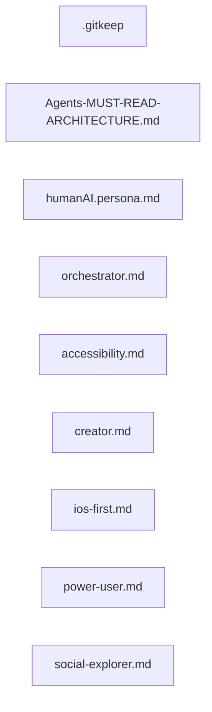

</details>

<details><summary>hooks/ — 10 files</summary>

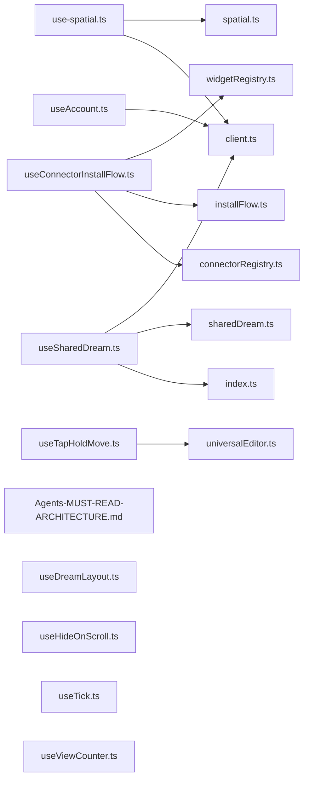

</details>

<details><summary>engins/ — 16 files</summary>

```mermaid
graph LR
  f_engins_CodeEngin_modules_ai_co_pilot_dream_panel_AgentPanel_tsx["dream.panel.AgentPanel.tsx"]
  f_engins_CodeEngin_modules_ai_co_pilot_useAgentSession_ts["useAgentSession.ts"]
  f_engins_CodeEngin_modules_ai_co_pilot_index_ts["index.ts"]
  f_engins_CodeEngin_orchestrator_dream_index_tsx["dream.index.tsx"]
  f_lib_enginpipe_index_ts["index.ts"]
  f_engins_autoopen_dream_AutoOpenGameEngin_tsx["dream.AutoOpenGameEngin.tsx"]
  f_lib_runtime_instanceManager_ts["instanceManager.ts"]
  f_lib_runtime_useSharedEnginChannel_ts["useSharedEnginChannel.ts"]
  f_engins_dream_ForgeEngin_tsx["dream.ForgeEngin.tsx"]
  f_components_daydream_dream_JourneyTrail_tsx["dream.JourneyTrail.tsx"]
  f_components_dream_BrandLogo_tsx["dream.BrandLogo.tsx"]
  f_components_forge_dream_panel_AIBuilderPanel_tsx["dream.panel.AIBuilderPanel.tsx"]
  f_lib_forge_forgeIntelligence_ts["forgeIntelligence.ts"]
  f_lib_forge_forgeMomentum_ts["forgeMomentum.ts"]
  f_lib_forge_forgeNexus_ts["forgeNexus.ts"]
  f_lib_forge_forgeRegistry_ts["forgeRegistry.ts"]
  f_lib_forge_forgeRituals_ts["forgeRituals.ts"]
  f_lib_forge_useForgeActivity_ts["useForgeActivity.ts"]
  f_lib_runtime_dualRuntimeBridge_ts["dualRuntimeBridge.ts"]
  f_engins_engin_BrandingEngin_tsx["engin.BrandingEngin.tsx"]
  f_hooks_useSharedDream_ts["useSharedDream.ts"]
  f_lib_daydream_useDaydreamPersistence_ts["useDaydreamPersistence.ts"]
  f_lib_daydream_useDaydreamState_ts["useDaydreamState.ts"]
  f_lib_dreamenginOS_index_ts["index.ts"]
  f_lib_engins_brand_useBrandEnginRuntime_ts["useBrandEnginRuntime.ts"]
  f_lib_engins_useEnginWorkflow_ts["useEnginWorkflow.ts"]
  f_lib_runtime_useEnginBridge_ts["useEnginBridge.ts"]
  f_lib_runtime_useEnginCoopSync_ts["useEnginCoopSync.ts"]
  f_lib_supabase_client_ts["client.ts"]
  f_lib_supabase_safeGetUser_ts["safeGetUser.ts"]
  f_engins_engin_CodeEngin_tsx["engin.CodeEngin.tsx"]
  f_components_dreamengin_dream_panel_CrossEnginStatusPanel_tsx["dream.panel.CrossEnginStatusPanel.tsx"]
  f_lib_engins_code_useCodeEnginRuntime_ts["useCodeEnginRuntime.ts"]
  f_engins_CodeEngin_core_parser_ts["parser.ts"]
  f_engins_engin_ContentEngin_tsx["engin.ContentEngin.tsx"]
  f_components_activity_dream_ActivityPostForm_tsx["dream.ActivityPostForm.tsx"]
  f_lib_composite_compositor_ts["compositor.ts"]
  f_lib_composite_fxSimulation_ts["fxSimulation.ts"]
  f_lib_composite_matchmover_ts["matchmover.ts"]
  f_lib_composite_motionCapture_ts["motionCapture.ts"]
  f_lib_composite_rotoscope_ts["rotoscope.ts"]
  f_lib_content_publishIntent_ts["publishIntent.ts"]
  f_lib_content_seoScorer_ts["seoScorer.ts"]
  f_lib_content_transcriptEditor_ts["transcriptEditor.ts"]
  f_lib_engins_content_useContentEnginRuntime_ts["useContentEnginRuntime.ts"]
  f_lib_utils_ts["utils.ts"]
  f_engins_engin_GameEngin_tsx["engin.GameEngin.tsx"]
  f_components_gameengin_dream_CartridgeRegistryBootstrap_tsx["dream.CartridgeRegistryBootstrap.tsx"]
  f_components_gameengin_dream_cartridge_FeaturedCartridges_tsx["dream.cartridge.FeaturedCartridges.tsx"]
  f_components_games_dream_Leaderboard_tsx["dream.Leaderboard.tsx"]
  f_components_games_dream_remote_GameRemote_tsx["dream.remote.GameRemote.tsx"]
  f_components_games_dream_hud_LegacyGameHUD_tsx["dream.hud.LegacyGameHUD.tsx"]
  f_components_games_dream_hud_MobileGameHUD_tsx["dream.hud.MobileGameHUD.tsx"]
  f_components_gameengin_dream_CrashReportModal_tsx["dream.CrashReportModal.tsx"]
  f_components_gameengin_dream_cartridge_CartridgeErrorBoundary_tsx["dream.cartridge.CartridgeErrorBoundary.tsx"]
  f_lib_dreamdm_DreamSystemContext_tsx["DreamSystemContext.tsx"]
  f_lib_engins_game_gameEnginRuleSet_ts["gameEnginRuleSet.ts"]
  f_lib_engins_game_useGameEnginRuntime_ts["useGameEnginRuntime.ts"]
  f_lib_gameengin_GameRuntime_tsx["GameRuntime.tsx"]
  f_lib_gameengin_cartridge_ts["cartridge.ts"]
  f_lib_gameengin_cartridges_loaders_ts["loaders.ts"]
  f_lib_games_catalog_ts["catalog.ts"]
  f_lib_games_avatar_ts["avatar.ts"]
  f_lib_games_library_state_ts["library-state.ts"]
  f_lib_games_navigation_ts["navigation.ts"]
  f_lib_games_quality_plan_ts["quality-plan.ts"]
  f_lib_games_useGameInputKeyboardBridge_ts["useGameInputKeyboardBridge.ts"]
  f_lib_games_useGamepad_ts["useGamepad.ts"]
  f_lib_games_useAIDirector_ts["useAIDirector.ts"]
  f_lib_games_DualSenseManager_ts["DualSenseManager.ts"]
  f_lib_games_useRemoteChannel_ts["useRemoteChannel.ts"]
  f_lib_media_ledger_ts["ledger.ts"]
  f_engins_engin_LabEngin_tsx["engin.LabEngin.tsx"]
  f_components_dream_ForgeDreamCanvas_tsx["dream.ForgeDreamCanvas.tsx"]
  f_lib_engins_lab_useLabEnginRuntime_ts["useLabEnginRuntime.ts"]
  f_engins_dream_QuantumCircuitCanvas_tsx["dream.QuantumCircuitCanvas.tsx"]
  f_engins_engin_StarMakerEngin_tsx["engin.StarMakerEngin.tsx"]
  f_components_daydream_starmaker_dream_panel_MultitrackArrangementPanel_tsx["dream.panel.MultitrackArrangementPanel.tsx"]
  f_components_daydream_starmaker_dream_panel_CompingPanel_tsx["dream.panel.CompingPanel.tsx"]
  f_components_daydream_starmaker_dream_panel_PianoRollPanel_tsx["dream.panel.PianoRollPanel.tsx"]
  f_components_daydream_starmaker_dream_panel_SessionViewPanel_tsx["dream.panel.SessionViewPanel.tsx"]
  f_components_dream_AudioVisualizer3D_tsx["dream.AudioVisualizer3D.tsx"]
  f_lib_audioFingerprint_ts["audioFingerprint.ts"]
  f_lib_engins_music_useStarMakerEnginRuntime_ts["useStarMakerEnginRuntime.ts"]
  f_lib_music_presets_ts["presets.ts"]
  f_lib_music_starmaker_ts["starmaker.ts"]
  f_lib_music_starmakerArrangement_ts["starmakerArrangement.ts"]
  f_lib_music_starmakerDaw_ts["starmakerDaw.ts"]
  f_lib_supabase_config_ts["config.ts"]
  f_engins_portfolio_dream_PortfolioEngin_tsx["dream.PortfolioEngin.tsx"]
  f_engins_Agents_MUST_READ_ARCHITECTURE_md["Agents-MUST-READ-ARCHITECTURE.md"]
  f_engins_CodeEngin_modules_ai_co_pilot_dream_panel_AgentPanel_tsx --> f_engins_CodeEngin_modules_ai_co_pilot_useAgentSession_ts
  f_engins_CodeEngin_modules_ai_co_pilot_index_ts --> f_engins_CodeEngin_modules_ai_co_pilot_dream_panel_AgentPanel_tsx
  f_engins_CodeEngin_modules_ai_co_pilot_index_ts --> f_engins_CodeEngin_modules_ai_co_pilot_useAgentSession_ts
  f_engins_CodeEngin_orchestrator_dream_index_tsx --> f_lib_enginpipe_index_ts
  f_engins_CodeEngin_orchestrator_dream_index_tsx --> f_engins_CodeEngin_modules_ai_co_pilot_dream_panel_AgentPanel_tsx
  f_engins_autoopen_dream_AutoOpenGameEngin_tsx --> f_lib_runtime_instanceManager_ts
  f_engins_autoopen_dream_AutoOpenGameEngin_tsx --> f_lib_runtime_useSharedEnginChannel_ts
  f_engins_dream_ForgeEngin_tsx --> f_components_daydream_dream_JourneyTrail_tsx
  f_engins_dream_ForgeEngin_tsx --> f_components_dream_BrandLogo_tsx
  f_engins_dream_ForgeEngin_tsx --> f_components_forge_dream_panel_AIBuilderPanel_tsx
  f_engins_dream_ForgeEngin_tsx --> f_lib_enginpipe_index_ts
  f_engins_dream_ForgeEngin_tsx --> f_lib_forge_forgeIntelligence_ts
  f_engins_dream_ForgeEngin_tsx --> f_lib_forge_forgeMomentum_ts
  f_engins_dream_ForgeEngin_tsx --> f_lib_forge_forgeNexus_ts
  f_engins_dream_ForgeEngin_tsx --> f_lib_forge_forgeRegistry_ts
  f_engins_dream_ForgeEngin_tsx --> f_lib_forge_forgeRituals_ts
  f_engins_dream_ForgeEngin_tsx --> f_lib_forge_useForgeActivity_ts
  f_engins_dream_ForgeEngin_tsx --> f_lib_runtime_dualRuntimeBridge_ts
  f_engins_engin_BrandingEngin_tsx --> f_components_daydream_dream_JourneyTrail_tsx
  f_engins_engin_BrandingEngin_tsx --> f_hooks_useSharedDream_ts
  f_engins_engin_BrandingEngin_tsx --> f_lib_daydream_useDaydreamPersistence_ts
  f_engins_engin_BrandingEngin_tsx --> f_lib_daydream_useDaydreamState_ts
  f_engins_engin_BrandingEngin_tsx --> f_lib_dreamenginOS_index_ts
  f_engins_engin_BrandingEngin_tsx --> f_lib_enginpipe_index_ts
  f_engins_engin_BrandingEngin_tsx --> f_lib_engins_brand_useBrandEnginRuntime_ts
  f_engins_engin_BrandingEngin_tsx --> f_lib_engins_useEnginWorkflow_ts
  f_engins_engin_BrandingEngin_tsx --> f_lib_forge_forgeIntelligence_ts
  f_engins_engin_BrandingEngin_tsx --> f_lib_forge_useForgeActivity_ts
  f_engins_engin_BrandingEngin_tsx --> f_lib_runtime_dualRuntimeBridge_ts
  f_engins_engin_BrandingEngin_tsx --> f_lib_runtime_useEnginBridge_ts
  f_engins_engin_BrandingEngin_tsx --> f_lib_runtime_useEnginCoopSync_ts
  f_engins_engin_BrandingEngin_tsx --> f_lib_supabase_client_ts
  f_engins_engin_BrandingEngin_tsx --> f_lib_supabase_safeGetUser_ts
  f_engins_engin_CodeEngin_tsx --> f_components_dreamengin_dream_panel_CrossEnginStatusPanel_tsx
  f_engins_engin_CodeEngin_tsx --> f_lib_daydream_useDaydreamPersistence_ts
  f_engins_engin_CodeEngin_tsx --> f_lib_daydream_useDaydreamState_ts
  f_engins_engin_CodeEngin_tsx --> f_lib_enginpipe_index_ts
  f_engins_engin_CodeEngin_tsx --> f_lib_engins_code_useCodeEnginRuntime_ts
  f_engins_engin_CodeEngin_tsx --> f_lib_engins_useEnginWorkflow_ts
  f_engins_engin_CodeEngin_tsx --> f_lib_forge_forgeIntelligence_ts
  f_engins_engin_CodeEngin_tsx --> f_lib_forge_useForgeActivity_ts
  f_engins_engin_CodeEngin_tsx --> f_lib_runtime_dualRuntimeBridge_ts
  f_engins_engin_CodeEngin_tsx --> f_lib_runtime_useEnginBridge_ts
  f_engins_engin_CodeEngin_tsx --> f_engins_CodeEngin_modules_ai_co_pilot_index_ts
  f_engins_engin_CodeEngin_tsx --> f_engins_CodeEngin_core_parser_ts
  f_engins_engin_ContentEngin_tsx --> f_components_activity_dream_ActivityPostForm_tsx
  f_engins_engin_ContentEngin_tsx --> f_components_daydream_dream_JourneyTrail_tsx
  f_engins_engin_ContentEngin_tsx --> f_lib_composite_compositor_ts
  f_engins_engin_ContentEngin_tsx --> f_lib_composite_fxSimulation_ts
  f_engins_engin_ContentEngin_tsx --> f_lib_composite_matchmover_ts
  f_engins_engin_ContentEngin_tsx --> f_lib_composite_motionCapture_ts
  f_engins_engin_ContentEngin_tsx --> f_lib_composite_rotoscope_ts
  f_engins_engin_ContentEngin_tsx --> f_lib_content_publishIntent_ts
  f_engins_engin_ContentEngin_tsx --> f_lib_content_seoScorer_ts
  f_engins_engin_ContentEngin_tsx --> f_lib_content_transcriptEditor_ts
  f_engins_engin_ContentEngin_tsx --> f_lib_daydream_useDaydreamPersistence_ts
  f_engins_engin_ContentEngin_tsx --> f_lib_dreamenginOS_index_ts
  f_engins_engin_ContentEngin_tsx --> f_lib_enginpipe_index_ts
  f_engins_engin_ContentEngin_tsx --> f_lib_engins_content_useContentEnginRuntime_ts
  f_engins_engin_ContentEngin_tsx --> f_lib_engins_useEnginWorkflow_ts
  f_engins_engin_ContentEngin_tsx --> f_lib_forge_forgeIntelligence_ts
  f_engins_engin_ContentEngin_tsx --> f_lib_forge_useForgeActivity_ts
  f_engins_engin_ContentEngin_tsx --> f_lib_runtime_dualRuntimeBridge_ts
  f_engins_engin_ContentEngin_tsx --> f_lib_runtime_useEnginBridge_ts
  f_engins_engin_ContentEngin_tsx --> f_lib_runtime_useEnginCoopSync_ts
  f_engins_engin_ContentEngin_tsx --> f_lib_supabase_client_ts
  f_engins_engin_ContentEngin_tsx --> f_lib_utils_ts
  f_engins_engin_GameEngin_tsx --> f_components_daydream_dream_JourneyTrail_tsx
  f_engins_engin_GameEngin_tsx --> f_components_gameengin_dream_CartridgeRegistryBootstrap_tsx
  f_engins_engin_GameEngin_tsx --> f_components_gameengin_dream_cartridge_FeaturedCartridges_tsx
  f_engins_engin_GameEngin_tsx --> f_components_games_dream_Leaderboard_tsx
  f_engins_engin_GameEngin_tsx --> f_components_games_dream_remote_GameRemote_tsx
  f_engins_engin_GameEngin_tsx --> f_components_games_dream_hud_LegacyGameHUD_tsx
  f_engins_engin_GameEngin_tsx --> f_components_games_dream_hud_MobileGameHUD_tsx
  f_engins_engin_GameEngin_tsx --> f_components_gameengin_dream_CrashReportModal_tsx
  f_engins_engin_GameEngin_tsx --> f_components_gameengin_dream_cartridge_CartridgeErrorBoundary_tsx
  f_engins_engin_GameEngin_tsx --> f_lib_daydream_useDaydreamPersistence_ts
  f_engins_engin_GameEngin_tsx --> f_lib_dreamdm_DreamSystemContext_tsx
  f_engins_engin_GameEngin_tsx --> f_lib_dreamenginOS_index_ts
  f_engins_engin_GameEngin_tsx --> f_lib_engins_game_gameEnginRuleSet_ts
  f_engins_engin_GameEngin_tsx --> f_lib_engins_game_useGameEnginRuntime_ts
  f_engins_engin_GameEngin_tsx --> f_lib_forge_forgeIntelligence_ts
  f_engins_engin_GameEngin_tsx --> f_lib_forge_useForgeActivity_ts
  f_engins_engin_GameEngin_tsx --> f_lib_gameengin_GameRuntime_tsx
  f_engins_engin_GameEngin_tsx --> f_lib_gameengin_cartridge_ts
  f_engins_engin_GameEngin_tsx --> f_lib_gameengin_cartridges_loaders_ts
  f_engins_engin_GameEngin_tsx --> f_lib_games_catalog_ts
  f_engins_engin_GameEngin_tsx --> f_lib_games_avatar_ts
  f_engins_engin_GameEngin_tsx --> f_lib_games_library_state_ts
  f_engins_engin_GameEngin_tsx --> f_lib_games_navigation_ts
  f_engins_engin_GameEngin_tsx --> f_lib_games_quality_plan_ts
  f_engins_engin_GameEngin_tsx --> f_lib_games_useGameInputKeyboardBridge_ts
  f_engins_engin_GameEngin_tsx --> f_lib_games_useGamepad_ts
  f_engins_engin_GameEngin_tsx --> f_lib_games_useAIDirector_ts
  f_engins_engin_GameEngin_tsx --> f_lib_games_DualSenseManager_ts
  f_engins_engin_GameEngin_tsx --> f_lib_games_useRemoteChannel_ts
  f_engins_engin_GameEngin_tsx --> f_lib_media_ledger_ts
  f_engins_engin_GameEngin_tsx --> f_lib_runtime_dualRuntimeBridge_ts
  f_engins_engin_GameEngin_tsx --> f_lib_runtime_instanceManager_ts
  f_engins_engin_GameEngin_tsx --> f_lib_runtime_useEnginBridge_ts
  f_engins_engin_GameEngin_tsx --> f_lib_runtime_useEnginCoopSync_ts
  f_engins_engin_GameEngin_tsx --> f_lib_runtime_useSharedEnginChannel_ts
  f_engins_engin_GameEngin_tsx --> f_lib_supabase_client_ts
  f_engins_engin_GameEngin_tsx --> f_lib_enginpipe_index_ts
  f_engins_engin_GameEngin_tsx --> f_lib_utils_ts
  f_engins_engin_LabEngin_tsx --> f_components_daydream_dream_JourneyTrail_tsx
  f_engins_engin_LabEngin_tsx --> f_components_dream_ForgeDreamCanvas_tsx
  f_engins_engin_LabEngin_tsx --> f_lib_daydream_useDaydreamPersistence_ts
  f_engins_engin_LabEngin_tsx --> f_lib_dreamenginOS_index_ts
  f_engins_engin_LabEngin_tsx --> f_lib_enginpipe_index_ts
  f_engins_engin_LabEngin_tsx --> f_lib_engins_lab_useLabEnginRuntime_ts
  f_engins_engin_LabEngin_tsx --> f_lib_engins_useEnginWorkflow_ts
  f_engins_engin_LabEngin_tsx --> f_lib_forge_forgeIntelligence_ts
  f_engins_engin_LabEngin_tsx --> f_lib_forge_useForgeActivity_ts
  f_engins_engin_LabEngin_tsx --> f_lib_runtime_dualRuntimeBridge_ts
  f_engins_engin_LabEngin_tsx --> f_lib_runtime_useEnginBridge_ts
  f_engins_engin_LabEngin_tsx --> f_lib_runtime_useEnginCoopSync_ts
  f_engins_engin_LabEngin_tsx --> f_lib_supabase_client_ts
  f_engins_engin_LabEngin_tsx --> f_engins_dream_QuantumCircuitCanvas_tsx
  f_engins_engin_LabEngin_tsx --> f_lib_utils_ts
  f_engins_engin_StarMakerEngin_tsx --> f_components_daydream_dream_JourneyTrail_tsx
  f_engins_engin_StarMakerEngin_tsx --> f_components_daydream_starmaker_dream_panel_MultitrackArrangementPanel_tsx
  f_engins_engin_StarMakerEngin_tsx --> f_components_daydream_starmaker_dream_panel_CompingPanel_tsx
  f_engins_engin_StarMakerEngin_tsx --> f_components_daydream_starmaker_dream_panel_PianoRollPanel_tsx
  f_engins_engin_StarMakerEngin_tsx --> f_components_daydream_starmaker_dream_panel_SessionViewPanel_tsx
  f_engins_engin_StarMakerEngin_tsx --> f_components_dream_AudioVisualizer3D_tsx
  f_engins_engin_StarMakerEngin_tsx --> f_hooks_useSharedDream_ts
  f_engins_engin_StarMakerEngin_tsx --> f_lib_audioFingerprint_ts
  f_engins_engin_StarMakerEngin_tsx --> f_lib_daydream_useDaydreamPersistence_ts
  f_engins_engin_StarMakerEngin_tsx --> f_lib_daydream_useDaydreamState_ts
  f_engins_engin_StarMakerEngin_tsx --> f_lib_dreamenginOS_index_ts
  f_engins_engin_StarMakerEngin_tsx --> f_lib_enginpipe_index_ts
  f_engins_engin_StarMakerEngin_tsx --> f_lib_engins_music_useStarMakerEnginRuntime_ts
  f_engins_engin_StarMakerEngin_tsx --> f_lib_engins_useEnginWorkflow_ts
  f_engins_engin_StarMakerEngin_tsx --> f_lib_forge_forgeIntelligence_ts
  f_engins_engin_StarMakerEngin_tsx --> f_lib_forge_useForgeActivity_ts
  f_engins_engin_StarMakerEngin_tsx --> f_lib_media_ledger_ts
  f_engins_engin_StarMakerEngin_tsx --> f_lib_music_presets_ts
  f_engins_engin_StarMakerEngin_tsx --> f_lib_music_starmaker_ts
  f_engins_engin_StarMakerEngin_tsx --> f_lib_music_starmakerArrangement_ts
  f_engins_engin_StarMakerEngin_tsx --> f_lib_music_starmakerDaw_ts
  f_engins_engin_StarMakerEngin_tsx --> f_lib_runtime_dualRuntimeBridge_ts
  f_engins_engin_StarMakerEngin_tsx --> f_lib_runtime_useEnginCoopSync_ts
  f_engins_engin_StarMakerEngin_tsx --> f_lib_supabase_client_ts
  f_engins_engin_StarMakerEngin_tsx --> f_lib_supabase_safeGetUser_ts
  f_engins_engin_StarMakerEngin_tsx --> f_lib_supabase_config_ts
  f_engins_engin_StarMakerEngin_tsx --> f_lib_utils_ts
  f_engins_portfolio_dream_PortfolioEngin_tsx --> f_components_daydream_dream_JourneyTrail_tsx
  f_engins_portfolio_dream_PortfolioEngin_tsx --> f_engins_dream_QuantumCircuitCanvas_tsx
  f_engins_portfolio_dream_PortfolioEngin_tsx --> f_lib_forge_forgeIntelligence_ts
  f_engins_portfolio_dream_PortfolioEngin_tsx --> f_lib_forge_useForgeActivity_ts
  f_engins_portfolio_dream_PortfolioEngin_tsx --> f_lib_runtime_dualRuntimeBridge_ts
```

</details>

<details><summary>types/ — 19 files</summary>

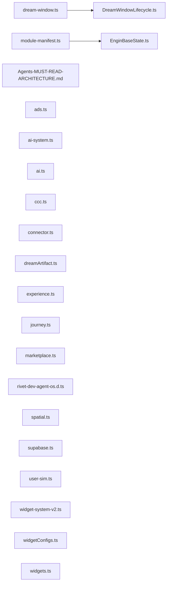

</details>

<details><summary>src/ — 43 files</summary>

```mermaid
graph LR
  f_src_configs_demoGameConfig_ts["demoGameConfig.ts"]
  f_src_core_GameEnginCore_ts["GameEnginCore.ts"]
  f_lib_gameengin_core_ts["core.ts"]
  f_lib_gameengin_gameEnginRuntime_ts["gameEnginRuntime.ts"]
  f_src_dream_rulesets_homedream_dream_homedream_physics_ts["dream.homedream.physics.ts"]
  f_src_dream_rulesets_homedream_dream_homedream_constants_ts["dream.homedream.constants.ts"]
  f_src_dream_rulesets_homedream_dream_homedream_transforms_ts["dream.homedream.transforms.ts"]
  f_src_dream_rulesets_homedream_index_ts["index.ts"]
  f_src_dreamsurface_dreamsurface_bridge_ts["dreamsurface.bridge.ts"]
  f_src_engin_core_engin_eventbus_ts["engin.eventbus.ts"]
  f_src_engin_core_engin_ledger_ts["engin.ledger.ts"]
  f_src_dreamsurface_index_ts["index.ts"]
  f_src_dreamsurface_dreamsurface_delta_ts["dreamsurface.delta.ts"]
  f_src_engin_core_index_ts["index.ts"]
  f_src_engin_state_base_json["base.json"]
  f_lib_supabase_client_ts["client.ts"]
  f_lib_ai_capability_gate_ts["capability-gate.ts"]
  f_lib_ai_confirm_token_ts["confirm-token.ts"]
  f_lib_ai_rate_limiter_ts["rate-limiter.ts"]
  f_lib_ai_idempotency_ts["idempotency.ts"]
  f_lib_agents_boogieManAI_ts["boogieManAI.ts"]
  f_build_memory_registry_json["registry.json"]
  f_src_engin_generated_index_ts["index.ts"]
  f_src_engin_core_engin_renderloop_ts["engin.renderloop.ts"]
  f_src_engin_core_engin_auth_ts["engin.auth.ts"]
  f_src_engin_generated_brain_ts["brain.ts"]
  f_lib_gameengin_brain_active_projects_json["active-projects.json"]
  f_lib_gameengin_brain_character_voices_mad_maxi_json["mad-maxi.json"]
  f_lib_gameengin_brain_composition_principles_leading_lines_landmark_json["leading-lines-landmark.json"]
  f_lib_gameengin_brain_composition_principles_parallax_layers_json["parallax-layers.json"]
  f_lib_gameengin_brain_concept_library_neon_courier_json["neon-courier.json"]
  f_lib_gameengin_brain_concept_patterns_protagonists_reluctant_courier_json["reluctant-courier.json"]
  f_lib_gameengin_brain_concept_patterns_scope_formulas_one_day_runner_json["one-day-runner.json"]
  f_lib_gameengin_brain_concept_patterns_settings_neon_rain_megacity_json["neon-rain-megacity.json"]
  f_lib_gameengin_brain_dialogue_patterns_callback_anchor_json["callback-anchor.json"]
  f_lib_gameengin_brain_dialogue_patterns_implied_subject_json["implied-subject.json"]
  f_lib_gameengin_brain_dialogue_patterns_sentence_fragment_rhythm_json["sentence-fragment-rhythm.json"]
  f_lib_gameengin_brain_emotional_tones_determined_json["determined.json"]
  f_lib_gameengin_brain_emotional_tones_fierce_json["fierce.json"]
  f_lib_gameengin_brain_emotional_tones_hopeful_json["hopeful.json"]
  f_lib_gameengin_brain_emotional_tones_reflective_json["reflective.json"]
  f_lib_gameengin_brain_emotional_tones_weary_json["weary.json"]
  f_lib_gameengin_brain_fun_heuristics_meta_progression_json["meta-progression.json"]
  f_lib_gameengin_brain_fun_heuristics_moment_to_moment_json["moment-to-moment.json"]
  f_lib_gameengin_brain_fun_heuristics_session_loop_json["session-loop.json"]
  f_lib_gameengin_brain_genre_dna_action_rpg_json["action-rpg.json"]
  f_lib_gameengin_brain_genre_dna_episodic_json["episodic.json"]
  f_lib_gameengin_brain_genre_dna_live_service_json["live-service.json"]
  f_lib_gameengin_brain_genre_dna_metroidvania_json["metroidvania.json"]
  f_lib_gameengin_brain_genre_dna_open_world_json["open-world.json"]
  f_lib_gameengin_brain_genre_dna_platformer_json["platformer.json"]
  f_lib_gameengin_brain_genre_dna_puzzle_json["puzzle.json"]
  f_lib_gameengin_brain_genre_dna_racing_json["racing.json"]
  f_lib_gameengin_brain_genre_dna_roguelike_json["roguelike.json"]
  f_lib_gameengin_brain_genre_dna_sandbox_json["sandbox.json"]
  f_lib_gameengin_brain_genre_dna_template_json["template.json"]
  f_lib_gameengin_brain_inspiration_corpus_celeste_json["celeste.json"]
  f_lib_gameengin_brain_inspiration_corpus_dead_cells_json["dead-cells.json"]
  f_lib_gameengin_brain_inspiration_corpus_hades_json["hades.json"]
  f_lib_gameengin_brain_inspiration_corpus_hollow_knight_json["hollow-knight.json"]
  f_lib_gameengin_brain_inspiration_corpus_outer_wilds_json["outer-wilds.json"]
  f_lib_gameengin_brain_material_recipes_neon_glass_tube_json["neon-glass-tube.json"]
  f_lib_gameengin_brain_material_recipes_rusted_iron_json["rusted-iron.json"]
  f_lib_gameengin_brain_material_recipes_sun_bleached_sandstone_json["sun-bleached-sandstone.json"]
  f_lib_gameengin_brain_mechanic_library_camera_look_ahead_json["look-ahead.json"]
  f_lib_gameengin_brain_mechanic_library_camera_screen_shake_json["screen-shake.json"]
  f_lib_gameengin_brain_mechanic_library_camera_smooth_follow_json["smooth-follow.json"]
  f_lib_gameengin_brain_mechanic_library_combat_combo_json["combo.json"]
  f_lib_gameengin_brain_mechanic_library_combat_hit_stop_json["hit-stop.json"]
  f_lib_gameengin_brain_mechanic_library_combat_parry_json["parry.json"]
  f_lib_gameengin_brain_mechanic_library_combat_ranged_json["ranged.json"]
  f_lib_gameengin_brain_mechanic_library_movement_coyote_time_json["coyote-time.json"]
  f_lib_gameengin_brain_mechanic_library_movement_dash_json["dash.json"]
  f_lib_gameengin_brain_mechanic_library_movement_double_jump_json["double-jump.json"]
  f_lib_gameengin_brain_mechanic_library_movement_grapple_json["grapple.json"]
  f_lib_gameengin_brain_mechanic_library_movement_wall_slide_json["wall-slide.json"]
  f_lib_gameengin_brain_mechanic_library_progression_metroidvania_gating_json["metroidvania-gating.json"]
  f_lib_gameengin_brain_mechanic_library_progression_roguelike_perks_json["roguelike-perks.json"]
  f_lib_gameengin_brain_mechanic_library_progression_skill_tree_json["skill-tree.json"]
  f_lib_gameengin_brain_mechanic_library_structural_ability_gating_json["ability-gating.json"]
  f_lib_gameengin_brain_mechanic_library_structural_meta_progression_json["meta-progression.json"]
  f_lib_gameengin_brain_mechanic_library_structural_procedural_generation_json["procedural-generation.json"]
  f_lib_gameengin_brain_mechanic_library_structural_run_persistence_json["run-persistence.json"]
  f_lib_gameengin_brain_mechanic_library_structural_season_pass_json["season-pass.json"]
  f_lib_gameengin_brain_mechanic_library_structural_world_streaming_json["world-streaming.json"]
  f_lib_gameengin_brain_narrative_pacing_default_json["default.json"]
  f_lib_gameengin_brain_originality_registry_by_cartridge_mad_maxi_json["mad-maxi.json"]
  f_lib_gameengin_brain_originality_registry_signatures_json["signatures.json"]
  f_lib_gameengin_brain_technique_library_lighting_three_point_mood_json["three-point-mood.json"]
  f_lib_gameengin_brain_technique_library_modeling_edge_flow_json["edge-flow.json"]
  f_lib_gameengin_brain_technique_library_modeling_silhouette_first_json["silhouette-first.json"]
  f_lib_gameengin_brain_technique_library_optimization_texture_atlasing_json["texture-atlasing.json"]
  f_lib_gameengin_brain_upgrade_history_prioritization_rules_json["prioritization-rules.json"]
  f_src_engin_generated_cartridges_ts["cartridges.ts"]
  f_lib_gameengin_cartridges_achievementEngine_ts["achievementEngine.ts"]
  f_lib_gameengin_cartridges_apiStubs_ts["apiStubs.ts"]
  f_lib_gameengin_cartridges_index_ts["index.ts"]
  f_lib_gameengin_cartridges_loaders_ts["loaders.ts"]
  f_lib_gameengin_cartridges_manifest_ts["manifest.ts"]
  f_lib_gameengin_cartridges_reactCartridge_ts["reactCartridge.ts"]
  f_lib_gameengin_cartridges_saveState_ts["saveState.ts"]
  f_public_cartridges_mad_maxi_MANIFEST_json["MANIFEST.json"]
  f_src_engin_generated_connectors_ts["connectors.ts"]
  f_lib_connectors_connectorRegistry_ts["connectorRegistry.ts"]
  f_lib_connectors_deliveryStrategy_ts["deliveryStrategy.ts"]
  f_lib_connectors_installFlow_ts["installFlow.ts"]
  f_lib_connectors_normalise_ts["normalise.ts"]
  f_lib_connectors_providers_bluesky_ts["bluesky.ts"]
  f_lib_connectors_providers_devto_ts["devto.ts"]
  f_lib_connectors_providers_facebook_ts["facebook.ts"]
  f_lib_connectors_providers_github_ts["github.ts"]
  f_lib_connectors_providers_hackernews_ts["hackernews.ts"]
  f_lib_connectors_providers_instagram_ts["instagram.ts"]
  f_lib_connectors_providers_mastodon_ts["mastodon.ts"]
  f_lib_connectors_providers_medium_ts["medium.ts"]
  f_lib_connectors_providers_nostr_ts["nostr.ts"]
  f_lib_connectors_providers_pinterest_ts["pinterest.ts"]
  f_lib_connectors_providers_podcast_ts["podcast.ts"]
  f_lib_connectors_providers_reddit_ts["reddit.ts"]
  f_lib_connectors_providers_shellhub_ts["shellhub.ts"]
  f_lib_connectors_providers_substack_ts["substack.ts"]
  f_lib_connectors_providers_tiktok_ts["tiktok.ts"]
  f_lib_connectors_providers_tumblr_ts["tumblr.ts"]
  f_lib_connectors_providers_twitter_ts["twitter.ts"]
  f_lib_connectors_providers_youtube_ts["youtube.ts"]
  f_lib_connectors_reconcile_ts["reconcile.ts"]
  f_lib_connectors_syncDispatch_ts["syncDispatch.ts"]
  f_lib_connectors_webhookVerification_ts["webhookVerification.ts"]
  f_lib_connectors_youtube_ts["youtube.ts"]
  f_src_engin_generated_dreamdmbar_ts["dreamdmbar.ts"]
  f_dreamdmbar_dream_GlowingLight_tsx["dream.GlowingLight.tsx"]
  f_dreamdmbar_dreamsurface_dreamdmbar_tsx["dreamsurface.dreamdmbar.tsx"]
  f_lib_dreamdm_barInteractions_ts["barInteractions.ts"]
  f_lib_dreamdm_bridgeSeamFlow_ts["bridgeSeamFlow.ts"]
  f_lib_dreamdm_DreamSystemContext_tsx["DreamSystemContext.tsx"]
  f_lib_dreamdm_useDreamBarContext_ts["useDreamBarContext.ts"]
  f_lib_dreamdm_useDreamDMConversations_ts["useDreamDMConversations.ts"]
  f_lib_dreamdm_useDreamDMDraft_ts["useDreamDMDraft.ts"]
  f_lib_dreamdm_useDreamDMMessages_ts["useDreamDMMessages.ts"]
  f_lib_dreamdm_useDreamSearch_ts["useDreamSearch.ts"]
  f_lib_dreamdm_useMessagingCore_ts["useMessagingCore.ts"]
  f_lib_dreamdm_useModuleBarIntent_ts["useModuleBarIntent.ts"]
  f_lib_dreamdm_useNotifications_ts["useNotifications.ts"]
  f_src_engin_generated_dreamr_ts["dreamr.ts"]
  f_app_dreamr_page_tsx["page.tsx"]
  f_components_dreamr_dream_CloseFriendsSettings_tsx["dream.CloseFriendsSettings.tsx"]
  f_components_dreamr_dream_panel_DreamRChannelPanel_tsx["dream.panel.DreamRChannelPanel.tsx"]
  f_components_dreamr_dream_panel_DreamRCreatorPanel_tsx["dream.panel.DreamRCreatorPanel.tsx"]
  f_lib_dreamr_closeFriendsVisibility_ts["closeFriendsVisibility.ts"]
  f_lib_dreamr_dreamrfeed_tsx["dreamrfeed.tsx"]
  f_lib_dreamr_feedCursor_ts["feedCursor.ts"]
  f_lib_dreamr_socialHumanityScore_ts["socialHumanityScore.ts"]
  f_lib_dreamr_swipeCalibration_ts["swipeCalibration.ts"]
  f_lib_dreamr_swipePersonalization_ts["swipePersonalization.ts"]
  f_lib_dreamr_torridityLedger_ts["torridityLedger.ts"]
  f_src_engin_generated_dreamsurfaces_ts["dreamsurfaces.ts"]
  f_components_dreams_dream_connectorlayer_tsx["dream.connectorlayer.tsx"]
  f_components_dreams_dream_DraggableDream_tsx["dream.DraggableDream.tsx"]
  f_components_dreams_dream_featurelayer_tsx["dream.featurelayer.tsx"]
  f_components_dreams_dream_GlobalDragLayer_tsx["dream.GlobalDragLayer.tsx"]
  f_components_dreams_dream_outputlayer_tsx["dream.outputlayer.tsx"]
  f_components_dreams_dream_panel_RuntimeMemoryHUD_tsx["dream.panel.RuntimeMemoryHUD.tsx"]
  f_components_dreams_dream_PlatformErrorReporter_tsx["dream.PlatformErrorReporter.tsx"]
  f_components_dreams_dream_shell_DreamShell_tsx["dream.shell.DreamShell.tsx"]
  f_components_dreams_dream_shell_SharedDreamShell_tsx["dream.shell.SharedDreamShell.tsx"]
  f_components_dreams_dream_SlideOverPanel_tsx["dream.SlideOverPanel.tsx"]
  f_components_dreams_dream_widget_SuperDreamWidget_tsx["dream.widget.SuperDreamWidget.tsx"]
  f_components_dreams_dream_window_JourneyDreamWindow_tsx["dream.window.JourneyDreamWindow.tsx"]
  f_components_dreams_dreamsurface_dreamspace_tsx["dreamsurface.dreamspace.tsx"]
  f_components_dreams_dreamsurface_shell_tsx["dreamsurface.shell.tsx"]
  f_components_dreams_dreamsurface_window_tsx["dreamsurface.window.tsx"]
  f_lib_dream_window_connectionVerbs_ts["connectionVerbs.ts"]
  f_lib_dream_window_DreamWindowLifecycle_ts["DreamWindowLifecycle.ts"]
  f_lib_dream_window_enginConnectionNetwork_ts["enginConnectionNetwork.ts"]
  f_lib_dream_window_index_ts["index.ts"]
  f_lib_dream_window_runtimeRegion_ts["runtimeRegion.ts"]
  f_lib_dream_window_useDreamWindowActions_ts["useDreamWindowActions.ts"]
  f_lib_dreams_drag_ts["drag.ts"]
  f_lib_dreams_dreamIntentBus_ts["dreamIntentBus.ts"]
  f_lib_dreams_DreamRegistry_tsx["DreamRegistry.tsx"]
  f_lib_dreams_profileProjection_ts["profileProjection.ts"]
  f_lib_dreams_types_ts["types.ts"]
  f_lib_dreams_useDreamsRuntime_ts["useDreamsRuntime.ts"]
  f_lib_widgets_CrossWidgetPosting_ts["CrossWidgetPosting.ts"]
  f_lib_widgets_feed_resolver_ts["feed-resolver.ts"]
  f_lib_widgets_parse_ts["parse.ts"]
  f_lib_widgets_parseConfig_ts["parseConfig.ts"]
  f_lib_widgets_useWidget_ts["useWidget.ts"]
  f_lib_widgets_WidgetBus_ts["WidgetBus.ts"]
  f_lib_widgets_WidgetEngine_tsx["WidgetEngine.tsx"]
  f_lib_widgets_WidgetEventBus_ts["WidgetEventBus.ts"]
  f_lib_widgets_WidgetLinkGraph_ts["WidgetLinkGraph.ts"]
  f_lib_widgets_widgetRegistry_ts["widgetRegistry.ts"]
  f_src_engin_generated_engins_ts["engins.ts"]
  f_engins_autoopen_dream_AutoOpenGameEngin_tsx["dream.AutoOpenGameEngin.tsx"]
  f_engins_CodeEngin_core_parser_ts["parser.ts"]
  f_engins_CodeEngin_modules_ai_co_pilot_dream_panel_AgentPanel_tsx["dream.panel.AgentPanel.tsx"]
  f_engins_CodeEngin_modules_ai_co_pilot_index_ts["index.ts"]
  f_engins_CodeEngin_modules_ai_co_pilot_useAgentSession_ts["useAgentSession.ts"]
  f_engins_CodeEngin_orchestrator_dream_index_tsx["dream.index.tsx"]
  f_engins_dream_ForgeEngin_tsx["dream.ForgeEngin.tsx"]
  f_engins_dream_QuantumCircuitCanvas_tsx["dream.QuantumCircuitCanvas.tsx"]
  f_engins_engin_BrandingEngin_tsx["engin.BrandingEngin.tsx"]
  f_engins_engin_CodeEngin_tsx["engin.CodeEngin.tsx"]
  f_engins_engin_ContentEngin_tsx["engin.ContentEngin.tsx"]
  f_engins_engin_GameEngin_tsx["engin.GameEngin.tsx"]
  f_engins_engin_LabEngin_tsx["engin.LabEngin.tsx"]
  f_engins_engin_StarMakerEngin_tsx["engin.StarMakerEngin.tsx"]
  f_engins_portfolio_dream_PortfolioEngin_tsx["dream.PortfolioEngin.tsx"]
  f_src_engin_generated_homedream_ts["homedream.ts"]
  f_app_homedream_page_tsx["page.tsx"]
  f_lib_home_buttons_button_groups_ts["button-groups.ts"]
  f_lib_home_buttons_contextual_home_ts["contextual-home.ts"]
  f_src_engin_generated_hooks_ts["hooks.ts"]
  f_hooks_use_spatial_ts["use-spatial.ts"]
  f_hooks_useAccount_ts["useAccount.ts"]
  f_hooks_useConnectorInstallFlow_ts["useConnectorInstallFlow.ts"]
  f_hooks_useDreamLayout_ts["useDreamLayout.ts"]
  f_hooks_useHideOnScroll_ts["useHideOnScroll.ts"]
  f_hooks_useSharedDream_ts["useSharedDream.ts"]
  f_hooks_useTapHoldMove_ts["useTapHoldMove.ts"]
  f_hooks_useTick_ts["useTick.ts"]
  f_hooks_useViewCounter_ts["useViewCounter.ts"]
  f_lib_hooks_useMotionTilt_ts["useMotionTilt.ts"]
  f_lib_hooks_useResponsive_ts["useResponsive.ts"]
  f_lib_hooks_useTap_ts["useTap.ts"]
  f_src_engin_generated_rulesets_ts["rulesets.ts"]
  f_src_engin_generated_surfaces_ts["surfaces.ts"]
  f_src_engin_generated_personas_ts["personas.ts"]
  f_src_engin_generated_systems_ts["systems.ts"]
  f_src_engin_generated_osArchitectureMap_ts["osArchitectureMap.ts"]
  f_lib_engins_brand_brandEnginRuleSet_ts["brandEnginRuleSet.ts"]
  f_lib_engins_brand_useBrandEnginRuntime_ts["useBrandEnginRuntime.ts"]
  f_lib_engins_code_codeEnginRuleSet_ts["codeEnginRuleSet.ts"]
  f_lib_engins_code_useCodeEnginRuntime_ts["useCodeEnginRuntime.ts"]
  f_lib_engins_content_contentEnginRuleSet_ts["contentEnginRuleSet.ts"]
  f_lib_engins_content_useContentEnginRuntime_ts["useContentEnginRuntime.ts"]
  f_lib_engins_game_gameEnginRuleSet_ts["gameEnginRuleSet.ts"]
  f_lib_engins_game_index_ts["index.ts"]
  f_lib_engins_game_useGameEnginRuntime_ts["useGameEnginRuntime.ts"]
  f_lib_engins_lab_labEnginRuleSet_ts["labEnginRuleSet.ts"]
  f_lib_engins_lab_useLabEnginRuntime_ts["useLabEnginRuntime.ts"]
  f_lib_engins_music_starMakerEnginRuleSet_ts["starMakerEnginRuleSet.ts"]
  f_lib_engins_music_useStarMakerEnginRuntime_ts["useStarMakerEnginRuntime.ts"]
  f_lib_engins_useEnginWorkflow_ts["useEnginWorkflow.ts"]
  f_lib_engins_workflowEngine_ts["workflowEngine.ts"]
  f_src_dream_rulesets_codeengin_index_ts["index.ts"]
  f_src_dream_rulesets_dreamsengin_index_ts["index.ts"]
  f_src_dream_rulesets_forgengn_index_ts["index.ts"]
  f_src_dream_rulesets_gameengin_index_ts["index.ts"]
  f_src_dream_rulesets_labengin_index_ts["index.ts"]
  f_src_dream_rulesets_starmakerengin_index_ts["index.ts"]
  f_app__internal__idari_console_page_tsx["page.tsx"]
  f_app__internal__idari_console_platform_errors_page_tsx["page.tsx"]
  f_app__internal__idari_console_platform_health_page_tsx["page.tsx"]
  f_app_about_page_tsx["page.tsx"]
  f_app_actions_dream_docs_ts["dream-docs.ts"]
  f_app_ads_create_page_tsx["page.tsx"]
  f_app_ads_page_tsx["page.tsx"]
  f_app_ads_slot__id__page_tsx["page.tsx"]
  f_app_api_account_delete_data_route_ts["route.ts"]
  f_app_api_account_delete_dream_route_ts["route.ts"]
  f_app_api_account_export_data_route_ts["route.ts"]
  f_app_api_activity_track_route_ts["route.ts"]
  f_app_api_admin_ai_chat_route_ts["route.ts"]
  f_app_api_admin_ai_request_route_ts["route.ts"]
  f_app_api_admin_child_safety_route_ts["route.ts"]
  f_app_api_admin_code_files_route_ts["route.ts"]
  f_app_api_admin_observability_route_ts["route.ts"]
  f_app_api_ads_orders_route_ts["route.ts"]
  f_app_api_ads_view_route_ts["route.ts"]
  f_app_api_agent_session_route_ts["route.ts"]
  f_app_api_ai_boogieman_child_safety_route_ts["route.ts"]
  f_app_api_ai_boogieman_privacy_event_route_ts["route.ts"]
  f_app_api_ai_boogieman_route_ts["route.ts"]
  f_app_api_ai_boogieman_status_route_ts["route.ts"]
  f_app_api_ai_eams_route_ts["route.ts"]
  f_app_api_ai_execute_route_ts["route.ts"]
  f_app_api_ai_idari_route_ts["route.ts"]
  f_app_api_appeal_route_ts["route.ts"]
  f_app_api_auth_logout_route_ts["route.ts"]
  f_app_api_auth_providers_route_ts["route.ts"]
  f_app_api_blocks_route_ts["route.ts"]
  f_app_api_ci_run_route_ts["route.ts"]
  f_app_api_close_friends_route_ts["route.ts"]
  f_app_api_codeengin_diagnostics_route_ts["route.ts"]
  f_app_api_codeengin_file_route_ts["route.ts"]
  f_app_api_codeengin_git_route_ts["route.ts"]
  f_app_api_codeengin_run_route_ts["route.ts"]
  f_app_api_codeengin_search_route_ts["route.ts"]
  f_app_api_codeengin_upload_route_ts["route.ts"]
  f_app_api_codeengin_workspace_route_ts["route.ts"]
  f_app_api_comments_route_ts["route.ts"]
  f_app_api_connectors__provider__connect_route_ts["route.ts"]
  f_app_api_connectors__provider__disconnect_route_ts["route.ts"]
  f_app_api_connectors__provider__items_route_ts["route.ts"]
  f_app_api_connectors__provider__sync_route_ts["route.ts"]
  f_app_api_connectors__provider__verify_route_ts["route.ts"]
  f_app_api_connectors_cron_route_ts["route.ts"]
  f_app_api_connectors_instagram_oauth_callback_route_ts["route.ts"]
  f_app_api_connectors_instagram_oauth_start_route_ts["route.ts"]
  f_app_api_connectors_status_route_ts["route.ts"]
  f_app_api_connectors_webhooks__provider__route_ts["route.ts"]
  f_app_api_connectors_youtube_oauth_callback_route_ts["route.ts"]
  f_app_api_connectors_youtube_oauth_start_route_ts["route.ts"]
  f_app_api_content_generative_fill_route_ts["route.ts"]
  f_app_api_content_intelligence_route_ts["route.ts"]
  f_app_api_content_transcribe_route_ts["route.ts"]
  f_app_api_content_voice_clone_route_ts["route.ts"]
  f_app_api_dr_eams_hf_route_ts["route.ts"]
  f_app_api_dr_eams_run_route_ts["route.ts"]
  f_app_api_drafts__id__route_ts["route.ts"]
  f_app_api_drafts_route_ts["route.ts"]
  f_app_api_dream_windows__id__route_ts["route.ts"]
  f_app_api_dream_windows_route_ts["route.ts"]
  f_app_api_dreamengin_os_status_route_ts["route.ts"]
  f_app_api_dreamr_feed_route_ts["route.ts"]
  f_app_api_dreamr_suggested_route_ts["route.ts"]
  f_app_api_dreamr_tally_route_ts["route.ts"]
  f_app_api_dreams_feed_route_ts["route.ts"]
  f_app_api_dreams_instances_route_ts["route.ts"]
  f_app_api_dreams_transfer_route_ts["route.ts"]
  f_app_api_embed_feed_route_ts["route.ts"]
  f_app_api_favorites_route_ts["route.ts"]
  f_app_api_feed_route_ts["route.ts"]
  f_app_api_follow_route_ts["route.ts"]
  f_app_api_gal_route_ts["route.ts"]
  f_app_api_game_scores_route_ts["route.ts"]
  f_app_api_gameengin_crash_report_route_ts["route.ts"]
  f_app_api_health_route_ts["route.ts"]
  f_app_api_home_layout_route_ts["route.ts"]
  f_app_api_journey_route_ts["route.ts"]
  f_app_api_lab_benchmarks_route_ts["route.ts"]
  f_app_api_ledger_media_route_ts["route.ts"]
  f_app_api_likes_route_ts["route.ts"]
  f_app_api_marketplace_request_route_ts["route.ts"]
  f_app_api_marketplace_route_ts["route.ts"]
  f_app_api_messages_boards_route_ts["route.ts"]
  f_app_api_messages_route_ts["route.ts"]
  f_app_api_metrics_platform_route_ts["route.ts"]
  f_app_api_metrics_route_ts["route.ts"]
  f_app_api_metrics_user__userId__route_ts["route.ts"]
  f_app_api_music_route_ts["route.ts"]
  f_app_api_notifications_route_ts["route.ts"]
  f_app_api_platform_errors_route_ts["route.ts"]
  f_app_api_posts__id__route_ts["route.ts"]
  f_app_api_posts__id__save_route_ts["route.ts"]
  f_app_api_posts__id__view_route_ts["route.ts"]
  f_app_api_posts_profile__userId__route_ts["route.ts"]
  f_app_api_posts_route_ts["route.ts"]
  f_app_api_profile_route_ts["route.ts"]
  f_app_api_projects_route_ts["route.ts"]
  f_app_api_scheduled_posts_route_ts["route.ts"]
  f_app_api_security_scan_route_ts["route.ts"]
  f_app_api_settings_appearance_route_ts["route.ts"]
  f_app_api_settings_feed_route_ts["route.ts"]
  f_app_api_settings_notifications_route_ts["route.ts"]
  f_app_api_settings_privacy_route_ts["route.ts"]
  f_app_api_setup_check_route_ts["route.ts"]
  f_app_api_setup_google_oauth_route_ts["route.ts"]
  f_app_api_shared_dream_sessions__id__route_ts["route.ts"]
  f_app_api_shared_dream_sessions_route_ts["route.ts"]
  f_app_api_shellhub_devices_route_ts["route.ts"]
  f_app_api_shop_route_ts["route.ts"]
  f_app_api_skip_credits_balance_route_ts["route.ts"]
  f_app_api_skip_credits_earn_route_ts["route.ts"]
  f_app_api_skip_credits_use_route_ts["route.ts"]
  f_app_api_social_ipfs_route_ts["route.ts"]
  f_app_api_social_livekit_room_route_ts["route.ts"]
  f_app_api_social_livekit_token_route_ts["route.ts"]
  f_app_api_social_rss_feed_route_ts["route.ts"]
  f_app_api_upload_route_ts["route.ts"]
  f_app_api_user_layout_route_ts["route.ts"]
  f_app_api_views_track_route_ts["route.ts"]
  f_app_api_widgets_feed_route_ts["route.ts"]
  f_app_api_widgets_instances_route_ts["route.ts"]
  f_app_api_youtube_channel_route_ts["route.ts"]
  f_app_api_youtube_discovery_route_ts["route.ts"]
  f_app_api_youtube_live_feed_route_ts["route.ts"]
  f_app_auth_callback_route_ts["route.ts"]
  f_app_auth_reset_password_page_tsx["page.tsx"]
  f_app_auth_update_password_page_tsx["page.tsx"]
  f_app_connectors_dream_ConnectorsClient_tsx["dream.ConnectorsClient.tsx"]
  f_app_connectors_page_tsx["page.tsx"]
  f_app_daydream_brand_engin_page_tsx["page.tsx"]
  f_app_daydream_brand_page_tsx["page.tsx"]
  f_app_daydream_code_engin_page_tsx["page.tsx"]
  f_app_daydream_code_page_tsx["page.tsx"]
  f_app_daydream_constellation_dream_ConstellationClient_tsx["dream.ConstellationClient.tsx"]
  f_app_daydream_constellation_page_tsx["page.tsx"]
  f_app_daydream_create_engin_page_tsx["page.tsx"]
  f_app_daydream_create_page_tsx["page.tsx"]
  f_app_daydream_forge_page_tsx["page.tsx"]
  f_app_daydream_game_dream_GamePageClient_tsx["dream.GamePageClient.tsx"]
  f_app_daydream_game_dream_shell_ImmersiveGameShell_tsx["dream.shell.ImmersiveGameShell.tsx"]
  f_app_daydream_game_page_tsx["page.tsx"]
  f_app_daydream_games_engin_page_tsx["page.tsx"]
  f_app_daydream_games_page_tsx["page.tsx"]
  f_app_daydream_lab_engin_page_tsx["page.tsx"]
  f_app_daydream_lab_page_tsx["page.tsx"]
  f_app_daydream_lab_portfolio_page_tsx["page.tsx"]
  f_app_daydream_media_vault_page_tsx["page.tsx"]
  f_app_daydream_music_engin_page_tsx["page.tsx"]
  f_app_daydream_music_page_tsx["page.tsx"]
  f_app_daydream_music_upload_page_tsx["page.tsx"]
  f_app_daydream_play_page_tsx["page.tsx"]
  f_app_discover_page_tsx["page.tsx"]
  f_app_dream_effects_page_tsx["page.tsx"]
  f_app_dreamdmbar__components_DreamBarDataBridge_tsx["DreamBarDataBridge.tsx"]
  f_app_dreamdmbar__components_dreamr_algorithms_botDetector_ts["botDetector.ts"]
  f_app_dreamdmbar__components_dreamr_algorithms_dreamrAlgorithm_ts["dreamrAlgorithm.ts"]
  f_app_dreamdmbar__components_dreamr_api_feedHandler_ts["feedHandler.ts"]
  f_app_dreamdmbar__components_dreamr_api_route_ts["route.ts"]
  f_app_dreamdmbar__components_dreamr_dream_DreamRCore_tsx["dream.DreamRCore.tsx"]
  f_app_dreamdmbar__components_dreamr_dream_DreamRFeed_tsx["dream.DreamRFeed.tsx"]
  f_app_dreamdmbar__components_dreamr_dreamsurface_dreamr_tsx["dreamsurface.dreamr.tsx"]
  f_app_dreamdmbar__components_DreamSpaceRegion_tsx["DreamSpaceRegion.tsx"]
  f_app_dreamdmbar__components_DreamWidgetGrid_tsx["DreamWidgetGrid.tsx"]
  f_app_dreamdmbar__components_HomeDreamRegion_tsx["HomeDreamRegion.tsx"]
  f_app_dreamdmbar_dreamspace_page_tsx["page.tsx"]
  f_app_dreamdmbar_dualruntime_page_tsx["page.tsx"]
  f_app_dreamdmbar_homedream_page_tsx["page.tsx"]
  f_app_dreamdmbar_layout_tsx["layout.tsx"]
  f_app_dreamdmbar_page_tsx["page.tsx"]
  f_app_dreamspace_page_tsx["page.tsx"]
  f_app_edit_profiledream_page_tsx["page.tsx"]
  f_app_engines_brand_campaigns_page_tsx["page.tsx"]
  f_app_engines_brand_identity_page_tsx["page.tsx"]
  f_app_engines_brand_layout_tsx["layout.tsx"]
  f_app_engines_brand_page_tsx["page.tsx"]
  f_app_engines_code_ai_page_tsx["page.tsx"]
  f_app_engines_code_layout_tsx["layout.tsx"]
  f_app_engines_code_notebook_page_tsx["page.tsx"]
  f_app_engines_code_page_tsx["page.tsx"]
  f_app_engines_code_projects_page_tsx["page.tsx"]
  f_app_engines_create_calendar_page_tsx["page.tsx"]
  f_app_engines_create_editor_page_tsx["page.tsx"]
  f_app_engines_create_layout_tsx["layout.tsx"]
  f_app_engines_create_page_tsx["page.tsx"]
  f_app_engines_create_queue_page_tsx["page.tsx"]
  f_app_engines_games_builder_page_tsx["page.tsx"]
  f_app_engines_games_layout_tsx["layout.tsx"]
  f_app_engines_games_library_page_tsx["page.tsx"]
  f_app_engines_games_page_tsx["page.tsx"]
  f_app_engines_games_scores_page_tsx["page.tsx"]
  f_app_engines_lab_data_page_tsx["page.tsx"]
  f_app_engines_lab_experiments_page_tsx["page.tsx"]
  f_app_engines_lab_layout_tsx["layout.tsx"]
  f_app_engines_lab_page_tsx["page.tsx"]
  f_app_engines_lab_quantum_page_tsx["page.tsx"]
  f_app_engines_layout_tsx["layout.tsx"]
  f_app_engines_music_arrange_page_tsx["page.tsx"]
  f_app_engines_music_layout_tsx["layout.tsx"]
  f_app_engines_music_library_page_tsx["page.tsx"]
  f_app_engines_music_page_tsx["page.tsx"]
  f_app_engines_music_studio_page_tsx["page.tsx"]
  f_app_engines_page_tsx["page.tsx"]
  f_app_engines_portfolio_assets_page_tsx["page.tsx"]
  f_app_engines_portfolio_layout_tsx["layout.tsx"]
  f_app_engines_portfolio_optimize_page_tsx["page.tsx"]
  f_app_engines_portfolio_page_tsx["page.tsx"]
  f_app_engines_portfolio_quantum_page_tsx["page.tsx"]
  f_app_feed_settings_dream_FeedSettingsClient_tsx["dream.FeedSettingsClient.tsx"]
  f_app_feed_settings_page_tsx["page.tsx"]
  f_app_gameengin_cartridges__id__page_tsx["page.tsx"]
  f_app_gameengin_cartridges_page_tsx["page.tsx"]
  f_app_gameengin_page_tsx["page.tsx"]
  f_app_join_page_tsx["page.tsx"]
  f_app_lab__id__codespace_page_tsx["page.tsx"]
  f_app_lab__id__page_tsx["page.tsx"]
  f_app_lab_new_page_tsx["page.tsx"]
  f_app_lab_page_tsx["page.tsx"]
  f_app_layout_tsx["layout.tsx"]
  f_app_login_page_tsx["page.tsx"]
  f_app_marketplace__id__page_tsx["page.tsx"]
  f_app_marketplace_page_tsx["page.tsx"]
  f_app_marketplace_sell_page_tsx["page.tsx"]
  f_app_messages_boards__id__page_tsx["page.tsx"]
  f_app_messages_boards_new_page_tsx["page.tsx"]
  f_app_messages_boards_page_tsx["page.tsx"]
  f_app_messages_page_tsx["page.tsx"]
  f_app_mission_page_tsx["page.tsx"]
  f_app_notes_page_tsx["page.tsx"]
  f_app_onboarding_page_tsx["page.tsx"]
  f_app_page_tsx["page.tsx"]
  f_app_policy_page_tsx["page.tsx"]
  f_app_profile__handle__page_tsx["page.tsx"]
  f_app_profile_page_tsx["page.tsx"]
  f_app_settings_account_dream_DangerZoneActions_tsx["dream.DangerZoneActions.tsx"]
  f_app_settings_account_page_tsx["page.tsx"]
  f_app_settings_algorithm_page_tsx["page.tsx"]
  f_app_settings_appearance_page_tsx["page.tsx"]
  f_app_settings_controls_dream_ControlsClient_tsx["dream.ControlsClient.tsx"]
  f_app_settings_controls_dream_PositionIndicatorToggle_tsx["dream.PositionIndicatorToggle.tsx"]
  f_app_settings_controls_page_tsx["page.tsx"]
  f_app_settings_data_dream_DataClient_tsx["dream.DataClient.tsx"]
  f_app_settings_data_page_tsx["page.tsx"]
  f_app_settings_dreams_dreams_layout_editor_tsx["dreams-layout-editor.tsx"]
  f_app_settings_dreams_page_tsx["page.tsx"]
  f_app_settings_feed_page_tsx["page.tsx"]
  f_app_settings_help_page_tsx["page.tsx"]
  f_app_settings_notifications_page_tsx["page.tsx"]
  f_app_settings_page_tsx["page.tsx"]
  f_app_settings_privacy_dream_PrivacyClient_tsx["dream.PrivacyClient.tsx"]
  f_app_settings_privacy_page_tsx["page.tsx"]
  f_app_settings_safety_page_tsx["page.tsx"]
  f_app_settings_security_page_tsx["page.tsx"]
  f_app_settings_widgets_page_tsx["page.tsx"]
  f_app_shop_page_tsx["page.tsx"]
  f_app_shop_sell_page_tsx["page.tsx"]
  f_app_u__handle__page_tsx["page.tsx"]
  f_app_view_profile_page_tsx["page.tsx"]
  f_app_webgpu_page_tsx["page.tsx"]
  f_components_activity_dream_ActivityPostForm_tsx["dream.ActivityPostForm.tsx"]
  f_components_activity_dream_ActivityProfile_tsx["dream.ActivityProfile.tsx"]
  f_components_activity_dream_TierBadge_tsx["dream.TierBadge.tsx"]
  f_components_ads_dream_AdUnit_tsx["dream.AdUnit.tsx"]
  f_components_ads_dream_SkipCreditBalance_tsx["dream.SkipCreditBalance.tsx"]
  f_components_auth_dream_PasswordField_tsx["dream.PasswordField.tsx"]
  f_components_connectors_dream_AddSliceSheet_tsx["dream.AddSliceSheet.tsx"]
  f_components_connectors_dream_ConnectDreamPrompt_tsx["dream.ConnectDreamPrompt.tsx"]
  f_components_connectors_dream_ConnectorRow_tsx["dream.ConnectorRow.tsx"]
  f_components_connectors_dream_NoSlotDialog_tsx["dream.NoSlotDialog.tsx"]
  f_components_connectors_dream_PlacementMode_tsx["dream.PlacementMode.tsx"]
  f_components_connectors_dream_widget_ConnectorWidgetPicker_tsx["dream.widget.ConnectorWidgetPicker.tsx"]
  f_components_connectors_dream_widget_ConnectWidgetPrompt_tsx["dream.widget.ConnectWidgetPrompt.tsx"]
  f_components_core_dream_CoreDream_tsx["dream.CoreDream.tsx"]
  f_components_customize_dream_bar_CustomizeModeBar_tsx["dream.bar.CustomizeModeBar.tsx"]
  f_components_customize_dream_bar_CustomizeToolbar_tsx["dream.bar.CustomizeToolbar.tsx"]
  f_components_customize_dream_GlobalCustomizeUI_tsx["dream.GlobalCustomizeUI.tsx"]
  f_components_customize_panels_dream_panel_ColorPanel_tsx["dream.panel.ColorPanel.tsx"]
  f_components_customize_panels_dream_panel_EffectsPanel_tsx["dream.panel.EffectsPanel.tsx"]
  f_components_customize_panels_dream_panel_FontPanel_tsx["dream.panel.FontPanel.tsx"]
  f_components_customize_panels_dream_panel_LayoutPanel_tsx["dream.panel.LayoutPanel.tsx"]
  f_components_daydream_dream_CodeDreamIDE_tsx["dream.CodeDreamIDE.tsx"]
  f_components_daydream_dream_constellationmap_tsx["dream.constellationmap.tsx"]
  f_components_daydream_dream_DiffViewer_tsx["dream.DiffViewer.tsx"]
  f_components_daydream_dream_JourneyTrail_tsx["dream.JourneyTrail.tsx"]
  f_components_daydream_dream_LabDreamIDE_tsx["dream.LabDreamIDE.tsx"]
  f_components_daydream_dream_NGNEngin_tsx["dream.NGNEngin.tsx"]
  f_components_daydream_dream_OpenDaydreamSideBButton_tsx["dream.OpenDaydreamSideBButton.tsx"]
  f_components_daydream_dream_shell_DaydreamShell_tsx["dream.shell.DaydreamShell.tsx"]
  f_components_daydream_dream_StandaloneEnginSurface_tsx["dream.StandaloneEnginSurface.tsx"]
  f_components_daydream_dreamsurface_daydream_BrandDaydream_tsx["dreamsurface.daydream.BrandDaydream.tsx"]
  f_components_daydream_starmaker_dream_panel_CompingPanel_tsx["dream.panel.CompingPanel.tsx"]
  f_components_daydream_starmaker_dream_panel_MultitrackArrangementPanel_tsx["dream.panel.MultitrackArrangementPanel.tsx"]
  f_components_daydream_starmaker_dream_panel_PianoRollPanel_tsx["dream.panel.PianoRollPanel.tsx"]
  f_components_daydream_starmaker_dream_panel_SessionViewPanel_tsx["dream.panel.SessionViewPanel.tsx"]
  f_components_draggable_dream_DraggableModule_tsx["dream.DraggableModule.tsx"]
  f_components_dream_AIAssistant_tsx["dream.AIAssistant.tsx"]
  f_components_dream_AudioVisualizer3D_tsx["dream.AudioVisualizer3D.tsx"]
  f_components_dream_BoogieWarningBanner_tsx["dream.BoogieWarningBanner.tsx"]
  f_components_dream_BrandLogo_tsx["dream.BrandLogo.tsx"]
  f_components_dream_CommandPalette_tsx["dream.CommandPalette.tsx"]
  f_components_dream_CreatePostModal_tsx["dream.CreatePostModal.tsx"]
  f_components_dream_DragToAnchorClose_tsx["dream.DragToAnchorClose.tsx"]
  f_components_dream_DrEamsModeToggle_tsx["dream.DrEamsModeToggle.tsx"]
  f_components_dream_DrEamsVoiceAssistant_tsx["dream.DrEamsVoiceAssistant.tsx"]
  f_components_dream_FeedCard_tsx["dream.FeedCard.tsx"]
  f_components_dream_ForgeDreamCanvas_tsx["dream.ForgeDreamCanvas.tsx"]
  f_components_dream_GlobalOverlays_tsx["dream.GlobalOverlays.tsx"]
  f_components_dream_HeroSprite_tsx["dream.HeroSprite.tsx"]
  f_components_dream_HomeFeed_tsx["dream.HomeFeed.tsx"]
  f_components_dream_IconSelector_tsx["dream.IconSelector.tsx"]
  f_components_dream_InnerDreamsButton_tsx["dream.InnerDreamsButton.tsx"]
  f_components_dream_KonamiDream_tsx["dream.KonamiDream.tsx"]
  f_components_dream_LandingHero_tsx["dream.LandingHero.tsx"]
  f_components_dream_LedgerChart_tsx["dream.LedgerChart.tsx"]
  f_components_dream_MessagesClient_tsx["dream.MessagesClient.tsx"]
  f_components_dream_NotificationCenter_tsx["dream.NotificationCenter.tsx"]
  f_components_dream_OSShellActivator_tsx["dream.OSShellActivator.tsx"]
  f_components_dream_panel_ChildSafetyPanel_tsx["dream.panel.ChildSafetyPanel.tsx"]
  f_components_dream_panel_IDariPanel_tsx["dream.panel.IDariPanel.tsx"]
  f_components_dream_PhysicsLab_tsx["dream.PhysicsLab.tsx"]
  f_components_dream_ProfileEditor_tsx["dream.ProfileEditor.tsx"]
  f_components_dream_ProfileShareButton_tsx["dream.ProfileShareButton.tsx"]
  f_components_dream_ProfileSpace_tsx["dream.ProfileSpace.tsx"]
  f_components_dream_PullToRefresh_tsx["dream.PullToRefresh.tsx"]
  f_components_dream_ShrunkMode_tsx["dream.ShrunkMode.tsx"]
  f_components_dream_SkeletonLoaders_tsx["dream.SkeletonLoaders.tsx"]
  f_components_dream_ThemeApplicator_tsx["dream.ThemeApplicator.tsx"]
  f_components_dream_ThemeToggle_tsx["dream.ThemeToggle.tsx"]
  f_components_dream_ToastSystem_tsx["dream.ToastSystem.tsx"]
  f_components_dream_universal_asset_registry_tsx["dream.universal_asset_registry.tsx"]
  f_components_dream_VoidThemeToggle_tsx["dream.VoidThemeToggle.tsx"]
  f_components_dream_widget_AnchorWidget_tsx["dream.widget.AnchorWidget.tsx"]
  f_components_dream_widget_ProfileWidgetBlock_tsx["dream.widget.ProfileWidgetBlock.tsx"]
  f_components_dream_widget_WidgetBubble_tsx["dream.widget.WidgetBubble.tsx"]
  f_components_dreamengin_dream_bar_DrEamsSearchBar_tsx["dream.bar.DrEamsSearchBar.tsx"]
  f_components_dreamengin_dream_CanvasDropZone_tsx["dream.CanvasDropZone.tsx"]
  f_components_dreamengin_dream_DREAMenginOS_tsx["dream.DREAMenginOS.tsx"]
  f_components_dreamengin_dream_DrEamsCanvas_tsx["dream.DrEamsCanvas.tsx"]
  f_components_dreamengin_dream_HomeControls_tsx["dream.HomeControls.tsx"]
  f_components_dreamengin_dream_menu_NexusMenu_tsx["dream.menu.NexusMenu.tsx"]
  f_components_dreamengin_dream_menu_OutdreamMenu_tsx["dream.menu.OutdreamMenu.tsx"]
  f_components_dreamengin_dream_overlay_ViewAllDreamsOverlay_tsx["dream.overlay.ViewAllDreamsOverlay.tsx"]
  f_components_dreamengin_dream_panel_CrossEnginStatusPanel_tsx["dream.panel.CrossEnginStatusPanel.tsx"]
  f_components_dreamengin_dream_panel_DrEamsPanel_tsx["dream.panel.DrEamsPanel.tsx"]
  f_components_dreamengin_dream_scene_BabylonGameScene_tsx["dream.scene.BabylonGameScene.tsx"]
  f_components_dreamengin_dream_scene_DrEamsScene_tsx["dream.scene.DrEamsScene.tsx"]
  f_components_dreamengin_dream_scene_PortfolioOptimizationScene_tsx["dream.scene.PortfolioOptimizationScene.tsx"]
  f_components_dreamengin_dream_shell_EnginShell_tsx["dream.shell.EnginShell.tsx"]
  f_components_dreamengin_dream_widget_AppearanceWidget_tsx["dream.widget.AppearanceWidget.tsx"]
  f_components_dreamengin_dreamsurface_dreamengin_tsx["dreamsurface.dreamengin.tsx"]
  f_components_dreamengin_engine_math_ts["math.ts"]
  f_components_dreamengin_engine_types_ts["types.ts"]
  f_components_dreamnav_dream_DreamNavControls_tsx["dream.DreamNavControls.tsx"]
  f_components_dreamnav_dreamsurface_dreamnav_tsx["dreamsurface.dreamnav.tsx"]
  f_components_engines_brand_dream_BrandEnginApp_tsx["dream.BrandEnginApp.tsx"]
  f_components_engines_brand_index_ts["index.ts"]
  f_components_engines_brand_panels_dream_panel_CampaignsPanel_tsx["dream.panel.CampaignsPanel.tsx"]
  f_components_engines_brand_panels_dream_panel_IdentityPanel_tsx["dream.panel.IdentityPanel.tsx"]
  f_components_engines_code_dream_CodeEnginApp_tsx["dream.CodeEnginApp.tsx"]
  f_components_engines_code_index_ts["index.ts"]
  f_components_engines_code_panels_dream_panel_AIPanel_tsx["dream.panel.AIPanel.tsx"]
  f_components_engines_code_panels_dream_panel_NotebookPanel_tsx["dream.panel.NotebookPanel.tsx"]
  f_components_engines_code_panels_dream_panel_ProjectsPanel_tsx["dream.panel.ProjectsPanel.tsx"]
  f_components_engines_create_dream_CreateEnginApp_tsx["dream.CreateEnginApp.tsx"]
  f_components_engines_create_index_ts["index.ts"]
  f_components_engines_create_panels_dream_panel_CalendarPanel_tsx["dream.panel.CalendarPanel.tsx"]
  f_components_engines_create_panels_dream_panel_EditorPanel_tsx["dream.panel.EditorPanel.tsx"]
  f_components_engines_create_panels_dream_panel_QueuePanel_tsx["dream.panel.QueuePanel.tsx"]
  f_components_engines_games_dream_GameEnginApp_tsx["dream.GameEnginApp.tsx"]
  f_components_engines_games_index_ts["index.ts"]
  f_components_engines_games_panels_dream_panel_BuilderPanel_tsx["dream.panel.BuilderPanel.tsx"]
  f_components_engines_games_panels_dream_panel_LibraryPanel_tsx["dream.panel.LibraryPanel.tsx"]
  f_components_engines_games_panels_dream_panel_ScoresPanel_tsx["dream.panel.ScoresPanel.tsx"]
  f_components_engines_index_ts["index.ts"]
  f_components_engines_lab_dream_LabEnginApp_tsx["dream.LabEnginApp.tsx"]
  f_components_engines_lab_index_ts["index.ts"]
  f_components_engines_lab_panels_dream_panel_DataVizPanel_tsx["dream.panel.DataVizPanel.tsx"]
  f_components_engines_lab_panels_dream_panel_ExperimentsPanel_tsx["dream.panel.ExperimentsPanel.tsx"]
  f_components_engines_lab_panels_dream_panel_QuantumPanel_tsx["dream.panel.QuantumPanel.tsx"]
  f_components_engines_music_dream_MusicEnginApp_tsx["dream.MusicEnginApp.tsx"]
  f_components_engines_music_index_ts["index.ts"]
  f_components_engines_music_panels_dream_panel_ArrangePanel_tsx["dream.panel.ArrangePanel.tsx"]
  f_components_engines_music_panels_dream_panel_MusicLibraryPanel_tsx["dream.panel.MusicLibraryPanel.tsx"]
  f_components_engines_music_panels_dream_panel_StudioPanel_tsx["dream.panel.StudioPanel.tsx"]
  f_components_engines_portfolio_dream_PortfolioEnginApp_tsx["dream.PortfolioEnginApp.tsx"]
  f_components_engines_portfolio_index_ts["index.ts"]
  f_components_engines_portfolio_panels_dream_panel_AssetsPanel_tsx["dream.panel.AssetsPanel.tsx"]
  f_components_engines_portfolio_panels_dream_panel_OptimizePanel_tsx["dream.panel.OptimizePanel.tsx"]
  f_components_engines_portfolio_panels_dream_panel_PortfolioQuantumPanel_tsx["dream.panel.PortfolioQuantumPanel.tsx"]
  f_components_engines_shared_dream_bar_EnginNavBar_tsx["dream.bar.EnginNavBar.tsx"]
  f_components_engines_shared_dream_EnginProvider_tsx["dream.EnginProvider.tsx"]
  f_components_engines_shared_dream_EnginRuleSet_ts["dream.EnginRuleSet.ts"]
  f_components_engines_shared_dream_makeEnginApp_tsx["dream.makeEnginApp.tsx"]
  f_components_engines_shared_dream_shell_EnginAppShell_tsx["dream.shell.EnginAppShell.tsx"]
  f_components_engines_shared_index_ts["index.ts"]
  f_components_feed_dream_AlgorithmEngine_tsx["dream.AlgorithmEngine.tsx"]
  f_components_feed_dream_CommentSection_tsx["dream.CommentSection.tsx"]
  f_components_feed_dream_FeedVideoCard_tsx["dream.FeedVideoCard.tsx"]
  f_components_feed_dream_FollowButton_tsx["dream.FollowButton.tsx"]
  f_components_feed_dream_FollowOnboarding_tsx["dream.FollowOnboarding.tsx"]
  f_components_feeds_dream_widget_EmbedFeedWidget_tsx["dream.widget.EmbedFeedWidget.tsx"]
  f_components_forge_dream_EngineBuilderCanvas_tsx["dream.EngineBuilderCanvas.tsx"]
  f_components_forge_dream_panel_AIBuilderPanel_tsx["dream.panel.AIBuilderPanel.tsx"]
  f_components_forge_dream_widget_ForgeMomentumWidget_tsx["dream.widget.ForgeMomentumWidget.tsx"]
  f_components_gameengin_dream_cartridge_CartridgeBrowser_tsx["dream.cartridge.CartridgeBrowser.tsx"]
  f_components_gameengin_dream_cartridge_CartridgeErrorBoundary_tsx["dream.cartridge.CartridgeErrorBoundary.tsx"]
  f_components_gameengin_dream_cartridge_CartridgeLauncher_tsx["dream.cartridge.CartridgeLauncher.tsx"]
  f_components_gameengin_dream_cartridge_FeaturedCartridges_tsx["dream.cartridge.FeaturedCartridges.tsx"]
  f_components_gameengin_dream_CartridgeRegistryBootstrap_tsx["dream.CartridgeRegistryBootstrap.tsx"]
  f_components_gameengin_dream_CrashReportModal_tsx["dream.CrashReportModal.tsx"]
  f_components_gameengin_input_DualSenseManager_ts["DualSenseManager.ts"]
  f_components_games__fx_canvasFx_ts["canvasFx.ts"]
  f_components_games_dream_AvenueOfMirrors_tsx["dream.AvenueOfMirrors.tsx"]
  f_components_games_dream_BabylonSideScroller_tsx["dream.BabylonSideScroller.tsx"]
  f_components_games_dream_DefuseRitual_tsx["dream.DefuseRitual.tsx"]
  f_components_games_dream_EchoArena_tsx["dream.EchoArena.tsx"]
  f_components_games_dream_EnginFracture_tsx["dream.EnginFracture.tsx"]
  f_components_games_dream_GameController_tsx["dream.GameController.tsx"]
  f_components_games_dream_GamesHub_tsx["dream.GamesHub.tsx"]
  f_components_games_dream_Glassfall_tsx["dream.Glassfall.tsx"]
  f_components_games_dream_hud_GameHUD_tsx["dream.hud.GameHUD.tsx"]
  f_components_games_dream_hud_LegacyGameHUD_tsx["dream.hud.LegacyGameHUD.tsx"]
  f_components_games_dream_hud_MobileGameHUD_tsx["dream.hud.MobileGameHUD.tsx"]
  f_components_games_dream_Leaderboard_tsx["dream.Leaderboard.tsx"]
  f_components_games_dream_LexiconSolitaire_tsx["dream.LexiconSolitaire.tsx"]
  f_components_games_dream_MadMaxiWildfall_tsx["dream.MadMaxiWildfall.tsx"]
  f_components_games_dream_NeonDrift_tsx["dream.NeonDrift.tsx"]
  f_components_games_dream_NiteFlyerSolarHymn_tsx["dream.NiteFlyerSolarHymn.tsx"]
  f_components_games_dream_NullCathedral_tsx["dream.NullCathedral.tsx"]
  f_components_games_dream_RecordingControls_tsx["dream.RecordingControls.tsx"]
  f_components_games_dream_remote_GameRemote_tsx["dream.remote.GameRemote.tsx"]
  f_components_games_dream_remote_GameRemoteSurface_tsx["dream.remote.GameRemoteSurface.tsx"]
  f_components_games_dream_remote_LegacyGameRemote_tsx["dream.remote.LegacyGameRemote.tsx"]
  f_components_games_dream_SerpentSiege_tsx["dream.SerpentSiege.tsx"]
  f_components_games_dream_VoidlineGP_tsx["dream.VoidlineGP.tsx"]
  f_components_games_madmaxi_audio_ts["audio.ts"]
  f_components_games_madmaxi_authoredZonePacks_ts["authoredZonePacks.ts"]
  f_components_games_madmaxi_config_ts["config.ts"]
  f_components_games_madmaxi_dream_MadmaxiGame_tsx["dream.MadmaxiGame.tsx"]
  f_components_games_madmaxi_index_ts["index.ts"]
  f_components_games_madmaxi_levels_ts["levels.ts"]
  f_components_games_madmaxi_materials_ts["materials.ts"]
  f_components_games_madmaxi_types_ts["types.ts"]
  f_components_games_madmaxi_vfx_ts["vfx.ts"]
  f_components_home_dream_ActiveModuleSurface_tsx["dream.ActiveModuleSurface.tsx"]
  f_components_home_dream_bar_GlobalDreamBar_tsx["dream.bar.GlobalDreamBar.tsx"]
  f_components_home_dream_bar_PersistentDreamBar_tsx["dream.bar.PersistentDreamBar.tsx"]
  f_components_home_dream_DaydreamPulseStrip_tsx["dream.DaydreamPulseStrip.tsx"]
  f_components_home_dream_FlagshipEnginesStrip_tsx["dream.FlagshipEnginesStrip.tsx"]
  f_components_home_dream_NeuralSeamCanvas_tsx["dream.NeuralSeamCanvas.tsx"]
  f_components_home_dream_widget_DreamWidget_tsx["dream.widget.DreamWidget.tsx"]
  f_components_idari_dream_PlatformHealth_tsx["dream.PlatformHealth.tsx"]
  f_components_landing_dream_LandingNav_tsx["dream.LandingNav.tsx"]
  f_components_landing_dream_LandingProductStatement_tsx["dream.LandingProductStatement.tsx"]
  f_components_landing_dream_scene_UniverseField_tsx["dream.scene.UniverseField.tsx"]
  f_components_marketplace_dream_MarketplaceListingCard_tsx["dream.MarketplaceListingCard.tsx"]
  f_components_marketplace_dream_MarketplaceRequestButton_tsx["dream.MarketplaceRequestButton.tsx"]
  f_components_menus_dream_menu_DreamRadialMenu_tsx["dream.menu.DreamRadialMenu.tsx"]
  f_components_menus_dream_menu_DualBottomMenu_tsx["dream.menu.DualBottomMenu.tsx"]
  f_components_menus_dream_menu_RadialMenu_tsx["dream.menu.RadialMenu.tsx"]
  f_components_menus_dream_menu_SystemRadialMenu_tsx["dream.menu.SystemRadialMenu.tsx"]
  f_components_menus_dream_panel_MenuPanel_tsx["dream.panel.MenuPanel.tsx"]
  f_components_messaging_dream_BoardComposer_tsx["dream.BoardComposer.tsx"]
  f_components_music_dream_SoundRecorder_tsx["dream.SoundRecorder.tsx"]
  f_components_onboarding_dream_OnboardingTip_tsx["dream.OnboardingTip.tsx"]
  f_components_optimizer_dream_scene_BabylonOptimizeroScene_tsx["dream.scene.BabylonOptimizeroScene.tsx"]
  f_components_overlays_dream_RootStatusScreen_tsx["dream.RootStatusScreen.tsx"]
  f_components_panels_dream_panel_AlgorithmPanel_tsx["dream.panel.AlgorithmPanel.tsx"]
  f_components_panels_dream_panel_AppearancePanel_tsx["dream.panel.AppearancePanel.tsx"]
  f_components_panels_dream_panel_ConnectorsPanel_tsx["dream.panel.ConnectorsPanel.tsx"]
  f_components_panels_dream_panel_ControlsPanel_tsx["dream.panel.ControlsPanel.tsx"]
  f_components_panels_dream_panel_DataPanel_tsx["dream.panel.DataPanel.tsx"]
  f_components_panels_dream_panel_FeedPanel_tsx["dream.panel.FeedPanel.tsx"]
  f_components_panels_dream_panel_FeedSettingsPanel_tsx["dream.panel.FeedSettingsPanel.tsx"]
  f_components_panels_dream_panel_HelpPanel_tsx["dream.panel.HelpPanel.tsx"]
  f_components_panels_dream_panel_MarketplacePanel_tsx["dream.panel.MarketplacePanel.tsx"]
  f_components_panels_dream_panel_PrivacyPanel_tsx["dream.panel.PrivacyPanel.tsx"]
  f_components_panels_dream_panel_ProfilePanel_tsx["dream.panel.ProfilePanel.tsx"]
  f_components_panels_dream_panel_SafetyPanel_tsx["dream.panel.SafetyPanel.tsx"]
  f_components_panels_dream_panel_SettingsPanel_tsx["dream.panel.SettingsPanel.tsx"]
  f_components_panels_dream_panel_WidgetsPanel_tsx["dream.panel.WidgetsPanel.tsx"]
  f_components_profile_dream_EditableAvatar_tsx["dream.EditableAvatar.tsx"]
  f_components_profile_dream_ProfileCanvas_tsx["dream.ProfileCanvas.tsx"]
  f_components_profile_dream_ProfileCustomizeButton_tsx["dream.ProfileCustomizeButton.tsx"]
  f_components_profile_dream_widget_ProfileWidgetGrid_tsx["dream.widget.ProfileWidgetGrid.tsx"]
  f_components_providers_dream_AppSurfaceShell_tsx["dream.AppSurfaceShell.tsx"]
  f_components_providers_dream_GodTierProvider_tsx["dream.GodTierProvider.tsx"]
  f_components_providers_dream_ThemeProvider_tsx["dream.ThemeProvider.tsx"]
  f_components_runtime_dream_DualRuntimeContainer_tsx["dream.DualRuntimeContainer.tsx"]
  f_components_runtime_dream_RuntimeView_tsx["dream.RuntimeView.tsx"]
  f_components_runtime_dream_shell_RuntimeShell_tsx["dream.shell.RuntimeShell.tsx"]
  f_components_shaders_dream_LightningWing_tsx["dream.LightningWing.tsx"]
  f_components_shaders_dream_NeonGlow_tsx["dream.NeonGlow.tsx"]
  f_components_shaders_dream_Refractor_tsx["dream.Refractor.tsx"]
  f_components_shaders_index_ts["index.ts"]
  f_components_shared_dream_dream_InviteFlow_tsx["dream.InviteFlow.tsx"]
  f_components_shared_dream_dream_SharedDreamCanvas_tsx["dream.SharedDreamCanvas.tsx"]
  f_components_shared_dream_dream_SharedDreamProvider_tsx["dream.SharedDreamProvider.tsx"]
  f_components_shared_dream_dream_SharedDreamRuntime_tsx["dream.SharedDreamRuntime.tsx"]
  f_components_shared_dream_index_ts["index.ts"]
  f_components_spatial_dream_PixiPhysicsLayer_tsx["dream.PixiPhysicsLayer.tsx"]
  f_components_spatial_dream_ProfileSpace_tsx["dream.ProfileSpace.tsx"]
  f_components_spatial_dream_shell_EnhancedSpatialShell_tsx["dream.shell.EnhancedSpatialShell.tsx"]
  f_components_three_dream_scene_tsx["dream.scene.tsx"]
  f_components_three_index_ts["index.ts"]
  f_components_ui_dream_AuthenticatedPageHeader_tsx["dream.AuthenticatedPageHeader.tsx"]
  f_components_ui_dream_DreamWord_tsx["dream.DreamWord.tsx"]
  f_components_ui_dream_IconList_tsx["dream.IconList.tsx"]
  f_components_ui_dream_InfinityIcon_tsx["dream.InfinityIcon.tsx"]
  f_components_ui_dream_PlatformBadge_tsx["dream.PlatformBadge.tsx"]
  f_components_ui_dream_SheetIcon_tsx["dream.SheetIcon.tsx"]
  f_components_ui_dream_SocialShareSheet_tsx["dream.SocialShareSheet.tsx"]
  f_components_universal_editor_dream_UniversalEditor_tsx["dream.UniversalEditor.tsx"]
  f_components_universal_editor_dream_UniversalEditorWrapper_tsx["dream.UniversalEditorWrapper.tsx"]
  f_components_universal_editor_index_ts["index.ts"]
  f_components_universal_editor_useTapHoldMove_ts["useTapHoldMove.ts"]
  f_components_universe_dream_node_cluster_tsx["dream.node-cluster.tsx"]
  f_components_universe_dream_shell_universe_shell_tsx["dream.shell.universe-shell.tsx"]
  f_components_universe_dream_universe_card_tsx["dream.universe-card.tsx"]
  f_components_universe_index_ts["index.ts"]
  f_components_warp_dream_WarpCanvas_tsx["dream.WarpCanvas.tsx"]
  f_components_webgpu_dream_WebGPUShowcase_tsx["dream.WebGPUShowcase.tsx"]
  f_components_webgpu_neuralPostProcess_ts["neuralPostProcess.ts"]
  f_components_webgpu_renderer_ts["renderer.ts"]
  f_components_webgpu_shaders_ts["shaders.ts"]
  f_components_widgets_dream_AddDreamCTA_tsx["dream.AddDreamCTA.tsx"]
  f_components_widgets_dream_ConfigureSheet_tsx["dream.ConfigureSheet.tsx"]
  f_components_widgets_dream_EditModeBanner_tsx["dream.EditModeBanner.tsx"]
  f_components_widgets_dream_EditModeProvider_tsx["dream.EditModeProvider.tsx"]
  f_components_widgets_dream_widget_PlayMediaWidget_tsx["dream.widget.PlayMediaWidget.tsx"]
  f_components_widgets_dream_widget_UniversalWidget_tsx["dream.widget.UniversalWidget.tsx"]
  f_components_widgets_dream_widget_WidgetCard_tsx["dream.widget.WidgetCard.tsx"]
  f_components_widgets_dream_widget_WidgetLibrary_tsx["dream.widget.WidgetLibrary.tsx"]
  f_components_widgets_dream_widget_WidgetPlaceholder_tsx["dream.widget.WidgetPlaceholder.tsx"]
  f_components_widgets_dream_widget_WidgetShell_tsx["dream.widget.WidgetShell.tsx"]
  f_components_widgets_dream_widget_WidgetSurface_tsx["dream.widget.WidgetSurface.tsx"]
  f_coresurfaces_dreamsurface_EditProfileDream_tsx["dreamsurface.EditProfileDream.tsx"]
  f_coresurfaces_dreamsurface_ViewProfile_tsx["dreamsurface.ViewProfile.tsx"]
  f_daydreams_brand_page_tsx["page.tsx"]
  f_daydreams_code_page_tsx["page.tsx"]
  f_daydreams_create_page_tsx["page.tsx"]
  f_daydreams_games_page_tsx["page.tsx"]
  f_daydreams_lab_page_tsx["page.tsx"]
  f_daydreams_music_page_tsx["page.tsx"]
  f_lib_activeModulesStore_ts["activeModulesStore.ts"]
  f_lib_activity_aqs_ts["aqs.ts"]
  f_lib_activity_boogieActivityPolicy_ts["boogieActivityPolicy.ts"]
  f_lib_activity_revenueSplit_ts["revenueSplit.ts"]
  f_lib_activity_scoring_ts["scoring.ts"]
  f_lib_activity_skipCredits_ts["skipCredits.ts"]
  f_lib_activity_types_ts["types.ts"]
  f_lib_activity_visibility_score_ts["visibility-score.ts"]
  f_lib_adari_ts["adari.ts"]
  f_lib_admin_lockout_ts["lockout.ts"]
  f_lib_admin_upgrade_readiness_ts["upgrade-readiness.ts"]
  f_lib_agentOS_ts["agentOS.ts"]
  f_lib_agentOS_hostTools_ts["hostTools.ts"]
  f_lib_agents_agentBus_ts["agentBus.ts"]
  f_lib_agents_dreamengin_ts["dreamengin.ts"]
  f_lib_agents_drEamsMode_ts["drEamsMode.ts"]
  f_lib_agents_idari_ts["idari.ts"]
  f_lib_agents_idariLoop_ts["idariLoop.ts"]
  f_lib_agents_teachBus_ts["teachBus.ts"]
  f_lib_agents_uiActions_ts["uiActions.ts"]
  f_lib_ai_audit_ts["audit.ts"]
  f_lib_ai_boogie_policy_ts["boogie-policy.ts"]
  f_lib_ai_boogie_verifier_ts["boogie-verifier.ts"]
  f_lib_ai_boogieman_ts["boogieman.ts"]
  f_lib_ai_CIC_ts["CIC.ts"]
  f_lib_ai_confirm_ts["confirm.ts"]
  f_lib_ai_groq_ts["groq.ts"]
  f_lib_ai_handlers_dreams_ts["dreams.ts"]
  f_lib_ai_handlers_index_ts["index.ts"]
  f_lib_ai_handlers_navigation_ts["navigation.ts"]
  f_lib_ai_handlers_social_ts["social.ts"]
  f_lib_ai_rateLimit_ts["rateLimit.ts"]
  f_lib_ai_schemas_ts["schemas.ts"]
  f_lib_ai_tfBackend_ts["tfBackend.ts"]
  f_lib_ai_tool_router_ts["tool-router.ts"]
  f_lib_ai_triad_ts["triad.ts"]
  f_lib_api_route_ts["route.ts"]
  f_lib_artifactStore_ts["artifactStore.ts"]
  f_lib_assets_assetOptimizer_ts["assetOptimizer.ts"]
  f_lib_assets_indexedDBStore_ts["indexedDBStore.ts"]
  f_lib_audio_fingerprint_fingerprint_ts["fingerprint.ts"]
  f_lib_audio_fingerprint_index_ts["index.ts"]
  f_lib_audio_fingerprint_peak_map_ts["peak-map.ts"]
  f_lib_audio_fingerprint_stem_extractor_ts["stem-extractor.ts"]
  f_lib_audioFingerprint_ts["audioFingerprint.ts"]
  f_lib_auth_nextRedirect_ts["nextRedirect.ts"]
  f_lib_babylon_createEngine_ts["createEngine.ts"]
  f_lib_babylon_dreamengine_hybrid_ts["dreamengine-hybrid.ts"]
  f_lib_bot_detection_detector_ts["detector.ts"]
  f_lib_bot_detection_index_ts["index.ts"]
  f_lib_bot_detection_swipe_physics_ts["swipe-physics.ts"]
  f_lib_bot_detection_view_tally_ts["view-tally.ts"]
  f_lib_botDetection_ts["botDetection.ts"]
  f_lib_branding_logos_ts["logos.ts"]
  f_lib_child_safety_childSafetyDetector_ts["childSafetyDetector.ts"]
  f_lib_child_safety_imageClassifier_ts["imageClassifier.ts"]
  f_lib_child_safety_messageContextChecker_ts["messageContextChecker.ts"]
  f_lib_child_safety_ncmecReporter_ts["ncmecReporter.ts"]
  f_lib_child_safety_scanMediaUrls_ts["scanMediaUrls.ts"]
  f_lib_code_drEamsCodeAssist_ts["drEamsCodeAssist.ts"]
  f_lib_codeengin_auth_ts["auth.ts"]
  f_lib_codeengin_diagnostics_ts["diagnostics.ts"]
  f_lib_codeengin_git_ts["git.ts"]
  f_lib_codeengin_pathSafety_ts["pathSafety.ts"]
  f_lib_codeengin_projectGraph_ts["projectGraph.ts"]
  f_lib_codeengin_runner_ts["runner.ts"]
  f_lib_codeengin_search_ts["search.ts"]
  f_lib_codeengin_types_ts["types.ts"]
  f_lib_codeengin_workspaceStore_ts["workspaceStore.ts"]
  f_lib_collaboration_index_ts["index.ts"]
  f_lib_componentInventory_ts["componentInventory.ts"]
  f_lib_composite_compositor_ts["compositor.ts"]
  f_lib_composite_fxSimulation_ts["fxSimulation.ts"]
  f_lib_composite_matchmover_ts["matchmover.ts"]
  f_lib_composite_motionCapture_ts["motionCapture.ts"]
  f_lib_composite_rotoscope_ts["rotoscope.ts"]
  f_lib_consent_consentManager_ts["consentManager.ts"]
  f_lib_content_generativeFill_ts["generativeFill.ts"]
  f_lib_content_publishIntent_ts["publishIntent.ts"]
  f_lib_content_seoScorer_ts["seoScorer.ts"]
  f_lib_content_transcriptEditor_ts["transcriptEditor.ts"]
  f_lib_content_voiceClone_ts["voiceClone.ts"]
  f_lib_data_transform_ts["data-transform.ts"]
  f_lib_daydream_useDaydreamPersistence_ts["useDaydreamPersistence.ts"]
  f_lib_daydream_useDaydreamState_ts["useDaydreamState.ts"]
  f_lib_dev_bypass_ts["dev-bypass.ts"]
  f_lib_diff_aiEditEngine_ts["aiEditEngine.ts"]
  f_lib_diff_diffUtils_ts["diffUtils.ts"]
  f_lib_dream_docs_embed_ts["embed.ts"]
  f_lib_dream_docs_index_ts["index.ts"]
  f_lib_dream_docs_search_ts["search.ts"]
  f_lib_dreamengin_DrEamsAnimator_ts["DrEamsAnimator.ts"]
  f_lib_dreamengin_drEamsSearch_ts["drEamsSearch.ts"]
  f_lib_dreamengin_engineAssets_ts["engineAssets.ts"]
  f_lib_dreamengin_osSubsystemManifest_ts["osSubsystemManifest.ts"]
  f_lib_dreamenginOS_index_ts["index.ts"]
  f_lib_dreamnav_delta_ts["delta.ts"]
  f_lib_dreamnav_gctAssist_ts["gctAssist.ts"]
  f_lib_dreamnav_gestures6_ts["gestures6.ts"]
  f_lib_dreamnav_path_ts["path.ts"]
  f_lib_dreamnav_tau_ts["tau.ts"]
  f_lib_engin_runtime_EnginBaseState_ts["EnginBaseState.ts"]
  f_lib_engin_runtime_EnginCapabilities_ts["EnginCapabilities.ts"]
  f_lib_engin_runtime_EnginCapabilityExecution_ts["EnginCapabilityExecution.ts"]
  f_lib_engin_runtime_EnginCapabilityScorecard_ts["EnginCapabilityScorecard.ts"]
  f_lib_engin_runtime_EnginCapabilityTargets_ts["EnginCapabilityTargets.ts"]
  f_lib_engin_runtime_EnginDomainCores_ts["EnginDomainCores.ts"]
  f_lib_engin_runtime_EnginEventBus_ts["EnginEventBus.ts"]
  f_lib_engin_runtime_EnginHardwareCapabilities_ts["EnginHardwareCapabilities.ts"]
  f_lib_engin_runtime_EnginIOAdapter_ts["EnginIOAdapter.ts"]
  f_lib_engin_runtime_EnginPerformanceProbe_ts["EnginPerformanceProbe.ts"]
  f_lib_engin_runtime_EnginRuleSetContract_ts["EnginRuleSetContract.ts"]
  f_lib_engin_runtime_EnginRuntime_ts["EnginRuntime.ts"]
  f_lib_engin_runtime_EnginSnapshotFingerprint_ts["EnginSnapshotFingerprint.ts"]
  f_lib_engin_runtime_HotRuntime_ts["HotRuntime.ts"]
  f_lib_engin_runtime_index_ts["index.ts"]
  f_lib_engin_runtime_InternalMetrics_ts["InternalMetrics.ts"]
  f_lib_engin_runtime_PremiumRuntimeQuality_ts["PremiumRuntimeQuality.ts"]
  f_lib_engine_index_ts["index.ts"]
  f_lib_enginpipe_artifact_manifest_ts["manifest.ts"]
  f_lib_enginpipe_index_ts["index.ts"]
  f_lib_enginpipe_quality_tiers_ts["tiers.ts"]
  f_lib_enginpipe_telemetry_client_ts["client.ts"]
  f_lib_enginpipe_telemetry_events_ts["events.ts"]
  f_lib_event_bus_index_ts["index.ts"]
  f_lib_eventBus_ts["eventBus.ts"]
  f_lib_feature_build_buildCycle_ts["buildCycle.ts"]
  f_lib_feature_build_featureManifest_ts["featureManifest.ts"]
  f_lib_feature_build_index_ts["index.ts"]
  f_lib_feature_build_uiQualityCriteria_ts["uiQualityCriteria.ts"]
  f_lib_feed_feedTopics_ts["feedTopics.ts"]
  f_lib_feed_hashtags_ts["hashtags.ts"]
  f_lib_feed_useLiveFeed_ts["useLiveFeed.ts"]
  f_lib_feed_useYouTubeLiveFeed_ts["useYouTubeLiveFeed.ts"]
  f_lib_feeds_embedFeedLoader_ts["embedFeedLoader.ts"]
  f_lib_forge_ngn_assembly_ts["assembly.ts"]
  f_lib_forge_ngn_index_ts["index.ts"]
  f_lib_forge_ngn_piece_registry_ts["piece-registry.ts"]
  f_lib_forge_engineForge_ts["engineForge.ts"]
  f_lib_forge_forgeBuild_ts["forgeBuild.ts"]
  f_lib_forge_forgeIntelligence_ts["forgeIntelligence.ts"]
  f_lib_forge_forgeMomentum_ts["forgeMomentum.ts"]
  f_lib_forge_forgeNexus_ts["forgeNexus.ts"]
  f_lib_forge_forgeRegistry_ts["forgeRegistry.ts"]
  f_lib_forge_forgeRituals_ts["forgeRituals.ts"]
  f_lib_forge_useForgeActivity_ts["useForgeActivity.ts"]
  f_lib_forge_useForgeBuild_ts["useForgeBuild.ts"]
  f_lib_gameengin_accessibility_ai_ts["accessibility-ai.ts"]
  f_lib_gameengin_ai_director_ts["ai-director.ts"]
  f_lib_gameengin_ai_npcs_ts["ai-npcs.ts"]
  f_lib_gameengin_assets_BundleCache_ts["BundleCache.ts"]
  f_lib_gameengin_assets_BundleManifest_ts["BundleManifest.ts"]
  f_lib_gameengin_backendNegotiator_ts["backendNegotiator.ts"]
  f_lib_gameengin_brain_reader_ts["brain-reader.ts"]
  f_lib_gameengin_cartridge_manifest_ts["cartridge-manifest.ts"]
  f_lib_gameengin_cartridge_ts["cartridge.ts"]
  f_lib_gameengin_cartridgeLoader_ts["cartridgeLoader.ts"]
  f_lib_gameengin_cloud_compute_ts["cloud-compute.ts"]
  f_lib_gameengin_control_mappings_ts["control-mappings.ts"]
  f_lib_gameengin_dream_engine_ts["dream-engine.ts"]
  f_lib_gameengin_dreamr_loader_ts["dreamr-loader.ts"]
  f_lib_gameengin_executionWiring_ts["executionWiring.ts"]
  f_lib_gameengin_generative_audio_ts["generative-audio.ts"]
  f_lib_gameengin_index_ts["index.ts"]
  f_lib_gameengin_input_index_ts["index.ts"]
  f_lib_gameengin_input_InputRouter_ts["InputRouter.ts"]
  f_lib_gameengin_neural_render_ts["neural-render.ts"]
  f_lib_gameengin_path_tracing_ts["path-tracing.ts"]
  f_lib_gameengin_platform_ts["platform.ts"]
  f_lib_gameengin_post_fx_ts["post-fx.ts"]
  f_lib_gameengin_power_systems_ts["power-systems.ts"]
  f_lib_gameengin_predictive_stream_ts["predictive-stream.ts"]
  f_lib_gameengin_procgen_ts["procgen.ts"]
  f_lib_gameengin_registerCartridges_ts["registerCartridges.ts"]
  f_lib_gameengin_remote_comboMachine_ts["comboMachine.ts"]
  f_lib_gameengin_remote_index_ts["index.ts"]
  f_lib_gameengin_remote_layout_ts["layout.ts"]
  f_lib_gameengin_remote_moves_ts["moves.ts"]
  f_lib_gameengin_remote_sprintDetector_ts["sprintDetector.ts"]
  f_lib_gameengin_render_ShaderRegistry_ts["ShaderRegistry.ts"]
  f_lib_gameengin_runtime_FrameBudget_ts["FrameBudget.ts"]
  f_lib_gameengin_runtime_FrameClock_ts["FrameClock.ts"]
  f_lib_gameengin_runtime_index_ts["index.ts"]
  f_lib_gameengin_runtime_RuntimeQuality_ts["RuntimeQuality.ts"]
  f_lib_gameengin_systems_ai_ts["ai.ts"]
  f_lib_gameengin_systems_animation_ts["animation.ts"]
  f_lib_gameengin_systems_assets_ts["assets.ts"]
  f_lib_gameengin_systems_index_ts["index.ts"]
  f_lib_gameengin_systems_lod_ts["lod.ts"]
  f_lib_gameengin_systems_network_ts["network.ts"]
  f_lib_gameengin_systems_physics_ts["physics.ts"]
  f_lib_gameengin_systems_pooling_ts["pooling.ts"]
  f_lib_gameengin_systems_rendering_ts["rendering.ts"]
  f_lib_gameengin_systems_spatial_ts["spatial.ts"]
  f_lib_gameengin_systems_world_ts["world.ts"]
  f_lib_gameengin_unifiedLoop_ts["unifiedLoop.ts"]
  f_lib_gameengin_useUnifiedLoop_ts["useUnifiedLoop.ts"]
  f_lib_gameengin_webgpu_runtime_shell_ts["webgpu-runtime-shell.ts"]
  f_lib_gameengin_world_crdt_ts["world-crdt.ts"]
  f_lib_gameengin_xr_ts["xr.ts"]
  f_lib_games_avatar_ts["avatar.ts"]
  f_lib_games_catalog_ts["catalog.ts"]
  f_lib_games_DualSenseManager_ts["DualSenseManager.ts"]
  f_lib_games_gameControllerButtons_ts["gameControllerButtons.ts"]
  f_lib_games_gameControllerLeft_ts["gameControllerLeft.ts"]
  f_lib_games_gameControllerRight_ts["gameControllerRight.ts"]
  f_lib_games_hooks_ts["hooks.ts"]
  f_lib_games_library_state_ts["library-state.ts"]
  f_lib_games_lucid_avenue_world_ts["lucid-avenue-world.ts"]
  f_lib_games_madmaxi_wildfall_world_ts["madmaxi-wildfall-world.ts"]
  f_lib_games_mobileControls_ts["mobileControls.ts"]
  f_lib_games_navigation_ts["navigation.ts"]
  f_lib_games_performance_baseline_ts["performance-baseline.ts"]
  f_lib_games_quality_plan_ts["quality-plan.ts"]
  f_lib_games_useAIDirector_ts["useAIDirector.ts"]
  f_lib_games_useGameInputKeyboardBridge_ts["useGameInputKeyboardBridge.ts"]
  f_lib_games_useGamepad_ts["useGamepad.ts"]
  f_lib_games_useImmersiveGameLayout_ts["useImmersiveGameLayout.ts"]
  f_lib_games_useRemoteChannel_ts["useRemoteChannel.ts"]
  f_lib_gct_anomaly_detection_ts["anomaly-detection.ts"]
  f_lib_gct_audio_fingerprint_ts["audio-fingerprint.ts"]
  f_lib_gct_gct_engine_ts["gct-engine.ts"]
  f_lib_gct_image_search_ts["image-search.ts"]
  f_lib_gct_index_ts["index.ts"]
  f_lib_gct_recommendations_ts["recommendations.ts"]
  f_lib_generationLaw_ts["generationLaw.ts"]
  f_lib_gestures_touchGestures_ts["touchGestures.ts"]
  f_lib_gestures_useTouchGestures_ts["useTouchGestures.ts"]
  f_lib_god_tier_godTierEngine_ts["godTierEngine.ts"]
  f_lib_god_tier_useGodTier_ts["useGodTier.ts"]
  f_lib_gsap_gsap_ts["gsap.ts"]
  f_lib_gsap_useGsapEntrance_ts["useGsapEntrance.ts"]
  f_lib_gsap_useGsapFlip_ts["useGsapFlip.ts"]
  f_lib_gsap_useGsapScrollReveal_ts["useGsapScrollReveal.ts"]
  f_lib_h265_encoder_ts["h265-encoder.ts"]
  f_lib_icons_sheet_ts["sheet.ts"]
  f_lib_identity_canonical_names_ts["canonical-names.ts"]
  f_lib_intelligence_continuityHelpers_ts["continuityHelpers.ts"]
  f_lib_intelligence_sessionContinuity_ts["sessionContinuity.ts"]
  f_lib_intelligence_sessionPatternEngine_ts["sessionPatternEngine.ts"]
  f_lib_intelligence_useSessionIntelligence_ts["useSessionIntelligence.ts"]
  f_lib_journey_journeyDots_ts["journeyDots.ts"]
  f_lib_journey_journeyInsights_ts["journeyInsights.ts"]
  f_lib_journey_withJourney_ts["withJourney.ts"]
  f_lib_ledger_data_ts["ledger-data.ts"]
  f_lib_ledger_ts["ledger.ts"]
  f_lib_marketplace_listings_ts["listings.ts"]
  f_lib_marketplace_request_ts["request.ts"]
  f_lib_media_ledger_ts["ledger.ts"]
  f_lib_media_postMedia_ts["postMedia.ts"]
  f_lib_music_presets_ts["presets.ts"]
  f_lib_music_starmaker_ts["starmaker.ts"]
  f_lib_music_starmakerArrangement_ts["starmakerArrangement.ts"]
  f_lib_music_starmakerDaw_ts["starmakerDaw.ts"]
  f_lib_music_wasmAudioBridge_ts["wasmAudioBridge.ts"]
  f_lib_navigation_anchorField_ts["anchorField.ts"]
  f_lib_navigation_AnchorStateBuffer_ts["AnchorStateBuffer.ts"]
  f_lib_navigation_AnchorWidgetStorage_ts["AnchorWidgetStorage.ts"]
  f_lib_navigation_dream_state_ts["dream-state.ts"]
  f_lib_navigation_GestureFrameComputer_ts["GestureFrameComputer.ts"]
  f_lib_navigation_GestureIntentResolver_ts["GestureIntentResolver.ts"]
  f_lib_navigation_index_ts["index.ts"]
  f_lib_navigation_manifold_ts["manifold.ts"]
  f_lib_navigation_NavStateBuffer_ts["NavStateBuffer.ts"]
  f_lib_navigation_physics_ts["physics.ts"]
  f_lib_navigation_PointerEventCapture_ts["PointerEventCapture.ts"]
  f_lib_navigation_quaternion_ts["quaternion.ts"]
  f_lib_navigation_ReturnStack_ts["ReturnStack.ts"]
  f_lib_navigation_SpatialNavigationEngine_ts["SpatialNavigationEngine.ts"]
  f_lib_navigation_StructureLedger_ts["StructureLedger.ts"]
  f_lib_navigation_TransformSolver_ts["TransformSolver.ts"]
  f_lib_navigation_useNavigation_ts["useNavigation.ts"]
  f_lib_navigation_WidgetInstanceMemory_ts["WidgetInstanceMemory.ts"]
  f_lib_notifications_notificationHelpers_ts["notificationHelpers.ts"]
  f_lib_notifications_useNotifications_ts["useNotifications.ts"]
  f_lib_observability_collector_ts["collector.ts"]
  f_lib_observability_correlator_ts["correlator.ts"]
  f_lib_observability_healthTrend_ts["healthTrend.ts"]
  f_lib_observability_immediateAction_ts["immediateAction.ts"]
  f_lib_observability_index_ts["index.ts"]
  f_lib_observability_otel_ts["otel.ts"]
  f_lib_observability_otelBridge_ts["otelBridge.ts"]
  f_lib_observability_rootCauseAnalyzer_ts["rootCauseAnalyzer.ts"]
  f_lib_offline_offlineCache_ts["offlineCache.ts"]
  f_lib_offline_useOfflineSync_ts["useOfflineSync.ts"]
  f_lib_optimizer_babylon_optimizero_ts["babylon-optimizero.ts"]
  f_lib_optimizer_constraint_solver_ts["constraint-solver.ts"]
  f_lib_optimizer_creative_optimizero_ts["creative-optimizero.ts"]
  f_lib_optimizer_creative_validator_ts["creative-validator.ts"]
  f_lib_optimizer_index_ts["index.ts"]
  f_lib_optimizer_types_ts["types.ts"]
  f_lib_panels_panelTypes_ts["panelTypes.ts"]
  f_lib_platform_index_ts["index.ts"]
  f_lib_platform_lab_ts["lab.ts"]
  f_lib_policy_boogiePolicy_ts["boogiePolicy.ts"]
  f_lib_reality_realityStore_ts["realityStore.ts"]
  f_lib_reality_types_ts["types.ts"]
  f_lib_renderer_Canvas2DRenderer_ts["Canvas2DRenderer.ts"]
  f_lib_renderer_FrustumCuller_ts["FrustumCuller.ts"]
  f_lib_renderer_index_ts["index.ts"]
  f_lib_renderer_IRenderer_ts["IRenderer.ts"]
  f_lib_routing_surfaces_ts["surfaces.ts"]
  f_lib_runtime_channelMetrics_ts["channelMetrics.ts"]
  f_lib_runtime_coercionTable_ts["coercionTable.ts"]
  f_lib_runtime_dreamOSBus_ts["dreamOSBus.ts"]
  f_lib_runtime_dropTargetRegistry_ts["dropTargetRegistry.ts"]
  f_lib_runtime_dualRuntime_ts["dualRuntime.ts"]
  f_lib_runtime_dualRuntimeBridge_ts["dualRuntimeBridge.ts"]
  f_lib_runtime_EnginDispatcher_ts["EnginDispatcher.ts"]
  f_lib_runtime_enginWorkflowRegistry_ts["enginWorkflowRegistry.ts"]
  f_lib_runtime_iEngine_ts["iEngine.ts"]
  f_lib_runtime_instanceManager_ts["instanceManager.ts"]
  f_lib_runtime_isAuthRelatedError_ts["isAuthRelatedError.ts"]
  f_lib_runtime_madMaxiSnapshotBridge_ts["madMaxiSnapshotBridge.ts"]
  f_lib_runtime_memory_ts["memory.ts"]
  f_lib_runtime_moduleRegistry_ts["moduleRegistry.ts"]
  f_lib_runtime_offlineQueue_ts["offlineQueue.ts"]
  f_lib_runtime_quantumCircuit_ts["quantumCircuit.ts"]
  f_lib_runtime_runtimeChannel_ts["runtimeChannel.ts"]
  f_lib_runtime_runtimeContainer_ts["runtimeContainer.ts"]
  f_lib_runtime_seamClipboard_ts["seamClipboard.ts"]
  f_lib_runtime_sharedResourcePool_ts["sharedResourcePool.ts"]
  f_lib_runtime_snapshotFingerprint_ts["snapshotFingerprint.ts"]
  f_lib_runtime_swapManager_ts["swapManager.ts"]
  f_lib_runtime_useDragSurface_ts["useDragSurface.ts"]
  f_lib_runtime_useDualRuntime_ts["useDualRuntime.ts"]
  f_lib_runtime_useDualRuntimePersistence_ts["useDualRuntimePersistence.ts"]
  f_lib_runtime_useEnginBridge_ts["useEnginBridge.ts"]
  f_lib_runtime_useEnginCoopSync_ts["useEnginCoopSync.ts"]
  f_lib_runtime_useSharedEnginChannel_ts["useSharedEnginChannel.ts"]
  f_lib_scene_sceneState_ts["sceneState.ts"]
  f_lib_setup_checks_ts["checks.ts"]
  f_lib_sharedDream_ts["sharedDream.ts"]
  f_lib_sharedDream_useSharedDreamSession_ts["useSharedDreamSession.ts"]
  f_lib_shop_listings_ts["listings.ts"]
  f_lib_slog_ts["slog.ts"]
  f_lib_social_feed_ts["social-feed.ts"]
  f_lib_social_crossPost_ts["crossPost.ts"]
  f_lib_social_livekit_ts["livekit.ts"]
  f_lib_social_normalizers_ts["normalizers.ts"]
  f_lib_social_platforms_ts["platforms.ts"]
  f_lib_social_rss_feed_ts["rss-feed.ts"]
  f_lib_social_useSocialData_ts["useSocialData.ts"]
  f_lib_supabase_config_ts["config.ts"]
  f_lib_supabase_realtime_ts["realtime.ts"]
  f_lib_supabase_safeGetUser_ts["safeGetUser.ts"]
  f_lib_supabase_server_ts["server.ts"]
  f_lib_supabase_vector_ts["vector.ts"]
  f_lib_torridity_ts["torridity.ts"]
  f_lib_torridity_constants_ts["constants.ts"]
  f_lib_torridity_index_ts["index.ts"]
  f_lib_torridity_physics_ts["physics.ts"]
  f_lib_ui_responsive_ts["responsive.ts"]
  f_lib_ui_runtimeViewport_ts["runtimeViewport.ts"]
  f_lib_ui_skin_engine_ts["skin-engine.ts"]
  f_lib_ui_theme_engine_ts["theme-engine.ts"]
  f_lib_ui_theme_ts["theme.ts"]
  f_lib_universalEditor_ts["universalEditor.ts"]
  f_lib_user_sim_userSimAgent_ts["userSimAgent.ts"]
  f_lib_utils_ts["utils.ts"]
  f_lib_vm_bufferManager_ts["bufferManager.ts"]
  f_lib_vm_bus_events_ts["bus-events.ts"]
  f_lib_vm_dual_runtime_ts["dual-runtime.ts"]
  f_lib_vm_dualVMCoordinator_ts["dualVMCoordinator.ts"]
  f_lib_vm_index_ts["index.ts"]
  f_lib_vm_inter_vm_messaging_ts["inter-vm-messaging.ts"]
  f_lib_vm_pipelineCache_ts["pipelineCache.ts"]
  f_lib_vm_resource_quota_ts["resource-quota.ts"]
  f_lib_vm_security_ts["security.ts"]
  f_lib_vm_snapshot_ts["snapshot.ts"]
  f_lib_vm_types_ts["types.ts"]
  f_lib_vm_wasm_features_ts["wasm-features.ts"]
  f_lib_vm_wasmGpuVM_ts["wasmGpuVM.ts"]
  f_lib_warp_useWarp_ts["useWarp.ts"]
  f_lib_warp_warpEngine_ts["warpEngine.ts"]
  f_lib_web3_client_ts["client.ts"]
  f_lib_web3_engagement_ts["engagement.ts"]
  f_lib_web3_index_ts["index.ts"]
  f_lib_web3_ipfs_ts["ipfs.ts"]
  f_lib_web3_types_ts["types.ts"]
  f_lib_webgpu_ts["webgpu.ts"]
  f_lib_webgpu_adaptiveQuality_ts["adaptiveQuality.ts"]
  f_lib_webgpu_director_ts["director.ts"]
  f_lib_webgpu_useWebGPUDirector_ts["useWebGPUDirector.ts"]
  f_src_launcher_ts["launcher.ts"]
  f_src_Agents_MUST_READ_ARCHITECTURE_md["Agents-MUST-READ-ARCHITECTURE.md"]
  f_src_components_dream_DreamEnginLogo_tsx["dream.DreamEnginLogo.tsx"]
  f_src_components_dream_LogoHero_tsx["dream.LogoHero.tsx"]
  f_src_components_dream_Nav_tsx["dream.Nav.tsx"]
  f_src_lib_ai_client_ts["client.ts"]
  f_src_lib_babylon_useDreamLogoScene_ts["useDreamLogoScene.ts"]
  f_src_configs_demoGameConfig_ts --> f_src_core_GameEnginCore_ts
  f_src_core_GameEnginCore_ts --> f_lib_gameengin_core_ts
  f_src_core_GameEnginCore_ts --> f_lib_gameengin_gameEnginRuntime_ts
  f_src_dream_rulesets_homedream_dream_homedream_physics_ts --> f_src_dream_rulesets_homedream_dream_homedream_constants_ts
  f_src_dream_rulesets_homedream_dream_homedream_transforms_ts --> f_src_dream_rulesets_homedream_dream_homedream_constants_ts
  f_src_dream_rulesets_homedream_index_ts --> f_src_dream_rulesets_homedream_dream_homedream_constants_ts
  f_src_dream_rulesets_homedream_index_ts --> f_src_dream_rulesets_homedream_dream_homedream_transforms_ts
  f_src_dream_rulesets_homedream_index_ts --> f_src_dream_rulesets_homedream_dream_homedream_physics_ts
  f_src_dreamsurface_dreamsurface_bridge_ts --> f_src_dream_rulesets_homedream_dream_homedream_transforms_ts
  f_src_dreamsurface_dreamsurface_bridge_ts --> f_src_engin_core_engin_eventbus_ts
  f_src_dreamsurface_dreamsurface_bridge_ts --> f_src_engin_core_engin_ledger_ts
  f_src_dreamsurface_index_ts --> f_src_dreamsurface_dreamsurface_bridge_ts
  f_src_dreamsurface_index_ts --> f_src_dreamsurface_dreamsurface_delta_ts
  f_src_engin_core_index_ts --> f_src_engin_state_base_json
  f_src_engin_core_index_ts --> f_lib_supabase_client_ts
  f_src_engin_core_index_ts --> f_lib_ai_capability_gate_ts
  f_src_engin_core_index_ts --> f_lib_ai_confirm_token_ts
  f_src_engin_core_index_ts --> f_lib_ai_rate_limiter_ts
  f_src_engin_core_index_ts --> f_lib_ai_idempotency_ts
  f_src_engin_core_index_ts --> f_lib_agents_boogieManAI_ts
  f_src_engin_core_index_ts --> f_build_memory_registry_json
  f_src_engin_core_index_ts --> f_src_engin_generated_index_ts
  f_src_engin_core_index_ts --> f_src_engin_core_engin_ledger_ts
  f_src_engin_core_index_ts --> f_src_engin_core_engin_eventbus_ts
  f_src_engin_core_index_ts --> f_src_engin_core_engin_renderloop_ts
  f_src_engin_core_index_ts --> f_src_engin_core_engin_auth_ts
  f_src_engin_generated_brain_ts --> f_lib_gameengin_brain_active_projects_json
  f_src_engin_generated_brain_ts --> f_lib_gameengin_brain_character_voices_mad_maxi_json
  f_src_engin_generated_brain_ts --> f_lib_gameengin_brain_composition_principles_leading_lines_landmark_json
  f_src_engin_generated_brain_ts --> f_lib_gameengin_brain_composition_principles_parallax_layers_json
  f_src_engin_generated_brain_ts --> f_lib_gameengin_brain_concept_library_neon_courier_json
  f_src_engin_generated_brain_ts --> f_lib_gameengin_brain_concept_patterns_protagonists_reluctant_courier_json
  f_src_engin_generated_brain_ts --> f_lib_gameengin_brain_concept_patterns_scope_formulas_one_day_runner_json
  f_src_engin_generated_brain_ts --> f_lib_gameengin_brain_concept_patterns_settings_neon_rain_megacity_json
  f_src_engin_generated_brain_ts --> f_lib_gameengin_brain_dialogue_patterns_callback_anchor_json
  f_src_engin_generated_brain_ts --> f_lib_gameengin_brain_dialogue_patterns_implied_subject_json
  f_src_engin_generated_brain_ts --> f_lib_gameengin_brain_dialogue_patterns_sentence_fragment_rhythm_json
  f_src_engin_generated_brain_ts --> f_lib_gameengin_brain_emotional_tones_determined_json
  f_src_engin_generated_brain_ts --> f_lib_gameengin_brain_emotional_tones_fierce_json
  f_src_engin_generated_brain_ts --> f_lib_gameengin_brain_emotional_tones_hopeful_json
  f_src_engin_generated_brain_ts --> f_lib_gameengin_brain_emotional_tones_reflective_json
  f_src_engin_generated_brain_ts --> f_lib_gameengin_brain_emotional_tones_weary_json
  f_src_engin_generated_brain_ts --> f_lib_gameengin_brain_fun_heuristics_meta_progression_json
  f_src_engin_generated_brain_ts --> f_lib_gameengin_brain_fun_heuristics_moment_to_moment_json
  f_src_engin_generated_brain_ts --> f_lib_gameengin_brain_fun_heuristics_session_loop_json
  f_src_engin_generated_brain_ts --> f_lib_gameengin_brain_genre_dna_action_rpg_json
  f_src_engin_generated_brain_ts --> f_lib_gameengin_brain_genre_dna_episodic_json
  f_src_engin_generated_brain_ts --> f_lib_gameengin_brain_genre_dna_live_service_json
  f_src_engin_generated_brain_ts --> f_lib_gameengin_brain_genre_dna_metroidvania_json
  f_src_engin_generated_brain_ts --> f_lib_gameengin_brain_genre_dna_open_world_json
  f_src_engin_generated_brain_ts --> f_lib_gameengin_brain_genre_dna_platformer_json
  f_src_engin_generated_brain_ts --> f_lib_gameengin_brain_genre_dna_puzzle_json
  f_src_engin_generated_brain_ts --> f_lib_gameengin_brain_genre_dna_racing_json
  f_src_engin_generated_brain_ts --> f_lib_gameengin_brain_genre_dna_roguelike_json
  f_src_engin_generated_brain_ts --> f_lib_gameengin_brain_genre_dna_sandbox_json
  f_src_engin_generated_brain_ts --> f_lib_gameengin_brain_genre_dna_template_json
  f_src_engin_generated_brain_ts --> f_lib_gameengin_brain_inspiration_corpus_celeste_json
  f_src_engin_generated_brain_ts --> f_lib_gameengin_brain_inspiration_corpus_dead_cells_json
  f_src_engin_generated_brain_ts --> f_lib_gameengin_brain_inspiration_corpus_hades_json
  f_src_engin_generated_brain_ts --> f_lib_gameengin_brain_inspiration_corpus_hollow_knight_json
  f_src_engin_generated_brain_ts --> f_lib_gameengin_brain_inspiration_corpus_outer_wilds_json
  f_src_engin_generated_brain_ts --> f_lib_gameengin_brain_material_recipes_neon_glass_tube_json
  f_src_engin_generated_brain_ts --> f_lib_gameengin_brain_material_recipes_rusted_iron_json
  f_src_engin_generated_brain_ts --> f_lib_gameengin_brain_material_recipes_sun_bleached_sandstone_json
  f_src_engin_generated_brain_ts --> f_lib_gameengin_brain_mechanic_library_camera_look_ahead_json
  f_src_engin_generated_brain_ts --> f_lib_gameengin_brain_mechanic_library_camera_screen_shake_json
  f_src_engin_generated_brain_ts --> f_lib_gameengin_brain_mechanic_library_camera_smooth_follow_json
  f_src_engin_generated_brain_ts --> f_lib_gameengin_brain_mechanic_library_combat_combo_json
  f_src_engin_generated_brain_ts --> f_lib_gameengin_brain_mechanic_library_combat_hit_stop_json
  f_src_engin_generated_brain_ts --> f_lib_gameengin_brain_mechanic_library_combat_parry_json
  f_src_engin_generated_brain_ts --> f_lib_gameengin_brain_mechanic_library_combat_ranged_json
  f_src_engin_generated_brain_ts --> f_lib_gameengin_brain_mechanic_library_movement_coyote_time_json
  f_src_engin_generated_brain_ts --> f_lib_gameengin_brain_mechanic_library_movement_dash_json
  f_src_engin_generated_brain_ts --> f_lib_gameengin_brain_mechanic_library_movement_double_jump_json
  f_src_engin_generated_brain_ts --> f_lib_gameengin_brain_mechanic_library_movement_grapple_json
  f_src_engin_generated_brain_ts --> f_lib_gameengin_brain_mechanic_library_movement_wall_slide_json
  f_src_engin_generated_brain_ts --> f_lib_gameengin_brain_mechanic_library_progression_metroidvania_gating_json
  f_src_engin_generated_brain_ts --> f_lib_gameengin_brain_mechanic_library_progression_roguelike_perks_json
  f_src_engin_generated_brain_ts --> f_lib_gameengin_brain_mechanic_library_progression_skill_tree_json
  f_src_engin_generated_brain_ts --> f_lib_gameengin_brain_mechanic_library_structural_ability_gating_json
  f_src_engin_generated_brain_ts --> f_lib_gameengin_brain_mechanic_library_structural_meta_progression_json
  f_src_engin_generated_brain_ts --> f_lib_gameengin_brain_mechanic_library_structural_procedural_generation_json
  f_src_engin_generated_brain_ts --> f_lib_gameengin_brain_mechanic_library_structural_run_persistence_json
  f_src_engin_generated_brain_ts --> f_lib_gameengin_brain_mechanic_library_structural_season_pass_json
  f_src_engin_generated_brain_ts --> f_lib_gameengin_brain_mechanic_library_structural_world_streaming_json
  f_src_engin_generated_brain_ts --> f_lib_gameengin_brain_narrative_pacing_default_json
  f_src_engin_generated_brain_ts --> f_lib_gameengin_brain_originality_registry_by_cartridge_mad_maxi_json
  f_src_engin_generated_brain_ts --> f_lib_gameengin_brain_originality_registry_signatures_json
  f_src_engin_generated_brain_ts --> f_lib_gameengin_brain_technique_library_lighting_three_point_mood_json
  f_src_engin_generated_brain_ts --> f_lib_gameengin_brain_technique_library_modeling_edge_flow_json
  f_src_engin_generated_brain_ts --> f_lib_gameengin_brain_technique_library_modeling_silhouette_first_json
  f_src_engin_generated_brain_ts --> f_lib_gameengin_brain_technique_library_optimization_texture_atlasing_json
  f_src_engin_generated_brain_ts --> f_lib_gameengin_brain_upgrade_history_prioritization_rules_json
  f_src_engin_generated_cartridges_ts --> f_lib_gameengin_cartridges_achievementEngine_ts
  f_src_engin_generated_cartridges_ts --> f_lib_gameengin_cartridges_apiStubs_ts
  f_src_engin_generated_cartridges_ts --> f_lib_gameengin_cartridges_index_ts
  f_src_engin_generated_cartridges_ts --> f_lib_gameengin_cartridges_loaders_ts
  f_src_engin_generated_cartridges_ts --> f_lib_gameengin_cartridges_manifest_ts
  f_src_engin_generated_cartridges_ts --> f_lib_gameengin_cartridges_reactCartridge_ts
  f_src_engin_generated_cartridges_ts --> f_lib_gameengin_cartridges_saveState_ts
  f_src_engin_generated_cartridges_ts --> f_public_cartridges_mad_maxi_MANIFEST_json
  f_src_engin_generated_connectors_ts --> f_lib_connectors_connectorRegistry_ts
  f_src_engin_generated_connectors_ts --> f_lib_connectors_deliveryStrategy_ts
  f_src_engin_generated_connectors_ts --> f_lib_connectors_installFlow_ts
  f_src_engin_generated_connectors_ts --> f_lib_connectors_normalise_ts
  f_src_engin_generated_connectors_ts --> f_lib_connectors_providers_bluesky_ts
  f_src_engin_generated_connectors_ts --> f_lib_connectors_providers_devto_ts
  f_src_engin_generated_connectors_ts --> f_lib_connectors_providers_facebook_ts
  f_src_engin_generated_connectors_ts --> f_lib_connectors_providers_github_ts
  f_src_engin_generated_connectors_ts --> f_lib_connectors_providers_hackernews_ts
  f_src_engin_generated_connectors_ts --> f_lib_connectors_providers_instagram_ts
  f_src_engin_generated_connectors_ts --> f_lib_connectors_providers_mastodon_ts
  f_src_engin_generated_connectors_ts --> f_lib_connectors_providers_medium_ts
  f_src_engin_generated_connectors_ts --> f_lib_connectors_providers_nostr_ts
  f_src_engin_generated_connectors_ts --> f_lib_connectors_providers_pinterest_ts
  f_src_engin_generated_connectors_ts --> f_lib_connectors_providers_podcast_ts
  f_src_engin_generated_connectors_ts --> f_lib_connectors_providers_reddit_ts
  f_src_engin_generated_connectors_ts --> f_lib_connectors_providers_shellhub_ts
  f_src_engin_generated_connectors_ts --> f_lib_connectors_providers_substack_ts
  f_src_engin_generated_connectors_ts --> f_lib_connectors_providers_tiktok_ts
  f_src_engin_generated_connectors_ts --> f_lib_connectors_providers_tumblr_ts
  f_src_engin_generated_connectors_ts --> f_lib_connectors_providers_twitter_ts
  f_src_engin_generated_connectors_ts --> f_lib_connectors_providers_youtube_ts
  f_src_engin_generated_connectors_ts --> f_lib_connectors_reconcile_ts
  f_src_engin_generated_connectors_ts --> f_lib_connectors_syncDispatch_ts
  f_src_engin_generated_connectors_ts --> f_lib_connectors_webhookVerification_ts
  f_src_engin_generated_connectors_ts --> f_lib_connectors_youtube_ts
  f_src_engin_generated_dreamdmbar_ts --> f_dreamdmbar_dream_GlowingLight_tsx
  f_src_engin_generated_dreamdmbar_ts --> f_dreamdmbar_dreamsurface_dreamdmbar_tsx
  f_src_engin_generated_dreamdmbar_ts --> f_lib_dreamdm_barInteractions_ts
  f_src_engin_generated_dreamdmbar_ts --> f_lib_dreamdm_bridgeSeamFlow_ts
  f_src_engin_generated_dreamdmbar_ts --> f_lib_dreamdm_DreamSystemContext_tsx
  f_src_engin_generated_dreamdmbar_ts --> f_lib_dreamdm_useDreamBarContext_ts
  f_src_engin_generated_dreamdmbar_ts --> f_lib_dreamdm_useDreamDMConversations_ts
  f_src_engin_generated_dreamdmbar_ts --> f_lib_dreamdm_useDreamDMDraft_ts
  f_src_engin_generated_dreamdmbar_ts --> f_lib_dreamdm_useDreamDMMessages_ts
  f_src_engin_generated_dreamdmbar_ts --> f_lib_dreamdm_useDreamSearch_ts
  f_src_engin_generated_dreamdmbar_ts --> f_lib_dreamdm_useMessagingCore_ts
  f_src_engin_generated_dreamdmbar_ts --> f_lib_dreamdm_useModuleBarIntent_ts
  f_src_engin_generated_dreamdmbar_ts --> f_lib_dreamdm_useNotifications_ts
  f_src_engin_generated_dreamr_ts --> f_app_dreamr_page_tsx
  f_src_engin_generated_dreamr_ts --> f_components_dreamr_dream_CloseFriendsSettings_tsx
  f_src_engin_generated_dreamr_ts --> f_components_dreamr_dream_panel_DreamRChannelPanel_tsx
  f_src_engin_generated_dreamr_ts --> f_components_dreamr_dream_panel_DreamRCreatorPanel_tsx
  f_src_engin_generated_dreamr_ts --> f_lib_dreamr_closeFriendsVisibility_ts
  f_src_engin_generated_dreamr_ts --> f_lib_dreamr_dreamrfeed_tsx
  f_src_engin_generated_dreamr_ts --> f_lib_dreamr_feedCursor_ts
  f_src_engin_generated_dreamr_ts --> f_lib_dreamr_socialHumanityScore_ts
  f_src_engin_generated_dreamr_ts --> f_lib_dreamr_swipeCalibration_ts
  f_src_engin_generated_dreamr_ts --> f_lib_dreamr_swipePersonalization_ts
  f_src_engin_generated_dreamr_ts --> f_lib_dreamr_torridityLedger_ts
  f_src_engin_generated_dreamsurfaces_ts --> f_components_dreams_dream_connectorlayer_tsx
  f_src_engin_generated_dreamsurfaces_ts --> f_components_dreams_dream_DraggableDream_tsx
  f_src_engin_generated_dreamsurfaces_ts --> f_components_dreams_dream_featurelayer_tsx
  f_src_engin_generated_dreamsurfaces_ts --> f_components_dreams_dream_GlobalDragLayer_tsx
  f_src_engin_generated_dreamsurfaces_ts --> f_components_dreams_dream_outputlayer_tsx
  f_src_engin_generated_dreamsurfaces_ts --> f_components_dreams_dream_panel_RuntimeMemoryHUD_tsx
  f_src_engin_generated_dreamsurfaces_ts --> f_components_dreams_dream_PlatformErrorReporter_tsx
  f_src_engin_generated_dreamsurfaces_ts --> f_components_dreams_dream_shell_DreamShell_tsx
  f_src_engin_generated_dreamsurfaces_ts --> f_components_dreams_dream_shell_SharedDreamShell_tsx
  f_src_engin_generated_dreamsurfaces_ts --> f_components_dreams_dream_SlideOverPanel_tsx
  f_src_engin_generated_dreamsurfaces_ts --> f_components_dreams_dream_widget_SuperDreamWidget_tsx
  f_src_engin_generated_dreamsurfaces_ts --> f_components_dreams_dream_window_JourneyDreamWindow_tsx
  f_src_engin_generated_dreamsurfaces_ts --> f_components_dreams_dreamsurface_dreamspace_tsx
  f_src_engin_generated_dreamsurfaces_ts --> f_components_dreams_dreamsurface_shell_tsx
  f_src_engin_generated_dreamsurfaces_ts --> f_components_dreams_dreamsurface_window_tsx
  f_src_engin_generated_dreamsurfaces_ts --> f_lib_dream_window_connectionVerbs_ts
  f_src_engin_generated_dreamsurfaces_ts --> f_lib_dream_window_DreamWindowLifecycle_ts
  f_src_engin_generated_dreamsurfaces_ts --> f_lib_dream_window_enginConnectionNetwork_ts
  f_src_engin_generated_dreamsurfaces_ts --> f_lib_dream_window_index_ts
  f_src_engin_generated_dreamsurfaces_ts --> f_lib_dream_window_runtimeRegion_ts
  f_src_engin_generated_dreamsurfaces_ts --> f_lib_dream_window_useDreamWindowActions_ts
  f_src_engin_generated_dreamsurfaces_ts --> f_lib_dreams_drag_ts
  f_src_engin_generated_dreamsurfaces_ts --> f_lib_dreams_dreamIntentBus_ts
  f_src_engin_generated_dreamsurfaces_ts --> f_lib_dreams_DreamRegistry_tsx
  f_src_engin_generated_dreamsurfaces_ts --> f_lib_dreams_profileProjection_ts
  f_src_engin_generated_dreamsurfaces_ts --> f_lib_dreams_types_ts
  f_src_engin_generated_dreamsurfaces_ts --> f_lib_dreams_useDreamsRuntime_ts
  f_src_engin_generated_dreamsurfaces_ts --> f_lib_widgets_CrossWidgetPosting_ts
  f_src_engin_generated_dreamsurfaces_ts --> f_lib_widgets_feed_resolver_ts
  f_src_engin_generated_dreamsurfaces_ts --> f_lib_widgets_parse_ts
  f_src_engin_generated_dreamsurfaces_ts --> f_lib_widgets_parseConfig_ts
  f_src_engin_generated_dreamsurfaces_ts --> f_lib_widgets_useWidget_ts
  f_src_engin_generated_dreamsurfaces_ts --> f_lib_widgets_WidgetBus_ts
  f_src_engin_generated_dreamsurfaces_ts --> f_lib_widgets_WidgetEngine_tsx
  f_src_engin_generated_dreamsurfaces_ts --> f_lib_widgets_WidgetEventBus_ts
  f_src_engin_generated_dreamsurfaces_ts --> f_lib_widgets_WidgetLinkGraph_ts
  f_src_engin_generated_dreamsurfaces_ts --> f_lib_widgets_widgetRegistry_ts
  f_src_engin_generated_engins_ts --> f_engins_autoopen_dream_AutoOpenGameEngin_tsx
  f_src_engin_generated_engins_ts --> f_engins_CodeEngin_core_parser_ts
  f_src_engin_generated_engins_ts --> f_engins_CodeEngin_modules_ai_co_pilot_dream_panel_AgentPanel_tsx
  f_src_engin_generated_engins_ts --> f_engins_CodeEngin_modules_ai_co_pilot_index_ts
  f_src_engin_generated_engins_ts --> f_engins_CodeEngin_modules_ai_co_pilot_useAgentSession_ts
  f_src_engin_generated_engins_ts --> f_engins_CodeEngin_orchestrator_dream_index_tsx
  f_src_engin_generated_engins_ts --> f_engins_dream_ForgeEngin_tsx
  f_src_engin_generated_engins_ts --> f_engins_dream_QuantumCircuitCanvas_tsx
  f_src_engin_generated_engins_ts --> f_engins_engin_BrandingEngin_tsx
  f_src_engin_generated_engins_ts --> f_engins_engin_CodeEngin_tsx
  f_src_engin_generated_engins_ts --> f_engins_engin_ContentEngin_tsx
  f_src_engin_generated_engins_ts --> f_engins_engin_GameEngin_tsx
  f_src_engin_generated_engins_ts --> f_engins_engin_LabEngin_tsx
  f_src_engin_generated_engins_ts --> f_engins_engin_StarMakerEngin_tsx
  f_src_engin_generated_engins_ts --> f_engins_portfolio_dream_PortfolioEngin_tsx
  f_src_engin_generated_homedream_ts --> f_app_homedream_page_tsx
  f_src_engin_generated_homedream_ts --> f_lib_home_buttons_button_groups_ts
  f_src_engin_generated_homedream_ts --> f_lib_home_buttons_contextual_home_ts
  f_src_engin_generated_hooks_ts --> f_hooks_use_spatial_ts
  f_src_engin_generated_hooks_ts --> f_hooks_useAccount_ts
  f_src_engin_generated_hooks_ts --> f_hooks_useConnectorInstallFlow_ts
  f_src_engin_generated_hooks_ts --> f_hooks_useDreamLayout_ts
  f_src_engin_generated_hooks_ts --> f_hooks_useHideOnScroll_ts
  f_src_engin_generated_hooks_ts --> f_hooks_useSharedDream_ts
  f_src_engin_generated_hooks_ts --> f_hooks_useTapHoldMove_ts
  f_src_engin_generated_hooks_ts --> f_hooks_useTick_ts
  f_src_engin_generated_hooks_ts --> f_hooks_useViewCounter_ts
  f_src_engin_generated_hooks_ts --> f_lib_hooks_useMotionTilt_ts
  f_src_engin_generated_hooks_ts --> f_lib_hooks_useResponsive_ts
  f_src_engin_generated_hooks_ts --> f_lib_hooks_useTap_ts
  f_src_engin_generated_index_ts --> f_src_engin_generated_engins_ts
  f_src_engin_generated_index_ts --> f_src_engin_generated_rulesets_ts
  f_src_engin_generated_index_ts --> f_src_engin_generated_surfaces_ts
  f_src_engin_generated_index_ts --> f_src_engin_generated_dreamsurfaces_ts
  f_src_engin_generated_index_ts --> f_src_engin_generated_dreamr_ts
  f_src_engin_generated_index_ts --> f_src_engin_generated_dreamdmbar_ts
  f_src_engin_generated_index_ts --> f_src_engin_generated_homedream_ts
  f_src_engin_generated_index_ts --> f_src_engin_generated_connectors_ts
  f_src_engin_generated_index_ts --> f_src_engin_generated_cartridges_ts
  f_src_engin_generated_index_ts --> f_src_engin_generated_brain_ts
  f_src_engin_generated_index_ts --> f_src_engin_generated_personas_ts
  f_src_engin_generated_index_ts --> f_src_engin_generated_systems_ts
  f_src_engin_generated_index_ts --> f_src_engin_generated_hooks_ts
  f_src_engin_generated_index_ts --> f_src_engin_generated_osArchitectureMap_ts
  f_src_engin_generated_rulesets_ts --> f_lib_engins_brand_brandEnginRuleSet_ts
  f_src_engin_generated_rulesets_ts --> f_lib_engins_brand_useBrandEnginRuntime_ts
  f_src_engin_generated_rulesets_ts --> f_lib_engins_code_codeEnginRuleSet_ts
  f_src_engin_generated_rulesets_ts --> f_lib_engins_code_useCodeEnginRuntime_ts
  f_src_engin_generated_rulesets_ts --> f_lib_engins_content_contentEnginRuleSet_ts
  f_src_engin_generated_rulesets_ts --> f_lib_engins_content_useContentEnginRuntime_ts
  f_src_engin_generated_rulesets_ts --> f_lib_engins_game_gameEnginRuleSet_ts
  f_src_engin_generated_rulesets_ts --> f_lib_engins_game_index_ts
  f_src_engin_generated_rulesets_ts --> f_lib_engins_game_useGameEnginRuntime_ts
  f_src_engin_generated_rulesets_ts --> f_lib_engins_lab_labEnginRuleSet_ts
  f_src_engin_generated_rulesets_ts --> f_lib_engins_lab_useLabEnginRuntime_ts
  f_src_engin_generated_rulesets_ts --> f_lib_engins_music_starMakerEnginRuleSet_ts
  f_src_engin_generated_rulesets_ts --> f_lib_engins_music_useStarMakerEnginRuntime_ts
  f_src_engin_generated_rulesets_ts --> f_lib_engins_useEnginWorkflow_ts
  f_src_engin_generated_rulesets_ts --> f_lib_engins_workflowEngine_ts
  f_src_engin_generated_rulesets_ts --> f_src_dream_rulesets_codeengin_index_ts
  f_src_engin_generated_rulesets_ts --> f_src_dream_rulesets_dreamsengin_index_ts
  f_src_engin_generated_rulesets_ts --> f_src_dream_rulesets_forgengn_index_ts
  f_src_engin_generated_rulesets_ts --> f_src_dream_rulesets_gameengin_index_ts
  f_src_engin_generated_rulesets_ts --> f_src_dream_rulesets_homedream_dream_homedream_constants_ts
  f_src_engin_generated_rulesets_ts --> f_src_dream_rulesets_homedream_dream_homedream_physics_ts
  f_src_engin_generated_rulesets_ts --> f_src_dream_rulesets_homedream_dream_homedream_transforms_ts
  f_src_engin_generated_rulesets_ts --> f_src_dream_rulesets_homedream_index_ts
  f_src_engin_generated_rulesets_ts --> f_src_dream_rulesets_labengin_index_ts
  f_src_engin_generated_rulesets_ts --> f_src_dream_rulesets_starmakerengin_index_ts
  f_src_engin_generated_surfaces_ts --> f_app__internal__idari_console_page_tsx
  f_src_engin_generated_surfaces_ts --> f_app__internal__idari_console_platform_errors_page_tsx
  f_src_engin_generated_surfaces_ts --> f_app__internal__idari_console_platform_health_page_tsx
  f_src_engin_generated_surfaces_ts --> f_app_about_page_tsx
  f_src_engin_generated_surfaces_ts --> f_app_actions_dream_docs_ts
  f_src_engin_generated_surfaces_ts --> f_app_ads_create_page_tsx
  f_src_engin_generated_surfaces_ts --> f_app_ads_page_tsx
  f_src_engin_generated_surfaces_ts --> f_app_ads_slot__id__page_tsx
  f_src_engin_generated_surfaces_ts --> f_app_api_account_delete_data_route_ts
  f_src_engin_generated_surfaces_ts --> f_app_api_account_delete_dream_route_ts
  f_src_engin_generated_surfaces_ts --> f_app_api_account_export_data_route_ts
  f_src_engin_generated_surfaces_ts --> f_app_api_activity_track_route_ts
  f_src_engin_generated_surfaces_ts --> f_app_api_admin_ai_chat_route_ts
  f_src_engin_generated_surfaces_ts --> f_app_api_admin_ai_request_route_ts
  f_src_engin_generated_surfaces_ts --> f_app_api_admin_child_safety_route_ts
  f_src_engin_generated_surfaces_ts --> f_app_api_admin_code_files_route_ts
  f_src_engin_generated_surfaces_ts --> f_app_api_admin_observability_route_ts
  f_src_engin_generated_surfaces_ts --> f_app_api_ads_orders_route_ts
  f_src_engin_generated_surfaces_ts --> f_app_api_ads_view_route_ts
  f_src_engin_generated_surfaces_ts --> f_app_api_agent_session_route_ts
  f_src_engin_generated_surfaces_ts --> f_app_api_ai_boogieman_child_safety_route_ts
  f_src_engin_generated_surfaces_ts --> f_app_api_ai_boogieman_privacy_event_route_ts
  f_src_engin_generated_surfaces_ts --> f_app_api_ai_boogieman_route_ts
  f_src_engin_generated_surfaces_ts --> f_app_api_ai_boogieman_status_route_ts
  f_src_engin_generated_surfaces_ts --> f_app_api_ai_eams_route_ts
  f_src_engin_generated_surfaces_ts --> f_app_api_ai_execute_route_ts
  f_src_engin_generated_surfaces_ts --> f_app_api_ai_idari_route_ts
  f_src_engin_generated_surfaces_ts --> f_app_api_appeal_route_ts
  f_src_engin_generated_surfaces_ts --> f_app_api_auth_logout_route_ts
  f_src_engin_generated_surfaces_ts --> f_app_api_auth_providers_route_ts
  f_src_engin_generated_surfaces_ts --> f_app_api_blocks_route_ts
  f_src_engin_generated_surfaces_ts --> f_app_api_ci_run_route_ts
  f_src_engin_generated_surfaces_ts --> f_app_api_close_friends_route_ts
  f_src_engin_generated_surfaces_ts --> f_app_api_codeengin_diagnostics_route_ts
  f_src_engin_generated_surfaces_ts --> f_app_api_codeengin_file_route_ts
  f_src_engin_generated_surfaces_ts --> f_app_api_codeengin_git_route_ts
  f_src_engin_generated_surfaces_ts --> f_app_api_codeengin_run_route_ts
  f_src_engin_generated_surfaces_ts --> f_app_api_codeengin_search_route_ts
  f_src_engin_generated_surfaces_ts --> f_app_api_codeengin_upload_route_ts
  f_src_engin_generated_surfaces_ts --> f_app_api_codeengin_workspace_route_ts
  f_src_engin_generated_surfaces_ts --> f_app_api_comments_route_ts
  f_src_engin_generated_surfaces_ts --> f_app_api_connectors__provider__connect_route_ts
  f_src_engin_generated_surfaces_ts --> f_app_api_connectors__provider__disconnect_route_ts
  f_src_engin_generated_surfaces_ts --> f_app_api_connectors__provider__items_route_ts
  f_src_engin_generated_surfaces_ts --> f_app_api_connectors__provider__sync_route_ts
  f_src_engin_generated_surfaces_ts --> f_app_api_connectors__provider__verify_route_ts
  f_src_engin_generated_surfaces_ts --> f_app_api_connectors_cron_route_ts
  f_src_engin_generated_surfaces_ts --> f_app_api_connectors_instagram_oauth_callback_route_ts
  f_src_engin_generated_surfaces_ts --> f_app_api_connectors_instagram_oauth_start_route_ts
  f_src_engin_generated_surfaces_ts --> f_app_api_connectors_status_route_ts
  f_src_engin_generated_surfaces_ts --> f_app_api_connectors_webhooks__provider__route_ts
  f_src_engin_generated_surfaces_ts --> f_app_api_connectors_youtube_oauth_callback_route_ts
  f_src_engin_generated_surfaces_ts --> f_app_api_connectors_youtube_oauth_start_route_ts
  f_src_engin_generated_surfaces_ts --> f_app_api_content_generative_fill_route_ts
  f_src_engin_generated_surfaces_ts --> f_app_api_content_intelligence_route_ts
  f_src_engin_generated_surfaces_ts --> f_app_api_content_transcribe_route_ts
  f_src_engin_generated_surfaces_ts --> f_app_api_content_voice_clone_route_ts
  f_src_engin_generated_surfaces_ts --> f_app_api_dr_eams_hf_route_ts
  f_src_engin_generated_surfaces_ts --> f_app_api_dr_eams_run_route_ts
  f_src_engin_generated_surfaces_ts --> f_app_api_drafts__id__route_ts
  f_src_engin_generated_surfaces_ts --> f_app_api_drafts_route_ts
  f_src_engin_generated_surfaces_ts --> f_app_api_dream_windows__id__route_ts
  f_src_engin_generated_surfaces_ts --> f_app_api_dream_windows_route_ts
  f_src_engin_generated_surfaces_ts --> f_app_api_dreamengin_os_status_route_ts
  f_src_engin_generated_surfaces_ts --> f_app_api_dreamr_feed_route_ts
  f_src_engin_generated_surfaces_ts --> f_app_api_dreamr_suggested_route_ts
  f_src_engin_generated_surfaces_ts --> f_app_api_dreamr_tally_route_ts
  f_src_engin_generated_surfaces_ts --> f_app_api_dreams_feed_route_ts
  f_src_engin_generated_surfaces_ts --> f_app_api_dreams_instances_route_ts
  f_src_engin_generated_surfaces_ts --> f_app_api_dreams_transfer_route_ts
  f_src_engin_generated_surfaces_ts --> f_app_api_embed_feed_route_ts
  f_src_engin_generated_surfaces_ts --> f_app_api_favorites_route_ts
  f_src_engin_generated_surfaces_ts --> f_app_api_feed_route_ts
  f_src_engin_generated_surfaces_ts --> f_app_api_follow_route_ts
  f_src_engin_generated_surfaces_ts --> f_app_api_gal_route_ts
  f_src_engin_generated_surfaces_ts --> f_app_api_game_scores_route_ts
  f_src_engin_generated_surfaces_ts --> f_app_api_gameengin_crash_report_route_ts
  f_src_engin_generated_surfaces_ts --> f_app_api_health_route_ts
  f_src_engin_generated_surfaces_ts --> f_app_api_home_layout_route_ts
  f_src_engin_generated_surfaces_ts --> f_app_api_journey_route_ts
  f_src_engin_generated_surfaces_ts --> f_app_api_lab_benchmarks_route_ts
  f_src_engin_generated_surfaces_ts --> f_app_api_ledger_media_route_ts
  f_src_engin_generated_surfaces_ts --> f_app_api_likes_route_ts
  f_src_engin_generated_surfaces_ts --> f_app_api_marketplace_request_route_ts
  f_src_engin_generated_surfaces_ts --> f_app_api_marketplace_route_ts
  f_src_engin_generated_surfaces_ts --> f_app_api_messages_boards_route_ts
  f_src_engin_generated_surfaces_ts --> f_app_api_messages_route_ts
  f_src_engin_generated_surfaces_ts --> f_app_api_metrics_platform_route_ts
  f_src_engin_generated_surfaces_ts --> f_app_api_metrics_route_ts
  f_src_engin_generated_surfaces_ts --> f_app_api_metrics_user__userId__route_ts
  f_src_engin_generated_surfaces_ts --> f_app_api_music_route_ts
  f_src_engin_generated_surfaces_ts --> f_app_api_notifications_route_ts
  f_src_engin_generated_surfaces_ts --> f_app_api_platform_errors_route_ts
  f_src_engin_generated_surfaces_ts --> f_app_api_posts__id__route_ts
  f_src_engin_generated_surfaces_ts --> f_app_api_posts__id__save_route_ts
  f_src_engin_generated_surfaces_ts --> f_app_api_posts__id__view_route_ts
  f_src_engin_generated_surfaces_ts --> f_app_api_posts_profile__userId__route_ts
  f_src_engin_generated_surfaces_ts --> f_app_api_posts_route_ts
  f_src_engin_generated_surfaces_ts --> f_app_api_profile_route_ts
  f_src_engin_generated_surfaces_ts --> f_app_api_projects_route_ts
  f_src_engin_generated_surfaces_ts --> f_app_api_scheduled_posts_route_ts
  f_src_engin_generated_surfaces_ts --> f_app_api_security_scan_route_ts
  f_src_engin_generated_surfaces_ts --> f_app_api_settings_appearance_route_ts
  f_src_engin_generated_surfaces_ts --> f_app_api_settings_feed_route_ts
  f_src_engin_generated_surfaces_ts --> f_app_api_settings_notifications_route_ts
  f_src_engin_generated_surfaces_ts --> f_app_api_settings_privacy_route_ts
  f_src_engin_generated_surfaces_ts --> f_app_api_setup_check_route_ts
  f_src_engin_generated_surfaces_ts --> f_app_api_setup_google_oauth_route_ts
  f_src_engin_generated_surfaces_ts --> f_app_api_shared_dream_sessions__id__route_ts
  f_src_engin_generated_surfaces_ts --> f_app_api_shared_dream_sessions_route_ts
  f_src_engin_generated_surfaces_ts --> f_app_api_shellhub_devices_route_ts
  f_src_engin_generated_surfaces_ts --> f_app_api_shop_route_ts
  f_src_engin_generated_surfaces_ts --> f_app_api_skip_credits_balance_route_ts
  f_src_engin_generated_surfaces_ts --> f_app_api_skip_credits_earn_route_ts
  f_src_engin_generated_surfaces_ts --> f_app_api_skip_credits_use_route_ts
  f_src_engin_generated_surfaces_ts --> f_app_api_social_ipfs_route_ts
  f_src_engin_generated_surfaces_ts --> f_app_api_social_livekit_room_route_ts
  f_src_engin_generated_surfaces_ts --> f_app_api_social_livekit_token_route_ts
  f_src_engin_generated_surfaces_ts --> f_app_api_social_rss_feed_route_ts
  f_src_engin_generated_surfaces_ts --> f_app_api_upload_route_ts
  f_src_engin_generated_surfaces_ts --> f_app_api_user_layout_route_ts
  f_src_engin_generated_surfaces_ts --> f_app_api_views_track_route_ts
  f_src_engin_generated_surfaces_ts --> f_app_api_widgets_feed_route_ts
  f_src_engin_generated_surfaces_ts --> f_app_api_widgets_instances_route_ts
  f_src_engin_generated_surfaces_ts --> f_app_api_youtube_channel_route_ts
  f_src_engin_generated_surfaces_ts --> f_app_api_youtube_discovery_route_ts
  f_src_engin_generated_surfaces_ts --> f_app_api_youtube_live_feed_route_ts
  f_src_engin_generated_surfaces_ts --> f_app_auth_callback_route_ts
  f_src_engin_generated_surfaces_ts --> f_app_auth_reset_password_page_tsx
  f_src_engin_generated_surfaces_ts --> f_app_auth_update_password_page_tsx
  f_src_engin_generated_surfaces_ts --> f_app_connectors_dream_ConnectorsClient_tsx
  f_src_engin_generated_surfaces_ts --> f_app_connectors_page_tsx
  f_src_engin_generated_surfaces_ts --> f_app_daydream_brand_engin_page_tsx
  f_src_engin_generated_surfaces_ts --> f_app_daydream_brand_page_tsx
  f_src_engin_generated_surfaces_ts --> f_app_daydream_code_engin_page_tsx
  f_src_engin_generated_surfaces_ts --> f_app_daydream_code_page_tsx
  f_src_engin_generated_surfaces_ts --> f_app_daydream_constellation_dream_ConstellationClient_tsx
  f_src_engin_generated_surfaces_ts --> f_app_daydream_constellation_page_tsx
  f_src_engin_generated_surfaces_ts --> f_app_daydream_create_engin_page_tsx
  f_src_engin_generated_surfaces_ts --> f_app_daydream_create_page_tsx
  f_src_engin_generated_surfaces_ts --> f_app_daydream_forge_page_tsx
  f_src_engin_generated_surfaces_ts --> f_app_daydream_game_dream_GamePageClient_tsx
  f_src_engin_generated_surfaces_ts --> f_app_daydream_game_dream_shell_ImmersiveGameShell_tsx
  f_src_engin_generated_surfaces_ts --> f_app_daydream_game_page_tsx
  f_src_engin_generated_surfaces_ts --> f_app_daydream_games_engin_page_tsx
  f_src_engin_generated_surfaces_ts --> f_app_daydream_games_page_tsx
  f_src_engin_generated_surfaces_ts --> f_app_daydream_lab_engin_page_tsx
  f_src_engin_generated_surfaces_ts --> f_app_daydream_lab_page_tsx
  f_src_engin_generated_surfaces_ts --> f_app_daydream_lab_portfolio_page_tsx
  f_src_engin_generated_surfaces_ts --> f_app_daydream_media_vault_page_tsx
  f_src_engin_generated_surfaces_ts --> f_app_daydream_music_engin_page_tsx
  f_src_engin_generated_surfaces_ts --> f_app_daydream_music_page_tsx
  f_src_engin_generated_surfaces_ts --> f_app_daydream_music_upload_page_tsx
  f_src_engin_generated_surfaces_ts --> f_app_daydream_play_page_tsx
  f_src_engin_generated_surfaces_ts --> f_app_discover_page_tsx
  f_src_engin_generated_surfaces_ts --> f_app_dream_effects_page_tsx
  f_src_engin_generated_surfaces_ts --> f_app_dreamdmbar__components_DreamBarDataBridge_tsx
  f_src_engin_generated_surfaces_ts --> f_app_dreamdmbar__components_dreamr_algorithms_botDetector_ts
  f_src_engin_generated_surfaces_ts --> f_app_dreamdmbar__components_dreamr_algorithms_dreamrAlgorithm_ts
  f_src_engin_generated_surfaces_ts --> f_app_dreamdmbar__components_dreamr_api_feedHandler_ts
  f_src_engin_generated_surfaces_ts --> f_app_dreamdmbar__components_dreamr_api_route_ts
  f_src_engin_generated_surfaces_ts --> f_app_dreamdmbar__components_dreamr_dream_DreamRCore_tsx
  f_src_engin_generated_surfaces_ts --> f_app_dreamdmbar__components_dreamr_dream_DreamRFeed_tsx
  f_src_engin_generated_surfaces_ts --> f_app_dreamdmbar__components_dreamr_dreamsurface_dreamr_tsx
  f_src_engin_generated_surfaces_ts --> f_app_dreamdmbar__components_DreamSpaceRegion_tsx
  f_src_engin_generated_surfaces_ts --> f_app_dreamdmbar__components_DreamWidgetGrid_tsx
  f_src_engin_generated_surfaces_ts --> f_app_dreamdmbar__components_HomeDreamRegion_tsx
  f_src_engin_generated_surfaces_ts --> f_app_dreamdmbar_dreamspace_page_tsx
  f_src_engin_generated_surfaces_ts --> f_app_dreamdmbar_dualruntime_page_tsx
  f_src_engin_generated_surfaces_ts --> f_app_dreamdmbar_homedream_page_tsx
  f_src_engin_generated_surfaces_ts --> f_app_dreamdmbar_layout_tsx
  f_src_engin_generated_surfaces_ts --> f_app_dreamdmbar_page_tsx
  f_src_engin_generated_surfaces_ts --> f_app_dreamspace_page_tsx
  f_src_engin_generated_surfaces_ts --> f_app_edit_profiledream_page_tsx
  f_src_engin_generated_surfaces_ts --> f_app_engines_brand_campaigns_page_tsx
  f_src_engin_generated_surfaces_ts --> f_app_engines_brand_identity_page_tsx
  f_src_engin_generated_surfaces_ts --> f_app_engines_brand_layout_tsx
  f_src_engin_generated_surfaces_ts --> f_app_engines_brand_page_tsx
  f_src_engin_generated_surfaces_ts --> f_app_engines_code_ai_page_tsx
  f_src_engin_generated_surfaces_ts --> f_app_engines_code_layout_tsx
  f_src_engin_generated_surfaces_ts --> f_app_engines_code_notebook_page_tsx
  f_src_engin_generated_surfaces_ts --> f_app_engines_code_page_tsx
  f_src_engin_generated_surfaces_ts --> f_app_engines_code_projects_page_tsx
  f_src_engin_generated_surfaces_ts --> f_app_engines_create_calendar_page_tsx
  f_src_engin_generated_surfaces_ts --> f_app_engines_create_editor_page_tsx
  f_src_engin_generated_surfaces_ts --> f_app_engines_create_layout_tsx
  f_src_engin_generated_surfaces_ts --> f_app_engines_create_page_tsx
  f_src_engin_generated_surfaces_ts --> f_app_engines_create_queue_page_tsx
  f_src_engin_generated_surfaces_ts --> f_app_engines_games_builder_page_tsx
  f_src_engin_generated_surfaces_ts --> f_app_engines_games_layout_tsx
  f_src_engin_generated_surfaces_ts --> f_app_engines_games_library_page_tsx
  f_src_engin_generated_surfaces_ts --> f_app_engines_games_page_tsx
  f_src_engin_generated_surfaces_ts --> f_app_engines_games_scores_page_tsx
  f_src_engin_generated_surfaces_ts --> f_app_engines_lab_data_page_tsx
  f_src_engin_generated_surfaces_ts --> f_app_engines_lab_experiments_page_tsx
  f_src_engin_generated_surfaces_ts --> f_app_engines_lab_layout_tsx
  f_src_engin_generated_surfaces_ts --> f_app_engines_lab_page_tsx
  f_src_engin_generated_surfaces_ts --> f_app_engines_lab_quantum_page_tsx
  f_src_engin_generated_surfaces_ts --> f_app_engines_layout_tsx
  f_src_engin_generated_surfaces_ts --> f_app_engines_music_arrange_page_tsx
  f_src_engin_generated_surfaces_ts --> f_app_engines_music_layout_tsx
  f_src_engin_generated_surfaces_ts --> f_app_engines_music_library_page_tsx
  f_src_engin_generated_surfaces_ts --> f_app_engines_music_page_tsx
  f_src_engin_generated_surfaces_ts --> f_app_engines_music_studio_page_tsx
  f_src_engin_generated_surfaces_ts --> f_app_engines_page_tsx
  f_src_engin_generated_surfaces_ts --> f_app_engines_portfolio_assets_page_tsx
  f_src_engin_generated_surfaces_ts --> f_app_engines_portfolio_layout_tsx
  f_src_engin_generated_surfaces_ts --> f_app_engines_portfolio_optimize_page_tsx
  f_src_engin_generated_surfaces_ts --> f_app_engines_portfolio_page_tsx
  f_src_engin_generated_surfaces_ts --> f_app_engines_portfolio_quantum_page_tsx
  f_src_engin_generated_surfaces_ts --> f_app_feed_settings_dream_FeedSettingsClient_tsx
  f_src_engin_generated_surfaces_ts --> f_app_feed_settings_page_tsx
  f_src_engin_generated_surfaces_ts --> f_app_gameengin_cartridges__id__page_tsx
  f_src_engin_generated_surfaces_ts --> f_app_gameengin_cartridges_page_tsx
  f_src_engin_generated_surfaces_ts --> f_app_gameengin_page_tsx
  f_src_engin_generated_surfaces_ts --> f_app_join_page_tsx
  f_src_engin_generated_surfaces_ts --> f_app_lab__id__codespace_page_tsx
  f_src_engin_generated_surfaces_ts --> f_app_lab__id__page_tsx
  f_src_engin_generated_surfaces_ts --> f_app_lab_new_page_tsx
  f_src_engin_generated_surfaces_ts --> f_app_lab_page_tsx
  f_src_engin_generated_surfaces_ts --> f_app_layout_tsx
  f_src_engin_generated_surfaces_ts --> f_app_login_page_tsx
  f_src_engin_generated_surfaces_ts --> f_app_marketplace__id__page_tsx
  f_src_engin_generated_surfaces_ts --> f_app_marketplace_page_tsx
  f_src_engin_generated_surfaces_ts --> f_app_marketplace_sell_page_tsx
  f_src_engin_generated_surfaces_ts --> f_app_messages_boards__id__page_tsx
  f_src_engin_generated_surfaces_ts --> f_app_messages_boards_new_page_tsx
  f_src_engin_generated_surfaces_ts --> f_app_messages_boards_page_tsx
  f_src_engin_generated_surfaces_ts --> f_app_messages_page_tsx
  f_src_engin_generated_surfaces_ts --> f_app_mission_page_tsx
  f_src_engin_generated_surfaces_ts --> f_app_notes_page_tsx
  f_src_engin_generated_surfaces_ts --> f_app_onboarding_page_tsx
  f_src_engin_generated_surfaces_ts --> f_app_page_tsx
  f_src_engin_generated_surfaces_ts --> f_app_policy_page_tsx
  f_src_engin_generated_surfaces_ts --> f_app_profile__handle__page_tsx
  f_src_engin_generated_surfaces_ts --> f_app_profile_page_tsx
  f_src_engin_generated_surfaces_ts --> f_app_settings_account_dream_DangerZoneActions_tsx
  f_src_engin_generated_surfaces_ts --> f_app_settings_account_page_tsx
  f_src_engin_generated_surfaces_ts --> f_app_settings_algorithm_page_tsx
  f_src_engin_generated_surfaces_ts --> f_app_settings_appearance_page_tsx
  f_src_engin_generated_surfaces_ts --> f_app_settings_controls_dream_ControlsClient_tsx
  f_src_engin_generated_surfaces_ts --> f_app_settings_controls_dream_PositionIndicatorToggle_tsx
  f_src_engin_generated_surfaces_ts --> f_app_settings_controls_page_tsx
  f_src_engin_generated_surfaces_ts --> f_app_settings_data_dream_DataClient_tsx
  f_src_engin_generated_surfaces_ts --> f_app_settings_data_page_tsx
  f_src_engin_generated_surfaces_ts --> f_app_settings_dreams_dreams_layout_editor_tsx
  f_src_engin_generated_surfaces_ts --> f_app_settings_dreams_page_tsx
  f_src_engin_generated_surfaces_ts --> f_app_settings_feed_page_tsx
  f_src_engin_generated_surfaces_ts --> f_app_settings_help_page_tsx
  f_src_engin_generated_surfaces_ts --> f_app_settings_notifications_page_tsx
  f_src_engin_generated_surfaces_ts --> f_app_settings_page_tsx
  f_src_engin_generated_surfaces_ts --> f_app_settings_privacy_dream_PrivacyClient_tsx
  f_src_engin_generated_surfaces_ts --> f_app_settings_privacy_page_tsx
  f_src_engin_generated_surfaces_ts --> f_app_settings_safety_page_tsx
  f_src_engin_generated_surfaces_ts --> f_app_settings_security_page_tsx
  f_src_engin_generated_surfaces_ts --> f_app_settings_widgets_page_tsx
  f_src_engin_generated_surfaces_ts --> f_app_shop_page_tsx
  f_src_engin_generated_surfaces_ts --> f_app_shop_sell_page_tsx
  f_src_engin_generated_surfaces_ts --> f_app_u__handle__page_tsx
  f_src_engin_generated_surfaces_ts --> f_app_view_profile_page_tsx
  f_src_engin_generated_surfaces_ts --> f_app_webgpu_page_tsx
  f_src_engin_generated_surfaces_ts --> f_components_activity_dream_ActivityPostForm_tsx
  f_src_engin_generated_surfaces_ts --> f_components_activity_dream_ActivityProfile_tsx
  f_src_engin_generated_surfaces_ts --> f_components_activity_dream_TierBadge_tsx
  f_src_engin_generated_surfaces_ts --> f_components_ads_dream_AdUnit_tsx
  f_src_engin_generated_surfaces_ts --> f_components_ads_dream_SkipCreditBalance_tsx
  f_src_engin_generated_surfaces_ts --> f_components_auth_dream_PasswordField_tsx
  f_src_engin_generated_surfaces_ts --> f_components_connectors_dream_AddSliceSheet_tsx
  f_src_engin_generated_surfaces_ts --> f_components_connectors_dream_ConnectDreamPrompt_tsx
  f_src_engin_generated_surfaces_ts --> f_components_connectors_dream_ConnectorRow_tsx
  f_src_engin_generated_surfaces_ts --> f_components_connectors_dream_NoSlotDialog_tsx
  f_src_engin_generated_surfaces_ts --> f_components_connectors_dream_PlacementMode_tsx
  f_src_engin_generated_surfaces_ts --> f_components_connectors_dream_widget_ConnectorWidgetPicker_tsx
  f_src_engin_generated_surfaces_ts --> f_components_connectors_dream_widget_ConnectWidgetPrompt_tsx
  f_src_engin_generated_surfaces_ts --> f_components_core_dream_CoreDream_tsx
  f_src_engin_generated_surfaces_ts --> f_components_customize_dream_bar_CustomizeModeBar_tsx
  f_src_engin_generated_surfaces_ts --> f_components_customize_dream_bar_CustomizeToolbar_tsx
  f_src_engin_generated_surfaces_ts --> f_components_customize_dream_GlobalCustomizeUI_tsx
  f_src_engin_generated_surfaces_ts --> f_components_customize_panels_dream_panel_ColorPanel_tsx
  f_src_engin_generated_surfaces_ts --> f_components_customize_panels_dream_panel_EffectsPanel_tsx
  f_src_engin_generated_surfaces_ts --> f_components_customize_panels_dream_panel_FontPanel_tsx
  f_src_engin_generated_surfaces_ts --> f_components_customize_panels_dream_panel_LayoutPanel_tsx
  f_src_engin_generated_surfaces_ts --> f_components_daydream_dream_CodeDreamIDE_tsx
  f_src_engin_generated_surfaces_ts --> f_components_daydream_dream_constellationmap_tsx
  f_src_engin_generated_surfaces_ts --> f_components_daydream_dream_DiffViewer_tsx
  f_src_engin_generated_surfaces_ts --> f_components_daydream_dream_JourneyTrail_tsx
  f_src_engin_generated_surfaces_ts --> f_components_daydream_dream_LabDreamIDE_tsx
  f_src_engin_generated_surfaces_ts --> f_components_daydream_dream_NGNEngin_tsx
  f_src_engin_generated_surfaces_ts --> f_components_daydream_dream_OpenDaydreamSideBButton_tsx
  f_src_engin_generated_surfaces_ts --> f_components_daydream_dream_shell_DaydreamShell_tsx
  f_src_engin_generated_surfaces_ts --> f_components_daydream_dream_StandaloneEnginSurface_tsx
  f_src_engin_generated_surfaces_ts --> f_components_daydream_dreamsurface_daydream_BrandDaydream_tsx
  f_src_engin_generated_surfaces_ts --> f_components_daydream_starmaker_dream_panel_CompingPanel_tsx
  f_src_engin_generated_surfaces_ts --> f_components_daydream_starmaker_dream_panel_MultitrackArrangementPanel_tsx
  f_src_engin_generated_surfaces_ts --> f_components_daydream_starmaker_dream_panel_PianoRollPanel_tsx
  f_src_engin_generated_surfaces_ts --> f_components_daydream_starmaker_dream_panel_SessionViewPanel_tsx
  f_src_engin_generated_surfaces_ts --> f_components_draggable_dream_DraggableModule_tsx
  f_src_engin_generated_surfaces_ts --> f_components_dream_AIAssistant_tsx
  f_src_engin_generated_surfaces_ts --> f_components_dream_AudioVisualizer3D_tsx
  f_src_engin_generated_surfaces_ts --> f_components_dream_BoogieWarningBanner_tsx
  f_src_engin_generated_surfaces_ts --> f_components_dream_BrandLogo_tsx
  f_src_engin_generated_surfaces_ts --> f_components_dream_CommandPalette_tsx
  f_src_engin_generated_surfaces_ts --> f_components_dream_CreatePostModal_tsx
  f_src_engin_generated_surfaces_ts --> f_components_dream_DragToAnchorClose_tsx
  f_src_engin_generated_surfaces_ts --> f_components_dream_DrEamsModeToggle_tsx
  f_src_engin_generated_surfaces_ts --> f_components_dream_DrEamsVoiceAssistant_tsx
  f_src_engin_generated_surfaces_ts --> f_components_dream_FeedCard_tsx
  f_src_engin_generated_surfaces_ts --> f_components_dream_ForgeDreamCanvas_tsx
  f_src_engin_generated_surfaces_ts --> f_components_dream_GlobalOverlays_tsx
  f_src_engin_generated_surfaces_ts --> f_components_dream_HeroSprite_tsx
  f_src_engin_generated_surfaces_ts --> f_components_dream_HomeFeed_tsx
  f_src_engin_generated_surfaces_ts --> f_components_dream_IconSelector_tsx
  f_src_engin_generated_surfaces_ts --> f_components_dream_InnerDreamsButton_tsx
  f_src_engin_generated_surfaces_ts --> f_components_dream_KonamiDream_tsx
  f_src_engin_generated_surfaces_ts --> f_components_dream_LandingHero_tsx
  f_src_engin_generated_surfaces_ts --> f_components_dream_LedgerChart_tsx
  f_src_engin_generated_surfaces_ts --> f_components_dream_MessagesClient_tsx
  f_src_engin_generated_surfaces_ts --> f_components_dream_NotificationCenter_tsx
  f_src_engin_generated_surfaces_ts --> f_components_dream_OSShellActivator_tsx
  f_src_engin_generated_surfaces_ts --> f_components_dream_panel_ChildSafetyPanel_tsx
  f_src_engin_generated_surfaces_ts --> f_components_dream_panel_IDariPanel_tsx
  f_src_engin_generated_surfaces_ts --> f_components_dream_PhysicsLab_tsx
  f_src_engin_generated_surfaces_ts --> f_components_dream_ProfileEditor_tsx
  f_src_engin_generated_surfaces_ts --> f_components_dream_ProfileShareButton_tsx
  f_src_engin_generated_surfaces_ts --> f_components_dream_ProfileSpace_tsx
  f_src_engin_generated_surfaces_ts --> f_components_dream_PullToRefresh_tsx
  f_src_engin_generated_surfaces_ts --> f_components_dream_ShrunkMode_tsx
  f_src_engin_generated_surfaces_ts --> f_components_dream_SkeletonLoaders_tsx
  f_src_engin_generated_surfaces_ts --> f_components_dream_ThemeApplicator_tsx
  f_src_engin_generated_surfaces_ts --> f_components_dream_ThemeToggle_tsx
  f_src_engin_generated_surfaces_ts --> f_components_dream_ToastSystem_tsx
  f_src_engin_generated_surfaces_ts --> f_components_dream_universal_asset_registry_tsx
  f_src_engin_generated_surfaces_ts --> f_components_dream_VoidThemeToggle_tsx
  f_src_engin_generated_surfaces_ts --> f_components_dream_widget_AnchorWidget_tsx
  f_src_engin_generated_surfaces_ts --> f_components_dream_widget_ProfileWidgetBlock_tsx
  f_src_engin_generated_surfaces_ts --> f_components_dream_widget_WidgetBubble_tsx
  f_src_engin_generated_surfaces_ts --> f_components_dreamengin_dream_bar_DrEamsSearchBar_tsx
  f_src_engin_generated_surfaces_ts --> f_components_dreamengin_dream_CanvasDropZone_tsx
  f_src_engin_generated_surfaces_ts --> f_components_dreamengin_dream_DREAMenginOS_tsx
  f_src_engin_generated_surfaces_ts --> f_components_dreamengin_dream_DrEamsCanvas_tsx
  f_src_engin_generated_surfaces_ts --> f_components_dreamengin_dream_HomeControls_tsx
  f_src_engin_generated_surfaces_ts --> f_components_dreamengin_dream_menu_NexusMenu_tsx
  f_src_engin_generated_surfaces_ts --> f_components_dreamengin_dream_menu_OutdreamMenu_tsx
  f_src_engin_generated_surfaces_ts --> f_components_dreamengin_dream_overlay_ViewAllDreamsOverlay_tsx
  f_src_engin_generated_surfaces_ts --> f_components_dreamengin_dream_panel_CrossEnginStatusPanel_tsx
  f_src_engin_generated_surfaces_ts --> f_components_dreamengin_dream_panel_DrEamsPanel_tsx
  f_src_engin_generated_surfaces_ts --> f_components_dreamengin_dream_scene_BabylonGameScene_tsx
  f_src_engin_generated_surfaces_ts --> f_components_dreamengin_dream_scene_DrEamsScene_tsx
  f_src_engin_generated_surfaces_ts --> f_components_dreamengin_dream_scene_PortfolioOptimizationScene_tsx
  f_src_engin_generated_surfaces_ts --> f_components_dreamengin_dream_shell_EnginShell_tsx
  f_src_engin_generated_surfaces_ts --> f_components_dreamengin_dream_widget_AppearanceWidget_tsx
  f_src_engin_generated_surfaces_ts --> f_components_dreamengin_dreamsurface_dreamengin_tsx
  f_src_engin_generated_surfaces_ts --> f_components_dreamengin_engine_math_ts
  f_src_engin_generated_surfaces_ts --> f_components_dreamengin_engine_types_ts
  f_src_engin_generated_surfaces_ts --> f_components_dreamnav_dream_DreamNavControls_tsx
  f_src_engin_generated_surfaces_ts --> f_components_dreamnav_dreamsurface_dreamnav_tsx
  f_src_engin_generated_surfaces_ts --> f_components_engines_brand_dream_BrandEnginApp_tsx
  f_src_engin_generated_surfaces_ts --> f_components_engines_brand_index_ts
  f_src_engin_generated_surfaces_ts --> f_components_engines_brand_panels_dream_panel_CampaignsPanel_tsx
  f_src_engin_generated_surfaces_ts --> f_components_engines_brand_panels_dream_panel_IdentityPanel_tsx
  f_src_engin_generated_surfaces_ts --> f_components_engines_code_dream_CodeEnginApp_tsx
  f_src_engin_generated_surfaces_ts --> f_components_engines_code_index_ts
  f_src_engin_generated_surfaces_ts --> f_components_engines_code_panels_dream_panel_AIPanel_tsx
  f_src_engin_generated_surfaces_ts --> f_components_engines_code_panels_dream_panel_NotebookPanel_tsx
  f_src_engin_generated_surfaces_ts --> f_components_engines_code_panels_dream_panel_ProjectsPanel_tsx
  f_src_engin_generated_surfaces_ts --> f_components_engines_create_dream_CreateEnginApp_tsx
  f_src_engin_generated_surfaces_ts --> f_components_engines_create_index_ts
  f_src_engin_generated_surfaces_ts --> f_components_engines_create_panels_dream_panel_CalendarPanel_tsx
  f_src_engin_generated_surfaces_ts --> f_components_engines_create_panels_dream_panel_EditorPanel_tsx
  f_src_engin_generated_surfaces_ts --> f_components_engines_create_panels_dream_panel_QueuePanel_tsx
  f_src_engin_generated_surfaces_ts --> f_components_engines_games_dream_GameEnginApp_tsx
  f_src_engin_generated_surfaces_ts --> f_components_engines_games_index_ts
  f_src_engin_generated_surfaces_ts --> f_components_engines_games_panels_dream_panel_BuilderPanel_tsx
  f_src_engin_generated_surfaces_ts --> f_components_engines_games_panels_dream_panel_LibraryPanel_tsx
  f_src_engin_generated_surfaces_ts --> f_components_engines_games_panels_dream_panel_ScoresPanel_tsx
  f_src_engin_generated_surfaces_ts --> f_components_engines_index_ts
  f_src_engin_generated_surfaces_ts --> f_components_engines_lab_dream_LabEnginApp_tsx
  f_src_engin_generated_surfaces_ts --> f_components_engines_lab_index_ts
  f_src_engin_generated_surfaces_ts --> f_components_engines_lab_panels_dream_panel_DataVizPanel_tsx
  f_src_engin_generated_surfaces_ts --> f_components_engines_lab_panels_dream_panel_ExperimentsPanel_tsx
  f_src_engin_generated_surfaces_ts --> f_components_engines_lab_panels_dream_panel_QuantumPanel_tsx
  f_src_engin_generated_surfaces_ts --> f_components_engines_music_dream_MusicEnginApp_tsx
  f_src_engin_generated_surfaces_ts --> f_components_engines_music_index_ts
  f_src_engin_generated_surfaces_ts --> f_components_engines_music_panels_dream_panel_ArrangePanel_tsx
  f_src_engin_generated_surfaces_ts --> f_components_engines_music_panels_dream_panel_MusicLibraryPanel_tsx
  f_src_engin_generated_surfaces_ts --> f_components_engines_music_panels_dream_panel_StudioPanel_tsx
  f_src_engin_generated_surfaces_ts --> f_components_engines_portfolio_dream_PortfolioEnginApp_tsx
  f_src_engin_generated_surfaces_ts --> f_components_engines_portfolio_index_ts
  f_src_engin_generated_surfaces_ts --> f_components_engines_portfolio_panels_dream_panel_AssetsPanel_tsx
  f_src_engin_generated_surfaces_ts --> f_components_engines_portfolio_panels_dream_panel_OptimizePanel_tsx
  f_src_engin_generated_surfaces_ts --> f_components_engines_portfolio_panels_dream_panel_PortfolioQuantumPanel_tsx
  f_src_engin_generated_surfaces_ts --> f_components_engines_shared_dream_bar_EnginNavBar_tsx
  f_src_engin_generated_surfaces_ts --> f_components_engines_shared_dream_EnginProvider_tsx
  f_src_engin_generated_surfaces_ts --> f_components_engines_shared_dream_EnginRuleSet_ts
  f_src_engin_generated_surfaces_ts --> f_components_engines_shared_dream_makeEnginApp_tsx
  f_src_engin_generated_surfaces_ts --> f_components_engines_shared_dream_shell_EnginAppShell_tsx
  f_src_engin_generated_surfaces_ts --> f_components_engines_shared_index_ts
  f_src_engin_generated_surfaces_ts --> f_components_feed_dream_AlgorithmEngine_tsx
  f_src_engin_generated_surfaces_ts --> f_components_feed_dream_CommentSection_tsx
  f_src_engin_generated_surfaces_ts --> f_components_feed_dream_FeedVideoCard_tsx
  f_src_engin_generated_surfaces_ts --> f_components_feed_dream_FollowButton_tsx
  f_src_engin_generated_surfaces_ts --> f_components_feed_dream_FollowOnboarding_tsx
  f_src_engin_generated_surfaces_ts --> f_components_feeds_dream_widget_EmbedFeedWidget_tsx
  f_src_engin_generated_surfaces_ts --> f_components_forge_dream_EngineBuilderCanvas_tsx
  f_src_engin_generated_surfaces_ts --> f_components_forge_dream_panel_AIBuilderPanel_tsx
  f_src_engin_generated_surfaces_ts --> f_components_forge_dream_widget_ForgeMomentumWidget_tsx
  f_src_engin_generated_surfaces_ts --> f_components_gameengin_dream_cartridge_CartridgeBrowser_tsx
  f_src_engin_generated_surfaces_ts --> f_components_gameengin_dream_cartridge_CartridgeErrorBoundary_tsx
  f_src_engin_generated_surfaces_ts --> f_components_gameengin_dream_cartridge_CartridgeLauncher_tsx
  f_src_engin_generated_surfaces_ts --> f_components_gameengin_dream_cartridge_FeaturedCartridges_tsx
  f_src_engin_generated_surfaces_ts --> f_components_gameengin_dream_CartridgeRegistryBootstrap_tsx
  f_src_engin_generated_surfaces_ts --> f_components_gameengin_dream_CrashReportModal_tsx
  f_src_engin_generated_surfaces_ts --> f_components_gameengin_input_DualSenseManager_ts
  f_src_engin_generated_surfaces_ts --> f_components_games__fx_canvasFx_ts
  f_src_engin_generated_surfaces_ts --> f_components_games_dream_AvenueOfMirrors_tsx
  f_src_engin_generated_surfaces_ts --> f_components_games_dream_BabylonSideScroller_tsx
  f_src_engin_generated_surfaces_ts --> f_components_games_dream_DefuseRitual_tsx
  f_src_engin_generated_surfaces_ts --> f_components_games_dream_EchoArena_tsx
  f_src_engin_generated_surfaces_ts --> f_components_games_dream_EnginFracture_tsx
  f_src_engin_generated_surfaces_ts --> f_components_games_dream_GameController_tsx
  f_src_engin_generated_surfaces_ts --> f_components_games_dream_GamesHub_tsx
  f_src_engin_generated_surfaces_ts --> f_components_games_dream_Glassfall_tsx
  f_src_engin_generated_surfaces_ts --> f_components_games_dream_hud_GameHUD_tsx
  f_src_engin_generated_surfaces_ts --> f_components_games_dream_hud_LegacyGameHUD_tsx
  f_src_engin_generated_surfaces_ts --> f_components_games_dream_hud_MobileGameHUD_tsx
  f_src_engin_generated_surfaces_ts --> f_components_games_dream_Leaderboard_tsx
  f_src_engin_generated_surfaces_ts --> f_components_games_dream_LexiconSolitaire_tsx
  f_src_engin_generated_surfaces_ts --> f_components_games_dream_MadMaxiWildfall_tsx
  f_src_engin_generated_surfaces_ts --> f_components_games_dream_NeonDrift_tsx
  f_src_engin_generated_surfaces_ts --> f_components_games_dream_NiteFlyerSolarHymn_tsx
  f_src_engin_generated_surfaces_ts --> f_components_games_dream_NullCathedral_tsx
  f_src_engin_generated_surfaces_ts --> f_components_games_dream_RecordingControls_tsx
  f_src_engin_generated_surfaces_ts --> f_components_games_dream_remote_GameRemote_tsx
  f_src_engin_generated_surfaces_ts --> f_components_games_dream_remote_GameRemoteSurface_tsx
  f_src_engin_generated_surfaces_ts --> f_components_games_dream_remote_LegacyGameRemote_tsx
  f_src_engin_generated_surfaces_ts --> f_components_games_dream_SerpentSiege_tsx
  f_src_engin_generated_surfaces_ts --> f_components_games_dream_VoidlineGP_tsx
  f_src_engin_generated_surfaces_ts --> f_components_games_madmaxi_audio_ts
  f_src_engin_generated_surfaces_ts --> f_components_games_madmaxi_authoredZonePacks_ts
  f_src_engin_generated_surfaces_ts --> f_components_games_madmaxi_config_ts
  f_src_engin_generated_surfaces_ts --> f_components_games_madmaxi_dream_MadmaxiGame_tsx
  f_src_engin_generated_surfaces_ts --> f_components_games_madmaxi_index_ts
  f_src_engin_generated_surfaces_ts --> f_components_games_madmaxi_levels_ts
  f_src_engin_generated_surfaces_ts --> f_components_games_madmaxi_materials_ts
  f_src_engin_generated_surfaces_ts --> f_components_games_madmaxi_types_ts
  f_src_engin_generated_surfaces_ts --> f_components_games_madmaxi_vfx_ts
  f_src_engin_generated_surfaces_ts --> f_components_home_dream_ActiveModuleSurface_tsx
  f_src_engin_generated_surfaces_ts --> f_components_home_dream_bar_GlobalDreamBar_tsx
  f_src_engin_generated_surfaces_ts --> f_components_home_dream_bar_PersistentDreamBar_tsx
  f_src_engin_generated_surfaces_ts --> f_components_home_dream_DaydreamPulseStrip_tsx
  f_src_engin_generated_surfaces_ts --> f_components_home_dream_FlagshipEnginesStrip_tsx
  f_src_engin_generated_surfaces_ts --> f_components_home_dream_NeuralSeamCanvas_tsx
  f_src_engin_generated_surfaces_ts --> f_components_home_dream_widget_DreamWidget_tsx
  f_src_engin_generated_surfaces_ts --> f_components_idari_dream_PlatformHealth_tsx
  f_src_engin_generated_surfaces_ts --> f_components_landing_dream_LandingNav_tsx
  f_src_engin_generated_surfaces_ts --> f_components_landing_dream_LandingProductStatement_tsx
  f_src_engin_generated_surfaces_ts --> f_components_landing_dream_scene_UniverseField_tsx
  f_src_engin_generated_surfaces_ts --> f_components_marketplace_dream_MarketplaceListingCard_tsx
  f_src_engin_generated_surfaces_ts --> f_components_marketplace_dream_MarketplaceRequestButton_tsx
  f_src_engin_generated_surfaces_ts --> f_components_menus_dream_menu_DreamRadialMenu_tsx
  f_src_engin_generated_surfaces_ts --> f_components_menus_dream_menu_DualBottomMenu_tsx
  f_src_engin_generated_surfaces_ts --> f_components_menus_dream_menu_RadialMenu_tsx
  f_src_engin_generated_surfaces_ts --> f_components_menus_dream_menu_SystemRadialMenu_tsx
  f_src_engin_generated_surfaces_ts --> f_components_menus_dream_panel_MenuPanel_tsx
  f_src_engin_generated_surfaces_ts --> f_components_messaging_dream_BoardComposer_tsx
  f_src_engin_generated_surfaces_ts --> f_components_music_dream_SoundRecorder_tsx
  f_src_engin_generated_surfaces_ts --> f_components_onboarding_dream_OnboardingTip_tsx
  f_src_engin_generated_surfaces_ts --> f_components_optimizer_dream_scene_BabylonOptimizeroScene_tsx
  f_src_engin_generated_surfaces_ts --> f_components_overlays_dream_RootStatusScreen_tsx
  f_src_engin_generated_surfaces_ts --> f_components_panels_dream_panel_AlgorithmPanel_tsx
  f_src_engin_generated_surfaces_ts --> f_components_panels_dream_panel_AppearancePanel_tsx
  f_src_engin_generated_surfaces_ts --> f_components_panels_dream_panel_ConnectorsPanel_tsx
  f_src_engin_generated_surfaces_ts --> f_components_panels_dream_panel_ControlsPanel_tsx
  f_src_engin_generated_surfaces_ts --> f_components_panels_dream_panel_DataPanel_tsx
  f_src_engin_generated_surfaces_ts --> f_components_panels_dream_panel_FeedPanel_tsx
  f_src_engin_generated_surfaces_ts --> f_components_panels_dream_panel_FeedSettingsPanel_tsx
  f_src_engin_generated_surfaces_ts --> f_components_panels_dream_panel_HelpPanel_tsx
  f_src_engin_generated_surfaces_ts --> f_components_panels_dream_panel_MarketplacePanel_tsx
  f_src_engin_generated_surfaces_ts --> f_components_panels_dream_panel_PrivacyPanel_tsx
  f_src_engin_generated_surfaces_ts --> f_components_panels_dream_panel_ProfilePanel_tsx
  f_src_engin_generated_surfaces_ts --> f_components_panels_dream_panel_SafetyPanel_tsx
  f_src_engin_generated_surfaces_ts --> f_components_panels_dream_panel_SettingsPanel_tsx
  f_src_engin_generated_surfaces_ts --> f_components_panels_dream_panel_WidgetsPanel_tsx
  f_src_engin_generated_surfaces_ts --> f_components_profile_dream_EditableAvatar_tsx
  f_src_engin_generated_surfaces_ts --> f_components_profile_dream_ProfileCanvas_tsx
  f_src_engin_generated_surfaces_ts --> f_components_profile_dream_ProfileCustomizeButton_tsx
  f_src_engin_generated_surfaces_ts --> f_components_profile_dream_widget_ProfileWidgetGrid_tsx
  f_src_engin_generated_surfaces_ts --> f_components_providers_dream_AppSurfaceShell_tsx
  f_src_engin_generated_surfaces_ts --> f_components_providers_dream_GodTierProvider_tsx
  f_src_engin_generated_surfaces_ts --> f_components_providers_dream_ThemeProvider_tsx
  f_src_engin_generated_surfaces_ts --> f_components_runtime_dream_DualRuntimeContainer_tsx
  f_src_engin_generated_surfaces_ts --> f_components_runtime_dream_RuntimeView_tsx
  f_src_engin_generated_surfaces_ts --> f_components_runtime_dream_shell_RuntimeShell_tsx
  f_src_engin_generated_surfaces_ts --> f_components_shaders_dream_LightningWing_tsx
  f_src_engin_generated_surfaces_ts --> f_components_shaders_dream_NeonGlow_tsx
  f_src_engin_generated_surfaces_ts --> f_components_shaders_dream_Refractor_tsx
  f_src_engin_generated_surfaces_ts --> f_components_shaders_index_ts
  f_src_engin_generated_surfaces_ts --> f_components_shared_dream_dream_InviteFlow_tsx
  f_src_engin_generated_surfaces_ts --> f_components_shared_dream_dream_SharedDreamCanvas_tsx
  f_src_engin_generated_surfaces_ts --> f_components_shared_dream_dream_SharedDreamProvider_tsx
  f_src_engin_generated_surfaces_ts --> f_components_shared_dream_dream_SharedDreamRuntime_tsx
  f_src_engin_generated_surfaces_ts --> f_components_shared_dream_index_ts
  f_src_engin_generated_surfaces_ts --> f_components_spatial_dream_PixiPhysicsLayer_tsx
  f_src_engin_generated_surfaces_ts --> f_components_spatial_dream_ProfileSpace_tsx
  f_src_engin_generated_surfaces_ts --> f_components_spatial_dream_shell_EnhancedSpatialShell_tsx
  f_src_engin_generated_surfaces_ts --> f_components_three_dream_scene_tsx
  f_src_engin_generated_surfaces_ts --> f_components_three_index_ts
  f_src_engin_generated_surfaces_ts --> f_components_ui_dream_AuthenticatedPageHeader_tsx
  f_src_engin_generated_surfaces_ts --> f_components_ui_dream_DreamWord_tsx
  f_src_engin_generated_surfaces_ts --> f_components_ui_dream_IconList_tsx
  f_src_engin_generated_surfaces_ts --> f_components_ui_dream_InfinityIcon_tsx
  f_src_engin_generated_surfaces_ts --> f_components_ui_dream_PlatformBadge_tsx
  f_src_engin_generated_surfaces_ts --> f_components_ui_dream_SheetIcon_tsx
  f_src_engin_generated_surfaces_ts --> f_components_ui_dream_SocialShareSheet_tsx
  f_src_engin_generated_surfaces_ts --> f_components_universal_editor_dream_UniversalEditor_tsx
  f_src_engin_generated_surfaces_ts --> f_components_universal_editor_dream_UniversalEditorWrapper_tsx
  f_src_engin_generated_surfaces_ts --> f_components_universal_editor_index_ts
  f_src_engin_generated_surfaces_ts --> f_components_universal_editor_useTapHoldMove_ts
  f_src_engin_generated_surfaces_ts --> f_components_universe_dream_node_cluster_tsx
  f_src_engin_generated_surfaces_ts --> f_components_universe_dream_shell_universe_shell_tsx
  f_src_engin_generated_surfaces_ts --> f_components_universe_dream_universe_card_tsx
  f_src_engin_generated_surfaces_ts --> f_components_universe_index_ts
  f_src_engin_generated_surfaces_ts --> f_components_warp_dream_WarpCanvas_tsx
  f_src_engin_generated_surfaces_ts --> f_components_webgpu_dream_WebGPUShowcase_tsx
  f_src_engin_generated_surfaces_ts --> f_components_webgpu_neuralPostProcess_ts
  f_src_engin_generated_surfaces_ts --> f_components_webgpu_renderer_ts
  f_src_engin_generated_surfaces_ts --> f_components_webgpu_shaders_ts
  f_src_engin_generated_surfaces_ts --> f_components_widgets_dream_AddDreamCTA_tsx
  f_src_engin_generated_surfaces_ts --> f_components_widgets_dream_ConfigureSheet_tsx
  f_src_engin_generated_surfaces_ts --> f_components_widgets_dream_EditModeBanner_tsx
  f_src_engin_generated_surfaces_ts --> f_components_widgets_dream_EditModeProvider_tsx
  f_src_engin_generated_surfaces_ts --> f_components_widgets_dream_widget_PlayMediaWidget_tsx
  f_src_engin_generated_surfaces_ts --> f_components_widgets_dream_widget_UniversalWidget_tsx
  f_src_engin_generated_surfaces_ts --> f_components_widgets_dream_widget_WidgetCard_tsx
  f_src_engin_generated_surfaces_ts --> f_components_widgets_dream_widget_WidgetLibrary_tsx
  f_src_engin_generated_surfaces_ts --> f_components_widgets_dream_widget_WidgetPlaceholder_tsx
  f_src_engin_generated_surfaces_ts --> f_components_widgets_dream_widget_WidgetShell_tsx
  f_src_engin_generated_surfaces_ts --> f_components_widgets_dream_widget_WidgetSurface_tsx
  f_src_engin_generated_surfaces_ts --> f_coresurfaces_dreamsurface_EditProfileDream_tsx
  f_src_engin_generated_surfaces_ts --> f_coresurfaces_dreamsurface_ViewProfile_tsx
  f_src_engin_generated_surfaces_ts --> f_daydreams_brand_page_tsx
  f_src_engin_generated_surfaces_ts --> f_daydreams_code_page_tsx
  f_src_engin_generated_surfaces_ts --> f_daydreams_create_page_tsx
  f_src_engin_generated_surfaces_ts --> f_daydreams_games_page_tsx
  f_src_engin_generated_surfaces_ts --> f_daydreams_lab_page_tsx
  f_src_engin_generated_surfaces_ts --> f_daydreams_music_page_tsx
  f_src_engin_generated_systems_ts --> f_lib_activeModulesStore_ts
  f_src_engin_generated_systems_ts --> f_lib_activity_aqs_ts
  f_src_engin_generated_systems_ts --> f_lib_activity_boogieActivityPolicy_ts
  f_src_engin_generated_systems_ts --> f_lib_activity_revenueSplit_ts
  f_src_engin_generated_systems_ts --> f_lib_activity_scoring_ts
  f_src_engin_generated_systems_ts --> f_lib_activity_skipCredits_ts
  f_src_engin_generated_systems_ts --> f_lib_activity_types_ts
  f_src_engin_generated_systems_ts --> f_lib_activity_visibility_score_ts
  f_src_engin_generated_systems_ts --> f_lib_adari_ts
  f_src_engin_generated_systems_ts --> f_lib_admin_lockout_ts
  f_src_engin_generated_systems_ts --> f_lib_admin_upgrade_readiness_ts
  f_src_engin_generated_systems_ts --> f_lib_agentOS_ts
  f_src_engin_generated_systems_ts --> f_lib_agentOS_hostTools_ts
  f_src_engin_generated_systems_ts --> f_lib_agents_agentBus_ts
  f_src_engin_generated_systems_ts --> f_lib_agents_boogieManAI_ts
  f_src_engin_generated_systems_ts --> f_lib_agents_dreamengin_ts
  f_src_engin_generated_systems_ts --> f_lib_agents_drEamsMode_ts
  f_src_engin_generated_systems_ts --> f_lib_agents_idari_ts
  f_src_engin_generated_systems_ts --> f_lib_agents_idariLoop_ts
  f_src_engin_generated_systems_ts --> f_lib_agents_teachBus_ts
  f_src_engin_generated_systems_ts --> f_lib_agents_uiActions_ts
  f_src_engin_generated_systems_ts --> f_lib_ai_audit_ts
  f_src_engin_generated_systems_ts --> f_lib_ai_boogie_policy_ts
  f_src_engin_generated_systems_ts --> f_lib_ai_boogie_verifier_ts
  f_src_engin_generated_systems_ts --> f_lib_ai_boogieman_ts
  f_src_engin_generated_systems_ts --> f_lib_ai_capability_gate_ts
  f_src_engin_generated_systems_ts --> f_lib_ai_CIC_ts
  f_src_engin_generated_systems_ts --> f_lib_ai_confirm_token_ts
  f_src_engin_generated_systems_ts --> f_lib_ai_confirm_ts
  f_src_engin_generated_systems_ts --> f_lib_ai_groq_ts
  f_src_engin_generated_systems_ts --> f_lib_ai_handlers_dreams_ts
  f_src_engin_generated_systems_ts --> f_lib_ai_handlers_index_ts
  f_src_engin_generated_systems_ts --> f_lib_ai_handlers_navigation_ts
  f_src_engin_generated_systems_ts --> f_lib_ai_handlers_social_ts
  f_src_engin_generated_systems_ts --> f_lib_ai_idempotency_ts
  f_src_engin_generated_systems_ts --> f_lib_ai_rate_limiter_ts
  f_src_engin_generated_systems_ts --> f_lib_ai_rateLimit_ts
  f_src_engin_generated_systems_ts --> f_lib_ai_schemas_ts
  f_src_engin_generated_systems_ts --> f_lib_ai_tfBackend_ts
  f_src_engin_generated_systems_ts --> f_lib_ai_tool_router_ts
  f_src_engin_generated_systems_ts --> f_lib_ai_triad_ts
  f_src_engin_generated_systems_ts --> f_lib_api_route_ts
  f_src_engin_generated_systems_ts --> f_lib_artifactStore_ts
  f_src_engin_generated_systems_ts --> f_lib_assets_assetOptimizer_ts
  f_src_engin_generated_systems_ts --> f_lib_assets_indexedDBStore_ts
  f_src_engin_generated_systems_ts --> f_lib_audio_fingerprint_fingerprint_ts
  f_src_engin_generated_systems_ts --> f_lib_audio_fingerprint_index_ts
  f_src_engin_generated_systems_ts --> f_lib_audio_fingerprint_peak_map_ts
  f_src_engin_generated_systems_ts --> f_lib_audio_fingerprint_stem_extractor_ts
  f_src_engin_generated_systems_ts --> f_lib_audioFingerprint_ts
  f_src_engin_generated_systems_ts --> f_lib_auth_nextRedirect_ts
  f_src_engin_generated_systems_ts --> f_lib_babylon_createEngine_ts
  f_src_engin_generated_systems_ts --> f_lib_babylon_dreamengine_hybrid_ts
  f_src_engin_generated_systems_ts --> f_lib_bot_detection_detector_ts
  f_src_engin_generated_systems_ts --> f_lib_bot_detection_index_ts
  f_src_engin_generated_systems_ts --> f_lib_bot_detection_swipe_physics_ts
  f_src_engin_generated_systems_ts --> f_lib_bot_detection_view_tally_ts
  f_src_engin_generated_systems_ts --> f_lib_botDetection_ts
  f_src_engin_generated_systems_ts --> f_lib_branding_logos_ts
  f_src_engin_generated_systems_ts --> f_lib_child_safety_childSafetyDetector_ts
  f_src_engin_generated_systems_ts --> f_lib_child_safety_imageClassifier_ts
  f_src_engin_generated_systems_ts --> f_lib_child_safety_messageContextChecker_ts
  f_src_engin_generated_systems_ts --> f_lib_child_safety_ncmecReporter_ts
  f_src_engin_generated_systems_ts --> f_lib_child_safety_scanMediaUrls_ts
  f_src_engin_generated_systems_ts --> f_lib_code_drEamsCodeAssist_ts
  f_src_engin_generated_systems_ts --> f_lib_codeengin_auth_ts
  f_src_engin_generated_systems_ts --> f_lib_codeengin_diagnostics_ts
  f_src_engin_generated_systems_ts --> f_lib_codeengin_git_ts
  f_src_engin_generated_systems_ts --> f_lib_codeengin_pathSafety_ts
  f_src_engin_generated_systems_ts --> f_lib_codeengin_projectGraph_ts
  f_src_engin_generated_systems_ts --> f_lib_codeengin_runner_ts
  f_src_engin_generated_systems_ts --> f_lib_codeengin_search_ts
  f_src_engin_generated_systems_ts --> f_lib_codeengin_types_ts
  f_src_engin_generated_systems_ts --> f_lib_codeengin_workspaceStore_ts
  f_src_engin_generated_systems_ts --> f_lib_collaboration_index_ts
  f_src_engin_generated_systems_ts --> f_lib_componentInventory_ts
  f_src_engin_generated_systems_ts --> f_lib_composite_compositor_ts
  f_src_engin_generated_systems_ts --> f_lib_composite_fxSimulation_ts
  f_src_engin_generated_systems_ts --> f_lib_composite_matchmover_ts
  f_src_engin_generated_systems_ts --> f_lib_composite_motionCapture_ts
  f_src_engin_generated_systems_ts --> f_lib_composite_rotoscope_ts
  f_src_engin_generated_systems_ts --> f_lib_consent_consentManager_ts
  f_src_engin_generated_systems_ts --> f_lib_content_generativeFill_ts
  f_src_engin_generated_systems_ts --> f_lib_content_publishIntent_ts
  f_src_engin_generated_systems_ts --> f_lib_content_seoScorer_ts
  f_src_engin_generated_systems_ts --> f_lib_content_transcriptEditor_ts
  f_src_engin_generated_systems_ts --> f_lib_content_voiceClone_ts
  f_src_engin_generated_systems_ts --> f_lib_data_transform_ts
  f_src_engin_generated_systems_ts --> f_lib_daydream_useDaydreamPersistence_ts
  f_src_engin_generated_systems_ts --> f_lib_daydream_useDaydreamState_ts
  f_src_engin_generated_systems_ts --> f_lib_dev_bypass_ts
  f_src_engin_generated_systems_ts --> f_lib_diff_aiEditEngine_ts
  f_src_engin_generated_systems_ts --> f_lib_diff_diffUtils_ts
  f_src_engin_generated_systems_ts --> f_lib_dream_docs_embed_ts
  f_src_engin_generated_systems_ts --> f_lib_dream_docs_index_ts
  f_src_engin_generated_systems_ts --> f_lib_dream_docs_search_ts
  f_src_engin_generated_systems_ts --> f_lib_dreamengin_DrEamsAnimator_ts
  f_src_engin_generated_systems_ts --> f_lib_dreamengin_drEamsSearch_ts
  f_src_engin_generated_systems_ts --> f_lib_dreamengin_engineAssets_ts
  f_src_engin_generated_systems_ts --> f_lib_dreamengin_osSubsystemManifest_ts
  f_src_engin_generated_systems_ts --> f_lib_dreamenginOS_index_ts
  f_src_engin_generated_systems_ts --> f_lib_dreamnav_delta_ts
  f_src_engin_generated_systems_ts --> f_lib_dreamnav_gctAssist_ts
  f_src_engin_generated_systems_ts --> f_lib_dreamnav_gestures6_ts
  f_src_engin_generated_systems_ts --> f_lib_dreamnav_path_ts
  f_src_engin_generated_systems_ts --> f_lib_dreamnav_tau_ts
  f_src_engin_generated_systems_ts --> f_lib_engin_runtime_EnginBaseState_ts
  f_src_engin_generated_systems_ts --> f_lib_engin_runtime_EnginCapabilities_ts
  f_src_engin_generated_systems_ts --> f_lib_engin_runtime_EnginCapabilityExecution_ts
  f_src_engin_generated_systems_ts --> f_lib_engin_runtime_EnginCapabilityScorecard_ts
  f_src_engin_generated_systems_ts --> f_lib_engin_runtime_EnginCapabilityTargets_ts
  f_src_engin_generated_systems_ts --> f_lib_engin_runtime_EnginDomainCores_ts
  f_src_engin_generated_systems_ts --> f_lib_engin_runtime_EnginEventBus_ts
  f_src_engin_generated_systems_ts --> f_lib_engin_runtime_EnginHardwareCapabilities_ts
  f_src_engin_generated_systems_ts --> f_lib_engin_runtime_EnginIOAdapter_ts
  f_src_engin_generated_systems_ts --> f_lib_engin_runtime_EnginPerformanceProbe_ts
  f_src_engin_generated_systems_ts --> f_lib_engin_runtime_EnginRuleSetContract_ts
  f_src_engin_generated_systems_ts --> f_lib_engin_runtime_EnginRuntime_ts
  f_src_engin_generated_systems_ts --> f_lib_engin_runtime_EnginSnapshotFingerprint_ts
  f_src_engin_generated_systems_ts --> f_lib_engin_runtime_HotRuntime_ts
  f_src_engin_generated_systems_ts --> f_lib_engin_runtime_index_ts
  f_src_engin_generated_systems_ts --> f_lib_engin_runtime_InternalMetrics_ts
  f_src_engin_generated_systems_ts --> f_lib_engin_runtime_PremiumRuntimeQuality_ts
  f_src_engin_generated_systems_ts --> f_lib_engine_index_ts
  f_src_engin_generated_systems_ts --> f_lib_enginpipe_artifact_manifest_ts
  f_src_engin_generated_systems_ts --> f_lib_enginpipe_index_ts
  f_src_engin_generated_systems_ts --> f_lib_enginpipe_quality_tiers_ts
  f_src_engin_generated_systems_ts --> f_lib_enginpipe_telemetry_client_ts
  f_src_engin_generated_systems_ts --> f_lib_enginpipe_telemetry_events_ts
  f_src_engin_generated_systems_ts --> f_lib_event_bus_index_ts
  f_src_engin_generated_systems_ts --> f_lib_eventBus_ts
  f_src_engin_generated_systems_ts --> f_lib_feature_build_buildCycle_ts
  f_src_engin_generated_systems_ts --> f_lib_feature_build_featureManifest_ts
  f_src_engin_generated_systems_ts --> f_lib_feature_build_index_ts
  f_src_engin_generated_systems_ts --> f_lib_feature_build_uiQualityCriteria_ts
  f_src_engin_generated_systems_ts --> f_lib_feed_feedTopics_ts
  f_src_engin_generated_systems_ts --> f_lib_feed_hashtags_ts
  f_src_engin_generated_systems_ts --> f_lib_feed_useLiveFeed_ts
  f_src_engin_generated_systems_ts --> f_lib_feed_useYouTubeLiveFeed_ts
  f_src_engin_generated_systems_ts --> f_lib_feeds_embedFeedLoader_ts
  f_src_engin_generated_systems_ts --> f_lib_forge_ngn_assembly_ts
  f_src_engin_generated_systems_ts --> f_lib_forge_ngn_index_ts
  f_src_engin_generated_systems_ts --> f_lib_forge_ngn_piece_registry_ts
  f_src_engin_generated_systems_ts --> f_lib_forge_engineForge_ts
  f_src_engin_generated_systems_ts --> f_lib_forge_forgeBuild_ts
  f_src_engin_generated_systems_ts --> f_lib_forge_forgeIntelligence_ts
  f_src_engin_generated_systems_ts --> f_lib_forge_forgeMomentum_ts
  f_src_engin_generated_systems_ts --> f_lib_forge_forgeNexus_ts
  f_src_engin_generated_systems_ts --> f_lib_forge_forgeRegistry_ts
  f_src_engin_generated_systems_ts --> f_lib_forge_forgeRituals_ts
  f_src_engin_generated_systems_ts --> f_lib_forge_useForgeActivity_ts
  f_src_engin_generated_systems_ts --> f_lib_forge_useForgeBuild_ts
  f_src_engin_generated_systems_ts --> f_lib_gameengin_accessibility_ai_ts
  f_src_engin_generated_systems_ts --> f_lib_gameengin_ai_director_ts
  f_src_engin_generated_systems_ts --> f_lib_gameengin_ai_npcs_ts
  f_src_engin_generated_systems_ts --> f_lib_gameengin_assets_BundleCache_ts
  f_src_engin_generated_systems_ts --> f_lib_gameengin_assets_BundleManifest_ts
  f_src_engin_generated_systems_ts --> f_lib_gameengin_backendNegotiator_ts
  f_src_engin_generated_systems_ts --> f_lib_gameengin_brain_reader_ts
  f_src_engin_generated_systems_ts --> f_lib_gameengin_cartridge_manifest_ts
  f_src_engin_generated_systems_ts --> f_lib_gameengin_cartridge_ts
  f_src_engin_generated_systems_ts --> f_lib_gameengin_cartridgeLoader_ts
  f_src_engin_generated_systems_ts --> f_lib_gameengin_cloud_compute_ts
  f_src_engin_generated_systems_ts --> f_lib_gameengin_control_mappings_ts
  f_src_engin_generated_systems_ts --> f_lib_gameengin_core_ts
  f_src_engin_generated_systems_ts --> f_lib_gameengin_dream_engine_ts
  f_src_engin_generated_systems_ts --> f_lib_gameengin_dreamr_loader_ts
  f_src_engin_generated_systems_ts --> f_lib_gameengin_executionWiring_ts
  f_src_engin_generated_systems_ts --> f_lib_gameengin_gameEnginRuntime_ts
  f_src_engin_generated_systems_ts --> f_lib_gameengin_generative_audio_ts
  f_src_engin_generated_systems_ts --> f_lib_gameengin_index_ts
  f_src_engin_generated_systems_ts --> f_lib_gameengin_input_index_ts
  f_src_engin_generated_systems_ts --> f_lib_gameengin_input_InputRouter_ts
  f_src_engin_generated_systems_ts --> f_lib_gameengin_neural_render_ts
  f_src_engin_generated_systems_ts --> f_lib_gameengin_path_tracing_ts
  f_src_engin_generated_systems_ts --> f_lib_gameengin_platform_ts
  f_src_engin_generated_systems_ts --> f_lib_gameengin_post_fx_ts
  f_src_engin_generated_systems_ts --> f_lib_gameengin_power_systems_ts
  f_src_engin_generated_systems_ts --> f_lib_gameengin_predictive_stream_ts
  f_src_engin_generated_systems_ts --> f_lib_gameengin_procgen_ts
  f_src_engin_generated_systems_ts --> f_lib_gameengin_registerCartridges_ts
  f_src_engin_generated_systems_ts --> f_lib_gameengin_remote_comboMachine_ts
  f_src_engin_generated_systems_ts --> f_lib_gameengin_remote_index_ts
  f_src_engin_generated_systems_ts --> f_lib_gameengin_remote_layout_ts
  f_src_engin_generated_systems_ts --> f_lib_gameengin_remote_moves_ts
  f_src_engin_generated_systems_ts --> f_lib_gameengin_remote_sprintDetector_ts
  f_src_engin_generated_systems_ts --> f_lib_gameengin_render_ShaderRegistry_ts
  f_src_engin_generated_systems_ts --> f_lib_gameengin_runtime_FrameBudget_ts
  f_src_engin_generated_systems_ts --> f_lib_gameengin_runtime_FrameClock_ts
  f_src_engin_generated_systems_ts --> f_lib_gameengin_runtime_index_ts
  f_src_engin_generated_systems_ts --> f_lib_gameengin_runtime_RuntimeQuality_ts
  f_src_engin_generated_systems_ts --> f_lib_gameengin_systems_ai_ts
  f_src_engin_generated_systems_ts --> f_lib_gameengin_systems_animation_ts
  f_src_engin_generated_systems_ts --> f_lib_gameengin_systems_assets_ts
  f_src_engin_generated_systems_ts --> f_lib_gameengin_systems_index_ts
  f_src_engin_generated_systems_ts --> f_lib_gameengin_systems_lod_ts
  f_src_engin_generated_systems_ts --> f_lib_gameengin_systems_network_ts
  f_src_engin_generated_systems_ts --> f_lib_gameengin_systems_physics_ts
  f_src_engin_generated_systems_ts --> f_lib_gameengin_systems_pooling_ts
  f_src_engin_generated_systems_ts --> f_lib_gameengin_systems_rendering_ts
  f_src_engin_generated_systems_ts --> f_lib_gameengin_systems_spatial_ts
  f_src_engin_generated_systems_ts --> f_lib_gameengin_systems_world_ts
  f_src_engin_generated_systems_ts --> f_lib_gameengin_unifiedLoop_ts
  f_src_engin_generated_systems_ts --> f_lib_gameengin_useUnifiedLoop_ts
  f_src_engin_generated_systems_ts --> f_lib_gameengin_webgpu_runtime_shell_ts
  f_src_engin_generated_systems_ts --> f_lib_gameengin_world_crdt_ts
  f_src_engin_generated_systems_ts --> f_lib_gameengin_xr_ts
  f_src_engin_generated_systems_ts --> f_lib_games_avatar_ts
  f_src_engin_generated_systems_ts --> f_lib_games_catalog_ts
  f_src_engin_generated_systems_ts --> f_lib_games_DualSenseManager_ts
  f_src_engin_generated_systems_ts --> f_lib_games_gameControllerButtons_ts
  f_src_engin_generated_systems_ts --> f_lib_games_gameControllerLeft_ts
  f_src_engin_generated_systems_ts --> f_lib_games_gameControllerRight_ts
  f_src_engin_generated_systems_ts --> f_lib_games_hooks_ts
  f_src_engin_generated_systems_ts --> f_lib_games_library_state_ts
  f_src_engin_generated_systems_ts --> f_lib_games_lucid_avenue_world_ts
  f_src_engin_generated_systems_ts --> f_lib_games_madmaxi_wildfall_world_ts
  f_src_engin_generated_systems_ts --> f_lib_games_mobileControls_ts
  f_src_engin_generated_systems_ts --> f_lib_games_navigation_ts
  f_src_engin_generated_systems_ts --> f_lib_games_performance_baseline_ts
  f_src_engin_generated_systems_ts --> f_lib_games_quality_plan_ts
  f_src_engin_generated_systems_ts --> f_lib_games_useAIDirector_ts
  f_src_engin_generated_systems_ts --> f_lib_games_useGameInputKeyboardBridge_ts
  f_src_engin_generated_systems_ts --> f_lib_games_useGamepad_ts
  f_src_engin_generated_systems_ts --> f_lib_games_useImmersiveGameLayout_ts
  f_src_engin_generated_systems_ts --> f_lib_games_useRemoteChannel_ts
  f_src_engin_generated_systems_ts --> f_lib_gct_anomaly_detection_ts
  f_src_engin_generated_systems_ts --> f_lib_gct_audio_fingerprint_ts
  f_src_engin_generated_systems_ts --> f_lib_gct_gct_engine_ts
  f_src_engin_generated_systems_ts --> f_lib_gct_image_search_ts
  f_src_engin_generated_systems_ts --> f_lib_gct_index_ts
  f_src_engin_generated_systems_ts --> f_lib_gct_recommendations_ts
  f_src_engin_generated_systems_ts --> f_lib_generationLaw_ts
  f_src_engin_generated_systems_ts --> f_lib_gestures_touchGestures_ts
  f_src_engin_generated_systems_ts --> f_lib_gestures_useTouchGestures_ts
  f_src_engin_generated_systems_ts --> f_lib_god_tier_godTierEngine_ts
  f_src_engin_generated_systems_ts --> f_lib_god_tier_useGodTier_ts
  f_src_engin_generated_systems_ts --> f_lib_gsap_gsap_ts
  f_src_engin_generated_systems_ts --> f_lib_gsap_useGsapEntrance_ts
  f_src_engin_generated_systems_ts --> f_lib_gsap_useGsapFlip_ts
  f_src_engin_generated_systems_ts --> f_lib_gsap_useGsapScrollReveal_ts
  f_src_engin_generated_systems_ts --> f_lib_h265_encoder_ts
  f_src_engin_generated_systems_ts --> f_lib_icons_sheet_ts
  f_src_engin_generated_systems_ts --> f_lib_identity_canonical_names_ts
  f_src_engin_generated_systems_ts --> f_lib_intelligence_continuityHelpers_ts
  f_src_engin_generated_systems_ts --> f_lib_intelligence_sessionContinuity_ts
  f_src_engin_generated_systems_ts --> f_lib_intelligence_sessionPatternEngine_ts
  f_src_engin_generated_systems_ts --> f_lib_intelligence_useSessionIntelligence_ts
  f_src_engin_generated_systems_ts --> f_lib_journey_journeyDots_ts
  f_src_engin_generated_systems_ts --> f_lib_journey_journeyInsights_ts
  f_src_engin_generated_systems_ts --> f_lib_journey_withJourney_ts
  f_src_engin_generated_systems_ts --> f_lib_ledger_data_ts
  f_src_engin_generated_systems_ts --> f_lib_ledger_ts
  f_src_engin_generated_systems_ts --> f_lib_marketplace_listings_ts
  f_src_engin_generated_systems_ts --> f_lib_marketplace_request_ts
  f_src_engin_generated_systems_ts --> f_lib_media_ledger_ts
  f_src_engin_generated_systems_ts --> f_lib_media_postMedia_ts
  f_src_engin_generated_systems_ts --> f_lib_music_presets_ts
  f_src_engin_generated_systems_ts --> f_lib_music_starmaker_ts
  f_src_engin_generated_systems_ts --> f_lib_music_starmakerArrangement_ts
  f_src_engin_generated_systems_ts --> f_lib_music_starmakerDaw_ts
  f_src_engin_generated_systems_ts --> f_lib_music_wasmAudioBridge_ts
  f_src_engin_generated_systems_ts --> f_lib_navigation_anchorField_ts
  f_src_engin_generated_systems_ts --> f_lib_navigation_AnchorStateBuffer_ts
  f_src_engin_generated_systems_ts --> f_lib_navigation_AnchorWidgetStorage_ts
  f_src_engin_generated_systems_ts --> f_lib_navigation_dream_state_ts
  f_src_engin_generated_systems_ts --> f_lib_navigation_GestureFrameComputer_ts
  f_src_engin_generated_systems_ts --> f_lib_navigation_GestureIntentResolver_ts
  f_src_engin_generated_systems_ts --> f_lib_navigation_index_ts
  f_src_engin_generated_systems_ts --> f_lib_navigation_manifold_ts
  f_src_engin_generated_systems_ts --> f_lib_navigation_NavStateBuffer_ts
  f_src_engin_generated_systems_ts --> f_lib_navigation_physics_ts
  f_src_engin_generated_systems_ts --> f_lib_navigation_PointerEventCapture_ts
  f_src_engin_generated_systems_ts --> f_lib_navigation_quaternion_ts
  f_src_engin_generated_systems_ts --> f_lib_navigation_ReturnStack_ts
  f_src_engin_generated_systems_ts --> f_lib_navigation_SpatialNavigationEngine_ts
  f_src_engin_generated_systems_ts --> f_lib_navigation_StructureLedger_ts
  f_src_engin_generated_systems_ts --> f_lib_navigation_TransformSolver_ts
  f_src_engin_generated_systems_ts --> f_lib_navigation_useNavigation_ts
  f_src_engin_generated_systems_ts --> f_lib_navigation_WidgetInstanceMemory_ts
  f_src_engin_generated_systems_ts --> f_lib_notifications_notificationHelpers_ts
  f_src_engin_generated_systems_ts --> f_lib_notifications_useNotifications_ts
  f_src_engin_generated_systems_ts --> f_lib_observability_collector_ts
  f_src_engin_generated_systems_ts --> f_lib_observability_correlator_ts
  f_src_engin_generated_systems_ts --> f_lib_observability_healthTrend_ts
  f_src_engin_generated_systems_ts --> f_lib_observability_immediateAction_ts
  f_src_engin_generated_systems_ts --> f_lib_observability_index_ts
  f_src_engin_generated_systems_ts --> f_lib_observability_otel_ts
  f_src_engin_generated_systems_ts --> f_lib_observability_otelBridge_ts
  f_src_engin_generated_systems_ts --> f_lib_observability_rootCauseAnalyzer_ts
  f_src_engin_generated_systems_ts --> f_lib_offline_offlineCache_ts
  f_src_engin_generated_systems_ts --> f_lib_offline_useOfflineSync_ts
  f_src_engin_generated_systems_ts --> f_lib_optimizer_babylon_optimizero_ts
  f_src_engin_generated_systems_ts --> f_lib_optimizer_constraint_solver_ts
  f_src_engin_generated_systems_ts --> f_lib_optimizer_creative_optimizero_ts
  f_src_engin_generated_systems_ts --> f_lib_optimizer_creative_validator_ts
  f_src_engin_generated_systems_ts --> f_lib_optimizer_index_ts
  f_src_engin_generated_systems_ts --> f_lib_optimizer_types_ts
  f_src_engin_generated_systems_ts --> f_lib_panels_panelTypes_ts
  f_src_engin_generated_systems_ts --> f_lib_platform_index_ts
  f_src_engin_generated_systems_ts --> f_lib_platform_lab_ts
  f_src_engin_generated_systems_ts --> f_lib_policy_boogiePolicy_ts
  f_src_engin_generated_systems_ts --> f_lib_reality_realityStore_ts
  f_src_engin_generated_systems_ts --> f_lib_reality_types_ts
  f_src_engin_generated_systems_ts --> f_lib_renderer_Canvas2DRenderer_ts
  f_src_engin_generated_systems_ts --> f_lib_renderer_FrustumCuller_ts
  f_src_engin_generated_systems_ts --> f_lib_renderer_index_ts
  f_src_engin_generated_systems_ts --> f_lib_renderer_IRenderer_ts
  f_src_engin_generated_systems_ts --> f_lib_routing_surfaces_ts
  f_src_engin_generated_systems_ts --> f_lib_runtime_channelMetrics_ts
  f_src_engin_generated_systems_ts --> f_lib_runtime_coercionTable_ts
  f_src_engin_generated_systems_ts --> f_lib_runtime_dreamOSBus_ts
  f_src_engin_generated_systems_ts --> f_lib_runtime_dropTargetRegistry_ts
  f_src_engin_generated_systems_ts --> f_lib_runtime_dualRuntime_ts
  f_src_engin_generated_systems_ts --> f_lib_runtime_dualRuntimeBridge_ts
  f_src_engin_generated_systems_ts --> f_lib_runtime_EnginDispatcher_ts
  f_src_engin_generated_systems_ts --> f_lib_runtime_enginWorkflowRegistry_ts
  f_src_engin_generated_systems_ts --> f_lib_runtime_iEngine_ts
  f_src_engin_generated_systems_ts --> f_lib_runtime_instanceManager_ts
  f_src_engin_generated_systems_ts --> f_lib_runtime_isAuthRelatedError_ts
  f_src_engin_generated_systems_ts --> f_lib_runtime_madMaxiSnapshotBridge_ts
  f_src_engin_generated_systems_ts --> f_lib_runtime_memory_ts
  f_src_engin_generated_systems_ts --> f_lib_runtime_moduleRegistry_ts
  f_src_engin_generated_systems_ts --> f_lib_runtime_offlineQueue_ts
  f_src_engin_generated_systems_ts --> f_lib_runtime_quantumCircuit_ts
  f_src_engin_generated_systems_ts --> f_lib_runtime_runtimeChannel_ts
  f_src_engin_generated_systems_ts --> f_lib_runtime_runtimeContainer_ts
  f_src_engin_generated_systems_ts --> f_lib_runtime_seamClipboard_ts
  f_src_engin_generated_systems_ts --> f_lib_runtime_sharedResourcePool_ts
  f_src_engin_generated_systems_ts --> f_lib_runtime_snapshotFingerprint_ts
  f_src_engin_generated_systems_ts --> f_lib_runtime_swapManager_ts
  f_src_engin_generated_systems_ts --> f_lib_runtime_useDragSurface_ts
  f_src_engin_generated_systems_ts --> f_lib_runtime_useDualRuntime_ts
  f_src_engin_generated_systems_ts --> f_lib_runtime_useDualRuntimePersistence_ts
  f_src_engin_generated_systems_ts --> f_lib_runtime_useEnginBridge_ts
  f_src_engin_generated_systems_ts --> f_lib_runtime_useEnginCoopSync_ts
  f_src_engin_generated_systems_ts --> f_lib_runtime_useSharedEnginChannel_ts
  f_src_engin_generated_systems_ts --> f_lib_scene_sceneState_ts
  f_src_engin_generated_systems_ts --> f_lib_setup_checks_ts
  f_src_engin_generated_systems_ts --> f_lib_sharedDream_ts
  f_src_engin_generated_systems_ts --> f_lib_sharedDream_useSharedDreamSession_ts
  f_src_engin_generated_systems_ts --> f_lib_shop_listings_ts
  f_src_engin_generated_systems_ts --> f_lib_slog_ts
  f_src_engin_generated_systems_ts --> f_lib_social_feed_ts
  f_src_engin_generated_systems_ts --> f_lib_social_crossPost_ts
  f_src_engin_generated_systems_ts --> f_lib_social_livekit_ts
  f_src_engin_generated_systems_ts --> f_lib_social_normalizers_ts
  f_src_engin_generated_systems_ts --> f_lib_social_platforms_ts
  f_src_engin_generated_systems_ts --> f_lib_social_rss_feed_ts
  f_src_engin_generated_systems_ts --> f_lib_social_useSocialData_ts
  f_src_engin_generated_systems_ts --> f_lib_supabase_client_ts
  f_src_engin_generated_systems_ts --> f_lib_supabase_config_ts
  f_src_engin_generated_systems_ts --> f_lib_supabase_realtime_ts
  f_src_engin_generated_systems_ts --> f_lib_supabase_safeGetUser_ts
  f_src_engin_generated_systems_ts --> f_lib_supabase_server_ts
  f_src_engin_generated_systems_ts --> f_lib_supabase_vector_ts
  f_src_engin_generated_systems_ts --> f_lib_torridity_ts
  f_src_engin_generated_systems_ts --> f_lib_torridity_constants_ts
  f_src_engin_generated_systems_ts --> f_lib_torridity_index_ts
  f_src_engin_generated_systems_ts --> f_lib_torridity_physics_ts
  f_src_engin_generated_systems_ts --> f_lib_ui_responsive_ts
  f_src_engin_generated_systems_ts --> f_lib_ui_runtimeViewport_ts
  f_src_engin_generated_systems_ts --> f_lib_ui_skin_engine_ts
  f_src_engin_generated_systems_ts --> f_lib_ui_theme_engine_ts
  f_src_engin_generated_systems_ts --> f_lib_ui_theme_ts
  f_src_engin_generated_systems_ts --> f_lib_universalEditor_ts
  f_src_engin_generated_systems_ts --> f_lib_user_sim_userSimAgent_ts
  f_src_engin_generated_systems_ts --> f_lib_utils_ts
  f_src_engin_generated_systems_ts --> f_lib_vm_bufferManager_ts
  f_src_engin_generated_systems_ts --> f_lib_vm_bus_events_ts
  f_src_engin_generated_systems_ts --> f_lib_vm_dual_runtime_ts
  f_src_engin_generated_systems_ts --> f_lib_vm_dualVMCoordinator_ts
  f_src_engin_generated_systems_ts --> f_lib_vm_index_ts
  f_src_engin_generated_systems_ts --> f_lib_vm_inter_vm_messaging_ts
  f_src_engin_generated_systems_ts --> f_lib_vm_pipelineCache_ts
  f_src_engin_generated_systems_ts --> f_lib_vm_resource_quota_ts
  f_src_engin_generated_systems_ts --> f_lib_vm_security_ts
  f_src_engin_generated_systems_ts --> f_lib_vm_snapshot_ts
  f_src_engin_generated_systems_ts --> f_lib_vm_types_ts
  f_src_engin_generated_systems_ts --> f_lib_vm_wasm_features_ts
  f_src_engin_generated_systems_ts --> f_lib_vm_wasmGpuVM_ts
  f_src_engin_generated_systems_ts --> f_lib_warp_useWarp_ts
  f_src_engin_generated_systems_ts --> f_lib_warp_warpEngine_ts
  f_src_engin_generated_systems_ts --> f_lib_web3_client_ts
  f_src_engin_generated_systems_ts --> f_lib_web3_engagement_ts
  f_src_engin_generated_systems_ts --> f_lib_web3_index_ts
  f_src_engin_generated_systems_ts --> f_lib_web3_ipfs_ts
  f_src_engin_generated_systems_ts --> f_lib_web3_types_ts
  f_src_engin_generated_systems_ts --> f_lib_webgpu_ts
  f_src_engin_generated_systems_ts --> f_lib_webgpu_adaptiveQuality_ts
  f_src_engin_generated_systems_ts --> f_lib_webgpu_director_ts
  f_src_engin_generated_systems_ts --> f_lib_webgpu_useWebGPUDirector_ts
  f_src_launcher_ts --> f_src_configs_demoGameConfig_ts
  f_src_launcher_ts --> f_src_core_GameEnginCore_ts
  f_src_launcher_ts --> f_lib_utils_ts
```

</details>

<details><summary>scripts/ — 51 files</summary>

```mermaid
graph LR
  f_scripts_check_orphans_mjs["check-orphans.mjs"]
  f_scripts_wire_orphans_mjs["wire-orphans.mjs"]
  f_scripts_gameengin_smoke_webgl_ts["smoke-webgl.ts"]
  f_lib_gameengin_cartridges_manifest_ts["manifest.ts"]
  f_scripts_gameengin_smoke_webgpu_ts["smoke-webgpu.ts"]
  f_scripts_postbuild_ts["postbuild.ts"]
  f_lib_adari_ts["adari.ts"]
  f_scripts_update_readme_mjs["update-readme.mjs"]
  f_scripts_update_readme_status_utils_mjs["update-readme-status-utils.mjs"]
  f_scripts_Agents_MUST_READ_ARCHITECTURE_md["Agents-MUST-READ-ARCHITECTURE.md"]
  f_scripts_archive_validate_deployment_js["validate-deployment.js"]
  f_scripts_autofix_vercel_build_mjs["autofix-vercel-build.mjs"]
  f_scripts_center_audit_mjs["center-audit.mjs"]
  f_scripts_check_build_memory_drift_mjs["check-build-memory-drift.mjs"]
  f_scripts_check_engin_filenames_mjs["check-engin-filenames.mjs"]
  f_scripts_check_licenses_mjs["check-licenses.mjs"]
  f_scripts_check_root_hygiene_mjs["check-root-hygiene.mjs"]
  f_scripts_close_all_open_prs_sh["close-all-open-prs.sh"]
  f_scripts_deploy_sh["deploy.sh"]
  f_scripts_export_full_code_mjs["export-full-code.mjs"]
  f_scripts_feature_build_generate_features_mjs["generate-features.mjs"]
  f_scripts_fix_audit_js["fix-audit.js"]
  f_scripts_gameengin_architect_run_ts["architect-run.ts"]
  f_scripts_gameengin_artisan_run_ts["artisan-run.ts"]
  f_scripts_gameengin_lib_tar_ts["tar.ts"]
  f_scripts_gameengin_maestro_analyze_ts["maestro-analyze.ts"]
  f_scripts_gameengin_mechanic_run_ts["mechanic-run.ts"]
  f_scripts_gameengin_package_cartridge_ts["package-cartridge.ts"]
  f_scripts_gameengin_prophet_run_ts["prophet-run.ts"]
  f_scripts_gameengin_upgrader_run_ts["upgrader-run.ts"]
  f_scripts_gameengin_writer_run_ts["writer-run.ts"]
  f_scripts_generate_mobile_nextgen_spec_mjs["generate-mobile-nextgen-spec.mjs"]
  f_scripts_generate_mobile_ps5_spec_mjs["generate-mobile-ps5-spec.mjs"]
  f_scripts_generate_readme_ts["generate-readme.ts"]
  f_scripts_generate_repo_state_mjs["generate-repo-state.mjs"]
  f_scripts_generate_webapp_final_form_mjs["generate-webapp-final-form.mjs"]
  f_scripts_law_check_sh["law-check.sh"]
  f_scripts_migrate_imports_sh["migrate-imports.sh"]
  f_scripts_optimize_dreamengin_mjs["optimize-dreamengin.mjs"]
  f_scripts_postbuild_js["postbuild.js"]
  f_scripts_readme_autosync_ts["readme-autosync.ts"]
  f_scripts_repository_state_analysis_section_mjs["repository-state-analysis-section.mjs"]
  f_scripts_score_pass_cjs["score-pass.cjs"]
  f_scripts_setup_database_sql["setup-database.sql"]
  f_scripts_spec_check_cjs["spec-check.cjs"]
  f_scripts_sync_build_memory_mjs["sync-build-memory.mjs"]
  f_scripts_ui_ux_agent_py["ui-ux-agent.py"]
  f_scripts_update_bugs_mjs["update-bugs.mjs"]
  f_scripts_update_embed_feed_mjs["update-embed-feed.mjs"]
  f_scripts_update_handoff_mjs["update-handoff.mjs"]
  f_scripts_validate_schema_sync_sh["validate-schema-sync.sh"]
  f_scripts_vercel_ignore_cjs["vercel-ignore.cjs"]
  f_scripts_vercel_preflight_cjs["vercel-preflight.cjs"]
  f_scripts_check_orphans_mjs --> f_scripts_wire_orphans_mjs
  f_scripts_gameengin_smoke_webgl_ts --> f_lib_gameengin_cartridges_manifest_ts
  f_scripts_gameengin_smoke_webgpu_ts --> f_lib_gameengin_cartridges_manifest_ts
  f_scripts_postbuild_ts --> f_lib_adari_ts
  f_scripts_update_readme_mjs --> f_scripts_update_readme_status_utils_mjs
```

</details>

<details><summary>tests/ — 218 files</summary>

_File-level graph omitted: 218 files exceeds Mermaid render budget. See table above._

</details>

<details><summary>app/ — 269 files</summary>

_File-level graph omitted: 269 files exceeds Mermaid render budget. See table above._

</details>

<details><summary>components/ — 300 files</summary>

_File-level graph omitted: 300 files exceeds Mermaid render budget. See table above._

</details>

<details><summary>lib/ — 579 files</summary>

_File-level graph omitted: 579 files exceeds Mermaid render budget. See table above._

</details>


#### Orphan Files (floating/disconnected)
| Path | Type |
|---|---|
| `_manifest.json` | config |
| `.ci/DREAMengin CI-CD Pipeline` | file |
| `.ci/snapshot.diff.txt` | doc |
| `.ci/snapshot.md` | doc |
| `.cursorrules` | file |
| `.env.example` | file |
| `.env.local.example` | file |
| `.github/actions/resilient-engine/action.yml` | config |
| `.github/actions/setup-node/action.yml` | config |
| `.github/agents/dreamengin.agent.md` | doc |
| `.github/agents/error-tracker.agent.md` | doc |
| `.github/agents/gameengin-ai-agent.yml` | config |
| `.github/agents/gameengin.md` | doc |
| `.github/agents/humanAI.agent.md` | doc |
| `.github/agents/idari.agent.md` | doc |
| `.github/agents/my-agent.agent.md` | doc |
| `.github/agents/newagent.agent.md` | doc |
| `.github/agents/Spec-Engin HyperSICC.agent.md` | doc |
| `.github/agents/videogameAi.md` | doc |
| `.github/copilot-instructions.md` | doc |
| `.github/issue-triage/issue-552.md` | doc |
| `.github/issue-triage/issue-556.md` | doc |
| `.github/issue-triage/issue-560.md` | doc |
| `.github/issue-triage/issue-565.md` | doc |
| `.github/issue-triage/issue-571.md` | doc |
| `.github/issue-triage/issue-573.md` | doc |
| `.github/issue-triage/issue-600.md` | doc |
| `.github/issue-triage/issue-601.md` | doc |
| `.github/issue-triage/issue-602.md` | doc |
| `.github/issue-triage/issue-603.md` | doc |
| `.github/issue-triage/issue-604.md` | doc |
| `.github/issue-triage/issue-605.md` | doc |
| `.github/issue-triage/issue-606.md` | doc |
| `.github/issue-triage/issue-607.md` | doc |
| `.github/issue-triage/issue-608.md` | doc |
| `.github/issue-triage/issue-609.md` | doc |
| `.github/issue-triage/issue-610.md` | doc |
| `.github/issue-triage/issue-611.md` | doc |
| `.github/issue-triage/issue-612.md` | doc |
| `.github/issue-triage/issue-613.md` | doc |
| `.github/issue-triage/issue-617.md` | doc |
| `.github/issue-triage/issue-620.md` | doc |
| `.github/issue-triage/issue-621.md` | doc |
| `.github/issue-triage/issue-622.md` | doc |
| `.github/issue-triage/issue-623.md` | doc |
| `.github/issue-triage/issue-647.md` | doc |
| `.github/issue-triage/issue-753.md` | doc |
| `.github/issue-triage/issue-754.md` | doc |
| `.github/pull_request_template.md` | doc |
| `.github/PULL_REQUEST_TEMPLATE.md` | doc |
| `.github/ruleset/autofixvercelbuild.yml` | config |
| `.github/ruleset/bot-pr-automerge.yml` | config |
| `.github/ruleset/bouncer.yml` | config |
| `.github/ruleset/copilot-setup-steps.yml` | config |
| `.github/ruleset/daydream-all.yml` | config |
| `.github/ruleset/daydream-brand-engin.yml` | config |
| `.github/ruleset/daydream-code-engin.yml` | config |
| `.github/ruleset/daydream-create-engin.yml` | config |
| `.github/ruleset/daydream-engin-build-cycle.yml` | config |
| `.github/ruleset/daydream-engin-sicc-refinement.yml` | config |
| `.github/ruleset/daydream-games-engin.yml` | config |
| `.github/ruleset/daydream-lab-engin.yml` | config |
| `.github/ruleset/daydream-music-engin.yml` | config |
| `.github/ruleset/db-extension-audit.yml` | config |
| `.github/ruleset/db-extension-check.yml` | config |
| `.github/ruleset/deploy-artifact.yml` | config |
| `.github/ruleset/docs-auto-update.yml` | config |
| `.github/ruleset/dreamengin-preflight.yml` | config |
| `.github/ruleset/elite-gameengin-evolution.yml` | config |
| `.github/ruleset/engin-all.yml` | config |
| `.github/ruleset/exportrepo.yml` | config |
| `.github/ruleset/game-engin-patrol.yml` | config |
| `.github/ruleset/game-library-research.yml` | config |
| `.github/ruleset/gameengin-ai-agent.yml` | config |
| `.github/ruleset/gameengin-artisan.yml` | config |
| `.github/ruleset/gameengin-maestro.yml` | config |
| `.github/ruleset/gameengin-mechanic.yml` | config |
| `.github/ruleset/gameengin-prophet.yml` | config |
| `.github/ruleset/gameengin-upgrader.yml` | config |
| `.github/ruleset/gameengin-writer.yml` | config |
| `.github/ruleset/games-library-ai-agent.yml` | config |
| `.github/ruleset/garbageman.yml` | config |
| `.github/ruleset/generatesupabasetypes.yml` | config |
| `.github/ruleset/github-actions.yml` | config |
| `.github/ruleset/humanai-army-audit.yml` | config |
| `.github/ruleset/humanai-audit.yml` | config |
| `.github/ruleset/idari-daily.yml` | config |
| `.github/ruleset/issue-bot.yml` | config |
| `.github/ruleset/mobile-nextgen-spec-evolution.yml` | config |
| `.github/ruleset/mobile-ps5-spec-evolution.yml` | config |
| `.github/ruleset/neural-decision-engine.yml` | config |
| `.github/ruleset/optimize-dreamengin.yml` | config |
| `.github/ruleset/portfolio-optimization.yml` | config |
| `.github/ruleset/preflight.yml` | config |
| `.github/ruleset/print-codebase.yml` | config |
| `.github/ruleset/readme-autosync.yml` | config |
| `.github/ruleset/refreshlock.yml` | config |
| `.github/ruleset/repo-snapshot.yml` | config |
| `.github/ruleset/report-driven-coding-agent.yml` | config |
| `.github/ruleset/root-hygiene.yml` | config |
| `.github/ruleset/spec-engin-ai-agent.yml` | config |
| `.github/ruleset/sql-migration-guard.yml` | config |
| `.github/ruleset/sync-build-memory.yml` | config |
| `.github/ruleset/update-embed-feed.yml` | config |
| `.github/ruleset/update-repo-state.yml` | config |
| `.github/ruleset/vercel-deploy.yml` | config |
| `.github/scripts/ai_implement.py` | python |
| `.github/scripts/ai_neural_decision.py` | python |
| `.github/scripts/ai_propose.py` | python |
| `.github/scripts/ai_report_propose.py` | python |
| `.github/scripts/analyze-repo.js` | js |
| `.github/scripts/assemble_report_context.py` | python |
| `.github/scripts/catalog_games_for_ai.py` | python |
| `.github/scripts/check_workflow_masking.py` | python |
| `.github/scripts/check-root-hygiene.sh` | file |
| `.github/scripts/DREAMENGIN_CORE_COMPLETE.md` | doc |
| `.github/scripts/DREAMENGIN_CORE_USAGE.md` | doc |
| `.github/scripts/dreamengin_core.py` | python |
| `.github/scripts/humanai_audit.py` | python |
| `.github/scripts/issue-bot.js` | js |
| `.github/scripts/run-readme-autosync.mjs` | mjs |
| `.github/scripts/scan_dreamengin_context.py` | python |
| `.github/scripts/scan_gameengin_context.py` | python |
| `.github/scripts/validate_game_sandbox.py` | python |
| `.github/scripts/validate_report_agent_spec.py` | python |
| `.gitignore` | file |
| `.gitleaks.toml` | config |
| `Agents-MUST-READ-ARCHITECTURE.md` | doc |
| `AGENTS.md` | doc |
| `agents/.gitkeep` | file |
| `agents/Agents-MUST-READ-ARCHITECTURE.md` | doc |
| `agents/humanAI.persona.md` | doc |
| `agents/humanAI/orchestrator.md` | doc |
| `agents/humanAI/personas/accessibility.md` | doc |
| `agents/humanAI/personas/creator.md` | doc |
| `agents/humanAI/personas/ios-first.md` | doc |
| `agents/humanAI/personas/power-user.md` | doc |
| `agents/humanAI/personas/social-explorer.md` | doc |
| `app/Agents-MUST-READ-ARCHITECTURE.md` | doc |
| `app/error.tsx` | tsx |
| `app/global-error.tsx` | tsx |
| `app/globals-enhanced.css` | css |
| `app/loading.tsx` | tsx |
| `app/not-found.tsx` | tsx |
| `Architecture Vision vs Engineering Blueprint.md` | doc |
| `ARCHITECTURE.md` | doc |
| `assembly/Agents-MUST-READ-ARCHITECTURE.md` | doc |
| `assembly/bus.ts` | ts |
| `assembly/index.ts` | ts |
| `assembly/mad-maxi-player.ts` | ts |
| `build-memory/actions.json` | config |
| `build-memory/Agents-MUST-READ-ARCHITECTURE.md` | doc |
| `build-memory/events.json` | config |
| `build-memory/os-architecture-map.md` | doc |
| `build-memory/routes.json` | config |
| `build-memory/schema.json` | config |
| `build-memory/typecheck/error-files.txt` | doc |
| `build-memory/ui-surfaces.json` | config |
| `CHANGELOG.md` | doc |
| `components/Agents-MUST-READ-ARCHITECTURE.md` | doc |
| `components/gameengin/README.md` | doc |
| `components/games/css-modules.d.ts` | ts |
| `components/games/dream.GameController.module.css` | css |
| `comtentenginspec.md` | doc |
| `config/advanced-game-targets.json` | config |
| `config/Agents-MUST-READ-ARCHITECTURE.md` | doc |
| `config/optimizer.yaml` | config |
| `config/ui-ux-spec.yaml` | config |
| `COOP_AND_SOLO_ROADMAP.md` | doc |
| `COREARCHITECTURE.md` | doc |
| `COREBUILDPLAN.md` | doc |
| `COREENGINS.md` | doc |
| `CORERUNTIME.md` | doc |
| `coresurfaces/Agents-MUST-READ-ARCHITECTURE.md` | doc |
| `COREUX.md` | doc |
| `COREVISION.md` | doc |
| `daydreams/Agents-MUST-READ-ARCHITECTURE.md` | doc |
| `docs/ACTION_AUDIT.md` | doc |
| `docs/ACTIVITY_FIRST_PROTOCOL.md` | doc |
| `docs/ADD_WORKFLOW.md` | doc |
| `docs/AGENT_PLAYBOOK.md` | doc |
| `docs/Agents-MUST-READ-ARCHITECTURE.md` | doc |
| `docs/AI_MAP.md` | doc |
| `docs/alignment/DOCS_CHANGE_TRACKER.md` | doc |
| `docs/alignment/REPO_TO_SPEC.md` | doc |
| `docs/ARCHITECTURE.md` | doc |
| `docs/archive/.gitkeep` | file |
| `docs/AUTH_SETUP.md` | doc |
| `docs/AXIOMS.md` | doc |
| `docs/BOOGIEMAN_POLICY.md` | doc |
| `docs/BUGS.md` | doc |
| `docs/CHILD_SAFETY_POLICY.md` | doc |
| `docs/CONNECTOR_MATRIX.md` | doc |
| `docs/CONNECTORS.md` | doc |
| `docs/CONSTITUTION.md` | doc |
| `docs/COPILOT_TOOLKIT.md` | doc |
| `docs/DR_EAMS.md` | doc |
| `docs/dreamdm_bar_pass1.md` | doc |
| `docs/dreamdm_bar_pass2.md` | doc |
| `docs/dreamdm_messaging_phase2.md` | doc |
| `docs/dreamengin_phase1.md` | doc |
| `docs/dreamengin_phase6.md` | doc |
| `docs/dreamengin_phase8.md` | doc |
| `docs/DREAMGAME_FORMAT.md` | doc |
| `docs/DUALSENSE_EXAMPLE.md` | doc |
| `docs/DUALSENSE_INTEGRATION.md` | doc |
| `docs/ENGIN_RUNTIME.md` | doc |
| `docs/engin_workflows.md` | doc |
| `docs/engineering/guardrails.md` | doc |
| `docs/enginpipe/README.md` | doc |
| `docs/FEATURE_STATUS.md` | doc |
| `docs/GENERATION_LAW.md` | doc |
| `docs/GITHUB_CODING_AGENT.md` | doc |
| `docs/GOLD_BUTTON_DUAL_RUNTIME.md` | doc |
| `docs/GOLD_BUTTON_QUICK_REF.md` | doc |
| `docs/guides/GITHUB_PUSH_GUIDE.md` | doc |
| `docs/guides/README.agent.md` | doc |
| `docs/HANDOFF.md` | doc |
| `docs/icons.md` | doc |
| `docs/IDARI_CONTRACT.md` | doc |
| `docs/ISSUE_FIXES.md` | doc |
| `docs/issue-552-readme-section-bot-ai-agent-quick-reference.md` | doc |
| `docs/issue-556-readme-section-bot-canonical-route-system.md` | doc |
| `docs/issue-560-readme-section-bot-runtime-model.md` | doc |
| `docs/issue-565-readme-section-bot-3-os-layer-naming-law-canonic.md` | doc |
| `docs/issue-571-readme-section-bot-9-daydream-pair-system-6-dayd.md` | doc |
| `docs/issue-573-readme-section-bot-11-games-gameengin.md` | doc |
| `docs/issue-600-readme-section-bot-recent-changes.md` | doc |
| `docs/issue-601-readme-section-bot-repository-state-analysis.md` | doc |
| `docs/issue-602-readme-section-bot-homedream-system.md` | doc |
| `docs/issue-603-readme-section-bot-core-surfaces.md` | doc |
| `docs/issue-604-readme-section-bot-current-implementation-status.md` | doc |
| `docs/issue-605-readme-section-bot-daydream-surfaces.md` | doc |
| `docs/issue-606-readme-section-bot-daydream-engin-network-model.md` | doc |
| `docs/issue-607-readme-section-bot-dreamdmbar-interaction-rail-r.md` | doc |
| `docs/issue-608-readme-section-bot-1-product-law-16-foundational.md` | doc |
| `docs/issue-609-readme-section-bot-6-homedream-core-system-priva.md` | doc |
| `docs/issue-610-readme-section-bot-10-music-starmakerengin.md` | doc |
| `docs/issue-611-readme-section-bot-12-lab-labengin.md` | doc |
| `docs/issue-612-readme-section-bot-13-code-codeengin.md` | doc |
| `docs/issue-613-readme-section-bot-7-edit-profiledream-core-syst.md` | doc |
| `docs/issue-617-readme-section-bot-8-view-profile-public-shared-.md` | doc |
| `docs/issue-620-readme-section-bot-what-this-is.md` | doc |
| `docs/issue-621-readme-section-bot-start-here.md` | doc |
| `docs/issue-622-readme-section-bot-structure.md` | doc |
| `docs/issue-623-readme-section-bot-root-rules.md` | doc |
| `docs/issue-647-readme-section-bot-how-to-regenerate-this-spec.md` | doc |
| `docs/LAW.md` | doc |
| `docs/logs/README_PATCH.md` | doc |
| `docs/mobile-nextgen-web-gaming-engine-spec.md` | doc |
| `docs/mobile-ps5-web-gaming-engine-spec.md` | doc |
| `docs/MODULARITY_VIOLATION_LOG.md` | doc |
| `docs/NAMESPACE_PROTOCOL.md` | doc |
| `docs/NAMING_AUTHORITY.md` | doc |
| `docs/OBSERVABILITY.md` | doc |
| `docs/PHASE9_IMPLEMENTATION.md` | doc |
| `docs/POLICY_TESTS.md` | doc |
| `docs/policy/theboogie.md` | doc |
| `docs/PRINCIPLES_UPDATE.md` | doc |
| `docs/PRODUCT_DEFINITION.md` | doc |
| `docs/REPO_COMPANION.md` | doc |
| `docs/REPO_STATE_ANALYZER.md` | doc |
| `docs/REPO_STRUCTURE_CONTRACT.md` | doc |
| `docs/REVIEW_QUEUE.md` | doc |
| `docs/SECURITY.md` | doc |
| `docs/THEME.md` | doc |
| `docs/TRIAGE_LOG.md` | doc |
| `docs/UNIVERSAL_ENGINE.md` | doc |
| `docs/wasm_gpu_vm_spec.md` | doc |
| `docs/WASM_GPU_VM_SUMMARY.md` | doc |
| `docs/WIDGET_SYSTEM_V2.md` | doc |
| `dr-eams/Agents-MUST-READ-ARCHITECTURE.md` | doc |
| `dr-eams/capabilities.yaml` | config |
| `dr-eams/tools.ts` | ts |
| `dreamdmbar/Agents-MUST-READ-ARCHITECTURE.md` | doc |
| `engins/Agents-MUST-READ-ARCHITECTURE.md` | doc |
| `FILE_TREE.md` | doc |
| `fix-audit.js` | js |
| `fonts/Cormorant_Garamond/CormorantGaramond-Italic-VariableFont_wght.ttf` | file |
| `fonts/Cormorant_Garamond/CormorantGaramond-VariableFont_wght.ttf` | file |
| `fonts/Cormorant_Garamond/OFL.txt` | doc |
| `fonts/Cormorant_Garamond/README.txt` | doc |
| `fonts/Cormorant_Garamond/static/CormorantGaramond-Bold.ttf` | file |
| `fonts/Cormorant_Garamond/static/CormorantGaramond-BoldItalic.ttf` | file |
| `fonts/Cormorant_Garamond/static/CormorantGaramond-Italic.ttf` | file |
| `fonts/Cormorant_Garamond/static/CormorantGaramond-Light.ttf` | file |
| `fonts/Cormorant_Garamond/static/CormorantGaramond-LightItalic.ttf` | file |
| `fonts/Cormorant_Garamond/static/CormorantGaramond-Medium.ttf` | file |
| `fonts/Cormorant_Garamond/static/CormorantGaramond-MediumItalic.ttf` | file |
| `fonts/Cormorant_Garamond/static/CormorantGaramond-Regular.ttf` | file |
| `fonts/Cormorant_Garamond/static/CormorantGaramond-SemiBold.ttf` | file |
| `fonts/Cormorant_Garamond/static/CormorantGaramond-SemiBoldItalic.ttf` | file |
| `fonts/fonts.md` | doc |
| `fonts/Plus_Jakarta_Sans/OFL.txt` | doc |
| `fonts/Plus_Jakarta_Sans/PlusJakartaSans-Italic-VariableFont_wght.ttf` | file |
| `fonts/Plus_Jakarta_Sans/PlusJakartaSans-VariableFont_wght.ttf` | file |
| `fonts/Plus_Jakarta_Sans/README.txt` | doc |
| `fonts/Plus_Jakarta_Sans/static/PlusJakartaSans-Bold.ttf` | file |
| `fonts/Plus_Jakarta_Sans/static/PlusJakartaSans-BoldItalic.ttf` | file |
| `fonts/Plus_Jakarta_Sans/static/PlusJakartaSans-ExtraBold.ttf` | file |
| `fonts/Plus_Jakarta_Sans/static/PlusJakartaSans-ExtraBoldItalic.ttf` | file |
| `fonts/Plus_Jakarta_Sans/static/PlusJakartaSans-ExtraLight.ttf` | file |
| `fonts/Plus_Jakarta_Sans/static/PlusJakartaSans-ExtraLightItalic.ttf` | file |
| `fonts/Plus_Jakarta_Sans/static/PlusJakartaSans-Italic.ttf` | file |
| `fonts/Plus_Jakarta_Sans/static/PlusJakartaSans-Light.ttf` | file |
| `fonts/Plus_Jakarta_Sans/static/PlusJakartaSans-LightItalic.ttf` | file |
| `fonts/Plus_Jakarta_Sans/static/PlusJakartaSans-Medium.ttf` | file |
| `fonts/Plus_Jakarta_Sans/static/PlusJakartaSans-MediumItalic.ttf` | file |
| `fonts/Plus_Jakarta_Sans/static/PlusJakartaSans-Regular.ttf` | file |
| `fonts/Plus_Jakarta_Sans/static/PlusJakartaSans-SemiBold.ttf` | file |
| `fonts/Plus_Jakarta_Sans/static/PlusJakartaSans-SemiBoldItalic.ttf` | file |
| `fonts/Space_Grotesk/OFL.txt` | doc |
| `fonts/Space_Grotesk/README.txt` | doc |
| `fonts/Space_Grotesk/SpaceGrotesk-VariableFont_wght.ttf` | file |
| `fonts/Space_Grotesk/static/SpaceGrotesk-Bold.ttf` | file |
| `fonts/Space_Grotesk/static/SpaceGrotesk-Light.ttf` | file |
| `fonts/Space_Grotesk/static/SpaceGrotesk-Medium.ttf` | file |
| `fonts/Space_Grotesk/static/SpaceGrotesk-Regular.ttf` | file |
| `fonts/Space_Grotesk/static/SpaceGrotesk-SemiBold.ttf` | file |
| `GameENGINspec.md` | doc |
| `generate-readme.ts` | ts |
| `hooks/Agents-MUST-READ-ARCHITECTURE.md` | doc |
| `lib-index.mjs` | mjs |
| `lib/Agents-MUST-READ-ARCHITECTURE.md` | doc |
| `lib/bus.wasm` | file |
| `lib/gameengin/brain/asset-registry/README.md` | doc |
| `lib/gameengin/brain/build-history/README.md` | doc |
| `lib/gameengin/brain/concept-library/README.md` | doc |
| `lib/gameengin/brain/concept-patterns/README.md` | doc |
| `lib/gameengin/brain/crash-reports/README.md` | doc |
| `lib/gameengin/brain/principles/emotional-core.md` | doc |
| `lib/gameengin/brain/principles/feedback.md` | doc |
| `lib/gameengin/brain/principles/mastery.md` | doc |
| `lib/gameengin/brain/principles/progression.md` | doc |
| `lib/gameengin/brain/principles/responsiveness.md` | doc |
| `lib/gameengin/brain/principles/risk-reward.md` | doc |
| `lib/gameengin/brain/progression-state/README.md` | doc |
| `lib/gameengin/brain/rd-sessions/README.md` | doc |
| `lib/gameengin/brain/README.md` | doc |
| `lib/gameengin/brain/upgrade-history/README.md` | doc |
| `lib/gameengin/brain/visual-bible/characters/mad-maxi.md` | doc |
| `lib/gameengin/brain/visual-bible/environments/neon-wasteland.md` | doc |
| `lib/gameengin/brain/work-queue/README.md` | doc |
| `lib/navigation/README.md` | doc |
| `lib/optimizer/README.md` | doc |
| `lib/vm/README.md` | doc |
| `LICENSE` | file |
| `misc/Agents-MUST-READ-ARCHITECTURE.md` | doc |
| `misc/images/arm2_transparent.png` | file |
| `misc/images/coat_transparent.png` | file |
| `misc/images/head_transparent.png` | file |
| `misc/images/iconslist.png` | file |
| `misc/images/logo_DREAM_transparent.png` | file |
| `misc/images/logo_ENGIN_transparent.png` | file |
| `misc/images/logo_transparent.png` | file |
| `misc/images/shoe1_transparent.png` | file |
| `misc/images/shoe2_transparent.png` | file |
| `misc/images/sprite_2x_transparent.png` | file |
| `misc/images/sprite_transparent.png` | file |
| `next-env.d.ts` | ts |
| `optimizer/Agents-MUST-READ-ARCHITECTURE.md` | doc |
| `optimizer/index.ts` | ts |
| `proxy.ts` | ts |
| `public/Agents-MUST-READ-ARCHITECTURE.md` | doc |
| `public/arm1_transparent.png` | file |
| `public/arm2_transparent.png` | file |
| `public/cartridges/mad-maxi/logic/main.wasm` | file |
| `public/cartridges/mad-maxi/tuning.json` | config |
| `public/coat_transparent.png` | file |
| `public/dr-eams-pbr.html` | file |
| `public/DREAMenginree2-completedream/public/favicon.ico` | file |
| `public/DREAMenginree2-completedream/public/file.svg` | file |
| `public/DREAMenginree2-completedream/public/globe.svg` | file |
| `public/DREAMenginree2-completedream/public/images/logo1.PNG` | file |
| `public/DREAMenginree2-completedream/public/images/logo2.PNG` | file |
| `public/DREAMenginree2-completedream/public/images/logo3.PNG` | file |
| `public/DREAMenginree2-completedream/public/next.svg` | file |
| `public/DREAMenginree2-completedream/public/vercel.svg` | file |
| `public/DREAMenginree2-completedream/public/window.svg` | file |
| `public/favicon.ico` | file |
| `public/feeds/embed-feed.json` | config |
| `public/file.svg` | file |
| `public/globe.svg` | file |
| `public/head_transparent.png` | file |
| `public/images/iconslist.png` | file |
| `public/images/logo1.PNG` | file |
| `public/images/logo2.PNG` | file |
| `public/images/logo3.PNG` | file |
| `public/logo_DREAM_transparent.png` | file |
| `public/logo_ENGIN_transparent.png` | file |
| `public/logo-icon.png` | file |
| `public/manifest.json` | config |
| `public/manifest.webmanifest` | file |
| `public/module-loader.html` | file |
| `public/next.svg` | file |
| `public/shoe1_transparent.png` | file |
| `public/shoe2_transparent.png` | file |
| `public/sprite_2x_transparent.png` | file |
| `public/sprite_transparent.png` | file |
| `public/vercel.svg` | file |
| `public/window.svg` | file |
| `public/workers/asset-optimizer.worker.js` | js |
| `public/workers/engin-shader.wasm` | file |
| `public/workers/engin-shader.worker.ts` | ts |
| `README.md` | doc |
| `REPO_STATE.md` | doc |
| `repo-visualizer/Agents-MUST-READ-ARCHITECTURE.md` | doc |
| `repo-visualizer/analyzer.mjs` | mjs |
| `repo-visualizer/graph-stats.json` | config |
| `repo-visualizer/graph.json` | config |
| `repo-visualizer/index.html` | file |
| `repo-visualizer/README.md` | doc |
| `repo-visualizer/server.mjs` | mjs |
| `research-and-development/Agents-MUST-READ-ARCHITECTURE.md` | doc |
| `research-and-development/LICENSE` | file |
| `research-and-development/tech-spec-v1.md` | doc |
| `research/Agents-MUST-READ-ARCHITECTURE.md` | doc |
| `research/ccc-ada-twin-engine/code/README.md` | doc |
| `research/ccc-ada-twin-engine/data/README.md` | doc |
| `research/ccc-ada-twin-engine/notes/sharpening_notes.txt` | doc |
| `research/ccc-ada-twin-engine/paper/ccc_ada_axioms_and_invariants.tex` | file |
| `research/ccc-ada-twin-engine/paper/ccc_ada_black_hole_gravitational_wave_memory.tex` | file |
| `research/ccc-ada-twin-engine/paper/ccc_ada_holography_and_information_boundary.tex` | file |
| `research/ccc-ada-twin-engine/paper/ccc_ada_predictions_and_falsifiability.tex` | file |
| `research/ccc-ada-twin-engine/paper/ccc_ada_twin_engine_framework.tex` | file |
| `research/ccc-ada-twin-engine/README.md` | doc |
| `research/data/README.md` | doc |
| `research/data/torr_vs_mond_lock_n11.csv` | file |
| `research/DISCOVERY.md` | doc |
| `research/equations/torridityequate.txt` | doc |
| `research/paper/torridity_ledger.tex` | file |
| `research/README.md` | doc |
| `scripts/Agents-MUST-READ-ARCHITECTURE.md` | doc |
| `scripts/archive/validate-deployment.js` | js |
| `scripts/autofix-vercel-build.mjs` | mjs |
| `scripts/center-audit.mjs` | mjs |
| `scripts/check-build-memory-drift.mjs` | mjs |
| `scripts/check-engin-filenames.mjs` | mjs |
| `scripts/check-licenses.mjs` | mjs |
| `scripts/check-orphans.mjs` | mjs |
| `scripts/check-root-hygiene.mjs` | mjs |
| `scripts/close-all-open-prs.sh` | file |
| `scripts/deploy.sh` | file |
| `scripts/export-full-code.mjs` | mjs |
| `scripts/feature-build/generate-features.mjs` | mjs |
| `scripts/fix-audit.js` | js |
| `scripts/gameengin/architect-run.ts` | ts |
| `scripts/gameengin/artisan-run.ts` | ts |
| `scripts/gameengin/maestro-analyze.ts` | ts |
| `scripts/gameengin/mechanic-run.ts` | ts |
| `scripts/gameengin/package-cartridge.ts` | ts |
| `scripts/gameengin/prophet-run.ts` | ts |
| `scripts/gameengin/smoke-webgl.ts` | ts |
| `scripts/gameengin/smoke-webgpu.ts` | ts |
| `scripts/gameengin/upgrader-run.ts` | ts |
| `scripts/gameengin/writer-run.ts` | ts |
| `scripts/generate-mobile-nextgen-spec.mjs` | mjs |
| `scripts/generate-mobile-ps5-spec.mjs` | mjs |
| `scripts/generate-readme.ts` | ts |
| `scripts/generate-repo-state.mjs` | mjs |
| `scripts/generate-webapp-final-form.mjs` | mjs |
| `scripts/law-check.sh` | file |
| `scripts/migrate-imports.sh` | file |
| `scripts/optimize-dreamengin.mjs` | mjs |
| `scripts/postbuild.js` | js |
| `scripts/postbuild.ts` | ts |
| `scripts/score-pass.cjs` | cjs |
| `scripts/setup-database.sql` | sql |
| `scripts/spec-check.cjs` | cjs |
| `scripts/sync-build-memory.mjs` | mjs |
| `scripts/ui-ux-agent.py` | python |
| `scripts/update-bugs.mjs` | mjs |
| `scripts/update-embed-feed.mjs` | mjs |
| `scripts/update-handoff.mjs` | mjs |
| `scripts/update-readme.mjs` | mjs |
| `scripts/validate-schema-sync.sh` | file |
| `scripts/vercel-ignore.cjs` | cjs |
| `scripts/vercel-preflight.cjs` | cjs |
| `src/Agents-MUST-READ-ARCHITECTURE.md` | doc |
| `src/components/dream.DreamEnginLogo.tsx` | tsx |
| `src/components/dream.LogoHero.tsx` | tsx |
| `src/components/dream.Nav.tsx` | tsx |
| `src/dreamsurface/index.ts` | ts |
| `src/launcher.ts` | ts |
| `src/lib/ai/client.ts` | ts |
| `src/lib/babylon/useDreamLogoScene.ts` | ts |
| `styles/Agents-MUST-READ-ARCHITECTURE.md` | doc |
| `styles/theme.css` | css |
| `supabase/.temp/cli-latest` | file |
| `supabase/.temp/gotrue-version` | file |
| `supabase/.temp/linked-project.json` | config |
| `supabase/.temp/pooler-url` | file |
| `supabase/.temp/postgres-version` | file |
| `supabase/.temp/project-ref` | file |
| `supabase/.temp/rest-version` | file |
| `supabase/.temp/storage-migration` | file |
| `supabase/.temp/storage-version` | file |
| `supabase/Agents-MUST-READ-ARCHITECTURE.md` | doc |
| `supabase/config.toml` | config |
| `supabase/migrations/20240120000000_initial_schema.sql` | sql |
| `supabase/migrations/20240120000001_enable_rls.sql` | sql |
| `supabase/migrations/20260129000000_upgrade_schema.sql` | sql |
| `supabase/migrations/20260210_ai_core.sql` | sql |
| `supabase/migrations/20260210000000_widget_system_v2.sql` | sql |
| `supabase/migrations/20260210000001_ai_system_v2026.sql` | sql |
| `supabase/migrations/20260214000000_security_axioms.sql` | sql |
| `supabase/migrations/20260226000000_admin_lock.sql` | sql |
| `supabase/migrations/20260305000000_create_notes.sql` | sql |
| `supabase/migrations/20260305000001_comments.sql` | sql |
| `supabase/migrations/20260305000002_leaderboard.sql` | sql |
| `supabase/migrations/20260307000000_readme_gaps.sql` | sql |
| `supabase/migrations/20260307000001_conversations_messages.sql` | sql |
| `supabase/migrations/20260310000000_widget_instances_visibility.sql` | sql |
| `supabase/migrations/20260310000001_profiles_widget_config.sql` | sql |
| `supabase/migrations/20260310000002_profile_dream_widgets.sql` | sql |
| `supabase/migrations/20260310000003_connector_accounts.sql` | sql |
| `supabase/migrations/20260310000004_feed_items.sql` | sql |
| `supabase/migrations/20260310000010_dreamdm_bar_pass2.sql` | sql |
| `supabase/migrations/20260315000000_content_drafts.sql` | sql |
| `supabase/migrations/20260316000000_visibility_mappings.sql` | sql |
| `supabase/migrations/20260319000000_journey_dots.sql` | sql |
| `supabase/migrations/20260319065444_new-migration.sql` | sql |
| `supabase/migrations/20260319120000_connector_accounts_schema_reload.sql` | sql |
| `supabase/migrations/20260320000000_scheduled_posts.sql` | sql |
| `supabase/migrations/20260320100000_game_scores_all_games.sql` | sql |
| `supabase/migrations/20260320110000_user_blocks.sql` | sql |
| `supabase/migrations/20260321000000_ads_platform_promotions.sql` | sql |
| `supabase/migrations/20260321200000_phase8a_feed_and_layout.sql` | sql |
| `supabase/migrations/20260322000000_phase8b_dream_windows.sql` | sql |
| `supabase/migrations/20260322000000_policy_events.sql` | sql |
| `supabase/migrations/20260322000001_message_boards.sql` | sql |
| `supabase/migrations/20260323100000_embed_feed_items.sql` | sql |
| `supabase/migrations/20260324000000_phase8e_orders.sql` | sql |
| `supabase/migrations/20260324000001_phase8e_shop_marketplace.sql` | sql |
| `supabase/migrations/20260325000000_phase8f_daydream_network.sql` | sql |
| `supabase/migrations/20260325100000_child_safety.sql` | sql |
| `supabase/migrations/20260401000001_platform_utilities.sql` | sql |
| `supabase/migrations/20260402000001_control_mappings.sql` | sql |
| `supabase/migrations/20260402000002_game_assets.sql` | sql |
| `supabase/migrations/20260403000001_pgvector_embeddings.sql` | sql |
| `supabase/migrations/20260403000002_pgvector_search_rpc.sql` | sql |
| `supabase/migrations/20260405000001_dreamr_feed_registry.sql` | sql |
| `supabase/migrations/20260405042406_auto_scaffold.sql` | sql |
| `supabase/migrations/20260413000000_phase9_activity_first_protocol.sql` | sql |
| `supabase/migrations/20260417000000_repurpose_nods_as_dream_docs.sql` | sql |
| `supabase/migrations/20260417000001_dream_docs_search_rpc.sql` | sql |
| `supabase/migrations/20260418000000_gameengin_core.sql` | sql |
| `supabase/migrations/20260420000001_consent_settings_audit.sql` | sql |
| `supabase/migrations/20260426000000_activity_coop_gameengin_completion.sql` | sql |
| `supabase/migrations/20260426000100_rename_widgets_to_dreams.sql` | sql |
| `supabase/migrations/20260426000200_build_memory_schema_gaps.sql` | sql |
| `supabase/migrations/20260516000000_agent_sessions_forge_rate_limits.sql` | sql |
| `supabase/migrations/20260516000100_dreamr_tally.sql` | sql |
| `supabase/migrations/20260516000300_shared_dream_sessions.sql` | sql |
| `supabase/migrations/20260605015234_auto_scaffold.sql` | sql |
| `supabase/schema-final.sql` | sql |
| `supabase/seed.sql` | sql |
| `supabaseClient.ts` | ts |
| `tailwindcss-animate.d.ts` | ts |
| `tsconfig.app.json` | config |
| `tsconfig.base.json` | config |
| `tsconfig.games.json` | config |
| `tsconfig.gamesengin.json` | config |
| `tsconfig.server.json` | config |
| `tsconfig.test.json` | config |
| `tsconfig.tsbuildinfo` | file |
| `tsconfig.worker.json` | config |
| `types/Agents-MUST-READ-ARCHITECTURE.md` | doc |
| `types/ccc.ts` | ts |
| `types/experience.ts` | ts |
| `types/marketplace.ts` | ts |
| `types/rivet-dev-agent-os.d.ts` | ts |
| `utils/Agents-MUST-READ-ARCHITECTURE.md` | doc |
| `VISUAL-SCHEMATIC.md` | doc |

_Generated by `repo-visualizer/analyzer.mjs`._
<!-- VISUAL-SCHEMATIC:AUTO-GENERATED:END -->

Use the interactive viewer in `repo-visualizer/index.html` (served via `pnpm viz`) for click/zoom/filter exploration.
